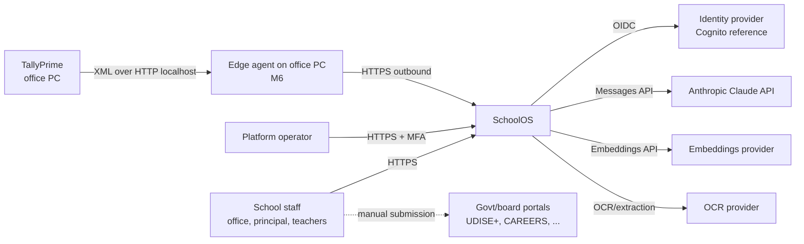
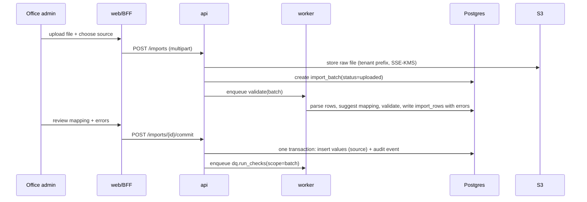
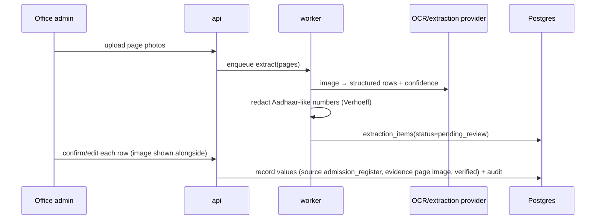
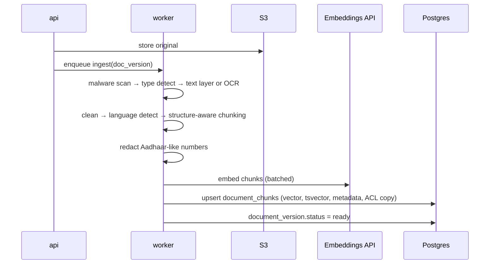
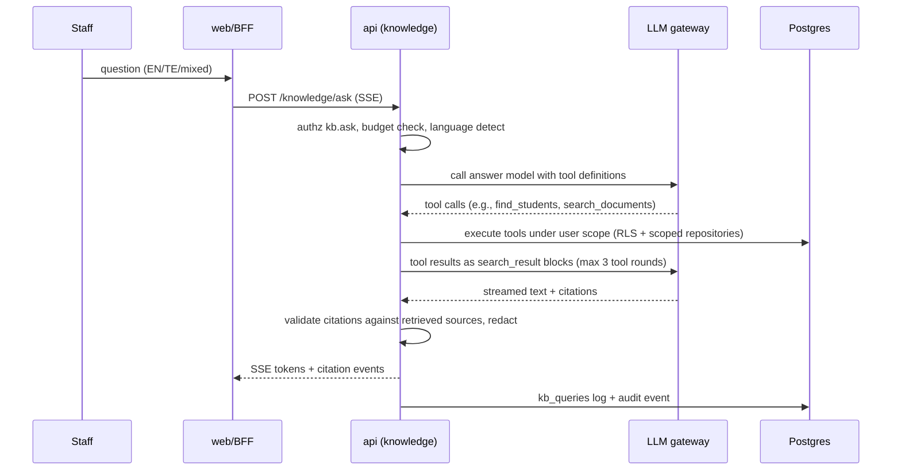

# 04 · System Architecture

| Field | Value |
|---|---|
| Version | 0.1 · 2026-09-26 |
| Style | Modular monolith + async workers, multi-tenant (pool model with RLS) |
| Related | ADR-0001..0012, 05-Data model, 06-RAG, 07-Security, 10-Infrastructure |

---

## 1. Architecture principles

1. **Boring core, sharp edges.** Proven components (Postgres, S3, Redis, FastAPI, Next.js). Innovation lives in domain logic (per-source records, AP naming, grounded AI), not infrastructure.
2. **One database of record.** PostgreSQL holds relational data, full-text indexes and vectors. Fewer moving parts means fewer security boundaries and simpler backups (ADR-0002).
3. **Isolation in depth.** Tenant isolation at DB (RLS), service (scoped repositories), retrieval (SQL filters) and prompt (only permitted data reaches the LLM).
4. **Seams for scale.** Stateless services, queue-based work, provider interfaces, and module boundaries that can become services later only if needed.
5. **Human in the loop for official data.** AI suggests; people confirm.
6. **Everything observable and auditable.** Traces for engineers, audit events for schools.

## 2. System context (C4 level 1)



SchoolOS never logs into government portals. It produces checked data and formatted sheets; staff submit.

## 3. Containers (C4 level 2)


| Container | Responsibility | Scales by |
|---|---|---|
| `web` | UI rendering, BFF (session cookie ↔ tokens), i18n, streaming proxy for Ask | CPU / requests |
| `api` | REST API, authz, business logic, transactions, audit | requests (stateless) |
| `worker` | Ingestion, OCR/extraction, embeddings, DQ batch runs, exports, PDF rendering, audit verification | queue depth per queue |
| `beat` | Scheduled jobs (audit chain verification, retention purges, budget resets) | single instance |
| PostgreSQL | System of record, FTS, vectors, RLS | vertical → replicas → partitions |
| Redis | Celery broker/results, rate limiting, short-lived caches | vertical; cluster at Stage 2 |
| S3 | Files, derived artifacts, exports, audit archive (Object Lock) | managed |

## 4. Backend modules (bounded contexts)

| Module | Owns | Public service functions (examples) | May depend on |
|---|---|---|---|
| `core` | config, DB/session/tenant context, errors, logging, redaction, crypto helpers | `tenant_session()`, `redact()`, `encrypt_field()` | — |
| `identity` | users, OIDC, sessions | `get_current_user()`, `revoke_sessions()` | core |
| `authz` | roles, permissions, scopes, policy | `require()`, `scope_filter()`, `can()` | core, identity |
| `audit` | audit events, chain verification | `record()`, `verify_chain()` | core |
| `tenancy` | tenants, years, classes, sections, enrolments, settings | `provision_tenant()`, `current_year()` | core, authz, audit |
| `students` | students, guardians, attribute values, canonical view | `get_profile()`, `record_value()`, `search()` | core, authz, audit, tenancy |
| `imports` | batches, mappings, extraction queue | `validate_batch()`, `commit_batch()` | students, documents |
| `dq` | rules, name matching, findings | `run_checks()`, `resolve()` | students |
| `changes` | change requests | `submit()`, `approve()` | students, dq, documents |
| `documents` | files, versions, ACLs, scanning | `upload()`, `get_download_url()` | core, authz, audit |
| `knowledge` | ingestion, chunks, embeddings, retrieval, tools, gateway, evals | `ask()`, `ingest()` | documents, students (via service), dq (via service) |
| `exports` | export profiles, report generation | `generate()` | students, dq |
| `notifications` | in-app notifications, templates | `notify()` | core |
| `admin` | tenant admin, retention, full export | `export_tenant()` | all services (read) |
| `ops` | operator console, flags, break-glass | `grant_break_glass()` | tenancy, audit |

**Dependency rules (enforced by import-linter in CI):** no cycles; modules use other modules only through `service.py`; `knowledge.tools` call other modules' services under the caller's user context (never raw repositories).

## 5. Request lifecycle

```
Browser → WAF → ALB → web (BFF)
  - session cookie (HttpOnly, Secure, SameSite=Lax) → server-side session in Redis
  - attaches short-lived access token + request ID; CSRF check on state-changing requests
→ api middleware chain
  1. request ID + trace context (OpenTelemetry)
  2. authenticate: verify JWT (issuer, audience, expiry, signature via JWKS cache)
  3. resolve tenant: active membership for token subject; reject if suspended
  4. rate limit: per user, per tenant, per route class (Redis token bucket)
  5. authorize: route's require(permission, scope) → 403 on failure
  6. handler → service → repository inside core.db.tenant_session():
       BEGIN; SET LOCAL app.tenant_id = '<uuid>'; SET LOCAL app.user_id = '<uuid>'; ... COMMIT
  7. audit.record(...) in the same transaction for audited actions
  8. response (problem+json on errors; no internal details)
```

## 6. Asynchronous processing

- **Queues:** `ingest` (scan, extract, chunk), `embed`, `ocr`, `dq`, `exports`, `pdf`, `maintenance`. Separate queues prevent a large OCR batch from delaying exports.
- **Task contract:** every task receives `tenant_id`, `actor_user_id`, `idempotency_key`, `correlation_id`; opens its own `tenant_session()`; is **idempotent** (safe to retry); records progress in `ops.job_runs`.
- **Retries:** exponential backoff with jitter, max 5; poison messages go to a dead-letter queue with an alert.
- **Fairness:** per-tenant concurrency caps (Redis semaphore) so one school's bulk upload cannot starve others.
- **Scheduling:** Celery beat for audit verification (daily), retention purges (daily), budget resets (monthly), stale verified-answer review (daily).

## 7. Key flows

### 7.1 Excel import → validation → commit



### 7.2 Register photo extraction → human verification



### 7.3 Document ingestion → searchable



### 7.4 Ask the school



### 7.5 Identity correction (maker-checker)

`office_admin` submits change request with evidence → `principal` receives notification → re-auth with MFA → approve → transaction: new verified value, supersede old, re-run DQ for student, audit both actions → printable correction memo.

## 8. Storage architecture

### 8.1 PostgreSQL layout
Schemas: `core` (tenancy, identity, authz), `sis` (students, guardians, attribute values, change requests, DQ), `kb` (documents, versions, chunks, queries, verified answers), `audit` (events), `ops` (jobs, flags, break-glass). One database; RLS on all tenant tables. Details: 05-Data model.

### 8.2 Object storage layout (S3, private, SSE-KMS, versioning on)

```
s3://sos-<env>-files/
  t/<tenant_id>/docs/<document_id>/v<version>/original.<ext>
  t/<tenant_id>/docs/<document_id>/v<version>/derived/text.json      # extracted text + layout
  t/<tenant_id>/docs/<document_id>/v<version>/derived/pages/<n>.png  # page renders for citations
  t/<tenant_id>/imports/<batch_id>/raw.<ext>
  t/<tenant_id>/exports/<export_id>/<file>                            # lifecycle: delete after 7 days
  t/<tenant_id>/tenant-export/<job_id>.zip                            # lifecycle: delete after 2 days
s3://sos-<env>-audit-archive/  (Object Lock, compliance mode)
  t/<tenant_id>/yyyy/mm/dd/audit-<date>.jsonl.gz + .sig
```

- Bucket policies deny non-TLS access and any public ACL; access only via the service IAM roles.
- IAM policies scope the app role to the bucket; per-tenant prefixes enable tenant-level lifecycle and deletion.
- Large files are uploaded via presigned POST directly from the browser to S3 (size/type constrained), then registered via the API.

### 8.3 Vectors
Stored in `kb.document_chunks.embedding` (pgvector). Index: HNSW (cosine). Filtered by `tenant_id` and ACL in the same query. Dimension and precision (`vector` vs `halfvec`) chosen by evaluation (06 §6).

## 9. Multi-tenancy

- **Model:** pool (shared schema) with `tenant_id` + RLS (ADR-0003). Cheapest to run and simplest to operate at this stage.
- **Isolation layers:** (1) RLS policies with FORCE; (2) app role without BYPASSRLS; (3) scoped repositories requiring a `UserContext`; (4) retrieval SQL filters; (5) tenant-prefixed S3 keys and per-tenant DEKs; (6) cross-tenant test suite in CI.
- **Noisy neighbours:** per-tenant rate limits, job concurrency caps, AI budgets.
- **Silo escape hatch:** a very large or regulated tenant can be moved to a dedicated database (same schema) behind the same app; routing by tenant ID in `core.db`.

## 10. Caching

| Cache | Store | TTL | Key includes tenant? |
|---|---|---|---|
| JWKS keys | in-process | 1 h | n/a |
| Permission snapshot per session | Redis | 60 s (invalidated on change) | yes |
| Embedding of identical chunk text | Postgres (hash → vector) | permanent per model | yes (never shared across tenants) |
| Query embedding | Redis | 10 min | yes |
| Rendered page images | S3 | document lifetime | yes |

Never cache AI answers across users. Never build cache keys without `tenant_id`.

## 11. Scalability path and triggers

| Stage | Compute | Database | Search | Trigger to move on |
|---|---|---|---|---|
| **0 · Pilot** | 1 service each for web/api/worker (ECS Fargate or a single container host) | RDS single-AZ, PITR | pgvector HNSW | > 5 schools or any SLO breach |
| **1 · Growth** | Autoscaling services; separate worker pools per queue | RDS Multi-AZ; RDS Proxy/PgBouncer; read replica for exports/analytics | pgvector with `halfvec`, tuned HNSW, iterative filtered scans | p95 retrieval > 500 ms, chunks > 10M, DB CPU > 60% sustained |
| **2 · Scale** | Per-queue autoscaling; ingestion service may split out | Partition `document_chunks` by hash(tenant_id); `audit.events` by month; silo large tenants | Consider dedicated vector engine behind the same retrieval interface | Business need + ADR |

## 12. Availability and failure modes

| Failure | Detection | Behaviour |
|---|---|---|
| LLM API errors/timeouts | gateway error rate, circuit breaker | Ask falls back to search-only (ranked snippets with citations, no generated prose); banner shown |
| Embeddings API down | task failures | Ingestion paused/queued; existing index serves; retries with backoff |
| OCR provider down | task failures | Extraction queue waits; users see "processing delayed" |
| Redis loss | health checks | Sessions invalidated (re-login); queues rebuilt from `ops.job_runs` pending records |
| DB primary failure | RDS events | Multi-AZ failover (Stage 1+); Stage 0: restore from PITR per runbook |
| S3 regional issue | error rates | Reads fail gracefully; writes retried; backups in ap-south-2 |
| Bad deploy | error budget burn, smoke tests | Automatic rollback to previous task definition |

## 13. Configuration and feature flags

- 12-factor config via environment; secrets from Secrets Manager at startup; no secrets in images.
- `ops.feature_flags` (global and per-tenant) for gradual rollout: e.g., `kb.ask.enabled`, `imports.photo_extraction`.
- Model IDs, prompt versions, DQ thresholds and export profiles are versioned config files in the repo, loaded at startup, with tenant overrides where allowed.

## 14. Technology choices

| Concern | Choice | Why | Alternatives considered |
|---|---|---|---|
| Backend | Python + FastAPI + SQLAlchemy 2 | Strong AI/NLP ecosystem, typed models, OpenAPI | Node/NestJS, Go |
| Workers | Celery + Redis | Mature retries, routing, scheduling | Dramatiq, Postgres-backed queues |
| Frontend | Next.js + TS + Tailwind | SSR, BFF route handlers, ecosystem | Remix, SvelteKit |
| DB | PostgreSQL + pgvector | One store for relational, FTS, vectors; RLS | Separate vector DB |
| Files | S3 | Durable, lifecycle, Object Lock | GCS, Azure Blob |
| Identity | OIDC provider (Cognito ref.) | Managed MFA and account security | Keycloak, Auth0 |
| LLM | Anthropic Claude via gateway | Tool use, citations via search results, ZDR option | Other providers via same gateway |
| Embeddings | Provider interface; Voyage as default candidate | Multilingual retrieval models; chosen by eval | Open-source multilingual models self-hosted |
| PDF | Chromium (Playwright) | Correct Telugu shaping, CSS print | WeasyPrint |
| IaC/CI | Terraform + GitHub Actions | Standard, reviewable, OIDC to AWS | Pulumi, CDK |
| Telemetry | OpenTelemetry → CloudWatch/X-Ray (or Grafana stack) | Vendor-neutral, India region | Datadog |

## 15. Decisions index

See `docs/adr/`: ADR-0001 modular monolith · 0002 Postgres+pgvector · 0003 pool tenancy with RLS · 0004 stack · 0005 LLM gateway & provider · 0006 embeddings by evaluation · 0007 no Aadhaar storage · 0008 tools not text-to-SQL · 0009 AWS India hosting · 0010 maker-checker · 0011 hash-chained audit · 0012 managed OIDC identity.
