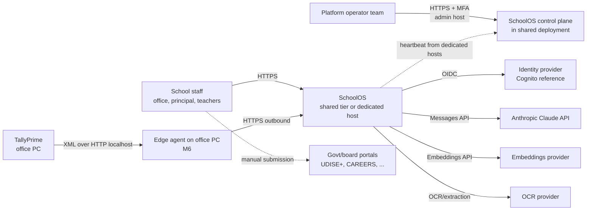
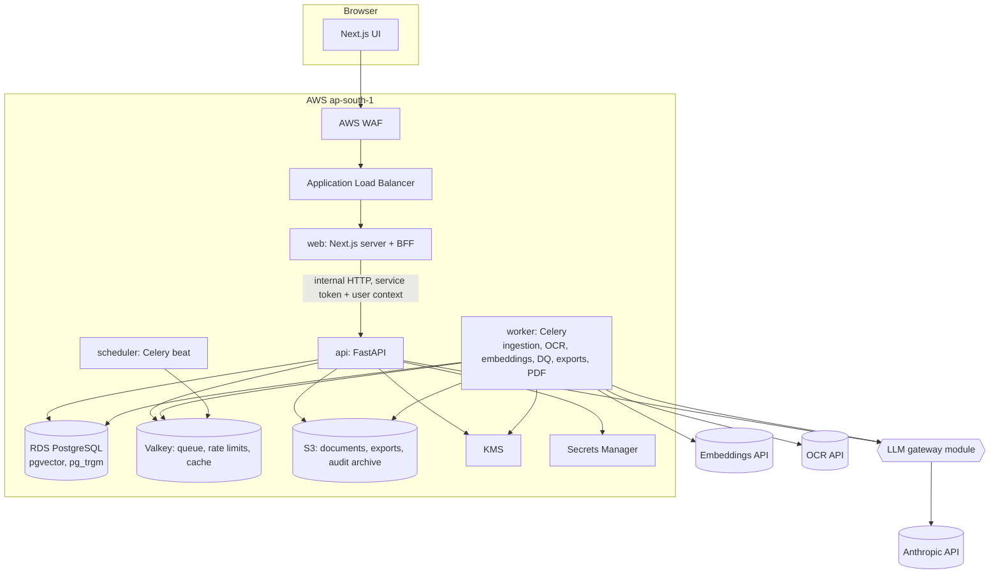
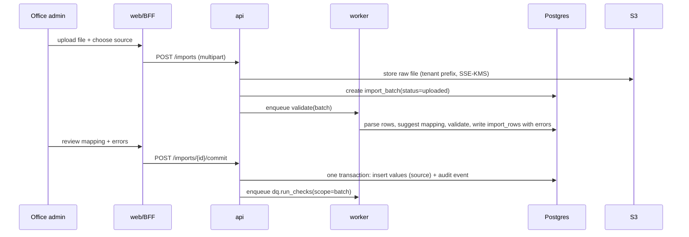
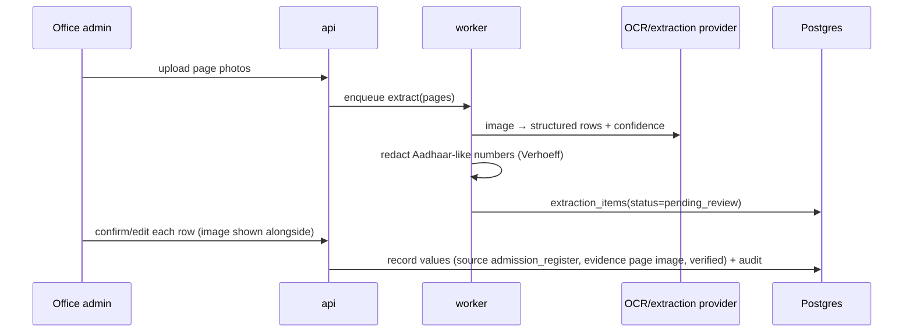
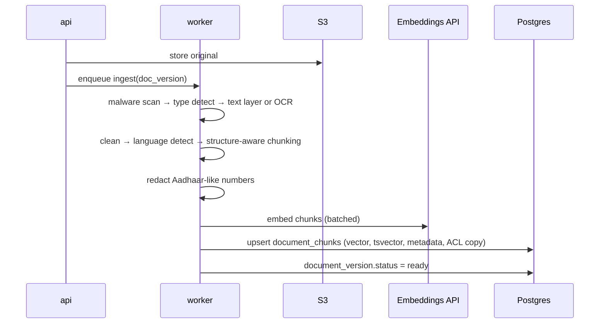
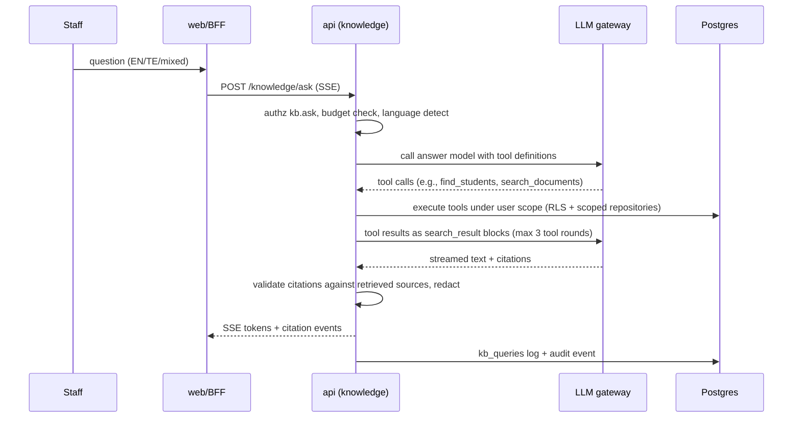
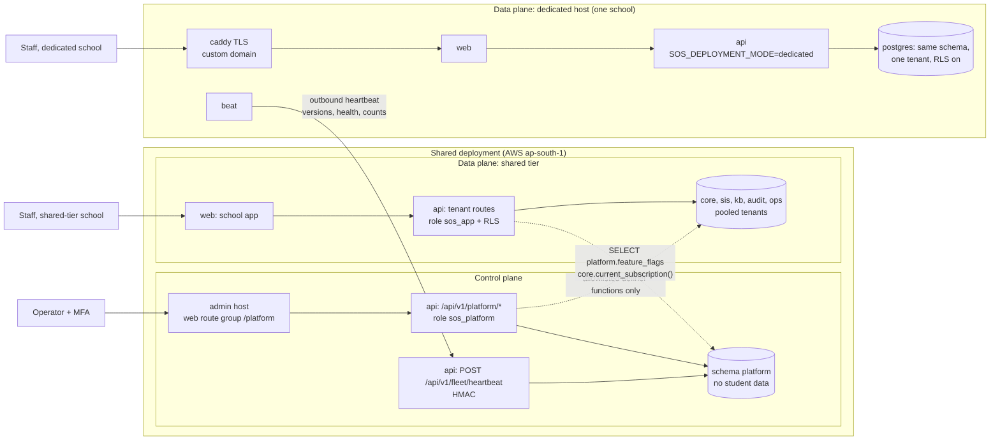

# 04 · System Architecture

| Field | Value |
|---|---|
| Version | 0.4 · 2026-09-29 |
| Style | Modular monolith + async workers, multi-tenant (pool model with RLS); managed SaaS in a shared tier and a dedicated tier |
| Related | ADR-0001..0017, 05-Data model, 06-RAG, 07-Security, 10-Infrastructure, 16-Platform admin panel |
| Changes | 0.4: modules `academics` and `insights` (M5) and their scheduled jobs. 0.3: `platform` dependencies as built (§4); tenancy provisioning functions; local stack table matches `docker-compose.yml` (§17). 0.2: deployment tiers and control plane (§16), local and CI stack (§17), `platform` module (§4), `set_config` tenant context (§5), Valkey replaces Redis (§3, §10, §12, §14), dedicated tier replaces the silo escape hatch (§9), flags moved to `platform.feature_flags` (§13), ADR index (§15). 0.1: baseline |

---

## 1. Architecture principles

1. **Boring core, sharp edges.** Proven components (Postgres, S3, Valkey, FastAPI, Next.js). Innovation lives in domain logic (per-source records, AP naming, grounded AI), not infrastructure.
2. **One database of record.** PostgreSQL holds relational data, full-text indexes and vectors. Fewer moving parts means fewer security boundaries and simpler backups (ADR-0002).
3. **Isolation in depth.** Tenant isolation at DB (RLS), service (scoped repositories), retrieval (SQL filters) and prompt (only permitted data reaches the LLM).
4. **Seams for scale.** Stateless services, queue-based work, provider interfaces, and module boundaries that can become services later only if needed.
5. **Human in the loop for official data.** AI suggests; people confirm.
6. **Everything observable and auditable.** Traces for engineers, audit events for schools.

## 2. System context (C4 level 1)



SchoolOS never logs into government portals. It produces checked data and formatted sheets; staff submit. Operators use the control plane (§16); it has no access to school data.

## 3. Containers (C4 level 2)



| Container | Responsibility | Scales by |
|---|---|---|
| `web` | UI rendering, BFF (session cookie ↔ tokens), i18n, streaming proxy for Ask | CPU / requests |
| `api` | REST API, authz, business logic, transactions, audit | requests (stateless) |
| `worker` | Ingestion, OCR/extraction, embeddings, DQ batch runs, exports, PDF rendering, audit verification | queue depth per queue |
| `beat` | Scheduled jobs (audit chain verification, retention purges, budget resets; in the shared tier also invoice runs, usage collection and heartbeat staleness checks) | single instance |
| PostgreSQL | System of record, FTS, vectors, RLS | vertical → replicas → partitions |
| Valkey (ElastiCache; Redis protocol) | Celery broker/results, rate limiting, sessions, short-lived caches | vertical; cluster at Stage 2 |
| S3 | Files, derived artifacts, exports, audit archive (Object Lock) | managed |

## 4. Backend modules (bounded contexts)

| Module | Owns | Public service functions (examples) | May depend on |
|---|---|---|---|
| `core` | config, DB/session/tenant context, errors, logging, redaction, crypto helpers | `tenant_session()`, `redact()`, `encrypt_field()` | — |
| `identity` | users, OIDC, sessions | `get_current_user()`, `revoke_sessions()` | core |
| `authz` | roles, permissions, scopes, policy | `require()`, `require_any()`, `scope_filter()`, `can()` | core, identity |
| `audit` | audit events, chain verification | `record()`, `verify_chain()` | core |
| `tenancy` | tenants, years, classes, sections, enrolments, settings | `register_tenant()` / `set_tenant_status()` (wrappers over the definer functions), `initialise_tenant()` (keys + post-provision hooks) | core, authz, audit, identity |
| `students` | students, guardians, attribute values, canonical view | `get_profile()`, `record_value()`, `search()` | core, authz, audit, tenancy |
| `imports` | batches, mappings, extraction queue | `validate_batch()`, `commit_batch()` | students, documents |
| `dq` | rules, name matching, findings | `run_checks()`, `resolve()` | students |
| `changes` | change requests | `submit()`, `approve()` | students, dq, documents |
| `documents` | files, versions, ACLs, scanning | `upload()`, `get_download_url()` | core, authz, audit |
| `knowledge` | ingestion, chunks, embeddings, retrieval, tools, gateway, evals | `ask()`, `ingest()` | documents, students (via service), dq (via service) |
| `exports` | export profiles, report generation | `generate()` | students, dq |
| `certificates` | certificate requests, serial numbers, TC/certificate registers, print views, certificate PDFs (M3; 05 §5.7) | `request_certificate()`, `approve()`, `render_pdf()`, `export_records()` | students, dq, documents, tenancy, notifications, ops (via service) |
| `circulars` | circular readings and deadline suggestions (storage and workflow; the AI call is `knowledge`'s), tasks and reminders, parent notices and their PDF/PNG (M4, 05 §6.3) | `on_version_indexed()`, `run_reading()`, `confirm_suggestion()`, `create_task()`, `send_reminders()`, `create_notice()`, `render_notice()` | core, authz, audit, identity, tenancy, documents, knowledge, notifications, ops (via service) |
| `academics` | attendance marks, exams and marks per subject, register/marks sheet previews (M5; 05 §5.8) | `record_attendance()`, `attendance_month()`, `record_marks()`, `attendance_history()`, `exam_results()` | core, authz, audit, students, tenancy, documents, ops (via service); never `insights` |
| `insights` | early-warning rules engine (pure, no AI), flags, owners and action log, behaviour notes (C3), student timeline, reminders, retention (M5; 05 §5.8, 08 §4) | `evaluate()`, `list_flags()`, `add_action()`, `close_flag()`, `timeline()`, `purge_expired()` | core, authz, audit, students, tenancy, academics, certificates (timeline only), identity, notifications, ops (via service); never `knowledge` (import-linter) |
| `notifications` | in-app notifications, templates; email (provider interface: fake, Amazon SES) | `notify()`, `request_email()` | core, identity, tenancy, ops (via service) |
| `admin` | tenant admin, retention, full export | `export_tenant()` | all services (read) |
| `ops` | job runs, outbox, idempotency keys, break-glass grants (tenant-side) | `grant_break_glass()`, `claim_outbox()` | tenancy, audit |
| `platform` | control plane: operators, school registry and provisioning, plans, subscriptions, billing accounts, invoices, payments (billing), usage, fleet/deployments and heartbeat, feature flags, announcements, support tickets, platform audit viewer (ADR-0017; 16) | `current_subscription()`, `invite_school_owner()`, `open_ticket_from_tenant()`, `is_flag_enabled()` | core, audit, authz, `tenancy.service` (provisioning/lifecycle only); tenant rows only through allowlisted definer functions (ADR-0013, Amendment A10) |

**Dependency rules (enforced by import-linter in CI):** no cycles; modules use other modules only through `service.py`; `knowledge.tools` call other modules' services under the caller's user context (never raw repositories). `platform` uses `core.db.platform_session()` (role `sos_platform`) for its own data and never imports tenant modules' repositories or models; as built it also calls `tenancy.service` for provisioning and lifecycle and opens `tenant_session()` for school-chain audit events, the school-side billing/announcement/support routes and the active-user count (ADR-0013 Amendment A10; pending product-owner confirmation, 14 · M0 status). import-linter forbids `core`, `identity` and `tenancy` from importing `platform`; tenant modules call `platform.service` only for the narrow entry points listed above.

## 5. Request lifecycle

```
Browser → WAF → ALB → web (BFF)
  - session cookie (HttpOnly, Secure, SameSite=Lax) → server-side session in Valkey
  - attaches the user's access token (Authorization: Bearer), a 60 s signed service token
    (X-Service-Token) and a request ID; CSRF check on state-changing requests
→ api middleware chain
  1. request ID + trace context (OpenTelemetry)
  2. authenticate: verify the BFF service token (X-Service-Token) and the user JWT (issuer, audience —
     for Cognito client_id + token_use —, expiry, signature via JWKS cache; ADR-0018)
  3. resolve tenant: active membership for token subject; reject if suspended
     (except the owner's Plan & billing and full-export routes, 16 §5.5)
  4. rate limit: per user, per tenant, per route class (Valkey token bucket)
  5. authorize: route's require(permission, scope) → 403 on failure
  6. handler → service → repository inside core.db.tenant_session():
       BEGIN;
       SELECT set_config('app.tenant_id', :tenant_id, true), set_config('app.user_id', :user_id, true);
       ...   -- transaction-local, same effect as SET LOCAL, but with bound parameters
       COMMIT
  7. audit.record(...) in the same transaction for audited actions
  8. response (problem+json on errors; no internal details)
```

Signed-out browsers: every school console page needs a staff session and sends a visitor to staff sign-in (`/bff/auth/login?next=<path>`), except the bare school home (`/`, `/en`, `/te`), which shows the public welcome page `/<locale>/welcome` (no session; product overview and a "Sign in" link). Operator pages always go to operator sign-in (`apps/web/README.md`).

## 6. Asynchronous processing

- **Queues:** `ingest` (scan, extract, chunk), `embed`, `ocr`, `dq`, `exports`, `pdf`, `maintenance`. Separate queues prevent a large OCR batch from delaying exports.
- **Task contract:** every tenant task receives `tenant_id`, `actor_user_id`, `idempotency_key`, `correlation_id`; opens its own `tenant_session()`; is **idempotent** (safe to retry); records progress in `ops.job_runs` (`tenant_id NOT NULL`). Platform tasks (invoice runs, usage collection, fleet checks) use `platform_session()` and record progress in `platform.job_runs`.
- **Retries:** exponential backoff with jitter, max 5; poison messages go to a dead-letter queue with an alert.
- **Fairness:** per-tenant concurrency caps (Valkey semaphore) so one school's bulk upload cannot starve others.
- **Scheduling:** Celery beat for audit verification (daily), retention purges (daily), budget resets (monthly), stale verified-answer review (daily). M5 adds the daily early-warning evaluation, overdue-flag reminders and the notes/closed-flags purge (queue `maintenance`, `insights.*` beat entries in `sos_worker.celery_app`).

## 7. Key flows

### 7.1 Excel import → validation → commit



### 7.2 Register photo extraction → human verification



### 7.3 Document ingestion → searchable



### 7.4 Ask the school



### 7.5 Identity correction (maker-checker)

`office_admin` submits change request with evidence → `principal` receives notification → re-auth with MFA → approve → transaction: new verified value, supersede old, re-run DQ for student, audit both actions → printable correction memo.

## 8. Storage architecture

### 8.1 PostgreSQL layout
Schemas: `core` (tenancy, identity, authz), `sis` (students, guardians, attribute values, change requests, DQ), `kb` (documents, versions, chunks, queries, verified answers), `audit` (events), `ops` (tenant jobs, outbox, idempotency keys, break-glass), `platform` (control plane: operators, billing, fleet, flags, announcements, support, platform audit; no student data, no RLS, reachable only by `sos_platform`). One database per deployment; RLS on all tenant tables. Details: 05-Data model; `platform` DDL in 16 §7.

### 8.2 Object storage layout (S3, private, SSE-KMS, versioning on)

```
s3://sos-<env>-files/
  t/<tenant_id>/docs/<document_id>/v<version>/original.<ext>
  t/<tenant_id>/docs/<document_id>/v<version>/derived/text.json      # extracted text + layout
  t/<tenant_id>/docs/<document_id>/v<version>/derived/pages/<n>.png  # page renders for citations
  t/<tenant_id>/imports/<batch_id>/raw.<ext>
  t/<tenant_id>/exports/<export_id>/<file>                            # lifecycle: delete after 7 days
  t/<tenant_id>/tenant-export/<export_id>.zip                         # FR-ADM-001; purged 24 h after ready, lifecycle backstop 2 days
s3://sos-<env>-audit-archive/  (Object Lock, compliance mode)
  t/<tenant_id>/yyyy/mm/dd/audit-<date>.jsonl.gz + .sig
```

- Bucket policies deny non-TLS access and any public ACL; access only via the service IAM roles.
- IAM policies scope the app role to the bucket; per-tenant prefixes enable tenant-level lifecycle and deletion.
- Large files are uploaded via presigned POST directly from the browser to S3 (size/type constrained), then registered via the API.

### 8.3 Vectors
Stored in `kb.document_chunks.embedding` (pgvector). Index: HNSW (cosine). Filtered by `tenant_id` and ACL in the same query. Dimension and precision (`vector` vs `halfvec`) chosen by evaluation (06 §6).

## 9. Multi-tenancy

- **Model:** pool (shared schema) with `tenant_id` + RLS (ADR-0003). Cheapest to run and simplest to operate at this stage.
- **Isolation layers:** (1) RLS policies with FORCE; (2) no role with BYPASSRLS; (3) composite tenant foreign keys `(tenant_id, x_id) → (tenant_id, id)` so rows cannot reference another tenant's rows; (4) scoped repositories requiring a `UserContext`; (5) retrieval SQL filters; (6) tenant-prefixed S3 keys and per-tenant DEKs; (7) cross-tenant test suite in CI. Cross-tenant paths are limited to the allowlisted definer functions (ADR-0013; 05 §3.4).
- **Noisy neighbours:** per-tenant rate limits, job concurrency caps, AI budgets.
- **Dedicated tier (replaces the v0.1 silo escape hatch):** a school that needs isolation runs as a one-tenant install on its own host with the same images and schema, RLS still on (ADR-0015; §16).

## 10. Caching

| Cache | Store | TTL | Key includes tenant? |
|---|---|---|---|
| JWKS keys | in-process | 1 h | n/a |
| Permission snapshot per session | Valkey | 60 s (invalidated on change) | yes |
| Embedding of identical chunk text | Postgres (hash → vector) | permanent per model | yes (never shared across tenants) |
| Query embedding | Valkey | 10 min | yes |
| Active announcements | Valkey | until next publish (≤ 1 min) | no (no personal data; filtered by tier/tenant on read) |
| Rendered page images | S3 | document lifetime | yes |

Never cache AI answers across users. Never build cache keys without `tenant_id`.

## 11. Scalability path and triggers

| Stage | Compute | Database | Search | Trigger to move on |
|---|---|---|---|---|
| **0 · Pilot** | 1 service each for web/api/worker (ECS Fargate or a single container host) | RDS single-AZ, PITR | pgvector HNSW | > 5 schools or any SLO breach |
| **1 · Growth** | Autoscaling services; separate worker pools per queue | RDS Multi-AZ; RDS Proxy/PgBouncer; read replica for exports/analytics | pgvector with `halfvec`, tuned HNSW, iterative filtered scans | p95 retrieval > 500 ms, chunks > 10M, DB CPU > 60% sustained |
| **2 · Scale** | Per-queue autoscaling; ingestion service may split out | Partition `document_chunks` by hash(tenant_id); `audit.events` by month; silo large tenants | Consider dedicated vector engine behind the same retrieval interface | Business need + ADR |

## 12. Availability and failure modes

| Failure | Detection | Behaviour |
|---|---|---|
| LLM API errors/timeouts | gateway error rate, circuit breaker | Ask falls back to search-only (ranked snippets with citations, no generated prose); banner shown |
| Embeddings API down | task failures | Ingestion paused/queued; existing index serves; retries with backoff |
| OCR provider down | task failures | Extraction queue waits; users see "processing delayed" |
| Valkey loss | health checks | Sessions invalidated (re-login); queues rebuilt from `ops.job_runs` / `platform.job_runs` pending records |
| Control plane down | health checks, synthetic probe | Schools keep working; heartbeats retried by hosts; provisioning and billing wait (NFR-AVL-006) |
| Dedicated host down | missed heartbeat (20 min) | Alert; restore per runbook (RTO ≤ 8 h); other schools unaffected |
| DB primary failure | RDS events | Multi-AZ failover (Stage 1+); Stage 0: restore from PITR per runbook |
| S3 regional issue | error rates | Reads fail gracefully; writes retried; backups in ap-south-2 |
| Bad deploy | error budget burn, smoke tests | Automatic rollback to previous task definition |

## 13. Configuration and feature flags

- 12-factor config via environment; secrets from Secrets Manager at startup; no secrets in images.
- `platform.feature_flags` (global with % rollout, and per-tenant overrides) for gradual rollout: e.g., `kb.ask.enabled`, `imports.photo_extraction`. Managed in the platform admin panel; the tenant app has SELECT only (16 §5.11).
- `SOS_DEPLOYMENT_MODE` (`shared` | `dedicated`) decides whether control-plane routes and schedules exist.
- Model IDs, prompt versions, DQ thresholds and export profiles are versioned config files in the repo, loaded at startup, with tenant overrides where allowed.

## 14. Technology choices

| Concern | Choice | Why | Alternatives considered |
|---|---|---|---|
| Backend | Python + FastAPI + SQLAlchemy 2 | Strong AI/NLP ecosystem, typed models, OpenAPI | Node/NestJS, Go |
| Workers | Celery + Valkey (Redis protocol; ADR-0014) | Mature retries, routing, scheduling; permissive licence | Dramatiq, Postgres-backed queues |
| Frontend | Next.js + TS + Tailwind | SSR, BFF route handlers, ecosystem | Remix, SvelteKit |
| DB | PostgreSQL + pgvector | One store for relational, FTS, vectors; RLS | Separate vector DB |
| Files | S3 | Durable, lifecycle, Object Lock | GCS, Azure Blob |
| Identity | OIDC provider (Cognito ref.) | Managed MFA and account security | Keycloak, Auth0 |
| LLM | Anthropic Claude via gateway | Tool use, citations via search results, ZDR option | Other providers via same gateway |
| Embeddings | Provider interface; Voyage as default candidate | Multilingual retrieval models; chosen by eval | Open-source multilingual models self-hosted |
| PDF | Chromium (Playwright) | Correct Telugu shaping, CSS print | WeasyPrint |
| IaC/CI | Terraform + GitHub Actions | Standard, reviewable, OIDC to AWS | Pulumi, CDK |
| Telemetry | OpenTelemetry → CloudWatch/X-Ray (or Grafana stack) | Vendor-neutral, India region | Datadog |

## 15. Decisions index

See [`docs/adr/`](adr/README.md): ADR-0001 modular monolith · 0002 Postgres+pgvector · 0003 pool tenancy with RLS · 0004 stack · 0005 LLM gateway & provider · 0006 embeddings by evaluation · 0007 no Aadhaar storage · 0008 tools not text-to-SQL · 0009 AWS India hosting · 0010 maker-checker · 0011 hash-chained audit · 0012 managed OIDC identity · 0013 cross-tenant access paths and platform privilege separation · 0014 local/CI service images (SeaweedFS, Valkey) · 0015 deployment and commercial model (shared and dedicated tiers) · 0016 payments provider (Proposed) · 0017 platform admin panel architecture.

## 16. Deployment tiers and control plane

SchoolOS is a managed SaaS with two tiers from one codebase and one set of images (ADR-0015).

| | Shared tier | Dedicated tier |
|---|---|---|
| Who | Default plan | Premium plan |
| Compute | ECS Fargate services (web, api, worker, beat) | One EC2 host per school running `deploy/dedicated/compose.yaml` (caddy, web, api, worker, beat, postgres + pgvector, valkey) |
| Database | RDS PostgreSQL 16 + pgvector, pooled tenants | PostgreSQL on the host, one tenant |
| Cache/queue | ElastiCache for Valkey | Valkey container |
| Files | Shared S3 bucket, tenant prefixes, shared CMKs | Own S3 bucket and own KMS key |
| Domain | SchoolOS domain | Optional custom domain, TLS via Caddy (ACME) |
| Backups | RDS PITR + snapshot copies to ap-south-2 | WAL-G + nightly `pg_dump`, encrypted, to S3 ap-south-2 |
| Tenant isolation | RLS + all layers in §9 | Same code: `tenant_id` + RLS stay on |
| Control plane | **Runs here** (`SOS_DEPLOYMENT_MODE=shared`) | Disabled (`SOS_DEPLOYMENT_MODE=dedicated`) |

**Control plane vs data plane.** The *data plane* is everything that serves a school: the shared stack's tenant routes and every dedicated host. The *control plane* is the platform admin panel, billing and fleet registry (module `platform`, schema `platform`, role `sos_platform`). It runs only in the shared deployment, never pulls data from a school, and reaches tenant rows only through the allowlisted definer functions. Dedicated hosts talk to it only by an outbound, HMAC-signed heartbeat.



Rules:
- The control plane MUST NOT open connections to a dedicated host's database, files or API. Host changes go through the deploy pipeline (10 §15).
- Heartbeats carry versions, health, backup state and aggregate counts only (16 §12).
- A school's day-to-day work never depends on the control plane (NFR-AVL-006).

## 17. Local and CI stack

The local stack mirrors a dedicated host plus the control plane, using permissive-licence images (ADR-0014). Details and commands: 10 §11.

| Service | Image | Port | Role |
|---|---|---|---|
| `db` | `pgvector/pgvector:0.8.6-pg16-bookworm` | 5432 | PostgreSQL; `infra/db/bootstrap.sql` runs on first start (roles, schemas, extensions) |
| `valkey` | `valkey/valkey:8.1-alpine` | 6379 | Celery broker, rate limits, sessions, caches |
| `s3` | `chrislusf/seaweedfs` (pinned release) | 8333 | S3-compatible object storage |
| `s3-init` | api image | — | One-off: creates `SOS_S3_BUCKET_FILES` and `SOS_S3_BUCKET_AUDIT` |
| `migrate` | api image | — | One-off: `alembic upgrade head` + `python -m app.audit.partitions --months-ahead 12` as `sos_migrator` |
| `api` | api image | 8000 | FastAPI (tenant and platform routes; `SOS_DEPLOYMENT_MODE=shared` locally) |
| `worker` | api image | — | Celery worker (`sos_worker.celery_app`), queues `ingest,embed,ocr,dq,exports,pdf,maintenance` |
| `beat` | api image | — | Celery beat |
| `web` | web image | 3000 | Next.js school app and platform route group |
| `oidc` (profile `dev`) | `ghcr.io/navikt/mock-oauth2-server` (pinned) | 8080 | Dev OIDC stub for staff and operators; never in staging/prod |

CI starts the same `db`, `valkey` and `s3` images through testcontainers so integration tests match local behaviour. An OpenTelemetry collector is not part of the local stack; set `SOS_OTEL_EXPORTER_OTLP_ENDPOINT` to export traces.

