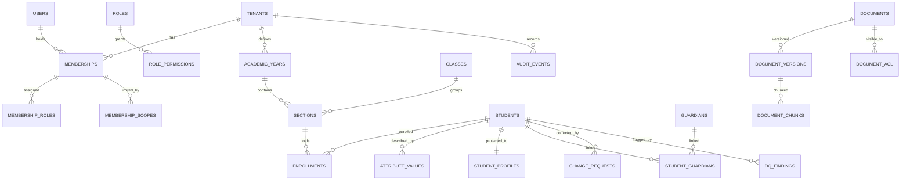

# 05 · Data Model & Storage

| Field | Value |
|---|---|
| Version | 0.1 · 2026-09-26 |
| DB | PostgreSQL 16+ (pgvector, pg_trgm, citext, pgcrypto) |
| Related | 04-Architecture §8, 06-RAG, 07-Security §7, 08-Privacy §7 |

---

## 1. Conventions

- **Primary keys:** `uuid`, UUIDv7 generated by the application (PostgreSQL 18+ `uuidv7()` MAY be used). Never expose sequential IDs.
- **Tenant key:** every tenant-owned table has `tenant_id uuid NOT NULL` as the **first column of every composite index**.
- **Timestamps:** `timestamptz`, UTC; `created_at`, `updated_at` default `now()`; display in IST.
- **Optimistic locking:** mutable rows have `version int NOT NULL DEFAULT 1`; updates use `WHERE version = :v` and increment; API uses ETags.
- **Text:** NFC-normalized before write; names also stored normalized (`*_norm`) for matching.
- **Enumerations:** `text` + `CHECK` constraints (easy to evolve) or small lookup tables.
- **Deletion:** personal data is hard-deleted per retention (no soft-delete graveyards for PII). Soft-delete (`deleted_at`) only for non-personal configuration.
- **Money (M6):** `numeric(14,2)` INR; never floats.
- **Naming:** snake_case; schemas `core`, `sis`, `kb`, `audit`, `ops`.

## 2. Entity overview



## 3. Database roles and tenant context

```sql
-- Roles (created by Terraform/bootstrap, not by the app)
CREATE ROLE sos_owner     NOLOGIN;                       -- owns objects
CREATE ROLE sos_migrator  LOGIN IN ROLE sos_owner;       -- runs Alembic only (CI/CD)
CREATE ROLE sos_app       LOGIN NOBYPASSRLS;             -- API + workers
CREATE ROLE sos_readonly  LOGIN NOBYPASSRLS;             -- replica/reporting, still tenant-scoped
-- No application role is superuser or has BYPASSRLS.

CREATE SCHEMA core AUTHORIZATION sos_owner;  -- likewise sis, kb, audit, ops

-- Tenant context helpers (fail closed when unset)
CREATE FUNCTION core.current_tenant() RETURNS uuid
  LANGUAGE sql STABLE AS $$ SELECT nullif(current_setting('app.tenant_id', true), '')::uuid $$;
CREATE FUNCTION core.current_user_id() RETURNS uuid
  LANGUAGE sql STABLE AS $$ SELECT nullif(current_setting('app.user_id', true), '')::uuid $$;
```

Application usage (every request/job):

```python
with core.db.tenant_session(tenant_id, user_id) as s:
    # executes: BEGIN; SET LOCAL app.tenant_id = :t; SET LOCAL app.user_id = :u;
    ...
    # COMMIT on success, ROLLBACK on error; settings vanish at transaction end
```

**Standard RLS policy (apply to every tenant-owned table):**

```sql
ALTER TABLE <schema>.<table> ENABLE ROW LEVEL SECURITY;
ALTER TABLE <schema>.<table> FORCE  ROW LEVEL SECURITY;
CREATE POLICY tenant_isolation ON <schema>.<table>
  USING      (tenant_id = core.current_tenant())
  WITH CHECK (tenant_id = core.current_tenant());
```

A migration test fails if any table with a `tenant_id` column lacks ENABLE+FORCE and this policy (catalog check on `pg_class.relrowsecurity`, `relforcerowsecurity`, `pg_policies`).

## 4. Core schema (tenancy, identity, authorization)

> DDL in this document is grouped by topic for readability. In migrations, create tables first, then functions, then policies (some policies reference tables defined later here). Standard RLS (§3) applies to every table with `tenant_id` even where not repeated.

```sql
CREATE TABLE core.tenants (
  id            uuid PRIMARY KEY,
  code          text UNIQUE NOT NULL,              -- short slug
  name          text NOT NULL,
  boards        text[] NOT NULL DEFAULT '{}',      -- e.g. {CISCE}
  state_code    text NOT NULL DEFAULT 'AP',
  status        text NOT NULL CHECK (status IN ('provisioning','active','suspended','offboarding','deleted')),
  settings      jsonb NOT NULL DEFAULT '{}',       -- languages, retention, ai_budget, idle_timeout
  created_at    timestamptz NOT NULL DEFAULT now(),
  updated_at    timestamptz NOT NULL DEFAULT now(),
  version       int NOT NULL DEFAULT 1
);
-- RLS: app may read only its own tenant row
ALTER TABLE core.tenants ENABLE ROW LEVEL SECURITY; ALTER TABLE core.tenants FORCE ROW LEVEL SECURITY;
CREATE POLICY own_tenant ON core.tenants USING (id = core.current_tenant()) WITH CHECK (id = core.current_tenant());

CREATE TABLE core.tenant_keys (                     -- envelope encryption (07 §7)
  tenant_id     uuid NOT NULL REFERENCES core.tenants(id),
  key_version   int  NOT NULL,
  wrapped_dek   bytea NOT NULL,                     -- DEK encrypted by KMS CMK
  wrapped_hmac  bytea NOT NULL,                     -- HMAC key for blind indexes
  kms_key_arn   text NOT NULL,
  created_at    timestamptz NOT NULL DEFAULT now(),
  retired_at    timestamptz,
  PRIMARY KEY (tenant_id, key_version)
);

CREATE TABLE core.users (                           -- global identity (a person may work at 2 schools)
  id                 uuid PRIMARY KEY,
  idp_subject        text UNIQUE NOT NULL,
  display_name       text NOT NULL,
  email              citext,
  phone_ciphertext   bytea,
  preferred_language text NOT NULL DEFAULT 'en' CHECK (preferred_language IN ('en','te')),
  status             text NOT NULL CHECK (status IN ('active','disabled')),
  created_at         timestamptz NOT NULL DEFAULT now(),
  last_login_at      timestamptz
);
-- RLS: visible only if the user has a membership in the current tenant
ALTER TABLE core.users ENABLE ROW LEVEL SECURITY; ALTER TABLE core.users FORCE ROW LEVEL SECURITY;
CREATE POLICY users_in_tenant ON core.users USING (
  EXISTS (SELECT 1 FROM core.memberships m WHERE m.user_id = users.id AND m.tenant_id = core.current_tenant())
);

-- Login happens before a tenant is chosen, so RLS above would hide the user.
-- The ONLY cross-tenant read path is this narrow SECURITY DEFINER function (owned by sos_owner),
-- returning just the user id and active memberships. It is audited and covered by tests.
CREATE FUNCTION core.resolve_login(p_subject text)
  RETURNS TABLE (user_id uuid, tenant_id uuid, membership_id uuid)
  LANGUAGE sql STABLE SECURITY DEFINER SET search_path = core, pg_temp AS $$
    SELECT u.id, m.tenant_id, m.id
    FROM core.users u JOIN core.memberships m ON m.user_id = u.id
    WHERE u.idp_subject = p_subject AND u.status = 'active' AND m.status = 'active'
  $$;
REVOKE ALL ON FUNCTION core.resolve_login(text) FROM PUBLIC;
GRANT EXECUTE ON FUNCTION core.resolve_login(text) TO sos_app;

CREATE TABLE core.memberships (
  id          uuid PRIMARY KEY,
  tenant_id   uuid NOT NULL REFERENCES core.tenants(id),
  user_id     uuid NOT NULL REFERENCES core.users(id),
  status      text NOT NULL CHECK (status IN ('invited','active','suspended','removed')),
  created_by  uuid,
  created_at  timestamptz NOT NULL DEFAULT now(),
  UNIQUE (tenant_id, user_id)
);

CREATE TABLE core.permissions (                     -- global catalog (read-only to app)
  key          text PRIMARY KEY,                    -- e.g. 'student.identity_change.approve'
  description  text NOT NULL,
  sensitivity  text NOT NULL CHECK (sensitivity IN ('normal','sensitive','critical'))
);

CREATE TABLE core.roles (
  id          uuid PRIMARY KEY,
  tenant_id   uuid NOT NULL REFERENCES core.tenants(id),
  key         text NOT NULL,                        -- 'office_admin', or custom
  name_en     text NOT NULL,
  name_te     text NOT NULL,
  is_system   boolean NOT NULL DEFAULT false,       -- system roles cloned at provisioning
  UNIQUE (tenant_id, key)
);
CREATE TABLE core.role_permissions (
  tenant_id       uuid NOT NULL,
  role_id         uuid NOT NULL REFERENCES core.roles(id) ON DELETE CASCADE,
  permission_key  text NOT NULL REFERENCES core.permissions(key),
  PRIMARY KEY (tenant_id, role_id, permission_key)
);
CREATE TABLE core.membership_roles (
  tenant_id      uuid NOT NULL,
  membership_id  uuid NOT NULL REFERENCES core.memberships(id) ON DELETE CASCADE,
  role_id        uuid NOT NULL REFERENCES core.roles(id),
  PRIMARY KEY (tenant_id, membership_id, role_id)
);
CREATE TABLE core.membership_scopes (
  id             uuid PRIMARY KEY,
  tenant_id      uuid NOT NULL,
  membership_id  uuid NOT NULL REFERENCES core.memberships(id) ON DELETE CASCADE,
  scope_type     text NOT NULL CHECK (scope_type IN ('school','class','section')),
  scope_ref      uuid,                              -- class_id/section_id; NULL for 'school'
  CHECK ((scope_type = 'school') = (scope_ref IS NULL))
);

CREATE TABLE core.academic_years (
  id          uuid PRIMARY KEY,
  tenant_id   uuid NOT NULL,
  label       text NOT NULL,                        -- '2026-27'
  starts_on   date NOT NULL,
  ends_on     date NOT NULL,
  is_current  boolean NOT NULL DEFAULT false,
  UNIQUE (tenant_id, label)
);
CREATE UNIQUE INDEX one_current_year ON core.academic_years(tenant_id) WHERE is_current;

CREATE TABLE core.classes (
  id uuid PRIMARY KEY, tenant_id uuid NOT NULL,
  code text NOT NULL,                               -- 'NUR','LKG','I'..'XII'
  display_en text NOT NULL, display_te text NOT NULL, sort_order int NOT NULL,
  UNIQUE (tenant_id, code)
);
CREATE TABLE core.sections (
  id uuid PRIMARY KEY, tenant_id uuid NOT NULL,
  class_id uuid NOT NULL REFERENCES core.classes(id),
  academic_year_id uuid NOT NULL REFERENCES core.academic_years(id),
  name text NOT NULL,                               -- 'A'
  class_teacher_membership_id uuid REFERENCES core.memberships(id),
  UNIQUE (tenant_id, academic_year_id, class_id, name)
);
```

## 5. Student information schema (`sis`)

```sql
CREATE TABLE sis.students (
  id             uuid PRIMARY KEY,
  tenant_id      uuid NOT NULL,
  status         text NOT NULL CHECK (status IN ('provisional','active','left','graduated')),
  admission_no   text,
  created_at     timestamptz NOT NULL DEFAULT now(),
  updated_at     timestamptz NOT NULL DEFAULT now(),
  version        int NOT NULL DEFAULT 1
);
CREATE UNIQUE INDEX students_adm_no ON sis.students(tenant_id, admission_no) WHERE admission_no IS NOT NULL;

CREATE TABLE sis.enrollments (
  id uuid PRIMARY KEY, tenant_id uuid NOT NULL,
  student_id uuid NOT NULL REFERENCES sis.students(id),
  section_id uuid NOT NULL REFERENCES core.sections(id),
  academic_year_id uuid NOT NULL REFERENCES core.academic_years(id),
  roll_no text,
  status text NOT NULL CHECK (status IN ('active','transferred','completed')),
  started_on date, ended_on date
);
CREATE UNIQUE INDEX one_active_enrollment ON sis.enrollments(tenant_id, student_id, academic_year_id) WHERE status = 'active';

-- Attribute catalog: global defaults (tenant_id NULL) + tenant custom fields
CREATE TABLE sis.attribute_definitions (
  id               uuid PRIMARY KEY,
  tenant_id        uuid,                            -- NULL = global
  key              text NOT NULL,                   -- 'full_name','dob','gender','father_name',...
  data_type        text NOT NULL CHECK (data_type IN ('text','date','enum','digits4')),
  classification   text NOT NULL CHECK (classification IN ('C1','C2','C3')),
  is_identity      boolean NOT NULL DEFAULT false,  -- identity fields need maker-checker
  validation       jsonb NOT NULL DEFAULT '{}',     -- regex, length, allowed values
  canonical_policy jsonb NOT NULL,                  -- precedence rules (see §10)
  label_en text NOT NULL, label_te text NOT NULL
);
CREATE UNIQUE INDEX attrdef_key ON sis.attribute_definitions (coalesce(tenant_id, '00000000-0000-0000-0000-000000000000'), key);
ALTER TABLE sis.attribute_definitions ENABLE ROW LEVEL SECURITY; ALTER TABLE sis.attribute_definitions FORCE ROW LEVEL SECURITY;
CREATE POLICY attrdef_read ON sis.attribute_definitions
  USING (tenant_id IS NULL OR tenant_id = core.current_tenant())
  WITH CHECK (tenant_id = core.current_tenant());  -- app cannot write global rows

-- The heart of "enter once": one row per (student, attribute, source, point in time)
CREATE TABLE sis.attribute_values (
  id                   uuid PRIMARY KEY,
  tenant_id            uuid NOT NULL,
  student_id           uuid NOT NULL REFERENCES sis.students(id),
  attribute_key        text NOT NULL,
  source               text NOT NULL CHECK (source IN ('admission_register','aadhaar_as_printed','udise_plus',
                          'board_registration','birth_certificate','parent_form','tc_incoming','manual_entry')),
  value_text           text,                        -- C1/C2 only
  value_date           date,                        -- C1/C2 only
  value_norm           text,                        -- normalized for matching (names); C1/C2 only
  value_ciphertext     bytea,                       -- C3 only (AES-256-GCM with tenant DEK)
  value_blind_index    bytea,                       -- HMAC for equality lookups on C3 (optional)
  key_version          int,
  confidence           numeric(4,3),                -- extraction confidence, if any
  verification_status  text NOT NULL CHECK (verification_status IN ('unverified','verified','rejected')),
  verified_by          uuid, verified_at timestamptz,
  evidence_document_id uuid,                        -- kb.documents (scan/photo)
  import_batch_id      uuid, change_request_id uuid,
  recorded_by          uuid NOT NULL,
  recorded_at          timestamptz NOT NULL DEFAULT now(),
  superseded_by        uuid REFERENCES sis.attribute_values(id),
  CHECK (NOT (value_ciphertext IS NOT NULL AND (value_text IS NOT NULL OR value_norm IS NOT NULL)))
);
-- Exactly one current value per (student, attribute, source)
CREATE UNIQUE INDEX av_current ON sis.attribute_values(tenant_id, student_id, attribute_key, source) WHERE superseded_by IS NULL;
CREATE INDEX av_student ON sis.attribute_values(tenant_id, student_id);

-- Denormalized projection for search and lists (C2 only), maintained in the same transaction
CREATE TABLE sis.student_profiles (
  tenant_id          uuid NOT NULL,
  student_id         uuid PRIMARY KEY REFERENCES sis.students(id),
  full_name          text, full_name_norm text, full_name_translit text,
  dob                date, gender text,
  father_name_norm   text, mother_name_norm text,
  current_section_id uuid, status text,
  search_tsv         tsvector,                      -- 'simple' config: names, adm no, parents
  updated_at         timestamptz NOT NULL DEFAULT now()
);
CREATE INDEX sp_name_trgm   ON sis.student_profiles USING gin (full_name_norm gin_trgm_ops);
CREATE INDEX sp_translit    ON sis.student_profiles USING gin (full_name_translit gin_trgm_ops);
CREATE INDEX sp_tsv         ON sis.student_profiles USING gin (search_tsv);
CREATE INDEX sp_section     ON sis.student_profiles (tenant_id, current_section_id);

CREATE TABLE sis.guardians (
  id uuid PRIMARY KEY, tenant_id uuid NOT NULL,
  full_name text NOT NULL, full_name_norm text,
  phone_ciphertext bytea, phone_blind_index bytea,
  address_ciphertext bytea, key_version int,
  created_at timestamptz NOT NULL DEFAULT now()
);
CREATE TABLE sis.student_guardians (
  tenant_id uuid NOT NULL,
  student_id uuid NOT NULL REFERENCES sis.students(id),
  guardian_id uuid NOT NULL REFERENCES sis.guardians(id),
  relationship text NOT NULL CHECK (relationship IN ('father','mother','guardian')),
  is_primary boolean NOT NULL DEFAULT false,
  PRIMARY KEY (tenant_id, student_id, guardian_id)
);

CREATE TABLE sis.change_requests (
  id uuid PRIMARY KEY, tenant_id uuid NOT NULL,
  student_id uuid NOT NULL REFERENCES sis.students(id),
  attribute_key text NOT NULL,
  target_source text NOT NULL DEFAULT 'admission_register',
  old_value_id uuid REFERENCES sis.attribute_values(id),
  new_value_text text, new_value_date date, new_value_ciphertext bytea,
  reason text NOT NULL,
  evidence_document_id uuid NOT NULL,
  status text NOT NULL CHECK (status IN ('pending','approved','rejected','expired','cancelled')),
  requested_by uuid NOT NULL, requested_at timestamptz NOT NULL DEFAULT now(),
  decided_by uuid, decided_at timestamptz, decision_note text,
  expires_at timestamptz NOT NULL,
  CHECK (decided_by IS NULL OR decided_by <> requested_by)   -- no self-approval, enforced in DB too
);

CREATE TABLE sis.dq_runs (
  id uuid PRIMARY KEY, tenant_id uuid NOT NULL,
  scope jsonb NOT NULL, profile_key text,
  started_by uuid NOT NULL, started_at timestamptz NOT NULL DEFAULT now(),
  finished_at timestamptz, stats jsonb
);
CREATE TABLE sis.dq_findings (
  id uuid PRIMARY KEY, tenant_id uuid NOT NULL,
  fingerprint text NOT NULL,                        -- hash(student, rule, attribute, sources)
  student_id uuid NOT NULL REFERENCES sis.students(id),
  rule_id text NOT NULL, rule_version int NOT NULL,
  attribute_key text, sources text[], match_class text,
  severity text NOT NULL CHECK (severity IN ('blocker','high','medium','low','info')),
  status text NOT NULL CHECK (status IN ('open','resolved','waived','reopened')),
  explanation_code text NOT NULL,
  details jsonb NOT NULL DEFAULT '{}',              -- masked values only
  first_seen_run_id uuid, last_seen_run_id uuid,
  resolved_by uuid, resolved_at timestamptz, resolution_note text, change_request_id uuid,
  waived_by uuid, waived_reason text,
  UNIQUE (tenant_id, fingerprint)
);

CREATE TABLE sis.import_batches (
  id uuid PRIMARY KEY, tenant_id uuid NOT NULL,
  kind text NOT NULL CHECK (kind IN ('spreadsheet','register_photos')),
  source text NOT NULL, status text NOT NULL,
  file_object_key text, mapping jsonb, stats jsonb,
  created_by uuid NOT NULL, created_at timestamptz NOT NULL DEFAULT now(),
  committed_at timestamptz, reverted_at timestamptz
);
CREATE TABLE sis.import_rows (
  id uuid PRIMARY KEY, tenant_id uuid NOT NULL,
  batch_id uuid NOT NULL REFERENCES sis.import_batches(id) ON DELETE CASCADE,
  row_no int NOT NULL,
  parsed jsonb NOT NULL,                            -- C3 columns stored encrypted inside as ciphertext blobs
  errors jsonb NOT NULL DEFAULT '[]',
  status text NOT NULL
);
CREATE TABLE sis.extraction_items (
  id uuid PRIMARY KEY, tenant_id uuid NOT NULL,
  batch_id uuid NOT NULL REFERENCES sis.import_batches(id),
  document_id uuid NOT NULL, page_no int NOT NULL, row_index int NOT NULL,
  fields jsonb NOT NULL,                            -- {field: {value, confidence, bbox}}
  status text NOT NULL CHECK (status IN ('pending_review','confirmed','rejected')),
  reviewed_by uuid, reviewed_at timestamptz, student_id uuid
);
```

## 6. Knowledge schema (`kb`)

```sql
CREATE TABLE kb.documents (
  id uuid PRIMARY KEY, tenant_id uuid NOT NULL,
  doc_type text NOT NULL CHECK (doc_type IN ('circular','policy','minutes','register_scan','certificate',
                                             'letter','form','report','verified_answer','other')),
  title text NOT NULL, issuer text, issued_on date, academic_year_id uuid,
  language text CHECK (language IN ('en','te','mixed')),
  sensitivity text NOT NULL CHECK (sensitivity IN ('C1','C2','C3')),
  current_version_id uuid,
  status text NOT NULL CHECK (status IN ('active','archived')),
  created_by uuid NOT NULL, created_at timestamptz NOT NULL DEFAULT now(),
  version int NOT NULL DEFAULT 1
);
CREATE TABLE kb.document_versions (
  id uuid PRIMARY KEY, tenant_id uuid NOT NULL,
  document_id uuid NOT NULL REFERENCES kb.documents(id),
  version_no int NOT NULL, object_key text NOT NULL, sha256 bytea NOT NULL,
  mime_type text NOT NULL, size_bytes bigint NOT NULL, page_count int,
  status text NOT NULL CHECK (status IN ('queued','scanning','extracting','chunking','embedding','ready','failed','quarantined')),
  error text, created_by uuid NOT NULL, created_at timestamptz NOT NULL DEFAULT now(),
  UNIQUE (tenant_id, document_id, version_no)
);
CREATE TABLE kb.document_acl (
  tenant_id uuid NOT NULL,
  document_id uuid NOT NULL REFERENCES kb.documents(id) ON DELETE CASCADE,
  principal_type text NOT NULL CHECK (principal_type IN ('role','section','class','membership')),
  principal_ref text NOT NULL,
  PRIMARY KEY (tenant_id, document_id, principal_type, principal_ref)
);

CREATE TABLE kb.document_chunks (
  id uuid PRIMARY KEY, tenant_id uuid NOT NULL,
  document_id uuid NOT NULL, version_id uuid NOT NULL,
  chunk_no int NOT NULL, page_from int, page_to int,
  heading_path text[], content text NOT NULL,
  content_tsv tsvector NOT NULL,                    -- to_tsvector('simple', content)
  language text, token_count int,
  embedding halfvec(1024),                          -- dimension/precision fixed by ADR-0006 eval
  embedding_model text NOT NULL,
  -- denormalized filters so retrieval is one indexed query
  doc_type text NOT NULL, issued_on date, academic_year_id uuid, sensitivity text NOT NULL,
  acl_roles text[] NOT NULL DEFAULT '{}', acl_sections uuid[] NOT NULL DEFAULT '{}',
  acl_classes uuid[] NOT NULL DEFAULT '{}', acl_memberships uuid[] NOT NULL DEFAULT '{}',
  is_latest boolean NOT NULL DEFAULT true,
  created_at timestamptz NOT NULL DEFAULT now()
);
CREATE INDEX chunks_hnsw ON kb.document_chunks USING hnsw (embedding halfvec_cosine_ops) WITH (m = 16, ef_construction = 64);
CREATE INDEX chunks_tsv  ON kb.document_chunks USING gin (content_tsv);
CREATE INDEX chunks_trgm ON kb.document_chunks USING gin (content gin_trgm_ops);
CREATE INDEX chunks_filter ON kb.document_chunks (tenant_id, is_latest, doc_type, issued_on);
CREATE INDEX chunks_acl_roles ON kb.document_chunks USING gin (acl_roles);

CREATE TABLE kb.embedding_cache (                   -- per tenant; never shared
  tenant_id uuid NOT NULL, model text NOT NULL, content_sha256 bytea NOT NULL,
  embedding halfvec(1024) NOT NULL,
  PRIMARY KEY (tenant_id, model, content_sha256)
);

CREATE TABLE kb.queries (
  id uuid PRIMARY KEY, tenant_id uuid NOT NULL,
  session_id uuid NOT NULL, user_id uuid NOT NULL,
  question_ciphertext bytea NOT NULL, question_sha256 bytea NOT NULL,
  language text, route text,                         -- 'tools','documents','both','refused'
  tools jsonb, retrieved jsonb,                      -- chunk/record IDs + scores (no content)
  answer_ciphertext bytea, citations jsonb,
  model_ids jsonb, input_tokens int, output_tokens int, latency_ms int,
  status text NOT NULL, feedback text CHECK (feedback IN ('helpful','not_helpful')), feedback_reason text,
  created_at timestamptz NOT NULL DEFAULT now()
);
CREATE TABLE kb.verified_answers (
  id uuid PRIMARY KEY, tenant_id uuid NOT NULL,
  question_canonical text NOT NULL, language text NOT NULL,
  answer_text text NOT NULL, citations jsonb NOT NULL,
  verified_by uuid NOT NULL, verified_at timestamptz NOT NULL,
  review_due date, status text NOT NULL CHECK (status IN ('active','needs_review','retired'))
);
```

When a document's ACL changes, a job rewrites `acl_*` arrays on its chunks (same transaction for small docs; job for large). Retrieval MUST treat an empty ACL as "no one except holders of `document.read` at school scope" (fail closed), never as public.

## 7. Audit and ops schemas

```sql
CREATE TABLE audit.events (
  id uuid NOT NULL, tenant_id uuid NOT NULL,
  occurred_at timestamptz NOT NULL DEFAULT now(),
  actor_type text NOT NULL CHECK (actor_type IN ('user','system','platform')),
  actor_id uuid, action text NOT NULL,              -- 'student.value.recorded','cr.approved','kb.asked',...
  resource_type text NOT NULL, resource_id uuid,
  summary jsonb NOT NULL,                           -- IDs, field names, counts; never raw personal values
  request_id text, ip_hash bytea,
  prev_hash bytea NOT NULL, hash bytea NOT NULL,
  PRIMARY KEY (occurred_at, id)
) PARTITION BY RANGE (occurred_at);                 -- monthly partitions created ahead by beat job

CREATE TABLE audit.chain_heads (tenant_id uuid PRIMARY KEY, last_hash bytea NOT NULL, updated_at timestamptz NOT NULL);

REVOKE UPDATE, DELETE, TRUNCATE ON audit.events FROM PUBLIC, sos_app;
CREATE FUNCTION audit.block_mutation() RETURNS trigger LANGUAGE plpgsql AS
$$ BEGIN RAISE EXCEPTION 'audit.events is append-only'; END $$;
CREATE TRIGGER no_update BEFORE UPDATE OR DELETE ON audit.events FOR EACH ROW EXECUTE FUNCTION audit.block_mutation();
```

Chain write (inside the audited transaction): `SELECT last_hash FROM audit.chain_heads WHERE tenant_id = :t FOR UPDATE` → compute `hash = sha256(prev_hash || canonical_json(event))` → insert event → update head. This serializes audit writes per tenant, which is acceptable at our scale.

```sql
CREATE TABLE ops.job_runs (
  id uuid PRIMARY KEY, tenant_id uuid,
  task_name text NOT NULL, idempotency_key text NOT NULL UNIQUE,
  status text NOT NULL CHECK (status IN ('pending','running','succeeded','failed','dead')),
  attempts int NOT NULL DEFAULT 0, progress jsonb, error text,
  created_at timestamptz NOT NULL DEFAULT now(), updated_at timestamptz NOT NULL DEFAULT now()
);
CREATE TABLE ops.feature_flags (
  key text NOT NULL, tenant_id uuid, enabled boolean NOT NULL, rollout jsonb,
  UNIQUE (key, tenant_id)
);
-- Transactional outbox: domain events written in the same transaction as the change,
-- relayed to Celery by a dispatcher; payloads carry IDs only (no personal values)
CREATE TABLE ops.outbox (
  id uuid PRIMARY KEY, tenant_id uuid NOT NULL,
  event_type text NOT NULL, payload jsonb NOT NULL,
  created_at timestamptz NOT NULL DEFAULT now(), dispatched_at timestamptz
);
CREATE INDEX outbox_pending ON ops.outbox (created_at) WHERE dispatched_at IS NULL;
-- The dispatcher is the only cross-tenant consumer: it calls a narrow SECURITY DEFINER function
-- ops.claim_outbox(batch_size int) that selects pending rows FOR UPDATE SKIP LOCKED, marks them
-- dispatched and returns (id, tenant_id, event_type, payload). Workers then open a normal
-- tenant_session(tenant_id) to act on each event.
CREATE TABLE ops.break_glass_grants (
  id uuid PRIMARY KEY, tenant_id uuid NOT NULL,
  platform_user_id uuid NOT NULL, approved_by_membership uuid,
  reason text NOT NULL, scope jsonb NOT NULL,
  status text NOT NULL CHECK (status IN ('requested','approved','active','expired','revoked','denied')),
  starts_at timestamptz, expires_at timestamptz, revoked_at timestamptz,
  CHECK (expires_at IS NULL OR expires_at <= starts_at + interval '8 hours')
);
```

`ops.job_runs` and `ops.break_glass_grants` are accessed through a separate `ops` code path; tenant-scoped rows still carry `tenant_id` and RLS.

## 8. Data classification

| Class | Meaning | Examples | Controls |
|---|---|---|---|
| **C0 Public** | Publishable | School name, public address | None beyond integrity |
| **C1 Internal** | School-internal, not personal | Class structure, non-personal circulars | Tenant isolation, authz |
| **C2 Confidential (personal)** | Identifies a person | Student/guardian names, DOB, gender, admission no., class, marks (M5) | + scoped access, audit on export, masking in logs |
| **C3 Restricted (sensitive / child-risk)** | Harm if exposed | Health/disability, caste/category, income, Aadhaar last4 + as-printed fields, guardian phone/address, disciplinary notes, early-warning flags (M5), identity evidence scans | + app-layer encryption, `student.read_sensitive`, masked in AI context unless required and permitted, never in logs |

Aadhaar numbers are **not** in any class because they are never stored (ADR-0007).

## 9. Field-level encryption

- AES-256-GCM with a per-tenant DEK; DEK wrapped by a KMS CMK (`core.tenant_keys`); unwrapped DEKs cached in memory ≤ 15 min.
- Ciphertext format: `version(1) | key_version(2) | nonce(12) | ciphertext | tag(16)`; associated data = `tenant_id|table|column|row_id` to prevent row swapping.
- Blind index (HMAC-SHA256 with tenant HMAC key) only where equality search is needed (e.g., guardian phone lookup).
- Key rotation: new `key_version`; background re-encryption; old versions retired after re-encryption.
- Tenant deletion: destroy wrapped keys → remaining ciphertext (incl. in backups) becomes unreadable (crypto-shredding).

## 10. Canonical value resolution

Per-attribute `canonical_policy` (JSON) defines precedence and requirements, e.g.:

```json
{ "precedence": ["admission_register", "birth_certificate", "tc_incoming", "parent_form", "manual_entry"],
  "require_verified": true,
  "show_conflicts_from": ["aadhaar_as_printed", "udise_plus", "board_registration"] }
```

Identity attributes resolve to the verified admission-register value (BR-01). If none is verified, the canonical value is marked **provisional** and a DQ-005-style finding is raised. Other sources never override; they only produce conflicts.

## 11. Indexing and vector search notes

- All tenant table lookups start with `tenant_id` in the index.
- HNSW: tune `hnsw.ef_search` per query (`SET LOCAL`), start at 64. For filtered queries, use pgvector's iterative index scan (`hnsw.iterative_scan`, pgvector ≥ 0.8) or partition by tenant at Stage 2.
- Keep `is_latest = false` chunks for version-history questions but exclude by default.
- Monitor index bloat and recall weekly (eval harness includes a recall-at-k probe on a fixed query set).

## 12. Partitioning (Stage 1 → 2)

- `audit.events`: monthly range partitions from day one.
- `kb.document_chunks`: hash-partition by `tenant_id` (e.g., 16 partitions) when crossing ~10M rows or when recall/latency degrade.
- `kb.queries`: monthly range partitions once volume warrants; retention-driven partition drops.

## 13. Retention defaults (tenant-configurable within legal bounds)

| Data | Default | Notes |
|---|---|---|
| Student records (active/left) | Per school policy; admission-register-equivalent data kept long-term | School decides; many registers are permanent records |
| Import raw files | 90 days after commit | Parsed values remain |
| Register photos used as evidence | Life of the linked value | Evidence for official changes |
| Exports | 7 days | Regenerate on demand |
| `kb.queries` (encrypted Q/A) | 180 days | Metadata aggregates kept longer, de-identified |
| Audit events | ≥ 1 year online; archive 3 years (Object Lock) | DPDP ≥ 1 year; CERT-In 180 days in India |
| Security/ICT logs | ≥ 1 year, stored in India | See 08 §6 |
| Tenant offboarding | Export → delete within 30 days → crypto-shred | Certificate of deletion issued |

## 14. Migration guidelines

- Alembic, one logical change per revision; `sos_migrator` role only; run as a pre-deploy task.
- **Expand → migrate → contract** for breaking changes (add nullable column → backfill in batches → switch reads → drop old in a later release).
- Every new tenant table ships with RLS in the **same** migration; CI catalog test enforces it.
- Backfills run as idempotent jobs with progress, never in the migration transaction for large tables.
- `CREATE INDEX CONCURRENTLY` for large tables (outside transaction blocks).
