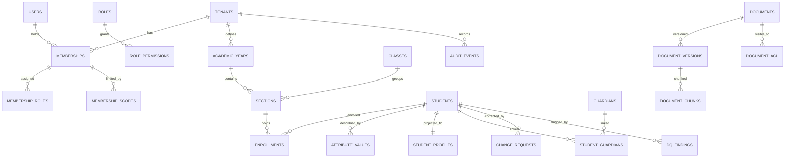

# 05 · Data Model & Storage

| Field | Value |
|---|---|
| Version | 0.6 · 2026-09-29 |
| DB | PostgreSQL 16+ (pgvector, pg_trgm, citext, pgcrypto) |
| Related | 04-Architecture §8, 06-RAG, 07-Security §7, 08-Privacy §7, 16-Platform admin panel §7, ADR-0013 |
| Changes | 0.6: circulars, tasks and parent notices (§6.3, `0034_circulars`, FR-CIR-*, FR-TASK-*, FR-NOTICE-*); retention rows for notice files, readings, tasks and notices (§13). 0.5: admin console tables `ops.tenant_exports` and `ops.retention_settings` and the full export archive (§7.3, `0031_admin`, FR-ADM-001/002); retention settings per school (§13). 0.4: year-end promotions `sis.promotion_runs` and `sis.promotion_items` (§5.1.1, `0022_promotions`, FR-TEN-011); enrolment corrections and guardian unlink as built (§5.1). 0.3: matches migrations 0001–0007: exact roles and grants (§3.1), `context_free_session` (§3.2), `definer_access` table list and allowlist keys (§3.3), eleven definer functions with grantees and the create-as-`sos_definer` pattern (§3.4), core DDL from `0003` incl. `is_platform` permissions (§4), audit DDL/partitions from `0002` and ops DDL from `0006` (§7). 0.2: database roles incl. `sos_platform` and `sos_definer` (NOBYPASSRLS) with per-table `definer_access` policies (§3); `set_config` tenant context; allowlisted definer functions; composite tenant foreign keys applied to all DDL; audit `seq`, `chain_heads.last_seq`, RFC 8785 canonical JSON, genesis hash, TRUNCATE trigger, RLS on partitions (§7); `ops.job_runs.tenant_id NOT NULL`; `ops.idempotency_keys`; `ops.feature_flags` moved to `platform.feature_flags`; schema `platform` (DDL in 16 §7); classification and retention for platform data. 0.1: baseline |

---

## 1. Conventions

- **Primary keys:** `uuid`, UUIDv7 generated by the application (PostgreSQL 18+ `uuidv7()` MAY be used). Never expose sequential IDs.
- **Tenant key:** every tenant-owned table has `tenant_id uuid NOT NULL` as the **first column of every composite index**.
- **Composite tenant foreign keys:** every reference from one tenant-owned table to another is `(tenant_id, x_id) → (tenant_id, id)`; referenced tables declare `UNIQUE (tenant_id, id)` (§3.5).
- **Timestamps:** `timestamptz`, UTC; `created_at`, `updated_at` default `now()`; display in IST.
- **Optimistic locking:** mutable rows have `version int NOT NULL DEFAULT 1`; updates use `WHERE version = :v` and increment; API uses ETags.
- **Text:** NFC-normalized before write; names also stored normalized (`*_norm`) for matching.
- **Enumerations:** `text` + `CHECK` constraints (easy to evolve) or small lookup tables.
- **Deletion:** personal data is hard-deleted per retention (no soft-delete graveyards for PII). Soft-delete (`deleted_at`) only for non-personal configuration.
- **Money:** `numeric(14,2)` INR; never floats (billing in `platform`, 16 §7; finance data in M6).
- **Naming:** snake_case; schemas `core`, `sis`, `kb`, `audit`, `ops` (tenant data) and `platform` (control plane, no student data).

## 2. Entity overview



## 3. Database roles and tenant context

Decisions: ADR-0003 (RLS), ADR-0013 (cross-tenant paths and privilege separation; see its Amendments section for where the implementation differs from the original text). Sources of truth: `infra/db/bootstrap.sql`, migrations `0001_baseline` … `0007_accept_invitations`, and `apps/api/tests/security/rls_allowlist.yaml`.

### 3.1 Roles

Roles, schemas and extensions are created by `infra/db/bootstrap.sql`, run once per database as the database admin (compose init, testcontainers, an ECS one-off task in AWS, and the dedicated-host bootstrap), never by the app. It is idempotent and re-applies role attributes on every run. `0001_baseline` refuses to run if any schema or role below is missing. **No role has `BYPASSRLS`, `SUPERUSER`, `CREATEDB`, `CREATEROLE` or `REPLICATION`.**

```sql
-- infra/db/bootstrap.sql (abridged; passwords are psql variables, never in the file)
CREATE ROLE sos_owner    NOLOGIN;   -- owns every object in core, sis, kb, audit, ops, platform
CREATE ROLE sos_definer  NOLOGIN;   -- owns ONLY the allowlisted SECURITY DEFINER functions (§3.4)
CREATE ROLE sos_migrator LOGIN;     -- Alembic; env.py runs SET ROLE sos_owner
CREATE ROLE sos_app      LOGIN;     -- tenant API + workers (RLS applies)
CREATE ROLE sos_platform LOGIN;     -- control plane (schema platform only)
CREATE ROLE sos_readonly LOGIN;     -- reporting (RLS applies)
ALTER ROLE <each> NOSUPERUSER NOBYPASSRLS NOCREATEDB NOCREATEROLE NOREPLICATION;

GRANT sos_owner, sos_definer TO CURRENT_USER;                     -- the admin running the script (RDS)
GRANT sos_owner   TO sos_migrator WITH INHERIT FALSE, SET TRUE;   -- SET ROLE only, no implicit privileges
GRANT sos_definer TO sos_migrator WITH INHERIT FALSE, SET TRUE;   -- migrations create definer functions AS sos_definer

ALTER ROLE sos_app, sos_platform, sos_readonly SET search_path = pg_catalog, public;
ALTER ROLE sos_app, sos_platform SET idle_in_transaction_session_timeout = '30s';

CREATE EXTENSION IF NOT EXISTS vector, pg_trgm, citext, pgcrypto;   -- in public
REVOKE CREATE ON SCHEMA public FROM PUBLIC;
CREATE SCHEMA core AUTHORIZATION sos_owner;   -- likewise sis, kb, audit, ops, platform
REVOKE ALL ON SCHEMA core, sis, kb, audit, ops, platform FROM PUBLIC;
GRANT USAGE ON SCHEMA core, sis, kb, audit, ops TO sos_app, sos_readonly, sos_definer;
GRANT USAGE ON SCHEMA platform TO sos_app, sos_platform, sos_definer;
GRANT USAGE ON SCHEMA core TO sos_platform;                -- to call definer functions; no table grants

-- Default privileges for objects created by sos_owner
ALTER DEFAULT PRIVILEGES FOR ROLE sos_owner, sos_definer REVOKE EXECUTE ON FUNCTIONS FROM PUBLIC;
ALTER DEFAULT PRIVILEGES FOR ROLE sos_owner IN SCHEMA core, sis, kb, ops  GRANT SELECT, INSERT, UPDATE, DELETE ON TABLES TO sos_app;
ALTER DEFAULT PRIVILEGES FOR ROLE sos_owner IN SCHEMA core, sis, kb, ops  GRANT USAGE, SELECT ON SEQUENCES TO sos_app;
ALTER DEFAULT PRIVILEGES FOR ROLE sos_owner IN SCHEMA audit              GRANT SELECT, INSERT ON TABLES TO sos_app;
ALTER DEFAULT PRIVILEGES FOR ROLE sos_owner IN SCHEMA core, sis, kb, audit GRANT SELECT ON TABLES TO sos_readonly;
ALTER DEFAULT PRIVILEGES FOR ROLE sos_owner IN SCHEMA platform          GRANT SELECT, INSERT, UPDATE, DELETE ON TABLES TO sos_platform;
ALTER DEFAULT PRIVILEGES FOR ROLE sos_owner IN SCHEMA platform          GRANT USAGE, SELECT ON SEQUENCES TO sos_platform;
```

Effective table privileges after migrations `0002`–`0007` (default privileges, then narrowed per table):

| Role | Privileges |
|---|---|
| `sos_app` | DML on `sis`, `kb` and most of `core`/`ops`, **narrowed** in `0003`/`0006`: `core.tenants` SELECT + `UPDATE (name, settings, version)` only; `core.users` SELECT + `UPDATE (display_name, email, phone_ciphertext, preferred_language, last_login_at, version)` only (**no INSERT/DELETE**; users come from definer functions); `core.permissions` SELECT only; `core.tenant_keys` SELECT, INSERT + `UPDATE (retired_at)` only; `ops.outbox` SELECT, INSERT only. Audit: SELECT + INSERT on `audit.events`, SELECT + INSERT + UPDATE on `audit.chain_heads`, nothing on partitions. Platform: SELECT on `platform.feature_flags` only. EXECUTE on the definer functions granted to it (§3.4) |
| `sos_platform` | DML on `platform` tables (audit tables: `platform.audit_events` SELECT + INSERT, `platform.audit_chain_head` SELECT + UPDATE); **no privileges on any table in `core`, `sis`, `kb`, `audit`, `ops`**; EXECUTE on the definer functions granted to it. It physically cannot read student data |
| `sos_readonly` | SELECT on `core`, `sis`, `kb`, `audit` (RLS applies); nothing on `core.tenant_keys`, `ops` or `platform` |
| `sos_definer` | Only what its functions need (§3.4); NOLOGIN; only `sos_migrator` and the bootstrap admin can `SET ROLE` to it (never a runtime role) |
| `sos_migrator` | Nothing directly (`INHERIT FALSE`); acts as `sos_owner` (and, inside migrations, `sos_definer`) via `SET ROLE` |
| `sos_purger` | ADR-0029 (migration `0032_offboarding`). NOLOGIN, NOBYPASSRLS; granted to `sos_app` `WITH INHERIT FALSE, SET TRUE` (so `sos_app` gains nothing unless it runs `SET LOCAL ROLE sos_purger`, which only the offboarding purge does). `SELECT, DELETE` on the tables the purge deletes (`kb.document_chunks`, `kb.verified_answers`, `kb.queries`, `kb.llm_calls`, `kb.embedding_cache`, `kb.upload_intents`, `kb.documents`, `sis.extraction_*`, `sis.dq_findings`, `sis.dq_runs`, `sis.change_requests`, `sis.promotion_runs`, `sis.student_guardians`, `sis.guardians`, `sis.enrollments`, `sis.students`, `sis.attribute_definitions`, `sis.import_batches`, `sis.import_mapping_templates`, `ops.exports`, `ops.tenant_exports`, `ops.retention_settings`, `ops.notifications`, `ops.break_glass_grants`, `ops.job_runs`, `ops.idempotency_keys`, `ops.outbox`, `core.membership_scopes`, `core.membership_roles`, `core.memberships`, `core.role_permissions`, `core.roles`, `core.sections`, `core.classes`, `core.academic_years`, `core.tenant_keys`) and on `audit.events`/`audit.chain_heads`; `SELECT (id, status)` on `core.tenants`. Nothing on `core.users`, `core.permissions` or `platform`. Each of those tables has the **restrictive** policy `offboarding_purge TO sos_purger USING (core.tenant_purge_allowed())` (audit tables: `core.tenant_audit_purge_allowed()`); `tenant_isolation` applies as well. `core.tenant_purge_allowed()`: tenant context set, transaction flag `app.purge_tenant` = the tenant, school `offboarding`. `core.tenant_audit_purge_allowed()`: flag `app.purge_audit`, school `deleted`; `audit.block_mutation()` additionally requires the event to be older than 365 days. Both are plain SQL, SECURITY INVOKER, `search_path` pinned (docs/16 §5.5.1) |

### 3.2 Tenant context

```sql
-- bootstrap.sql: tenant context helpers (fail closed when unset); EXECUTE for sos_app, sos_readonly, sos_definer, sos_platform
CREATE FUNCTION core.current_tenant() RETURNS uuid LANGUAGE sql STABLE PARALLEL SAFE
  AS $$ SELECT nullif(current_setting('app.tenant_id', true), '')::uuid $$;
CREATE FUNCTION core.current_user_id() RETURNS uuid LANGUAGE sql STABLE PARALLEL SAFE
  AS $$ SELECT nullif(current_setting('app.user_id', true), '')::uuid $$;
```

Application usage (every request/job):

```python
with core.db.tenant_session(tenant_id, user_id) as s:
    # executes: BEGIN;
    #   SELECT set_config('app.tenant_id', :tenant_id, true), set_config('app.user_id', :user_id, true),
    #          set_config('statement_timeout', :timeout, true);
    # is_local = true: settings vanish at transaction end (same as SET LOCAL, but bound parameters)
    ...
    # COMMIT on success, ROLLBACK on error
```

| Session helper | Role | Tenant context | Used for |
|---|---|---|---|
| `core.db.tenant_session(tenant_id, user_id=None)` | `sos_app` | set | Every tenant request and job |
| `core.db.context_free_session()` | `sos_app` | none (RLS returns nothing) | Only calling definer functions before a school is chosen: `resolve_login`, `find_user_id_by_subject`, `list_tenant_ids`, `accept_invitations` |
| `core.db.platform_session()` | `sos_platform` | none | Control plane (schema `platform`, platform definer functions) |

Statement timeouts: `SOS_DB_STATEMENT_TIMEOUT_MS` (default 5 s) for requests, `SOS_WORKER_STATEMENT_TIMEOUT_MS` (default 120 s) for long worker jobs (audit archive and verification).

### 3.3 Standard RLS policy

Apply to every tenant-owned table:

```sql
ALTER TABLE <schema>.<table> ENABLE ROW LEVEL SECURITY;
ALTER TABLE <schema>.<table> FORCE  ROW LEVEL SECURITY;
CREATE POLICY tenant_isolation ON <schema>.<table>
  USING      (tenant_id = core.current_tenant())
  WITH CHECK (tenant_id = core.current_tenant());
```

The catalog test (`apps/api/tests/security/test_rls_catalog.py`, 12 §4.5) fails if any table in `core`, `sis`, `kb`, `audit` or `ops` (`tenant_schemas` in the allowlist) with a `tenant_id` column lacks ENABLE + FORCE and this policy, unless `rls_allowlist.yaml` lists it:

| Allowlist key | Entries |
|---|---|
| `global_tables` (no `tenant_id`, listed so a new global table is always a reviewed decision) | `ops.alembic_version`, `core.permissions`, `core.users`, `core.tenants` |
| `policy_variants` (approved variant instead of `tenant_isolation`) | `core.tenants` → `own_tenant` (`id = core.current_tenant()`); `core.users` → `users_in_tenant` (membership-based; plus `users_in_tenant_update` for UPDATE); `sis.attribute_definitions` → `attrdef_read` (M1) |
| `platform_tables_readable_by_app` | `platform.feature_flags` |

Schema `platform` is exempt from RLS; the privilege-separation tests check its grants instead (§3.6).

**Definer access.** Tables that an allowlisted definer function must reach across tenants carry one extra permissive policy. Inside a `SECURITY DEFINER` function `current_user` is `sos_definer`, so this policy opens those tables to the function and to nothing else:

```sql
CREATE POLICY definer_access ON <schema>.<table> AS PERMISSIVE FOR ALL TO PUBLIC
  USING (current_user = 'sos_definer') WITH CHECK (current_user = 'sos_definer');
```

The allowlist (`definer_access_tables` in `rls_allowlist.yaml`) is exactly: `core.tenants`, `core.users`, `core.memberships`, `core.roles`, `core.role_permissions`, `core.membership_roles`, `core.membership_scopes`, `core.tenant_keys`, `core.academic_years`, `core.classes`, `core.sections`, `audit.chain_heads`, `audit.events`, `ops.outbox`. The catalog test fails if any other table carries the policy. The policy currently exists on:

| Migration | Tables with `definer_access` |
|---|---|
| `0002_audit` | `audit.events` (parent only; partitions are reachable by nobody but the owner), `audit.chain_heads` |
| `0003_core_schema` | `core.tenants`, `core.users`, `core.memberships`, `core.tenant_keys`, `core.sections`, `core.academic_years` |
| `0005_platform` | `core.roles`, `core.membership_roles`, `core.membership_scopes` (created only if absent; marked with a policy comment so the downgrade drops only its own) |
| `0006_ops` | `ops.outbox` |

`core.role_permissions` and `core.classes` are allowlisted but carry no policy yet. Tables that later milestones' usage counts need (e.g. `sis.students`, `kb.documents`) are **not** allowlisted; adding them needs an ADR-0013 amendment and an allowlist change.

### 3.4 Allowlisted `SECURITY DEFINER` functions

These are the **only** cross-tenant read/write paths (`definer_functions` in `rls_allowlist.yaml`). Each is owned by `sos_definer`, sets `search_path = pg_catalog, pg_temp`, has a fully schema-qualified body (including `pg_catalog.now()`, `pg_catalog.count()` etc.), returns the minimum columns, has `EXECUTE` revoked from `PUBLIC` and granted only to the listed roles, and is audited by its caller.

| Function | EXECUTE | Returns | Behaviour | Migration |
|---|---|---|---|---|
| `core.resolve_login(p_subject text, p_issuer text DEFAULT NULL, p_support_only boolean DEFAULT false)` | `sos_app` | `TABLE (user_id, tenant_id, membership_id, tenant_status)` | Active, unexpired memberships of the active identity `(p_issuer, p_subject)`, ordered by creation; reports the tenant status (suspended schools are handled by the API). `p_support_only` (break-glass support principals, ADR-0023): only memberships holding exactly the system role `platform_support` with a future `expires_at`; otherwise `platform_support` memberships are never returned. NULL issuer = API image older than 0027 (subject only, as before) | 0003, 0027 |
| `core.find_user_id_by_subject(p_subject text, p_issuer text DEFAULT NULL)` | `sos_app` | `uuid` or NULL | The identity `(p_issuer, p_subject)` | 0003, 0027 |
| `core.create_user_for_invite(p_subject text, p_display_name text, p_email citext, p_language text)` | `sos_app` | `uuid` (user id) | **Expand-phase wrapper** (0027) for API images older than 0027: calls the five-argument form below with the staff issuer of the environment (the pre-0027 behaviour for staff invites). Dropped by the contract migration | 0003, 0027 |
| `core.create_user_for_invite(p_subject text, p_display_name text, p_email citext, p_language text, p_issuer text)` | `sos_app` | `uuid` (user id) | Requires tenant **and** user context and an active, unexpired inviter membership in a `provisioning`/`active` school (else `insufficient_privilege`); inserts a UUIDv7 user `(p_issuer, p_subject)` or returns the existing one without overwriting it; a subject held by ANOTHER issuer's identity raises `unique_violation` (ADR-0023). Membership, roles and scopes are then written by the app under RLS | 0003, 0027 |
| `core.list_tenant_ids(p_status text[])` | `sos_app`, `sos_platform` | `TABLE (tenant_id uuid)` | Tenant IDs with the given statuses (all when NULL), for per-tenant job fan-out | 0003 |
| `core.provision_tenant(p_id uuid, p_code text, p_name text, p_boards text[], p_plan_tier text, p_deployment_mode text)` | `sos_platform` | `uuid` | Inserts **only** the tenant row, status `provisioning`. Keys (`tenancy.initialise_tenant`), system roles (post-provision hooks) and the owner invite (`core.create_owner_invite`) follow as separate steps (16 §5.4) | 0003 |
| `core.set_tenant_status(p_tenant uuid, p_status text)` | `sos_platform` | `text` — the **previous** status | Locks the row; allows only `provisioning→active`, `active→suspended`, `suspended→active`, `active→offboarding`, `suspended→offboarding`, `offboarding→deleted` (else `object_not_in_prerequisite_state`); **`provisioning→active` requires an unretired `core.tenant_keys` row**; bumps `version`. Writes no audit event (the caller does) | 0003 |
| `core.tenant_usage_summary(p_tenant uuid)` | `sos_platform` | `TABLE (active_memberships int, users int, sections int, academic_years int)` | Counts only (16 §11) | 0003 |
| `core.current_subscription()` | `sos_app` | `jsonb` | For `core.current_tenant()` only: live subscription (non-cancelled first), plan code/version/name/tier/period, status, period dates, trial end, past-due and grace dates, `cancel_at_period_end`, `limits`, latest `usage_daily` row, and the last 24 non-draft invoices with `amount_due_inr` | 0005 |
| `core.create_owner_invite(p_tenant uuid, p_subject text, p_display_name text, p_email citext, p_language text)` | `sos_platform` | `TABLE (user_id, membership_id, owner_role_assigned boolean)` | Only while the tenant is `provisioning` and has no memberships: creates/reuses the user (refuses a disabled one), an `invited` membership with `mfa_required = true`, a `school` scope, and the `owner` role if it has been cloned | 0005 |
| `core.accept_invitations(p_subject text)` | `sos_app` | `TABLE (tenant_id, membership_id, user_id)` | Activates the caller's own `invited` memberships created in the last 30 days, unexpired, in `active` schools (ADR-0019) | 0007 |
| `core.user_membership_count(p_user uuid)` | `sos_app` | `integer` or NULL | Needs tenant context (else `insufficient_privilege`); NULL unless `p_user` is a member of the current school; otherwise the number of that person's memberships in all schools, any status. Used by `PATCH /users/{id}` to refuse editing a shared profile (`409 profile_shared`, ADR-0028) | 0028 |
| `ops.claim_outbox(p_batch int)` | `sos_app` | `TABLE (id, tenant_id, event_type, payload)` | Claims up to `clamp(p_batch, 1, 500)` (default 100) pending rows `FOR UPDATE SKIP LOCKED`, sets `dispatched_at` | 0006 |

`sos_definer` table privileges (granted in the migrations, nothing via default privileges): `core.tenants` SELECT, INSERT, UPDATE; `core.users` SELECT, INSERT; `core.memberships` SELECT, INSERT, `UPDATE (status, updated_at, version)`; SELECT on `core.tenant_keys`, `core.sections`, `core.academic_years`, `core.roles`, `core.membership_roles` (0027); INSERT on `core.membership_scopes`, `core.membership_roles`; SELECT, INSERT on `audit.events`, `audit.chain_heads`; SELECT, `UPDATE (dispatched_at)` on `ops.outbox`; SELECT on `platform.plans`, `platform.subscriptions`, `platform.invoices`, `platform.usage_daily`.

**Migration pattern for a definer function** (never `ALTER FUNCTION … OWNER TO`, which `sos_owner` cannot do for a role it is not a member of):

```sql
GRANT CREATE ON SCHEMA core TO sos_definer;       -- exists only inside this migration transaction
SET ROLE sos_definer;
CREATE FUNCTION core.<name>(...) ... SECURITY DEFINER SET search_path = pg_catalog, pg_temp AS $$ ... $$;
REVOKE ALL ON FUNCTION core.<name>(...) FROM PUBLIC;
GRANT EXECUTE ON FUNCTION core.<name>(...) TO <callers>;
SET ROLE sos_owner;
REVOKE CREATE ON SCHEMA core FROM sos_definer;    -- a test asserts sos_definer has no CREATE on core
```

Downgrades drop the functions as `sos_owner` (owner of the schema). Tests: `apps/api/tests/security/test_definer_functions.py` and `test_rls_catalog.py` (12 §4.9).

### 3.5 Composite tenant foreign keys

PostgreSQL does not apply RLS to foreign-key checks, and `WITH CHECK` only checks the new row's own `tenant_id`. A single-column FK would let a row in tenant A point at a row in tenant B. Every tenant→tenant reference therefore includes `tenant_id`:

```sql
CREATE TABLE sis.students (
  id uuid PRIMARY KEY, tenant_id uuid NOT NULL,
  ...,
  UNIQUE (tenant_id, id)                                -- target for composite FKs
);
CREATE TABLE sis.enrollments (
  id uuid PRIMARY KEY, tenant_id uuid NOT NULL,
  student_id uuid NOT NULL,
  ...,
  FOREIGN KEY (tenant_id, student_id) REFERENCES sis.students (tenant_id, id)
);
```

Rules:
- Every tenant-owned table that is referenced declares `UNIQUE (tenant_id, id)`.
- Nullable references use the same composite FK (default `MATCH SIMPLE`: no check while the reference is NULL). To clear only the reference column on delete, use `ON DELETE SET NULL (column)` (e.g. `core.sections.class_teacher_membership_id`).
- References to global tables (`core.users`, `core.permissions`, `core.tenants`, global `sis.attribute_definitions` rows) stay single-column.
- References to tables created later in the revision chain (e.g., `sis.attribute_values.evidence_document_id → kb.documents`) get their composite FK in the migration that creates the referenced table.
- Polymorphic references (`core.membership_scopes.scope_ref`, `kb.document_acl.principal_ref`) cannot use an FK; `core.membership_scopes.scope_ref` is validated by the trigger `membership_scopes_ref_valid` (class/section of the same tenant) and protected by `classes_scope_restrict`/`sections_scope_restrict` (a class/section still used as a scope cannot be deleted).
- Tests: `apps/api/tests/security/test_composite_fks.py` (catalog: every tenant→tenant FK is composite; every referenced tenant table has `UNIQUE (tenant_id, id)`; behaviour: referencing another tenant's row fails) (12 §4.10).

### 3.6 Schema `platform`

Control-plane tables (operators, plans, subscriptions, billing accounts, invoices, payments, deployments, usage, usage threshold events, feature flags, announcements, support tickets, break-glass requests, platform audit, platform jobs) live in schema `platform`. It holds no student data, so it has **no RLS**; isolation is by grants: only `sos_platform` has DML; `sos_app` has only SELECT on `platform.feature_flags`; `sos_readonly` has nothing; `sos_definer` has SELECT on the four tables `core.current_subscription()` reads. Full DDL: [16 §7](16-platform-admin-panel.md#7-data-model-schema-platform).

## 4. Core schema (tenancy, identity, authorization)

The DDL below is `0003_core_schema` verbatim (constraints named as in the database). Standard RLS (§3.3) applies to every table with `tenant_id`: `core.tenant_keys`, `core.memberships`, `core.roles`, `core.role_permissions`, `core.membership_roles`, `core.membership_scopes`, `core.academic_years`, `core.classes`, `core.sections`.

```sql
CREATE TABLE core.tenants (
  id               uuid PRIMARY KEY,
  code             text NOT NULL,
  name             text NOT NULL,
  boards           text[] NOT NULL DEFAULT '{}',
  state_code       text NOT NULL DEFAULT 'AP',
  status           text NOT NULL DEFAULT 'provisioning',
  plan_tier        text NOT NULL DEFAULT 'shared',
  deployment_mode  text NOT NULL DEFAULT 'shared',
  settings         jsonb NOT NULL DEFAULT '{}'::jsonb,
  created_at       timestamptz NOT NULL DEFAULT now(),
  updated_at       timestamptz NOT NULL DEFAULT now(),
  version          int NOT NULL DEFAULT 1,
  CONSTRAINT tenants_code_key UNIQUE (code),
  CONSTRAINT tenants_code_format CHECK (code ~ '^[a-z][a-z0-9-]{1,31}$'),
  CONSTRAINT tenants_name_length CHECK (char_length(name) BETWEEN 1 AND 200),
  CONSTRAINT tenants_state_code_format CHECK (state_code ~ '^[A-Z]{2}$'),
  CONSTRAINT tenants_status_check
    CHECK (status IN ('provisioning','active','suspended','offboarding','deleted')),
  CONSTRAINT tenants_plan_tier_check CHECK (plan_tier IN ('shared','dedicated')),
  CONSTRAINT tenants_deployment_mode_check CHECK (deployment_mode IN ('shared','dedicated')),
  CONSTRAINT tenants_settings_object CHECK (jsonb_typeof(settings) = 'object'),
  CONSTRAINT tenants_version_positive CHECK (version >= 1)
);

CREATE TABLE core.tenant_keys (
  tenant_id     uuid NOT NULL,
  key_version   int  NOT NULL,
  wrapped_dek   bytea NOT NULL,
  wrapped_hmac  bytea NOT NULL,
  kms_key_arn   text NOT NULL,
  created_at    timestamptz NOT NULL DEFAULT now(),
  retired_at    timestamptz,
  CONSTRAINT tenant_keys_pkey PRIMARY KEY (tenant_id, key_version),
  CONSTRAINT tenant_keys_tenant_fk FOREIGN KEY (tenant_id) REFERENCES core.tenants (id),
  -- key_version is stored in 2 bytes of every ciphertext header (docs/05 §9).
  CONSTRAINT tenant_keys_version_range CHECK (key_version BETWEEN 1 AND 65535),
  CONSTRAINT tenant_keys_retired_after_created CHECK (retired_at IS NULL OR retired_at >= created_at)
);

CREATE TABLE core.users (
  id                 uuid PRIMARY KEY,
  -- 0027 (ADR-0023, expand): the identity is (idp_issuer, idp_subject). Nullable with
  -- DEFAULT = the staff issuer until the contract step (NOT NULL, drop UNIQUE (idp_subject)).
  idp_issuer         text DEFAULT '<SOS_OIDC_ISSUER at migration time>',
  idp_subject        text NOT NULL,
  display_name       text NOT NULL,
  email              public.citext,
  phone_ciphertext   bytea,
  preferred_language text NOT NULL DEFAULT 'en',
  status             text NOT NULL DEFAULT 'active',
  created_at         timestamptz NOT NULL DEFAULT now(),
  updated_at         timestamptz NOT NULL DEFAULT now(),
  last_login_at      timestamptz,
  version            int NOT NULL DEFAULT 1,
  CONSTRAINT users_idp_subject_key UNIQUE (idp_subject),
  CONSTRAINT users_idp_issuer_subject_key UNIQUE (idp_issuer, idp_subject),
  CONSTRAINT users_idp_issuer_length
    CHECK (idp_issuer IS NULL OR char_length(idp_issuer) BETWEEN 1 AND 255),
  CONSTRAINT users_idp_subject_length CHECK (char_length(idp_subject) BETWEEN 1 AND 255),
  CONSTRAINT users_display_name_length CHECK (char_length(display_name) BETWEEN 1 AND 200),
  CONSTRAINT users_preferred_language_check CHECK (preferred_language IN ('en','te')),
  CONSTRAINT users_status_check CHECK (status IN ('active','disabled')),
  CONSTRAINT users_version_positive CHECK (version >= 1)
);

CREATE TABLE core.memberships (
  id            uuid PRIMARY KEY,
  tenant_id     uuid NOT NULL,
  user_id       uuid NOT NULL,
  status        text NOT NULL DEFAULT 'invited',
  expires_at    timestamptz,
  mfa_required  boolean NOT NULL DEFAULT false,
  created_by    uuid,
  created_at    timestamptz NOT NULL DEFAULT now(),
  updated_at    timestamptz NOT NULL DEFAULT now(),
  version       int NOT NULL DEFAULT 1,
  CONSTRAINT memberships_tenant_id_id_key UNIQUE (tenant_id, id),
  CONSTRAINT memberships_tenant_id_user_id_key UNIQUE (tenant_id, user_id),
  CONSTRAINT memberships_tenant_fk FOREIGN KEY (tenant_id) REFERENCES core.tenants (id),
  CONSTRAINT memberships_user_fk FOREIGN KEY (user_id) REFERENCES core.users (id),
  CONSTRAINT memberships_created_by_fk FOREIGN KEY (created_by)
    REFERENCES core.users (id) ON DELETE SET NULL,
  CONSTRAINT memberships_status_check
    CHECK (status IN ('invited','active','suspended','removed')),
  CONSTRAINT memberships_expiry_after_creation CHECK (expires_at IS NULL OR expires_at > created_at),
  CONSTRAINT memberships_version_positive CHECK (version >= 1)
);
CREATE INDEX memberships_user_id_idx ON core.memberships (user_id);

CREATE TABLE core.permissions (
  key          text PRIMARY KEY,
  description  text NOT NULL,
  sensitivity  text NOT NULL DEFAULT 'normal',
  step_up      boolean NOT NULL DEFAULT false,
  is_platform  boolean NOT NULL DEFAULT false,
  created_at   timestamptz NOT NULL DEFAULT now(),
  CONSTRAINT permissions_key_format CHECK (key ~ '^[a-z][a-z0-9_]*(\.[a-z][a-z0-9_]*)+$'),
  CONSTRAINT permissions_sensitivity_check
    CHECK (sensitivity IN ('normal','sensitive','critical')),
  -- Platform permissions are exactly the platform.* keys; they can never be granted to a
  -- tenant role (trigger on core.role_permissions below).
  CONSTRAINT permissions_platform_prefix CHECK (is_platform = starts_with(key, 'platform.'))
);

CREATE TABLE core.roles (
  id          uuid PRIMARY KEY,
  tenant_id   uuid NOT NULL,
  key         text NOT NULL,
  name_en     text NOT NULL,
  name_te     text NOT NULL,
  is_system   boolean NOT NULL DEFAULT false,
  created_at  timestamptz NOT NULL DEFAULT now(),
  updated_at  timestamptz NOT NULL DEFAULT now(),
  version     int NOT NULL DEFAULT 1,
  CONSTRAINT roles_tenant_id_id_key UNIQUE (tenant_id, id),
  CONSTRAINT roles_tenant_id_key_key UNIQUE (tenant_id, key),
  CONSTRAINT roles_tenant_fk FOREIGN KEY (tenant_id) REFERENCES core.tenants (id),
  CONSTRAINT roles_key_format CHECK (key ~ '^[a-z][a-z0-9_]{1,63}$'),
  CONSTRAINT roles_name_en_length CHECK (char_length(name_en) BETWEEN 1 AND 100),
  CONSTRAINT roles_name_te_length CHECK (char_length(name_te) BETWEEN 1 AND 100),
  CONSTRAINT roles_version_positive CHECK (version >= 1)
);

CREATE TABLE core.role_permissions (
  tenant_id       uuid NOT NULL,
  role_id         uuid NOT NULL,
  permission_key  text NOT NULL,
  created_at      timestamptz NOT NULL DEFAULT now(),
  CONSTRAINT role_permissions_pkey PRIMARY KEY (tenant_id, role_id, permission_key),
  CONSTRAINT role_permissions_role_fk FOREIGN KEY (tenant_id, role_id)
    REFERENCES core.roles (tenant_id, id) ON DELETE CASCADE,
  CONSTRAINT role_permissions_permission_fk FOREIGN KEY (permission_key)
    REFERENCES core.permissions (key)
);
CREATE INDEX role_permissions_permission_key_idx ON core.role_permissions (permission_key);

CREATE TABLE core.membership_roles (
  tenant_id      uuid NOT NULL,
  membership_id  uuid NOT NULL,
  role_id        uuid NOT NULL,
  granted_by     uuid,
  created_at     timestamptz NOT NULL DEFAULT now(),
  CONSTRAINT membership_roles_pkey PRIMARY KEY (tenant_id, membership_id, role_id),
  CONSTRAINT membership_roles_membership_fk FOREIGN KEY (tenant_id, membership_id)
    REFERENCES core.memberships (tenant_id, id) ON DELETE CASCADE,
  CONSTRAINT membership_roles_role_fk FOREIGN KEY (tenant_id, role_id)
    REFERENCES core.roles (tenant_id, id),
  CONSTRAINT membership_roles_granted_by_fk FOREIGN KEY (granted_by)
    REFERENCES core.users (id) ON DELETE SET NULL
);
CREATE INDEX membership_roles_role_idx ON core.membership_roles (tenant_id, role_id);

CREATE TABLE core.academic_years (
  id          uuid PRIMARY KEY,
  tenant_id   uuid NOT NULL,
  label       text NOT NULL,
  starts_on   date NOT NULL,
  ends_on     date NOT NULL,
  is_current  boolean NOT NULL DEFAULT false,
  created_at  timestamptz NOT NULL DEFAULT now(),
  updated_at  timestamptz NOT NULL DEFAULT now(),
  version     int NOT NULL DEFAULT 1,
  CONSTRAINT academic_years_tenant_id_id_key UNIQUE (tenant_id, id),
  CONSTRAINT academic_years_tenant_id_label_key UNIQUE (tenant_id, label),
  CONSTRAINT academic_years_tenant_fk FOREIGN KEY (tenant_id) REFERENCES core.tenants (id),
  CONSTRAINT academic_years_label_length CHECK (char_length(label) BETWEEN 1 AND 32),
  CONSTRAINT academic_years_dates_ordered CHECK (starts_on < ends_on),
  CONSTRAINT academic_years_version_positive CHECK (version >= 1)
);
-- FR-TEN-010: exactly one current year per tenant.
CREATE UNIQUE INDEX one_current_year ON core.academic_years (tenant_id) WHERE is_current;

CREATE TABLE core.classes (
  id          uuid PRIMARY KEY,
  tenant_id   uuid NOT NULL,
  code        text NOT NULL,
  display_en  text NOT NULL,
  display_te  text NOT NULL,
  sort_order  int  NOT NULL,
  created_at  timestamptz NOT NULL DEFAULT now(),
  updated_at  timestamptz NOT NULL DEFAULT now(),
  version     int NOT NULL DEFAULT 1,
  CONSTRAINT classes_tenant_id_id_key UNIQUE (tenant_id, id),
  CONSTRAINT classes_tenant_id_code_key UNIQUE (tenant_id, code),
  CONSTRAINT classes_tenant_fk FOREIGN KEY (tenant_id) REFERENCES core.tenants (id),
  CONSTRAINT classes_code_format CHECK (code ~ '^[A-Z0-9][A-Z0-9_-]{0,15}$'),
  CONSTRAINT classes_display_en_length CHECK (char_length(display_en) BETWEEN 1 AND 100),
  CONSTRAINT classes_display_te_length CHECK (char_length(display_te) BETWEEN 1 AND 100),
  CONSTRAINT classes_sort_order_range CHECK (sort_order BETWEEN 0 AND 10000),
  CONSTRAINT classes_version_positive CHECK (version >= 1)
);

CREATE TABLE core.sections (
  id                           uuid PRIMARY KEY,
  tenant_id                    uuid NOT NULL,
  class_id                     uuid NOT NULL,
  academic_year_id             uuid NOT NULL,
  name                         text NOT NULL,
  class_teacher_membership_id  uuid,
  created_at                   timestamptz NOT NULL DEFAULT now(),
  updated_at                   timestamptz NOT NULL DEFAULT now(),
  version                      int NOT NULL DEFAULT 1,
  CONSTRAINT sections_tenant_id_id_key UNIQUE (tenant_id, id),
  CONSTRAINT sections_year_class_name_key UNIQUE (tenant_id, academic_year_id, class_id, name),
  CONSTRAINT sections_class_fk FOREIGN KEY (tenant_id, class_id)
    REFERENCES core.classes (tenant_id, id),
  CONSTRAINT sections_academic_year_fk FOREIGN KEY (tenant_id, academic_year_id)
    REFERENCES core.academic_years (tenant_id, id),
  CONSTRAINT sections_class_teacher_fk FOREIGN KEY (tenant_id, class_teacher_membership_id)
    REFERENCES core.memberships (tenant_id, id) ON DELETE SET NULL (class_teacher_membership_id),
  CONSTRAINT sections_name_length CHECK (char_length(name) BETWEEN 1 AND 16),
  CONSTRAINT sections_version_positive CHECK (version >= 1)
);
CREATE INDEX sections_class_idx ON core.sections (tenant_id, class_id);
CREATE INDEX sections_class_teacher_idx ON core.sections (tenant_id, class_teacher_membership_id)
  WHERE class_teacher_membership_id IS NOT NULL;

CREATE TABLE core.membership_scopes (
  id             uuid PRIMARY KEY,
  tenant_id      uuid NOT NULL,
  membership_id  uuid NOT NULL,
  scope_type     text NOT NULL,
  scope_ref      uuid,
  created_at     timestamptz NOT NULL DEFAULT now(),
  CONSTRAINT membership_scopes_tenant_id_id_key UNIQUE (tenant_id, id),
  CONSTRAINT membership_scopes_unique_scope
    UNIQUE NULLS NOT DISTINCT (tenant_id, membership_id, scope_type, scope_ref),
  CONSTRAINT membership_scopes_membership_fk FOREIGN KEY (tenant_id, membership_id)
    REFERENCES core.memberships (tenant_id, id) ON DELETE CASCADE,
  CONSTRAINT membership_scopes_type_check CHECK (scope_type IN ('school','class','section')),
  CONSTRAINT membership_scopes_ref_matches_type CHECK ((scope_type = 'school') = (scope_ref IS NULL))
);
CREATE INDEX membership_scopes_ref_idx ON core.membership_scopes (tenant_id, scope_ref)
  WHERE scope_ref IS NOT NULL;
```

Policies, triggers and grants of `0003`:

```sql
-- RLS variants (rls_allowlist.yaml policy_variants)
CREATE POLICY own_tenant ON core.tenants
  USING (id = core.current_tenant()) WITH CHECK (id = core.current_tenant());
CREATE POLICY users_in_tenant ON core.users FOR SELECT
  USING (EXISTS (SELECT 1 FROM core.memberships AS m
                 WHERE m.user_id = users.id AND m.tenant_id = core.current_tenant()));
CREATE POLICY users_in_tenant_update ON core.users FOR UPDATE
  USING (<same EXISTS>) WITH CHECK (<same EXISTS>);
-- (no INSERT/DELETE policy on core.users: the app has no such grant)

-- Triggers (SECURITY INVOKER functions owned by sos_owner, search_path pinned)
--   <table>_set_updated_at        BEFORE UPDATE on tenants, users, memberships, roles, academic_years, classes, sections
--   role_permissions_not_platform BEFORE INSERT/UPDATE OF permission_key ON core.role_permissions:
--                                 refuses any permission with is_platform (check_violation)
--   membership_scopes_ref_valid   BEFORE INSERT/UPDATE ON core.membership_scopes: scope_ref must be a
--                                 class/section of the same tenant (foreign_key_violation)
--   classes_scope_restrict, sections_scope_restrict  BEFORE DELETE: refuse while used as a scope

-- sos_app grants narrowed from the default privileges (ADR-0013 Amendment A2)
REVOKE INSERT, UPDATE, DELETE ON core.tenants FROM sos_app;
GRANT UPDATE (name, settings, version) ON core.tenants TO sos_app;
REVOKE INSERT, UPDATE, DELETE ON core.users FROM sos_app;
GRANT UPDATE (display_name, email, phone_ciphertext, preferred_language, last_login_at, version)
  ON core.users TO sos_app;
REVOKE INSERT, UPDATE, DELETE ON core.permissions FROM sos_app;
REVOKE UPDATE, DELETE ON core.tenant_keys FROM sos_app;
GRANT UPDATE (retired_at) ON core.tenant_keys TO sos_app;
REVOKE ALL ON core.tenant_keys FROM sos_readonly;
```

**Permission catalog.** `core.permissions` is seeded by `0004_authz_seed` from `apps/api/app/authz/permissions.yaml` (upsert; a later catalog change gets its own revision re-running the upsert; the downgrade keeps keys still granted to a role, §14). It contains tenant permissions, the implicit `session.authenticated` (held by every active member, never stored in `core.role_permissions`), and the `platform.*` keys with `is_platform = true`, so route guards can be checked against one table. `permissions_platform_prefix` ties the flag to the prefix and `role_permissions_not_platform` makes them ungrantable to tenant roles. System roles are **not** seeded by a migration: they are cloned into each school at provisioning from `apps/api/app/authz/roles.yaml` (roles are tenant rows under RLS). A release that changes them reaches existing schools through the operator command `python -m app.identity.sync_system_roles` (ADR-0022): each school in its own `tenant_session`, dry run by default, `--apply` adds missing system roles and grants and updates display names, `--prune` also removes grants roles.yaml no longer lists; custom roles and `platform_support` are never changed; every change is audited (`role.permission_granted`, `role.permission_revoked`, `role.created`, `role.updated`, `role.system_sync_applied`).

Writes to `core.academic_years`, `core.classes` and `core.sections` require `tenant.structure.manage` (07 §6.2). `POST /classes/defaults` adds the missing classes from `apps/api/app/tenancy/academic_defaults.yaml` (Nursery–XII, EN/TE names).

**Archive (migration `0023_api_gaps`; US-202, FR-TEN-010).** The three structure tables gain `archived_at timestamptz` (NULL while in use). Archived rows are never deleted or rewritten: enrolments, documents, exports and membership scopes keep referring to them, and codes/labels stay taken (the unique keys are unchanged). The API hides them from its lists unless `include_archived=true`; other modules' service calls still see them.

```sql
ALTER TABLE core.academic_years ADD COLUMN archived_at timestamptz;
ALTER TABLE core.classes        ADD COLUMN archived_at timestamptz;
ALTER TABLE core.sections       ADD COLUMN archived_at timestamptz;
ALTER TABLE core.academic_years ADD CONSTRAINT academic_years_current_not_archived
  CHECK (NOT (is_current AND archived_at IS NOT NULL));
-- SECURITY INVOKER (RLS applies), search_path pinned; fires only on the NULL -> timestamp
-- transition: an active sis.enrollments row in the year / section / any section of the class
-- raises object_not_in_prerequisite_state, CONSTRAINT structure_active_enrolments (API 409
-- structure_in_use).
CREATE FUNCTION core.tg_structure_archive_guard() RETURNS trigger ...;
CREATE TRIGGER academic_years_archive_guard BEFORE UPDATE OF archived_at ON core.academic_years ...;
CREATE TRIGGER classes_archive_guard        BEFORE UPDATE OF archived_at ON core.classes ...;
CREATE TRIGGER sections_archive_guard       BEFORE UPDATE OF archived_at ON core.sections ...;
```

Downgrade drops the triggers, function, CHECK and columns; archived rows become ordinary rows again (their `*.archived` audit events remain). Enrolling a student into an archived section is not refused by the database yet (students module).

## 5. Student information schema (`sis`)

```sql
CREATE TABLE sis.students (
  id             uuid PRIMARY KEY,
  tenant_id      uuid NOT NULL,
  status         text NOT NULL CHECK (status IN ('provisional','active','left','graduated')),
  admission_no   text,
  created_at     timestamptz NOT NULL DEFAULT now(),
  updated_at     timestamptz NOT NULL DEFAULT now(),
  version        int NOT NULL DEFAULT 1,
  UNIQUE (tenant_id, id)
);
CREATE UNIQUE INDEX students_adm_no ON sis.students(tenant_id, admission_no) WHERE admission_no IS NOT NULL;

CREATE TABLE sis.enrollments (
  id uuid PRIMARY KEY, tenant_id uuid NOT NULL,
  student_id uuid NOT NULL,
  section_id uuid NOT NULL,
  academic_year_id uuid NOT NULL,
  roll_no text,
  status text NOT NULL CHECK (status IN ('active','transferred','completed')),
  started_on date, ended_on date,
  FOREIGN KEY (tenant_id, student_id)       REFERENCES sis.students (tenant_id, id),
  FOREIGN KEY (tenant_id, section_id)       REFERENCES core.sections (tenant_id, id),
  FOREIGN KEY (tenant_id, academic_year_id) REFERENCES core.academic_years (tenant_id, id)
);
CREATE UNIQUE INDEX one_active_enrollment ON sis.enrollments(tenant_id, student_id, academic_year_id) WHERE status = 'active';

-- Attribute catalog: global defaults (tenant_id NULL) + tenant custom fields
CREATE TABLE sis.attribute_definitions (
  id               uuid PRIMARY KEY,
  tenant_id        uuid,                            -- NULL = global
  key              text NOT NULL,                   -- 'full_name','dob','gender','father_name',...
  data_type        text NOT NULL CHECK (data_type IN ('text','date','enum','digits4')),
  classification   text NOT NULL CHECK (classification IN ('C1','C2','C3')),
  is_identity      boolean NOT NULL DEFAULT false,  -- identity fields need maker-checker
  validation       jsonb NOT NULL DEFAULT '{}',     -- regex, length, allowed values
  canonical_policy jsonb NOT NULL,                  -- precedence rules (see §10)
  label_en text NOT NULL, label_te text NOT NULL
);
CREATE UNIQUE INDEX attrdef_key ON sis.attribute_definitions (coalesce(tenant_id, '00000000-0000-0000-0000-000000000000'), key);
ALTER TABLE sis.attribute_definitions ENABLE ROW LEVEL SECURITY; ALTER TABLE sis.attribute_definitions FORCE ROW LEVEL SECURITY;
CREATE POLICY attrdef_read ON sis.attribute_definitions
  USING (tenant_id IS NULL OR tenant_id = core.current_tenant())
  WITH CHECK (tenant_id = core.current_tenant());  -- app cannot write global rows

-- The heart of "enter once": one row per (student, attribute, source, point in time)
CREATE TABLE sis.attribute_values (
  id                   uuid PRIMARY KEY,
  tenant_id            uuid NOT NULL,
  student_id           uuid NOT NULL,
  attribute_key        text NOT NULL,
  source               text NOT NULL CHECK (source IN ('admission_register','aadhaar_as_printed','udise_plus',
                          'board_registration','birth_certificate','parent_form','tc_incoming','manual_entry')),
  value_text           text,                        -- C1/C2 only
  value_date           date,                        -- C1/C2 only
  value_norm           text,                        -- normalized for matching (names); C1/C2 only
  value_ciphertext     bytea,                       -- C3 only (AES-256-GCM with tenant DEK)
  value_blind_index    bytea,                       -- HMAC for equality lookups on C3 (optional)
  key_version          int,
  confidence           numeric(4,3),                -- extraction confidence, if any
  verification_status  text NOT NULL CHECK (verification_status IN ('unverified','verified','rejected')),
  verified_by          uuid, verified_at timestamptz,
  evidence_document_id uuid,                        -- kb.documents (scan/photo); composite FK added with kb (§3.5)
  import_batch_id      uuid, change_request_id uuid,  -- composite FKs added once those tables exist
  recorded_by          uuid NOT NULL,
  recorded_at          timestamptz NOT NULL DEFAULT now(),
  superseded_by        uuid,
  CHECK (NOT (value_ciphertext IS NOT NULL AND (value_text IS NOT NULL OR value_norm IS NOT NULL))),
  UNIQUE (tenant_id, id),
  FOREIGN KEY (tenant_id, student_id)    REFERENCES sis.students (tenant_id, id),
  FOREIGN KEY (tenant_id, superseded_by) REFERENCES sis.attribute_values (tenant_id, id)
);
-- Exactly one current value per (student, attribute, source)
CREATE UNIQUE INDEX av_current ON sis.attribute_values(tenant_id, student_id, attribute_key, source) WHERE superseded_by IS NULL;
CREATE INDEX av_student ON sis.attribute_values(tenant_id, student_id);

-- Denormalized projection for search and lists (C2 only), maintained in the same transaction
CREATE TABLE sis.student_profiles (
  tenant_id          uuid NOT NULL,
  student_id         uuid PRIMARY KEY,
  full_name          text, full_name_norm text, full_name_translit text,
  dob                date, gender text,
  father_name_norm   text, mother_name_norm text,
  current_section_id uuid, status text,
  search_tsv         tsvector,                      -- 'simple' config: names, adm no, parents
  updated_at         timestamptz NOT NULL DEFAULT now(),
  FOREIGN KEY (tenant_id, student_id) REFERENCES sis.students (tenant_id, id)
);
CREATE INDEX sp_name_trgm   ON sis.student_profiles USING gin (full_name_norm gin_trgm_ops);
CREATE INDEX sp_translit    ON sis.student_profiles USING gin (full_name_translit gin_trgm_ops);
CREATE INDEX sp_tsv         ON sis.student_profiles USING gin (search_tsv);
CREATE INDEX sp_section     ON sis.student_profiles (tenant_id, current_section_id);

CREATE TABLE sis.guardians (
  id uuid PRIMARY KEY, tenant_id uuid NOT NULL,
  full_name text NOT NULL, full_name_norm text,
  phone_ciphertext bytea, phone_blind_index bytea,
  address_ciphertext bytea, key_version int,
  created_at timestamptz NOT NULL DEFAULT now(),
  UNIQUE (tenant_id, id)
);
CREATE TABLE sis.student_guardians (
  tenant_id uuid NOT NULL,
  student_id uuid NOT NULL,
  guardian_id uuid NOT NULL,
  relationship text NOT NULL CHECK (relationship IN ('father','mother','guardian')),
  is_primary boolean NOT NULL DEFAULT false,
  PRIMARY KEY (tenant_id, student_id, guardian_id),
  FOREIGN KEY (tenant_id, student_id)  REFERENCES sis.students (tenant_id, id),
  FOREIGN KEY (tenant_id, guardian_id) REFERENCES sis.guardians (tenant_id, id)
);

CREATE TABLE sis.change_requests (
  id uuid PRIMARY KEY, tenant_id uuid NOT NULL,
  student_id uuid NOT NULL,
  attribute_key text NOT NULL,
  target_source text NOT NULL DEFAULT 'admission_register',
  old_value_id uuid,
  new_value_text text, new_value_date date, new_value_ciphertext bytea,
  reason text NOT NULL,
  evidence_document_id uuid NOT NULL,
  status text NOT NULL CHECK (status IN ('pending','approved','rejected','expired','cancelled')),
  requested_by uuid NOT NULL, requested_at timestamptz NOT NULL DEFAULT now(),
  decided_by uuid, decided_at timestamptz, decision_note text,
  expires_at timestamptz NOT NULL,
  CHECK (decided_by IS NULL OR decided_by <> requested_by),  -- no self-approval, enforced in DB too
  UNIQUE (tenant_id, id),
  FOREIGN KEY (tenant_id, student_id)   REFERENCES sis.students (tenant_id, id),
  FOREIGN KEY (tenant_id, old_value_id) REFERENCES sis.attribute_values (tenant_id, id)
);

CREATE TABLE sis.dq_runs (
  id uuid PRIMARY KEY, tenant_id uuid NOT NULL,
  scope jsonb NOT NULL, profile_key text,
  started_by uuid NOT NULL, started_at timestamptz NOT NULL DEFAULT now(),
  finished_at timestamptz, stats jsonb,
  UNIQUE (tenant_id, id)
);
CREATE TABLE sis.dq_findings (
  id uuid PRIMARY KEY, tenant_id uuid NOT NULL,
  fingerprint text NOT NULL,                        -- hash(student, rule, attribute, sources)
  student_id uuid NOT NULL,
  rule_id text NOT NULL, rule_version int NOT NULL,
  attribute_key text, sources text[], match_class text,
  severity text NOT NULL CHECK (severity IN ('blocker','high','medium','low','info')),
  status text NOT NULL CHECK (status IN ('open','resolved','waived','reopened')),
  explanation_code text NOT NULL,
  details jsonb NOT NULL DEFAULT '{}',              -- masked values only
  first_seen_run_id uuid, last_seen_run_id uuid,
  resolved_by uuid, resolved_at timestamptz, resolution_note text, change_request_id uuid,
  waived_by uuid, waived_reason text,
  UNIQUE (tenant_id, fingerprint),
  UNIQUE (tenant_id, id),
  FOREIGN KEY (tenant_id, student_id) REFERENCES sis.students (tenant_id, id)
);

CREATE TABLE sis.import_batches (
  id uuid PRIMARY KEY, tenant_id uuid NOT NULL,
  kind text NOT NULL CHECK (kind IN ('spreadsheet','register_photos')),
  source text NOT NULL, status text NOT NULL,
  file_object_key text, mapping jsonb, stats jsonb,
  created_by uuid NOT NULL, created_at timestamptz NOT NULL DEFAULT now(),
  committed_at timestamptz, reverted_at timestamptz,
  UNIQUE (tenant_id, id)
);
CREATE TABLE sis.import_rows (
  id uuid PRIMARY KEY, tenant_id uuid NOT NULL,
  batch_id uuid NOT NULL,
  row_no int NOT NULL,
  parsed jsonb NOT NULL,                            -- C3 columns stored encrypted inside as ciphertext blobs
  errors jsonb NOT NULL DEFAULT '[]',
  status text NOT NULL,
  FOREIGN KEY (tenant_id, batch_id) REFERENCES sis.import_batches (tenant_id, id) ON DELETE CASCADE
);
CREATE TABLE sis.extraction_items (
  id uuid PRIMARY KEY, tenant_id uuid NOT NULL,
  batch_id uuid NOT NULL,
  document_id uuid NOT NULL, page_no int NOT NULL, row_index int NOT NULL,
  fields jsonb NOT NULL,                            -- {field: {value, confidence, bbox}}
  status text NOT NULL CHECK (status IN ('pending_review','confirmed','rejected')),
  reviewed_by uuid, reviewed_at timestamptz, student_id uuid,
  FOREIGN KEY (tenant_id, batch_id)   REFERENCES sis.import_batches (tenant_id, id),
  FOREIGN KEY (tenant_id, student_id) REFERENCES sis.students (tenant_id, id)
  -- (tenant_id, document_id) → kb.documents added with kb (§3.5); as built: §5.6
);
```

### 5.1 As built in M1 (migration `0008_sis_students`)

The DDL above is the model; migration `0008_sis_students` implements `students`, `enrollments`, `attribute_definitions`, `attribute_values`, `student_profiles`, `guardians` and `student_guardians` with these refinements (the other `sis` tables arrive with their modules):

- **Global attribute catalog** lives in `apps/api/app/students/attributes.yaml` and is seeded with deterministic ids (UUIDv5) before RLS is forced (FORCE applies to the owning role too). Extra columns: `sort_order`, `created_at`. `validation` carries `max_length`, `pattern`, `values`, `name` (normalise as a person name), `not_future` and `sources` (allowed sources). `canonical_policy` adds `anchor`: the only source that makes an identity value non-provisional (`admission_register`, BR-01).
- **Aadhaar-as-printed values are separate C3 attributes** (`aadhaar_last4` (`digits4`), `aadhaar_name_as_printed`, `aadhaar_dob_as_printed`, `aadhaar_gender_as_printed`), accepted only from source `aadhaar_as_printed`; `full_name`/`dob`/`gender` refuse that source, so as-printed data is never stored in C2 columns (08 PRV-014).
- **`attribute_definitions` policies** (reviewed variant, `rls_allowlist.yaml`): `attrdef_read` (SELECT only) returns global rows plus the school's own rows, and nothing at all without a tenant context; `attrdef_write` (ALL) is limited to the school's own rows. A single `FOR ALL` policy with `USING (tenant_id IS NULL OR …)` would have let a school UPDATE or DELETE global rows.
- **`attribute_values`**: `superseded_by` FK is `DEFERRABLE INITIALLY DEFERRED` (the old row is retired before its successor is inserted because `av_current` admits one current row). Trigger `attribute_values_immutable` forbids changing any value column; only `superseded_by` (once), verification fields on the current row, and re-encryption to a newer `key_version` are allowed. `sos_app` has column-level UPDATE on exactly those columns and no DELETE. Extra CHECKs: `value_date` is also excluded for C3, `key_version` present iff ciphertext, `(verification_status = 'unverified') = (verified_at IS NULL)`.
- **`student_profiles`**: primary key `(tenant_id, student_id)` (tenant first; a probe with another school's id meets only the composite FK). `full_name_norm` = `core.textnorm.comparison_key`; `full_name_translit` = phonetic keys of every current C2 spelling of the name (`" | "`-joined) so Telugu-script queries and spelling variants match. **Under RLS the pg_trgm GIN indexes are not used by `sos_app`**: trigram operators are not leakproof, so the planner cannot evaluate them before the RLS qual; it reaches a school's rows through a `tenant_id`-leading btree (`sp_section`, `sp_tenant_name`) and filters by `word_similarity`. Measured p95 ≈ 60 ms for 2,000 students (FR-STU-011 budget 300 ms); the GIN indexes stay for reporting roles and a future per-tenant partitioning.
- **`enrollments`** add `created_by`, `created_at`, `updated_at`, `version` and index `enrollments_section_active_idx (tenant_id, academic_year_id, section_id) WHERE status = 'active'`. Scope (SEC-015) is decided on active enrolments in the **current** academic year.
- **`guardians`** add `updated_at` and `version` (ETag); phone (C3) is stored as 10 digits, encrypted, with a blind index (`guardians_phone_bidx`); `student_guardians_one_primary` allows one primary guardian per student.
- **Encryption**: AAD `tenant_id|sis.attribute_values|value_ciphertext|<row id>` and `tenant_id|sis.guardians|phone_ciphertext|<guardian id>` (likewise `address_ciphertext`); blind index = HMAC-SHA256(tenant HMAC key, `schoolos/blind-index/v1|<purpose>|<value>`).
- **Enrolment corrections** (no schema change): an enrolment's `roll_no` and, while `active`, its `section_id` (another section of the same class and academic year) are updated in place with the enrolment `version` as ETag (audit `enrollment.updated`, field names and section ids only); moving to another class is a new enrolment. Closing sets `status` `completed`/`transferred` and `ended_on` (audit `enrollment.ended`); the student's record status is not changed.
- **Guardian unlink** (no schema change): deleting the `student_guardians` row (audit `guardian.unlinked`); a guardian no student is linked to any more is deleted with its C3 phone/address (audit `guardian.deleted`, data minimisation).

### 5.1.1 As built: year-end promotions (migration `0022_promotions`, FR-TEN-011)

The students module owns promotions (owner decision 2026-09-27; enrolments live there). Two tenant-owned tables (RLS ENABLE + FORCE `tenant_isolation`, composite FKs):

- **`sis.promotion_runs`**: one row per committed promotion: `from_academic_year_id`, `to_academic_year_id` (composite FKs to `core.academic_years`, CHECK they differ), `status` (`committed` | `undone`, CHECK `undone_at` iff `undone`), counts (`promoted_count`, `held_back_count`, `graduated_count`, `skipped_count`), `plan_fingerprint` (SHA-256 of the plan), `committed_by`/`undone_by` (→ `core.users`, `ON DELETE SET NULL`), `committed_at`, `undone_at`, `version`. Partial unique index `promotion_runs_one_committed (tenant_id, from_academic_year_id) WHERE status = 'committed'`: a year is promoted once until that promotion is undone. `sos_app` may INSERT and UPDATE only `status`, `undone_by`, `undone_at`, `version`, `updated_at`; no DELETE.
- **`sis.promotion_items`**: PK `(tenant_id, run_id, student_id)`; `outcome` (`promoted`, `held_back`, `graduated`), `from_enrollment_id` + `from_enrollment_version` (the enrolment closed and the version it was left at), `to_enrollment_id` + `to_enrollment_version` (the enrolment opened; none for graduates, CHECK), `previous_student_status`. `to_enrollment_id` is `ON DELETE SET NULL (to_enrollment_id)` (an undo removes that enrolment); the student and closed-enrolment FKs block deletes, so an import revert of a promoted student answers `409 import_has_dependents`. `sos_app` may only INSERT.
- **Commit** (one transaction): active enrolments of the source year are locked; each promoted or held-back student's enrolment becomes `completed` with `ended_on` = the source year's `ends_on` (never before its start) and a new `active` enrolment starts on the target year's `starts_on` (no roll number); graduates (last class by `core.classes.sort_order`) get record status `graduated` and no new enrolment; students whose record status is `left`/`graduated`, or who are already active in the target year, are skipped and untouched.
- **Undo** (within 24 h of `committed_at`): refused while any closed enrolment is not `completed` at its recorded version, any opened enrolment is not `active` at its recorded version, a graduate's status is no longer `graduated`, or a student is active again in the source year. Otherwise the opened enrolments are deleted, the closed ones become `active` again (`ended_on` NULL), graduates get `previous_student_status` back and the run becomes `undone`. Downgrade drops both tables; the enrolments stay.

### 5.2 As built: spreadsheet imports (migration `0012_imports`, US-401)

Tables `sis.import_batches`, `sis.import_rows` and `sis.import_mapping_templates` (all tenant-owned, RLS ENABLE + FORCE `tenant_isolation`, `UNIQUE (tenant_id, id)`, composite FKs). Refinements to the model above:

- **`import_batches`** add `document_id` (composite FK to `kb.documents`, `ON DELETE SET NULL (document_id)` so the retention job can delete the raw file), `file_kind` (`xlsx`/`csv`), `header_row`, `columns` (headers with the suggested target and score), `mapping` (column index → attribute key, `class`, `section`, `class_section` or `roll_no`), `mapping_template_id`, `row_count`, `error_count`, `error_code`, `job_id` (→ `ops.job_runs`), `committed_by`, `revert_deadline` (commit + 24 h, FR-IMP-005), `reverted_by`, `raw_file_deleted_at`, `version` (ETag). `file_object_key` is not stored: the file is the document's version. `status` ∈ `uploaded, parsing, parsed, validating, validated, committing, committed, reverting, reverted, failed`; one live batch per document (`import_batches_one_live_per_document`, reverted/failed batches free it).
- **`import_rows.parsed` never holds C3 values**: it keeps the admission number, the normalised non-C3 values, the resolved section and **only the keys** of C3 attributes present (`sensitive`). C3 cells are re-read from the raw file (SSE-KMS, SHA-256 checked) when the batch is committed and encrypted by the student service. A full Aadhaar number anywhere in a row is a row error (`aadhaar_full_number_rejected`) that names the column only; the number is stored nowhere. Rows add `warnings`, `action` (`create`/`update`), `student_id` (`ON DELETE SET NULL (student_id)`), `created_student`, `student_version` (version after commit; revert refuses if it changed).
- **`import_mapping_templates`**: `name` (unique per school), `source`, `header_signature` (SHA-256 of the normalised headers), `headers`, `mapping` (normalised header → target), `last_used_at`. A new file with the same signature reuses the template automatically.
- **Student-record links (FR-IMP-004/005)**: `sis.attribute_values.import_batch_id` gets its composite FK `attribute_values_import_batch_fk`. To let a revert remove the students a batch created while `sos_app` keeps **no** DELETE on `sis.attribute_values` (FR-STU-005), `attribute_values_student_fk` becomes `ON DELETE CASCADE` (the referential action runs as the table owner) and trigger `students_delete_only_by_import_revert` refuses deleting any student unless an import row created it and its batch is `reverting` in the same transaction. The student module owns these writes: imports call `students.plan_import_revert` (the `import_has_dependents` checks) and `students.revert_import`, which withdraws the values a batch added to existing students by marking them `rejected` (history kept, audit `student.values.withdrawn`), re-records the values they had replaced, refreshes the profile and version of every student that lost a value, and removes the students the batch created (audit `student.removed`).
- **Retention (FR-IMP-007)**: the raw file is kept 90 days after commit (documents delete guard `import_file_retained`), then the daily job `imports.purge_raw_files` deletes it through the documents delete path (audit `document.deleted` + `import.raw_file_deleted`); parsed rows stay.

#### 5.2.1 As built: staged cell edits (migration `0030_import_cell_edits`, US-401 AC5/AC6, FR-IMP-008, FR-IMP-009)

`sis.import_cell_edits` is the append-only edit history of a batch's staged sheet; the uploaded raw file never changes. Tenant-owned: `tenant_id` first, `UNIQUE (tenant_id, id)`, RLS ENABLE + FORCE `tenant_isolation`, composite FK `(tenant_id, batch_id) → sis.import_batches ON DELETE CASCADE`; `edited_by → core.users`.

- **One row per edited cell**: `row_no` (as the spreadsheet shows it, ≥ 1), `column_index` (0-based, 0..255), `batch_version` (the batch ETag version the edit produced; `UNIQUE (tenant_id, batch_id, row_no, column_index, batch_version)`), `edited_by`, `edited_at`. The current value of a cell is its newest edit (`batch_version` highest; index `import_cell_edits_cell_idx`). Parsing, validation, the staged-sheet view, the download and the commit all read the raw file and apply the current edits on top.
- **Values only as ciphertext**: `old_value_ciphertext` / `new_value_ciphertext` (AES-256-GCM under the school's DEK, AAD `tenant_id|sis.import_cell_edits|<column>|<edit id>`, `key_version`; NULL = the cell was / became empty; CHECK `import_cell_edits_key_version`). A cell may hold anything a school typed, including C3 data in a column that is not imported. The value before is masked (`core.redaction.mask_aadhaar`) before encryption; a new value with a full Aadhaar number is refused (422 `aadhaar_full_number_rejected`) before anything is stored (invariant 4).
- **Grants**: `sos_app` has INSERT and SELECT, no DELETE, and UPDATE only on `old_value_ciphertext`, `new_value_ciphertext`, `key_version` (re-encryption, SEC-012; retention erasure).
- **Key rotation**: both ciphertext columns are in `app.students.rotation.CIPHERTEXT_COLUMNS`; `app.imports.cells.reencrypt_batch` is registered as the `import_cell_edits` re-encryptor (§9).
- **Retention**: when `imports.purge_raw_files` deletes a batch's raw file, it also sets the batch's edit ciphertext and `key_version` to NULL (audit `import.raw_file_deleted` adds `cell_edits_erased`); who edited which cell and when stays.
- **Audit** (same transaction, never values): `import.cell_edited` per cell (`edit_id`, `row_no`, `column`, `field` or `column_<n>`, `cleared`, `revalidated`); `import.sheet_exported` (`format`, `rows`, `columns`, `edited_cells`, `restricted_columns`, `restricted_included`, `status`).
- **Downgrade** drops the table (the edit history is lost; batches keep working from their raw files). Round trip on a populated database: `tests/imports/test_migration_schema.py`.

### 5.3 Data quality as built (migration `0013_dq`)

`sis.dq_runs` and `sis.dq_findings` follow the model above with these refinements (engine: `app/dq/engine.py`; rules, profiles and thresholds in `app/dq/config/`):

- **`dq_runs`**: `trigger` (`manual` | `event`), `event_type` (event runs), `status` (`queued`, `running`, `completed`, `failed`), `scope` = the *effective* scope (section/class/student ids or an import `batch_id`, already limited to the requester's reach), `requested_by_membership` (composite FK; notified when a queued run finishes), `stats` (counts only: students, new, reopened, updated, unchanged, cleared, blockers, warnings, by severity, duration), `error_code`. Manual runs need `started_by` and the requesting membership.
- **`dq_findings`**: `fingerprint` = sha256(student | rule | attribute | sorted sources [+ `profile:<key>` for profile rules DQ-005/006/009] [+ `student:<id>` for DQ-008 pairs]), UNIQUE `(tenant_id, fingerprint)`; extra columns `related_student_id` (DQ-008 only, composite FK), `profile_key`, `explanation_params` (codes: profile key, attribute key, issue code, age, class code, admission number), `route_codes`, `conflict_hash` (sha256 of severity, match class, details and params: a waiver covers exactly that conflict), `first_seen_run_id`/`last_seen_run_id` (composite FKs), `first_seen_at`/`last_seen_at`, `resolution` (`note` | `change_request` | `auto_cleared`), `waived_at`, `reopened_count`, `created_at`/`updated_at`/`version` (ETag). `change_request_id` gets its composite FK `dq_findings_change_request_fk` in `0014_change_requests`.
- **`details` holds masked values only** (FR-DQ-006): per compared value `{attribute_key, source, value_id, masked}` (names `K••• V•••`, dates `••/••/••••`, other `••••`), match-class token positions and metrics, and codes (`differs_in`, `issues`, `missing`, `reason`). C3 values (Aadhaar-as-printed) are decrypted in memory by the engine only; the API adds the current value for C2 attributes and never for C3.
- **Lifecycle**: a re-run inserts `open`; refreshes changed findings; turns `resolved` into `reopened` (US-502 AC2); keeps `waived` while `conflict_hash` is unchanged (else `reopened`); and resolves unresolved findings it no longer finds as `auto_cleared` (or `change_request` when linked to that request). Only what the run evaluated is cleared: its students (either side of a DQ-008 pair) and, for profile findings, the profiles it checked. CHECKs: resolved needs `resolved_at` + resolution, `note` needs note and resolver, `change_request` needs the id; waived needs who, when and reason.
- **Indexes**: `(tenant_id, status, severity)`, `(tenant_id, student_id)`, `(tenant_id, related_student_id)` and `(tenant_id, change_request_id)` (partial). The student FKs are `ON DELETE CASCADE`: findings are derived data and go with a student an import revert removes (FR-IMP-005); nothing else can delete a student. RLS ENABLE + FORCE with `tenant_isolation`; `sos_app` has no DELETE/TRUNCATE on either table.
### 5.4 Change requests as built in M1 (migration `0014_change_requests`; US-601, FR-CR-*, ADR-0010)

`sis.change_requests` follows the DDL above with these refinements:

- **Snapshot and value columns.** `old_value_id` is the value being corrected (current value of `attribute_key` from `target_source` at submission); `old_value_text`/`old_value_date`/`old_value_ciphertext` snapshot it for the memo. The requested value is exactly one of `new_value_text`/`new_value_date`/`new_value_ciphertext` (CHECK). C3 attributes are stored only as ciphertext (AAD `tenant_id|sis.change_requests|new_value_ciphertext|<id>`, likewise `old_value_ciphertext`; `key_version` present iff a ciphertext is).
- **Maker-checker.** `requested_by`/`decided_by` are **memberships** (composite FKs to `core.memberships`); `change_requests_no_self_approval CHECK (decided_by IS NULL OR decided_by <> requested_by)` (SEC-014). `decided_by` is set exactly for `approved`/`rejected`; `decided_at` for every closed status (`cancelled` by the requester and `expired` by the daily task carry no `decided_by`). `applied_value_id` (composite FK to `attribute_values`) is set exactly when `approved`.
- **Text rules.** `reason` 10..1000 characters; `decision_note` optional on approval, required on rejection (`change_requests_reject_needs_note`), same length. Bounds live in `app/changes/config.yaml` too (`expiry_days: 30`).
- **One open request** per `(tenant_id, student_id, attribute_key, target_source)` (`change_requests_one_pending`, partial unique index); evidence is a composite FK to `kb.documents` (NOT NULL).
- **Records.** Trigger `change_requests_frozen` forbids any change to a decided row and to the requested content of a pending one (only workflow columns and re-encryption to a newer key); `sos_app` has column-level UPDATE on those columns and no DELETE. Extra columns: `applied_value_id`, `updated_at`, `version` (ETag).
- **`attribute_values.change_request_id`** and **`dq_findings.change_request_id`** now have their composite FKs (`attribute_values_change_request_fk`, `dq_findings_change_request_fk`). The downgrade drops the requests (lossy; values keep the ids), so the upgrade adds each FK `NOT VALID` and validates it only when no stale ids exist.
- **Events** (outbox, payload `{change_request_id, student_id, attribute_key}`): `change_request.submitted` (DQ links the student's open findings), `.approved` (DQ re-checks the student), `.rejected`, `.cancelled` and `.expired` (DQ releases the linked findings).

### 5.5 Exports as built (migrations `0017_exports`, `0019_export_access`; tables in schema `ops`; US-501 AC4, US-901, FR-EXP-001..004, ADR-0021)

Export records are operational data about the school's own exports (IDs, codes, counts), so they live in `ops` next to `ops.job_runs`; the files themselves (personal data) are in S3 under `t/<tenant_id>/exports/<export_id>/<file>` (private bucket, SSE-KMS, docs/04 §8.2). Both tables are tenant-owned: `tenant_id` first, `UNIQUE (tenant_id, id)`, RLS ENABLE + FORCE with `tenant_isolation`, composite FKs.

- **`ops.exports`**: `kind` (`board_precheck`, `portal_precheck`, `student_list`); pre-checks name `profile_key` + `profile_version` (the DQ profile), student lists name their `columns` (CHECK `exports_kind_shape`); `layout_version` (the layout in `app/exports/config.yaml`, FR-EXP-001); `formats` ⊆ {`xlsx`, `pdf`, `csv`}; `language` (`en`/`te`); `scope` (requested `section_ids` or `class_ids`); `include_sensitive` (C3 values explicitly included); **`student_ids uuid[]`** + `student_count` = the students the requester could reach when asking (frozen; FR-EXP-003 "which students"; at most 2,000 by config); `status` `queued → running → ready → expired` or `failed` (+ `error_code`); `job_id` (composite FK to `ops.job_runs`, `ON DELETE SET NULL (job_id)`); `requested_by` (user) and `requested_by_membership` (composite FK to `core.memberships`): the requester reads and downloads their own export; other members see it only with `export.read_all` (details, never the files) and download it only with `export.download_any` (always step-up, school-wide reach), else 404 (ADR-0021); `started_at`, `finished_at`, `expires_at` (ready + 7 days), `files_deleted_at`, `updated_at`, `version`.
- **Records are kept**: trigger `exports_frozen` refuses any change to what was requested (kind, profile, formats, language, scope, columns, `include_sensitive`, `student_ids`, requester, `created_at`) even for the owner; `sos_app` has no DELETE/TRUNCATE and column-level UPDATE only on the workflow columns (`status`, `error_code`, `job_id`, `started_at`, `finished_at`, `expires_at`, `files_deleted_at`, `updated_at`, `version`).
- **`ops.export_files`**: one row per stored file (`format` unique per export, `object_key` CHECKed to sit under `t/<tenant_id>/exports/<export_id>/`, `content_type`, `size_bytes`, `sha256`), written once by the worker in the transaction that marks the export `ready`; `sos_app` cannot UPDATE, DELETE or TRUNCATE it.
- **Audit** (same transaction, IDs/codes/counts only): `export.requested` (kind, profile key/version, layout version, formats, language, scope, columns, `include_sensitive`, `sensitive_columns` = the restricted (C3) columns included, for student lists and for pre-checks with `include_sensitive` (e.g. UDISE+ `category`; names only, never values; ADR-0021), `students`, and `student_ids_digest` = the first 16 bytes of SHA-256 over the sorted student ids as a UUID, binding the row's list to the chain), `export.completed` (counts, file ids), `export.failed` (`error_code`), `export.downloaded` (format, file id, `own_export`, `requested_by_membership`; the actor is the downloader), `export.expired` (system actor).
- **Permissions** (migration `0019_export_access`, ADR-0021): adds `export.read_all` and `export.download_any` (step-up) to `core.permissions` and marks `export.board`/`export.portal` step-up. It does not change existing schools' role grants (FORCE RLS hides role rows from the migrator); new schools get them from `roles.yaml` at provisioning, existing schools when operators run `python -m app.identity.sync_system_roles --apply` after the migration (ADR-0022). Downgrade restores the flags and deletes the two keys unless a role still holds them (kept, as in `0004`).
- **Retention** (§13): the daily task `exports.purge_expired` deletes the files 7 days after `ready` (and the leftovers of failed exports after a day) and marks the row `expired`; the row stays. A bucket lifecycle rule on `exports/` is the backstop.
- **Downgrade** drops both tables (lossy; exports are working data).

### 5.6 Register-photo extraction as built (migrations `0016_extraction`, `0018_extraction_redaction`)

US-402, FR-IMP-020..024, PRV-015/016. Photo batches have their own table (`sis.import_batches` belongs to spreadsheet imports), so `sis.extraction_items.batch_id` references `sis.extraction_batches`:

- **`extraction_batches`**: `source` fixed to `admission_register` (BR-01); `status` `queued → processing → review → completed` or `failed` (`error_code` iff failed, e.g. `provider_not_configured`); `provider` (kind used); `created_by`, `created_by_membership` (composite FK to `core.memberships`, notification recipient); progress counters `page_count`, `pages_done`, `pages_failed`, `pages_withheld`, `items_total/pending/confirmed/rejected/low_confidence` with CHECKs that they add up; `version`.
- **`extraction_pages`**: one row per page image (M1: one JPG/PNG `register_scan` document per page; PDFs are refused until a rasteriser is approved); composite FK to `kb.documents`; `document_version_no`, `seq`, `status` (`queued`, `done`, `failed` + `error_code`), `row_count`, `low_confidence_count`, `dropped_field_count`. `aadhaar_detected` (a Verhoeff-valid 12-digit number was in the page text, the text layer or any cell) means the original image is never kept (PRV-016, ADR-0007): exactly one of `image_redacted` (the number regions were blacked out using the provider's boxes, the copy was re-encoded without metadata and read again without finding a number; `document_version_no` then names the redacted version, which is shown to reviewers and cited as evidence) and `image_withheld` (the number could not be placed or was still legible: the original is discarded and the page's rows cannot be confirmed, 409 `evidence_unavailable`) holds for a detected page, neither for any other (CHECK `extraction_pages_image_state`). Redaction settings (padding, pixel cap, JPEG quality) are in `app/extraction/config.yaml`. `0018`'s downgrade stops while redacted pages exist (FORCE RLS hides tenant rows from the migrator, so it cannot rewrite them). **No OCR text is stored.**
- **`extraction_items`**: as §5 plus `page_id` (composite FK), `fields` = `{field: {value, confidence, bbox, masked, low_confidence}}` with values already masked (`XXXX XXXX 1234`), only C2 register fields (`app/extraction/config.yaml`); `low_confidence`, `masked`, `reject_reason`, `value_ids` (the `sis.attribute_values` rows created on confirmation), `corrected_fields` (fields the reviewer changed, for provider evaluation), `created_student`, `version`. `UNIQUE (tenant_id, page_id, row_index)` makes page processing idempotent. A CHECK ties the review outcome to the status; trigger `extraction_items_immutable` forbids changing extracted values and any change after review.
- All three: RLS ENABLE + FORCE with `tenant_isolation`, `UNIQUE (tenant_id, id)`; the app role has no DELETE/TRUNCATE (provenance of confirmed register values). The FKs to `kb.documents` keep a register page from being deleted while rows point at it (409 `document_in_use`).
- **Redacted and discarded document versions (PRV-016).** `documents.replace_with_redacted` stores the redacted copy as the next `kb.document_versions` row (`queued`, malware-scanned like any upload, current version) and discards the original; `documents.discard_version` marks a version `quarantined` with `error` `aadhaar_redacted` or `aadhaar_unredactable` (the row stays for history and audit). The object is deleted after commit by the outbox task `documents.discard_object` (event `document.version.discarded` carries `document_id` and `version_id` only; the worker reads the key from the version row, and still accepts older events that carry `object_key`) (plus a daily sweep of the last 7 days), which tags it `sos-lifecycle=discarded` first so the bucket rule `discarded-1d` expires the noncurrent copy after one day instead of the 90-day recovery window. Audit: `document.version_redacted`, `document.version_discarded`, `extraction.page.image_redacted`, `extraction.page.image_withheld` (IDs, counts and codes only).

### 5.7 Certificates and registers as built (migration `0033_certificates`; M3, US-1101..US-1108, FR-CERT-001..014, FR-REG-001..005)

Two tenant tables in `sis`, with the usual rules: `tenant_id` first, `UNIQUE (tenant_id, id)`, RLS ENABLE + FORCE with `tenant_isolation`, composite FKs. Offboarding uses the restrictive `offboarding_purge` policy with `SELECT, DELETE` for `sos_purger`, and `certificates` sits after `changes` in `app/tenancy/offboarding.yaml` `purge_order`. The certificate types, serial format, reason bounds, labels and the printed fields for each type live in `app/certificates/config.yaml` (`template_version` `v1`).

- **`sis.certificates`**: one row per request. Once issued, the same row is the register entry.
  - Columns: `certificate_type` (`transfer`, `bonafide`, `study`, `conduct`); `status` (`pending → issued | rejected | withdrawn`, and `issued → cancelled`); `inputs` (the details typed at request time, e.g. leaving date and reason, purpose). Once issued: `academic_year_id`, `serial_no` + `serial` (e.g. `TC/2026-27/0001`), `content` (the printed values frozen as JSON) + `content_sha256`, `template_version`, `issued_by`/`issued_at`. Decision columns: `requested_by`/`decided_by`/`issued_by`/`cancelled_by` are memberships (composite FKs); `decision_note`, `cancel_reason`. PDF columns: `document_id` (composite FK to `kb.documents`, so the PDF cannot be deleted while the entry points at it), `pdf_status` (`none|queued|ready|failed`) + `pdf_error` (a code). Also `updated_at` and `version` (ETag).
  - **Maker-checker** (ADR-0010, FR-CERT-004): `certificates_maker_checker CHECK (decided_by IS NULL OR decided_by <> requested_by)`. The service also refuses self-approval (`403 self_approval_forbidden`).
  - **Duplicates** (FR-CERT-007): `original_certificate_id` (self composite FK) + `duplicate_reason` (10–1000 characters) + `duplicate_no` (copy 1, 2, … once issued). A duplicate has no serial of its own; its content is the original's with the DUPLICATE mark. `certificates_one_pending_duplicate` allows one pending duplicate per original.
  - **One live TC per student**: the partial unique index `certificates_one_live_tc` covers original TCs that are `pending` or `issued`.
  - **Records never change** (FR-CERT-003, FR-REG-005). The trigger `certificates_frozen` refuses:
    - any change to what was requested;
    - any change to a closed request;
    - once issued, any change to the number, content, dates or decision. The only allowed changes are `issued → cancelled` with its reason, the PDF state and linking the first document.

    `sos_app` has column-level `UPDATE` on the workflow columns only, and no `DELETE`/`TRUNCATE`. The trigger `certificates_append_only` refuses deletes, except in the offboarding purge (`core.tenant_purge_allowed()`, ADR-0029).
  - CHECKs tie each status to its columns (`certificates_issued_fields`, `_serial_when_issued`, `_decision`, `_cancelled_fields`, `_pdf_ready`, `_pdf_error_shape`) and bound every reason to 10–1000 characters.
  - Uniqueness: `certificates_serial_unique (tenant_id, certificate_type, academic_year_id, serial_no)` and `certificates_serial_text_unique (tenant_id, serial)`, so a number is never reused. Cancelled certificates keep their number.
- **`sis.certificate_counters`**: `(tenant_id, certificate_type, academic_year_id) → last_no`.
  - Serials are allocated with `INSERT … ON CONFLICT DO UPDATE SET last_no = last_no + 1 RETURNING last_no` in the transaction that issues the certificate. That locks the row, so concurrent issues get consecutive numbers, and a rolled-back issue releases its number (gap-free, FR-CERT-006).
  - The trigger `certificate_counters_never_down` stops a number from going down. `sos_app` may update `last_no` and `updated_at` only, and cannot delete.
  - Serial format: `{prefix}/{year}/{number}`, number width 4 (`config.yaml`). The format per school is a PO question.
- **TC ends the enrolment** (FR-CERT-005): approving a TC calls `students.withdraw_for_transfer_certificate` in the same transaction as the register entry. That call ends the active enrolments on the leaving date (enrolment status `transferred`), sets the student to `left` and audits `student.withdrawn`. It fails with `422 leaving_date_before_enrolment`. Cancelling a TC does not re-admit the student.
- **Blockers** (FR-CERT-002): nothing is issued while one of these is true:
  - `dq.open_blockers` returns an open blocker finding on a printed field;
  - a printed field has no value;
  - the student is not active, has no enrolment (for the types that need one), or there is no current year.

  Approval checks again. Provisional (unverified) values print with a warning in the preview. Nothing is ever corrected automatically.
- **What is printed** (FR-CERT-009): only the configured C1/C2 fields. Aadhaar-as-printed keys and `aadhaar_last4` are never printable (`NEVER_PRINTED`), no C3 field is printed, and every value goes through `mask_aadhaar` and HTML escaping. Fields of the official AP TC that SchoolOS cannot fill yet are printed as labelled blanks (`official_format_todo`, `TODO(official format)`).
- **Letterhead** (FR-CERT-013): `core.tenants.settings.certificate_letterhead` holds `school_name_te`, `address_en`, `address_te`, `affiliation` and `place`. It is edited through `PATCH /tenant` with `tenant.settings.manage`. The English name is the school's name.
- **PDF** (FR-CERT-010): the outbox event `certificate.render_requested` → task `certificates.render` on queue `pdf` (`app.core.pdf`, bundled Noto Sans Telugu, at most 3 retries, then `pdf_status = failed`). The PDF is stored as a `kb.documents` row with purpose `certificate` (below). A cancelled certificate's document is archived, not deleted.
- **Audit** (same transaction; IDs, codes and serials only, never names or values):
  - `certificate.requested`, `.approval_requested`, `.issued`, `.approved`, `.rejected`, `.withdrawn`, `.cancelled`, `.duplicate_requested`;
  - `.print_viewed`, `.downloaded`, `.pdf_stored`, `.pdf_failed`;
  - `register.viewed`;
  - `student.withdrawn`.
- **Notifications** (EN/TE): `certificate.approval_requested` (to approvers), `certificate.approved` and `certificate.rejected` (to the requester).
- **Full data export** (FR-ADM-001): both tables are in `records/` (`certificates.export_records`).
- **Permissions** (upserted into `core.permissions`): `certificate.read`, `certificate.issue`, `certificate.approve` (step-up) and `register.read` (step-up). Role grants are in `roles.yaml` (07 §6.2). Existing schools get them from `python -m app.identity.sync_system_roles --apply` after the migration (ADR-0022).
- **Downgrade** drops both tables. This is lossy: the register is lost, and the PDFs stay as documents. It also re-adds the old `kb.documents` purpose CHECK as `NOT VALID`, and deletes the permission keys unless a role still holds them.

## 6. Knowledge schema (`kb`)

```sql
CREATE TABLE kb.documents (
  id uuid PRIMARY KEY, tenant_id uuid NOT NULL,
  doc_type text NOT NULL CHECK (doc_type IN ('circular','policy','minutes','register_scan','certificate',
                                             'letter','form','report','verified_answer','other')),
  title text NOT NULL, issuer text, issued_on date, academic_year_id uuid,
  language text CHECK (language IN ('en','te','mixed')),
  sensitivity text NOT NULL CHECK (sensitivity IN ('C1','C2','C3')),
  current_version_id uuid,
  status text NOT NULL CHECK (status IN ('active','archived')),
  created_by uuid NOT NULL, created_at timestamptz NOT NULL DEFAULT now(),
  version int NOT NULL DEFAULT 1,
  UNIQUE (tenant_id, id)
);
CREATE TABLE kb.document_versions (
  id uuid PRIMARY KEY, tenant_id uuid NOT NULL,
  document_id uuid NOT NULL,
  version_no int NOT NULL, object_key text NOT NULL, sha256 bytea NOT NULL,
  mime_type text NOT NULL, size_bytes bigint NOT NULL, page_count int,
  status text NOT NULL CHECK (status IN ('queued','scanning','extracting','chunking','embedding','ready','failed','quarantined')),
  error text, created_by uuid NOT NULL, created_at timestamptz NOT NULL DEFAULT now(),
  UNIQUE (tenant_id, document_id, version_no),
  UNIQUE (tenant_id, id),
  FOREIGN KEY (tenant_id, document_id) REFERENCES kb.documents (tenant_id, id)
);
CREATE TABLE kb.document_acl (
  tenant_id uuid NOT NULL,
  document_id uuid NOT NULL,
  principal_type text NOT NULL CHECK (principal_type IN ('role','section','class','membership')),
  principal_ref text NOT NULL,                      -- polymorphic; validated by service (§3.5)
  PRIMARY KEY (tenant_id, document_id, principal_type, principal_ref),
  FOREIGN KEY (tenant_id, document_id) REFERENCES kb.documents (tenant_id, id) ON DELETE CASCADE
);

CREATE TABLE kb.document_chunks (
  id uuid PRIMARY KEY, tenant_id uuid NOT NULL,
  document_id uuid NOT NULL, version_id uuid NOT NULL,
  chunk_no int NOT NULL, page_from int, page_to int,
  heading_path text[], content text NOT NULL,
  content_tsv tsvector NOT NULL,                    -- to_tsvector('simple', content)
  language text, token_count int,
  embedding halfvec(1024),                          -- dimension/precision fixed by ADR-0006 eval
  embedding_model text NOT NULL,
  -- denormalized filters so retrieval is one indexed query
  doc_type text NOT NULL, issued_on date, academic_year_id uuid, sensitivity text NOT NULL,
  acl_roles text[] NOT NULL DEFAULT '{}', acl_sections uuid[] NOT NULL DEFAULT '{}',
  acl_classes uuid[] NOT NULL DEFAULT '{}', acl_memberships uuid[] NOT NULL DEFAULT '{}',
  is_latest boolean NOT NULL DEFAULT true,
  created_at timestamptz NOT NULL DEFAULT now(),
  FOREIGN KEY (tenant_id, document_id) REFERENCES kb.documents (tenant_id, id),
  FOREIGN KEY (tenant_id, version_id)  REFERENCES kb.document_versions (tenant_id, id)
);
CREATE INDEX chunks_hnsw ON kb.document_chunks USING hnsw (embedding halfvec_cosine_ops) WITH (m = 16, ef_construction = 64);
CREATE INDEX chunks_tsv  ON kb.document_chunks USING gin (content_tsv);
CREATE INDEX chunks_trgm ON kb.document_chunks USING gin (content gin_trgm_ops);
CREATE INDEX chunks_filter ON kb.document_chunks (tenant_id, is_latest, doc_type, issued_on);
CREATE INDEX chunks_acl_roles ON kb.document_chunks USING gin (acl_roles);

CREATE TABLE kb.embedding_cache (                   -- per tenant; never shared
  tenant_id uuid NOT NULL, model text NOT NULL, content_sha256 bytea NOT NULL,
  embedding halfvec(1024) NOT NULL,
  PRIMARY KEY (tenant_id, model, content_sha256)
);

CREATE TABLE kb.queries (
  id uuid PRIMARY KEY, tenant_id uuid NOT NULL,
  session_id uuid NOT NULL, user_id uuid NOT NULL,
  question_ciphertext bytea NOT NULL, question_sha256 bytea NOT NULL,
  language text, route text,                         -- 'tools','documents','both','refused'
  tools jsonb, retrieved jsonb,                      -- chunk/record IDs + scores (no content)
  answer_ciphertext bytea, citations jsonb,
  model_ids jsonb, input_tokens int, output_tokens int, latency_ms int,
  status text NOT NULL, feedback text CHECK (feedback IN ('helpful','not_helpful')), feedback_reason text,
  created_at timestamptz NOT NULL DEFAULT now()
);
CREATE TABLE kb.verified_answers (
  id uuid PRIMARY KEY, tenant_id uuid NOT NULL,
  question_canonical text NOT NULL, language text NOT NULL,
  answer_text text NOT NULL, citations jsonb NOT NULL,
  verified_by uuid NOT NULL, verified_at timestamptz NOT NULL,
  review_due date, status text NOT NULL CHECK (status IN ('active','needs_review','retired'))
);
```

When a document's ACL changes, a job rewrites `acl_*` arrays on its chunks (same transaction for small docs; job for large). Retrieval MUST treat an empty ACL as "no one except holders of `document.read` at school scope" (fail closed), never as public.

#### 6.1 Documents as built in M1 (migration `0009_kb_documents`)

M1 creates `kb.documents`, `kb.document_versions`, `kb.document_acl` and `kb.upload_intents` (chunks, embeddings and queries arrive in M2). Differences from the DDL above:

- `kb.documents.purpose` (`evidence`, `register_scan`, `circular`, `policy`, `other`, `import_file`) sets the accepted kinds, size limit, minimum sensitivity (evidence C3, register scans and import files C2) and S3 layout (04 §8.2; import files use `t/<tenant>/imports/<batch_id>/raw.<ext>` and never get versions). `doc_type` also allows `evidence` and `import_file`. `updated_at` is added. `current_version_id` is a composite FK `DEFERRABLE INITIALLY DEFERRED`. Migration `0033_certificates` adds the purpose `certificate`. These documents are only generated by `app.certificates` (FR-CERT-010) and cannot be uploaded (`UploadPurpose` leaves it out). They are PDF only, C2, never versioned, and their ACL is the roles in `app/certificates/config.yaml` `document_acl_roles`. They are scanned and indexed like any C2 document (§5.7).
- `kb.document_versions.object_key` and `kb.upload_intents.object_key` are checked for shape and must start with `t/<tenant_id>/`. `mime_type` is limited to PDF, JPEG, PNG, DOCX, XLSX and CSV (CSV only for imports). `error` holds a code, never free text.
- `kb.upload_intents` records every presigned POST (purpose, target document and version, staging key `t/<tenant>/uploads/<intent_id>/original.<ext>`, declared type and size, uploader, expiry ≤ 1 hour, `consumed_at`). An object can be registered once, by the uploader, before expiry, and only if its bytes match the declared kind (magic bytes; CSV: UTF-8 text without NUL). The checked bytes are then copied to the final key, on condition that their ETag is unchanged. No presigned POST can write a final key, so a file cannot be swapped after it was checked. A daily job removes expired and used staging objects.
- `kb.document_acl.principal_ref` is a role key or a section, class or membership UUID, checked by the documents service within the tenant.
- The composite FK `sis.attribute_values (tenant_id, evidence_document_id) → kb.documents` is added by this migration when that column exists (§3.5), so evidence still linked to a value cannot be deleted.

Sheet viewer and editor (no schema change; FR-DOC-009..011): XLSX/CSV versions are read on request with the import readers (`app.core.spreadsheet`: zip-bomb pre-check, formulas never evaluated; limits in `app/documents/sheets.yaml`) and never cached. Saving edits writes a **new** `kb.document_versions` row (XLSX, values only, Aadhaar-like numbers masked, text cells written as strings) through the normal scan and ingestion path; the stored versions never change. Import files (`purpose = import_file`) are not opened here. Audit: `document.version_added` (`source = sheet_editor`, `base_version_no`), `document.sheet_edited` (cell references such as `B3` and counts), `document.sheet_exported` (format, version, counts).

Visibility (the documents service; retrieval in M2 uses the same keys): holders of `document.manage_acl` see every document of their school. Other `document.read` holders see a document when an ACL entry matches their role, membership, section or class. A class scope covers its sections, and a section scope matches its class. School-wide readers match every section and class entry. An empty ACL is visible only to school-wide readers. Scoped uploaders (class teachers) must restrict new documents to their own sections or classes. Only scanned (`ready`) versions can be downloaded. C3 files also need `student.read_sensitive`, unless the caller uploaded them.

#### 6.2 Knowledge tables as built in M2 (migration `0021_kb_tables`)

`kb.document_chunks`, `kb.embedding_cache`, `kb.queries` and `kb.verified_answers`: each has RLS ENABLE + FORCE with `tenant_isolation`, no `definer_access` policy, and only composite tenant FKs. Grants come from the `kb` default privileges (`sos_app` DML, `sos_readonly` SELECT), except that `sos_readonly` has nothing on `kb.embedding_cache`. `sos_platform` has nothing on any of them. The downgrade drops the four tables and loses their data. Differences from the DDL above:

- **Version belongs to its document.** A new `UNIQUE (tenant_id, document_id, id)` on `kb.document_versions` is the target of the chunk FK `(tenant_id, document_id, version_id)`. Deleting a document or a version cascades to its chunks.
- **Chunk columns.** `context_header` is stored: users never see it, but full-text and keyword search use it. `content_tsv` is `GENERATED ALWAYS AS (to_tsvector('simple', context_header || ' ' || content)) STORED`. Other columns: `heading_path text[]`, `token_count`, `is_table`, `embedding halfvec(1024) NOT NULL` (ingestion embeds before it writes) and `embedding_model`. The facets `doc_type`, `issued_on`, `academic_year_id` and `sensitivity`, and the `acl_*` arrays, are copies that the ACL refresh rewrites.
- **`is_latest` defaults to `false`.** A new version stays invisible until ingestion promotes it with one UPDATE (`knowledge.repository.promote_version`).
- **Indexes.** An HNSW index on `embedding` (`halfvec_cosine_ops`, m = 16, ef_construction = 64), `document_chunks_filter (tenant_id, is_latest, doc_type, issued_on)`, and `document_chunks_document (tenant_id, document_id, version_id)`. There are **no GIN indexes** on `content_tsv`, `content` or the ACL arrays. The reason is FORCE RLS: PostgreSQL uses an index for a query condition only when the operator is `LEAKPROOF`, and `@@`, `%`/`<%` and `&&` are not. `sos_app` could never use those GIN indexes, so the text branches reach one school's rows through the tenant btree instead. `tests/knowledge/test_retrieval_explain.py` pins this. HNSW is unaffected because `<=>` is an index ORDER BY, not a condition.
- **`kb.embedding_cache`** has primary key `(tenant_id, model, input_type, content_sha256)` and a `created_at` column for the query-vector TTL. There is no cross-tenant sharing (ADR-0006).
- **`kb.queries`** has no plaintext. `question_ciphertext` and `answer_ciphertext` are encrypted under the tenant DEK, with `key_version`. `question_hmac` is keyed with the tenant HMAC key, never a bare sha256 of the question, which could be guessed. `mode`, `route` and `status` are enums. `error` and `feedback_reason` are codes. `tools`, `retrieved`, `citations` and `model_ids` are JSON arrays of IDs, source URIs and scores only.
- **`kb.verified_answers`** adds `document_id`, the `verified_answer` document that indexes it; its FK is `ON DELETE SET NULL (document_id)`. It also adds `created_at`, `updated_at` and `version`. `citations` must be a non-empty array.

Metadata and status (no schema change): `title`, `doc_type` (within the purpose's types), `language`, `issuer` and `issued_on` can be changed by `document.upload` holders who can see the document (audit `document.metadata_updated` with field names only). `status` moves between `active` and `archived` for `document.manage_acl` holders (audit `document.archived` / `document.unarchived`; `documents.STATUS_CHANGED_HOOKS` run in the same transaction for M2 retrieval). `created_by` of a document and of each version is shown as the uploader's membership id and display name (through `identity.service`; never contact details).

#### 6.3 Circulars, tasks and parent notices as built in M4 (migration `0034_circulars`; FR-CIR-*, FR-TASK-*, FR-NOTICE-*)

Four tenant-owned tables (`tenant_id` first, `UNIQUE (tenant_id, id)`, RLS ENABLE + FORCE with `tenant_isolation`, composite FKs only, no `definer_access`; the `offboarding_purge` policy and `sos_purger` grants of ADR-0029). Module `app/circulars` owns them; the AI reading and drafting live in `app/knowledge` (`circular_ai.py`, `knowledge/circulars/`) and are reached only through `knowledge.service`. `sos_platform` has nothing on any of them.

- **`kb.circular_readings`**: one AI reading per circular document **version** (`UNIQUE (tenant_id, version_id)`, so a rerun of the job is harmless). `status` `queued → running → ready | needs_review`; `error_code` is set exactly when `needs_review` (`no_text`, `document_gone`, or the gateway's code: `ai_disabled`, `ai_budget_exhausted`, `ai_rate_limited`, `ai_unavailable`, `ai_request_rejected`, `ai_invalid_output`). Result columns: `issuer`, `reference_no`, `issued_on`, `subject` (each only when the passages write it), `summary_en`, `summary_te`, `summary_sources` (JSON array of passage citations), `model`, `prompt` (`<id>.v<n>`), `suggestions_dropped` (suggestions the server-side checks threw away), `passages_sent` / `passages_total`, `attempts` (the "Read again" limit is `reading.max_attempts` in `app/circulars/config.yaml`), `requested_by`, `reviewed_by` / `reviewed_at`, `started_at`, `completed_at`, `version`. FKs to the document and the version are `ON DELETE CASCADE`: a reading goes with its document. `sos_app` may UPDATE only the workflow and result columns (column grants); no TRUNCATE.
- **`kb.circular_suggestions`**: the deadline suggestions of a reading (`position` 1..100, `title`, `details`, `due_on`, `citation` jsonb with `source` = `sos://doc/<id>/v<n>#p<page>` (CHECK), `passage`, `page`, `quote`). `status` `suggested → confirmed | dismissed`, decided once by a person (`decided_by`, `decided_at`; invariant 9); a confirmed one names its task (`task_id`, `ON DELETE SET NULL (task_id)`). `sos_app` may UPDATE only `status`, `task_id`, `decided_by`, `decided_at`, `updated_at`, `version`: the AI's text and citation never change after the reading. Deleted with the reading (cascade).
- **`ops.tasks`**: a piece of work with one owner (`owner_membership_id`, composite FK to `core.memberships`) and a `due_on` date; `status` `open`, `in_progress`, `done` (`completed_by`, `completed_at`), `cancelled` (`cancelled_at`); `source` `manual` or `circular` (a circular task must carry the `citation` of the suggestion it came from; `document_id` is `ON DELETE SET NULL (document_id)`, the citation stays). Indexes for "my tasks by due date" and for open tasks by due date (the reminder job). `sos_app` has no DELETE or TRUNCATE (tasks are cancelled, never deleted) and cannot change `source`, `document_id`, `citation` or the creator.
- **`ops.parent_notices`**: a bilingual notice (`title_en`, `body_en`, `title_te`, `body_te`), `source` `circular` / `staff_text` / `blank`, optional `document_id` (`ON DELETE SET NULL`), `ai_drafted`, `draft_error` (code when the AI draft failed; the staff then write it themselves), `status` `draft → approved` (`approved_by`, `approved_at`; CHECK: all four texts filled before approval, FR-NOTICE-004). The staff text an AI draft is made from is **not stored**. Rendering: `render_status` `queued | ready | failed` (only for approved notices), `render_error`, `pdf_key` / `png_key` (CHECK: `t/<tenant_id>/exports/<notice_id>/notice.pdf|png`, inside the school's own prefix), `rendered_at`. `sos_app` has no DELETE or TRUNCATE (the row is the record of what the school told parents and who approved it).
- **Metering**: the `kb.llm_calls` CHECKs accept the features `circulars` and `notices` and the model roles `circular` and `notice` (token counts per school, FR-CIR-007, FR-NOTICE-007).
- **Permissions**: the catalog gets `circular.review`, `task.read`, `task.read_all`, `task.manage`, `notice.draft`, `notice.approve` (rows upserted by the migration, like `0019`). Grants for new schools come from `app/authz/roles.yaml` (07 §6.2); existing schools get them with `python -m app.identity.sync_system_roles`.
- **Files**: the rendered PDF and PNG are written by the `pdf` worker through `documents.store_export_file` under the school's `exports/` prefix, so the bucket's 7-day `exports` rule deletes them; the API treats them as gone after `notices.render_keep_days` (6) and offers "Make the files again" (§13). Nothing is kept on local disk.
- **Audit** (same transaction; IDs, codes, counts, dates only, never text): `circular.read_requested`, `circular.read_completed` (`reading_id`, `version_no`, `suggestions`, `dropped`, `passages`, `prompt_ref`), `circular.read_failed` (`reading_id`, `version_no`, `code`), `circular.reviewed`, `circular.suggestion_confirmed` / `circular.suggestion_dismissed`, `task.created` / `task.updated` / `task.assigned` / `task.status_changed` / `task.completed` / `task.cancelled`, `notice.drafted` (`source`, `document_id`, `ai_drafted`, `draft_error`), `notice.edited` (field names), `notice.approved` (`ai_drafted`), `notice.render_requested`, `notice.rendered`, `notice.downloaded` (`format`).
- **Offboarding**: `circulars` is first in `app/tenancy/offboarding.yaml` `purge_order` and deletes suggestions, readings, notices and tasks (children first) as `sos_purger`; the notice files go with the rest of the school's objects under `t/<tenant_id>/`.
- **Downgrade** drops the four tables (lossy: readings, suggestions, tasks and notices), restores the metering CHECKs as `NOT VALID` (rows already metered for the new features stay) and removes the new catalog keys that no role holds. Round trip on a populated database: `tests/circulars/test_migration.py`.

## 7. Audit and ops schemas

### 7.1 Audit (ADR-0011 as amended by ADR-0013)

Migration `0002_audit` creates both chains: the per-tenant chain in schema `audit` and the control-plane chain in schema `platform`.

```sql
CREATE FUNCTION audit.block_mutation() RETURNS trigger
  LANGUAGE plpgsql SET search_path = pg_catalog, pg_temp AS $$
  BEGIN
    RAISE EXCEPTION 'audit.events is append-only'
      USING ERRCODE = 'insufficient_privilege',
            HINT = 'Audit events can never be updated, deleted or truncated (FR-AUD-002).';
  END $$;

CREATE TABLE audit.events (
  id            uuid        NOT NULL,
  tenant_id     uuid        NOT NULL,
  seq           bigint      NOT NULL CHECK (seq > 0),          -- per-tenant, gapless: chain_heads.last_seq + 1
  occurred_at   timestamptz NOT NULL DEFAULT clock_timestamp(), -- set by the app (µs); default is a fallback
  actor_type    text        NOT NULL CHECK (actor_type IN ('user', 'system', 'platform')),
  actor_id      uuid,
  action        text        NOT NULL CHECK (action ~ '^[a-z_]+(\.[a-z_]+)+$'),
  resource_type text        NOT NULL,
  resource_id   uuid,
  summary       jsonb       NOT NULL CHECK (jsonb_typeof(summary) = 'object'),  -- IDs, field names, counts, codes
  request_id    text,
  ip_hash       bytea,
  prev_hash     bytea       NOT NULL CHECK (octet_length(prev_hash) = 32),
  hash          bytea       NOT NULL CHECK (octet_length(hash) = 32),
  PRIMARY KEY (tenant_id, seq, occurred_at)                     -- partition key must be in the PK
) PARTITION BY RANGE (occurred_at);
CREATE INDEX events_tenant_occurred_idx ON audit.events (tenant_id, occurred_at);
ALTER TABLE audit.events ENABLE ROW LEVEL SECURITY; ALTER TABLE audit.events FORCE ROW LEVEL SECURITY;
CREATE POLICY tenant_isolation ON audit.events
  USING (tenant_id = core.current_tenant()) WITH CHECK (tenant_id = core.current_tenant());
CREATE POLICY definer_access ON audit.events
  USING (current_user = 'sos_definer') WITH CHECK (current_user = 'sos_definer');
CREATE TRIGGER events_append_only BEFORE UPDATE OR DELETE ON audit.events
  FOR EACH ROW EXECUTE FUNCTION audit.block_mutation();
CREATE TRIGGER events_no_truncate BEFORE TRUNCATE ON audit.events
  FOR EACH STATEMENT EXECUTE FUNCTION audit.block_mutation();
REVOKE ALL ON audit.events FROM PUBLIC, sos_app, sos_readonly, sos_definer;
GRANT SELECT, INSERT ON audit.events TO sos_app;
GRANT SELECT ON audit.events TO sos_readonly;
GRANT SELECT, INSERT ON audit.events TO sos_definer;

CREATE TABLE audit.chain_heads (
  tenant_id  uuid        PRIMARY KEY,
  last_seq   bigint      NOT NULL CHECK (last_seq >= 0),
  last_hash  bytea       NOT NULL CHECK (octet_length(last_hash) = 32),
  updated_at timestamptz NOT NULL DEFAULT now()
);
-- ENABLE + FORCE RLS, tenant_isolation and definer_access policies (as on audit.events)
REVOKE ALL ON audit.chain_heads FROM PUBLIC, sos_app, sos_readonly, sos_definer;
GRANT SELECT, INSERT, UPDATE ON audit.chain_heads TO sos_app;   -- own tenant's head only (RLS)
GRANT SELECT ON audit.chain_heads TO sos_readonly;
GRANT SELECT, INSERT ON audit.chain_heads TO sos_definer;

-- Platform (control-plane) chain: no RLS, privilege separation instead (16 §7)
CREATE TABLE platform.audit_events (
  id                uuid        PRIMARY KEY,
  seq               bigint      NOT NULL UNIQUE CHECK (seq > 0),
  occurred_at       timestamptz NOT NULL DEFAULT clock_timestamp(),
  actor_type        text        NOT NULL CHECK (actor_type IN ('operator', 'system')),
  actor_id          uuid,
  action            text        NOT NULL CHECK (action ~ '^[a-z_]+(\.[a-z_]+)+$'),
  resource_type     text        NOT NULL,
  resource_id       uuid,
  subject_tenant_id uuid,                                   -- affected school, if any
  summary           jsonb       NOT NULL CHECK (jsonb_typeof(summary) = 'object'),
  request_id        text,
  ip_hash           bytea,
  prev_hash         bytea       NOT NULL CHECK (octet_length(prev_hash) = 32),
  hash              bytea       NOT NULL CHECK (octet_length(hash) = 32)
);
CREATE INDEX audit_events_occurred_idx ON platform.audit_events (occurred_at);
CREATE INDEX audit_events_subject_idx ON platform.audit_events (subject_tenant_id, occurred_at)
  WHERE subject_tenant_id IS NOT NULL;
-- BEFORE UPDATE OR DELETE (row) and BEFORE TRUNCATE (statement) triggers → platform.block_mutation()
CREATE TABLE platform.audit_chain_head (
  id         boolean     PRIMARY KEY DEFAULT true CHECK (id),   -- single row
  last_seq   bigint      NOT NULL CHECK (last_seq >= 0),
  last_hash  bytea       NOT NULL CHECK (octet_length(last_hash) = 32),
  updated_at timestamptz NOT NULL DEFAULT now()
);
INSERT INTO platform.audit_chain_head (id, last_seq, last_hash) VALUES (true, 0, decode(repeat('00', 32), 'hex'));
REVOKE ALL ON platform.audit_events, platform.audit_chain_head
  FROM PUBLIC, sos_app, sos_readonly, sos_platform, sos_definer;
GRANT SELECT, INSERT ON platform.audit_events TO sos_platform;
GRANT SELECT, UPDATE ON platform.audit_chain_head TO sos_platform;
```

**Chain write** (inside the audited transaction, via `audit.service.record()`; tenant context required, else `AuditContextError`):
1. `SELECT last_seq, last_hash FROM audit.chain_heads WHERE tenant_id = :t FOR UPDATE`. If the tenant has no head yet, insert the genesis head (`last_seq = 0`, `last_hash` = 32 zero bytes, `ON CONFLICT DO NOTHING`) and lock it.
2. `occurred_at` = the application's `datetime.now(UTC)` (microsecond precision, so the hashed value is exactly the stored value); `seq = last_seq + 1`; `hash = sha256(last_hash || jcs(event))`, where `jcs` is **RFC 8785 JSON Canonicalization** (Python package `rfc8785`) of every stored column except the hashes: UUIDs as lowercase strings, `occurred_at` as RFC 3339 UTC with microseconds and `Z`, `ip_hash` as lowercase hex or null (`app/audit/hashing.py`).
3. Insert the event with `prev_hash = last_hash`; update the head (`last_seq`, `last_hash`, `updated_at`).

`summary` is validated before anything is written: IDs, field names, counts and codes only; personal-looking keys and values, long strings and long digit runs are rejected. The first event of a tenant has `seq = 1` and `prev_hash` = 32 zero bytes. Locking the head serializes audit writes per tenant; different tenants never block each other. The verifier (`verify_chain`) walks a tenant's events in `seq` order and reports the first gap, duplicate, reorder, hash mismatch or head mismatch. The platform chain (`audit.service.record_platform()`, head `platform.audit_chain_head`) uses the same algorithm.

**Why the extra guards:** row triggers do not fire on `TRUNCATE`, so a statement trigger blocks it on the parent and on every partition (row triggers are cloned to partitions, TRUNCATE triggers are not); policies on a partitioned parent do not apply when a partition is queried directly, so every partition has RLS enabled and forced **and** all privileges revoked from `sos_app`, `sos_readonly` and `sos_definer` (only the parent is reachable); PostgreSQL cannot enforce `UNIQUE (tenant_id, seq)` across partitions without the partition key, so the key is `(tenant_id, seq, occurred_at)` and the locked head guarantees contiguous sequence numbers (the verifier detects any duplicate).

**Partitions.** Monthly range partitions named `audit.events_yYYYYmMM` with explicit UTC bounds. They are created only by `audit.create_month_partition(date)` / `audit.ensure_partitions(int)`: `SECURITY INVOKER` functions owned by `sos_owner` and executable only by it (never by the app, never through a definer function). Each new partition gets ENABLE + FORCE RLS, the `tenant_isolation` policy, the `events_no_truncate` trigger and `REVOKE ALL … FROM PUBLIC, sos_app, sos_readonly, sos_definer`.
- `0002_audit` creates every month from 2026-09 through the later of 2028-08 (24 months) and the current month + 12.
- After every `alembic upgrade head`, the deploy (compose `migrate`, the ECS migrate task, the dedicated-host `migrate` service) runs `python -m app.audit.partitions --months-ahead 12` with migrator credentials (`SET LOCAL ROLE sos_owner`).
- There is **no DEFAULT partition**: an insert outside every partition fails (fail closed) instead of landing in a catch-all table.
- The daily verification job logs `audit.partitions.low_runway` (alerted) when less than 90 days of partitions remain.

**Daily jobs** (beat, UTC): `audit.archive_daily` at 20:30 (02:00 IST) writes a signed JSONL.gz archive per tenant and day to the audit bucket (`t/<tenant_id>/yyyy/mm/dd/audit-<date>.jsonl.gz` + `.sig`; KMS `ECDSA_SHA_256` with `SOS_AUDIT_SIGNING_KEY_ARN`, or a local Ed25519 key outside staging/prod); `audit.verify_all_chains` at 20:45 verifies every active or suspended tenant (IDs from `core.list_tenant_ids`) in its own `tenant_session`, plus the platform chain on the shared deployment. `python -m app.audit.verify_all` does the same on demand (restore drills).

### 7.2 Ops (tenant-side operations)

Migration `0006_ops`. Every table is tenant-owned (RLS ENABLE + FORCE, `tenant_isolation`); `ops.outbox` also carries `definer_access`. Platform-level jobs (invoice runs, usage collection, fleet checks, platform audit verification) use `platform.job_runs` (16 §7).

```sql
CREATE TABLE ops.job_runs (
  id               uuid PRIMARY KEY,
  tenant_id        uuid NOT NULL REFERENCES core.tenants (id),
  task_name        text NOT NULL CHECK (task_name ~ '^[a-z_]+(\.[a-z_]+)+$'),
  idempotency_key  text NOT NULL CHECK (char_length(idempotency_key) BETWEEN 1 AND 200),
  status           text NOT NULL CHECK (status IN ('pending','running','succeeded','failed','dead')),
  attempts         int NOT NULL DEFAULT 0 CHECK (attempts >= 0),
  progress         jsonb,
  error            text CHECK (char_length(error) <= 500),
  created_by       uuid,
  started_at       timestamptz,
  finished_at      timestamptz,
  created_at       timestamptz NOT NULL DEFAULT now(),
  updated_at       timestamptz NOT NULL DEFAULT now(),
  CONSTRAINT job_runs_tenant_id_id_key UNIQUE (tenant_id, id),
  CONSTRAINT job_runs_tenant_key UNIQUE (tenant_id, idempotency_key),
  CONSTRAINT job_runs_finished_after_start CHECK (finished_at IS NULL OR started_at IS NOT NULL)
);

CREATE TABLE ops.outbox (
  id             uuid PRIMARY KEY,
  tenant_id      uuid NOT NULL REFERENCES core.tenants (id),
  event_type     text NOT NULL CHECK (event_type ~ '^[a-z_]+(\.[a-z_]+)+$'),
  payload        jsonb NOT NULL CHECK (jsonb_typeof(payload) = 'object'),
  created_at     timestamptz NOT NULL DEFAULT now(),
  dispatched_at  timestamptz,
  CONSTRAINT outbox_tenant_id_id_key UNIQUE (tenant_id, id)
);
CREATE INDEX outbox_pending ON ops.outbox (created_at) WHERE dispatched_at IS NULL;

CREATE TABLE ops.idempotency_keys (
  tenant_id        uuid NOT NULL REFERENCES core.tenants (id),
  user_id          uuid NOT NULL,
  key              text NOT NULL CHECK (char_length(key) BETWEEN 8 AND 128),
  method           text NOT NULL CHECK (method IN ('POST','PUT','PATCH','DELETE')),
  route            text NOT NULL CHECK (char_length(route) BETWEEN 1 AND 200),
  request_sha256   bytea NOT NULL CHECK (octet_length(request_sha256) = 32),
  status           text NOT NULL CHECK (status IN ('in_progress','completed')),
  response_status  int CHECK (response_status BETWEEN 100 AND 599),
  resource_type    text,
  resource_id      uuid,
  location         text,
  created_at       timestamptz NOT NULL DEFAULT now(),
  expires_at       timestamptz NOT NULL DEFAULT now() + interval '24 hours',
  PRIMARY KEY (tenant_id, user_id, key),
  CONSTRAINT idempotency_keys_completed CHECK (status = 'in_progress' OR response_status IS NOT NULL)
);
CREATE INDEX idempotency_expiry ON ops.idempotency_keys (expires_at);

CREATE TABLE ops.break_glass_grants (
  id                      uuid PRIMARY KEY,
  tenant_id               uuid NOT NULL REFERENCES core.tenants (id),
  platform_user_id        uuid NOT NULL,           -- platform.operators.id (no cross-schema FK)
  platform_request_id     uuid,                    -- platform.breakglass_requests.id
  approved_by_membership  uuid,
  reason                  text NOT NULL CHECK (char_length(reason) BETWEEN 10 AND 500),
  scope                   jsonb NOT NULL CHECK (jsonb_typeof(scope) = 'object'),
  status                  text NOT NULL CHECK (status IN
                            ('requested','approved','active','expired','revoked','denied')),
  starts_at               timestamptz,
  expires_at              timestamptz,
  revoked_at              timestamptz,
  created_at              timestamptz NOT NULL DEFAULT now(),
  updated_at              timestamptz NOT NULL DEFAULT now(),
  CONSTRAINT break_glass_grants_tenant_id_id_key UNIQUE (tenant_id, id),
  -- 07 §6.4: a grant lasts at most 8 hours.
  CONSTRAINT break_glass_grants_max_8h CHECK (
    expires_at IS NULL
    OR (starts_at IS NOT NULL AND expires_at > starts_at
        AND expires_at <= starts_at + interval '8 hours')),
  CONSTRAINT break_glass_grants_window_when_active
    CHECK (status NOT IN ('active','approved') OR (starts_at IS NOT NULL AND expires_at IS NOT NULL)),
  CONSTRAINT break_glass_grants_revoked_at CHECK ((status = 'revoked') = (revoked_at IS NOT NULL)),
  CONSTRAINT break_glass_grants_approver_fk FOREIGN KEY (tenant_id, approved_by_membership)
    REFERENCES core.memberships (tenant_id, id)
);

-- 0011_breakglass (M1 workflow, US-103) adds to ops.break_glass_grants: reason_code,
-- duration_minutes (15..480), emergency, operator_display_name, requested_at, decided_at,
-- membership_id (the temporary platform_support membership), denied_by_membership,
-- revoked_by_membership, platform_status_synced; UNIQUE (tenant_id, platform_request_id);
-- CHECKs: no self-approval (approved_by_membership <> membership_id) and emergency grants
-- have no school approver; composite FKs for every membership column; REVOKE DELETE from
-- sos_app.

-- In-app notifications (C11, FR-NOT-001; migration 0010_notifications). One row per recipient.
-- template_key + params are rendered in EN/TE at read time (app/notifications/templates.yaml);
-- params hold IDs, counts and codes only (validated like audit summaries). The app may only
-- UPDATE read_at. Read notifications are purged after 90 days.
CREATE TABLE ops.notifications (
  id uuid PRIMARY KEY, tenant_id uuid NOT NULL REFERENCES core.tenants (id),
  recipient_membership_id uuid NOT NULL,
  template_key text NOT NULL, params jsonb NOT NULL DEFAULT '{}',
  resource_type text, resource_id uuid,             -- deep link (both or neither)
  dedupe_key text,                                  -- UNIQUE per recipient when set
  created_at timestamptz NOT NULL DEFAULT now(), read_at timestamptz,
  UNIQUE (tenant_id, id),
  FOREIGN KEY (tenant_id, recipient_membership_id) REFERENCES core.memberships (tenant_id, id)
    ON DELETE CASCADE
);

-- Outbox rows are written by the app and only claimed by the dispatcher (never edited):
REVOKE UPDATE, DELETE ON ops.outbox FROM sos_app;
GRANT SELECT, UPDATE (dispatched_at) ON ops.outbox TO sos_definer;
-- updated_at triggers on ops.job_runs and ops.break_glass_grants
```

- **Outbox:** domain events are written in the same transaction as the change; payloads carry IDs only. The dispatcher (beat `ops.dispatch_outbox`, every 5 s) is the only cross-tenant consumer: it calls `ops.claim_outbox(batch)` (§3.4), then workers open a normal `tenant_session(tenant_id)` per event.
- **Idempotency keys** (09 §2): same key + same request hash → replay status and `Location` (the resource is re-read under the caller's current permissions; no response body is stored); same key + different hash → `422 idempotency_key_reused`; key still `in_progress` → `409`. Purged daily after expiry (beat `ops.purge_idempotency_keys`, 02:40 IST). Control-plane routes cannot use this table (`sos_platform` has no `ops` privileges); they keep idempotency records in Valkey (16 §8).
- **Break-glass grants:** at most 8 hours (`break_glass_grants_max_8h`), a window is required once `approved`/`active`, `revoked_at` iff `revoked`. The workflow ships in M1 (07 §6.4).

### 7.3 Admin console as built (migration `0031_admin`; US-1201, FR-ADM-001, FR-ADM-002)

Two tenant-owned tables in `ops` (`tenant_id` first, `UNIQUE (tenant_id, id)`, RLS ENABLE + FORCE with `tenant_isolation`, composite FKs; module `app/admin`, which reads every other module only through its `service.py`):

- **`ops.tenant_exports`**: one full export of the school's data. `include_sensitive` (restricted C3 values explicitly included), `status` `queued → running → ready → expired` or `failed` (+ `error_code`: `permission_revoked`, `too_large`, `too_many_audit_events`, `integrity_mismatch`, `worker_error`), `job_id` (composite FK to `ops.job_runs`, `ON DELETE SET NULL (job_id)`), `requested_by` (user) and `requested_by_membership` (composite FK), `object_key` (CHECK: exactly `t/<tenant_id>/tenant-export/<id>.zip`), `size_bytes`, `sha256` (32 bytes), `counts` (row counts per table, documents, audit events; numbers only), `started_at`, `finished_at`, `expires_at` (ready + 24 h, FR-ADM-001), `files_deleted_at`, `version`. **One export at a time per school**: partial unique index `tenant_exports_one_live (tenant_id) WHERE status IN ('queued','running')` (409 `tenant_export_in_progress`). `sos_app` has INSERT/SELECT and column UPDATE on the workflow columns only; no DELETE/TRUNCATE (the row is the record of who exported everything).
- **`ops.retention_settings`**: at most one row per school (`UNIQUE (tenant_id)`): `rules` jsonb (category → whole days 1..3650, key pattern checked by `jsonb_path_exists`; only differences from the defaults are stored), `updated_by`, `version` (ETag for `PUT /admin/retention`). The bounds per category live in `app/admin/retention.yaml` and are checked by the service; a stored value outside newer bounds is clamped when read. `sos_app` may UPDATE only `rules`, `updated_by`, `updated_at`, `version`; no DELETE.
- **The archive** (`t/<tenant_id>/tenant-export/<export_id>.zip`, private bucket, SSE-KMS, object tag `sos-lifecycle=tenant-export-2d`) is streamed by the worker as an S3 multipart upload (`ObjectStore.open_writer`), never written to local disk: `README.txt` (EN + TE), `manifest.json` (tables, row counts, notes, documents, audit events; no personal data), `records/<table>.csv` (UTF-8 BOM, SEC-017 safe cells) and `records/<table>.json` for every table (`school`, `academic_years`, `classes`, `sections`, `staff`, `roles`, `students`, `student_values` (every value from every source, history included, with `value_state` `value`/`masked`/`withheld`), `enrollments`, `guardians`, `student_guardians`, `promotion_runs`, `promotion_items`, `change_requests`, `dq_runs`, `dq_findings`, `import_batches`, `import_mapping_templates`, `documents`, `document_versions`, `document_acl`, `certificates`, `certificate_counters` (M3), `circular_readings`, `circular_suggestions`, `tasks`, `parent_notices` (M4), `retention_settings`), `documents/<document_id>/v<n>.<ext>` (every `ready` version, SHA-256 checked while copying) and `audit/audit-log.csv` (made by `app.audit.export`, which records `audit.exported`). Restricted (C3) values, guardian phone and address are `••••` unless `include_sensitive`; the Aadhaar-as-printed fields are never exported (`never_exported` in `app/admin/config.yaml`); `aadhaar_last4` only as `XXXX XXXX 1234`; every text value passes Verhoeff masking. No ciphertext, blind index or `tenant_id` column leaves. Not exported: parsed import rows and staged cell edits (the values are in `student_values`), extraction pages/items, notifications, pre-check export records, knowledge questions (see 14 · M1 status).
- **Audit** (same transaction, IDs/codes/counts only): `admin.export.requested` (`include_sensitive`, `sensitive_columns` = restricted field names, `layout_version`, `link_valid_hours`), `admin.export.completed` (row counts per table, documents, `document_kib`, `audit_events`, `archive_kib`), `admin.export.failed` (`error_code`), `admin.export.downloaded` (`own_export`, `requested_by_membership`), `admin.export.expired` (system actor), `admin.retention.updated` (`changes`: category, from/to days).
- **Downgrade** drops both tables (lossy: exports are kept a day; retention falls back to the defaults). Round trip on a populated database: `tests/admin/test_migration.py`.

### 7.4 Tally read connector as built (migration `0036_tally`; M6, US-1801..US-1805, FR-TALLY-001..010; behind flag; ADR Proposed)

Six tenant-owned tables in `ops` (`tenant_id` first, `UNIQUE (tenant_id, id)`, RLS ENABLE + FORCE with `tenant_isolation`, composite FKs, `offboarding_purge` policy and `sos_purger` grants like 0032, ADR-0029; module `app/tally`). No `SECURITY DEFINER` function and no `definer_access` policy: the agent guard resolves the school from the `X-SOS-Tenant` header and reads the device inside that school's `tenant_session`.

- **`ops.tally_enrolment_codes`**: `code_hash` (SHA-256, 32 bytes; the code itself is never stored), `device_name`, `created_by`, `expires_at` (30 minutes), `used_at` (CHECK: not after expiry). `sos_app` may UPDATE `used_at` only.
- **`ops.tally_devices`**: `name`, `status` `active`/`revoked` (+ `revoked_at`, `revoked_by`), `key_id` (CHECK `^tdk-[a-z]{20}$`, letters only so audit summaries never carry long digit runs) and `key_ciphertext` (the 256-bit HMAC secret wrapped by the school's key wrapper; an HMAC verifier needs the secret, so it cannot be a one-way hash), `next_key_id`/`next_key_ciphertext` during a rotation (CHECKs: both or neither; none once revoked), `agent_version`, `platform`, `tally_product`, `last_seen_at`, `last_sync_at`, `silent_notified_at`, `version`. Column UPDATE grants only.
- **`ops.tally_groups`**: the groups the agent reported (`company`, `name`, `parent`; names only), `present`, `selected` (+ `selected_by`, `selected_at`), `UNIQUE (tenant_id, company, name)`.
- **`ops.tally_syncs`**: one row per accepted snapshot, `UNIQUE (tenant_id, device_id, batch_id)` (a repeat is answered from it): `company`, `as_of`, counts (`groups`, `parties`, `created`, `updated`, `missing`) and the total due; no names.
- **`ops.tally_parties`**: the latest closing balance of each party ledger under a selected group: `guid`, `ledger_name`, `group_name`, `closing_balance` (numeric; positive = the party owes the school), `as_of`, `present` (false when the last snapshot no longer had it), `last_sync_id`. **C2 personal financial data** (ledger names are usually student or parent names): readable only with `finance.read`, never in URLs, logs, notifications or audit summaries.
- **`ops.tally_party_links`**: `(party_id, student_id)` pairs made by a person with `tally.configure` (`UNIQUE (tenant_id, party_id, student_id)`; composite FKs to the party and `sis.students`, deleted with either). The AI never links (invariant 9).
- **Permissions** `tally.device.manage` and `tally.configure` are written into `core.permissions` by the migration; existing schools' system roles get them from the post-migration system-role sync (ADR-0022), which the release must run.
- **Export and offboarding**: all six tables are in the full data export (`tally_*` records; wrapped keys and code hashes left out) and deleted by the offboarding purge. Sync records are deleted after 400 days (§13).
- **Downgrade** drops the six tables (lossy: synced Tally data) and removes the two catalog keys when no role holds them. Round trip with rows: `tests/tally/test_migration.py`.

## 8. Data classification

| Class | Meaning | Examples | Controls |
|---|---|---|---|
| **C0 Public** | Publishable | School name, public address | None beyond integrity |
| **C1 Internal** | School-internal, not personal | Class structure, non-personal circulars | Tenant isolation, authz |
| **C2 Confidential (personal)** | Identifies a person | Student/guardian names, DOB, gender, admission no., class, marks (M5), Tally party ledger names and fee balances (M6, `finance.read` only; §7.4; C3 is PO question 4 of ADR-0032) | + scoped access, audit on export, masking in logs |
| **C3 Restricted (sensitive / child-risk)** | Harm if exposed | Health/disability, caste/category, income, Aadhaar last4 + as-printed fields, guardian phone/address, disciplinary notes, early-warning flags (M5), identity evidence scans | + app-layer encryption, `student.read_sensitive`, masked in AI context unless required and permitted, never in logs |

Aadhaar numbers are **not** in any class because they are never stored (ADR-0007).

**Platform data (schema `platform`)** is not school data about students. Plans, prices, invoices, usage counts, deployment records and flags are **C1** (business-internal). Operator accounts and school billing or support contacts (name, email, phone) are **C2**: personal data of adults, kept to the minimum, masked in logs, and never mixed with student data. For this data SchoolOS acts on its own behalf, not as the school's processor (08 §14). Support ticket text must not contain student data; it passes `redact()` before storage (16 §15).

## 9. Field-level encryption

- AES-256-GCM with a per-tenant DEK; DEK wrapped by a KMS CMK (`core.tenant_keys`); unwrapped DEKs cached in memory ≤ 15 min.
- Ciphertext format: `version(1) | key_version(2) | nonce(12) | ciphertext | tag(16)`; associated data = `tenant_id|table|column|row_id` to prevent row swapping.
- Blind index (HMAC-SHA256 with tenant HMAC key) only where equality search is needed (e.g., guardian phone lookup).
- Key rotation: new `key_version` (newest unretired = current for writes); background re-encryption in place (same AAD; `app.students.rotation`, census by ciphertext header over the columns in `CIPHERTEXT_COLUMNS`); old versions retired (`retired_at`) only when no ciphertext uses them and the key cache has expired; wrapped keys are never deleted by rotation (07 §8, runbook 10 §9.1). `0026_dek_rotation` lets superseded `attribute_values` rows and decided `change_requests` change only by re-encryption to a newer key version.
- Tenant deletion: destroy wrapped keys → remaining ciphertext becomes unreadable (crypto-shredding). Built in `tenancy.service.destroy_tenant_keys` (ADR-0029), after the purge is verified. Shared tier: database backups still hold the wrapped DEK (wrapped by the shared CMK) until they expire; the certificate states that date. Dedicated: the host key is scheduled for deletion, which also covers backups.

## 10. Canonical value resolution

Per-attribute `canonical_policy` (JSON) defines precedence and requirements, e.g.:

```json
{ "precedence": ["admission_register", "birth_certificate", "tc_incoming", "parent_form", "manual_entry"],
  "require_verified": true,
  "show_conflicts_from": ["aadhaar_as_printed", "udise_plus", "board_registration"] }
```

Identity attributes resolve to the verified admission-register value (BR-01). If none is verified, the canonical value is marked **provisional** and a DQ-005-style finding is raised. Other sources never override; they only produce conflicts.

## 11. Indexing and vector search notes

- All tenant table lookups start with `tenant_id` in the index.
- HNSW: tune `hnsw.ef_search` per query (`SET LOCAL`), start at 64. For filtered queries, use pgvector's iterative index scan (`hnsw.iterative_scan`, pgvector ≥ 0.8) or partition by tenant at Stage 2.
- Keep `is_latest = false` chunks for version-history questions but exclude by default.
- Monitor index bloat and recall weekly (eval harness includes a recall-at-k probe on a fixed query set).

## 12. Partitioning (Stage 1 → 2)

- `audit.events`: monthly range partitions from day one (`audit.events_yYYYYmMM`, no DEFAULT partition; creation and runway in §7.1).
- `kb.document_chunks`: hash-partition by `tenant_id` (e.g., 16 partitions) when crossing ~10M rows or when recall/latency degrade.
- `kb.queries`: monthly range partitions once volume warrants; retention-driven partition drops.

## 13. Retention defaults (tenant-configurable within legal bounds)

A school's owner or principal (`tenant.settings.manage`, step-up) changes the periods of the configurable categories with `PUT /admin/retention` (FR-ADM-002, §7.3) within the bounds of `app/admin/retention.yaml`: working data may be kept **shorter** than the default, never longer (the bucket lifecycle backstops delete at the default; data minimisation). The jobs read the school's period through `app.core.retention` (category keys: `import_raw_files`, `exports`, `notifications_read`); fixed categories (`tenant_exports`, `kb_queries`, `audit_events`) are shown but not changeable. Bounds as shipped: import raw files 7–90 days, exports 1–7, read notifications 30–90 (pending product/legal review, 14 · M1 status).

| Data | Default | Notes |
|---|---|---|
| Student records (active/left) | Per school policy; admission-register-equivalent data kept long-term | School decides; many registers are permanent records |
| Import raw files | 90 days after commit (school may set 7–90) | Parsed values remain. Daily `imports.purge_raw_files` calls `documents.delete_for_retention` (system actor, reason `import_raw_file`; objects purged after commit through the outbox); a file still linked as evidence is kept. The values of the batch's staged cell edits (`sis.import_cell_edits` ciphertext) are erased at the same time (§5.2.1) |
| Register photos used as evidence | Life of the linked value | Evidence for official changes |
| Exports | 7 days (school may set 1–7) | Regenerate on demand. The school's setting applies to exports completed after it changes (`expires_at` is set at completion) |
| Parent notice files (PDF/PNG of an approved notice, §6.3) | 6 days in the app (`notices.render_keep_days`); the bucket's 7-day `exports` rule deletes them | Made again on request from the approved notice, which is kept |
| Circular readings and deadline suggestions (§6.3) | Life of the circular | Deleted with the document (cascade) |
| Tasks and parent notices (§6.3) | Life of the school | No purge job yet: a period is a PO question (14 · M4 status) |
| Full data export (`ops.tenant_exports` archive, FR-ADM-001) | 24 hours after it is ready | Hourly `admin.purge_tenant_exports` deletes the archive; bucket rule `tenant-export-2d` (noncurrent 1 day) is the backstop; the row stays |
| Retention settings (`ops.retention_settings`) | Life of the school | Configuration, no personal data |
| Tally party ledgers and links (§7.4; behind flag; ADR Proposed) | While the connector is on: the latest snapshot per ledger | Revoking an agent keeps them; offboarding deletes them |
| Tally sync records (`ops.tally_syncs`, counts only) | 400 days | Deleted by the 30-minute `tally.check_silent_agents` job (`retention.sync_days` in `app/tally/config.yaml`) |
| `kb.queries` (encrypted Q/A) | 180 days | Rows deleted by the daily `knowledge.purge_queries` job (`query_log.retention_days` in `app/knowledge/config/models.yaml`); metadata aggregates (the `kb.llm_calls` metering ledger, audit events: ids and counts only) kept longer |
| Audit events | ≥ 1 year online; archive 3 years (Object Lock) | DPDP ≥ 1 year; CERT-In 180 days in India |
| Security/ICT logs | ≥ 1 year, stored in India | See 08 §6 |
| Tenant offboarding | Export confirmed → delete within 30 days (one transaction as `sos_purger`, then files) → verify → crypto-shred (delete `core.tenant_keys`) | Certificate of deletion issued (docs/16 §5.5.1, ADR-0029). The school's audit chain (IDs, codes, counts) is kept 366 days after the certificate, then deleted; staff `core.users` rows stay until the identity rework (docs/16 §5.5 TODO) |
| `ops.idempotency_keys` | 24 hours | Purged daily |
| `ops.notifications` | 90 days after being read (school may set 30–90) | Purged daily (`notifications.purge_read`); unread ones are kept |
| Invoices, invoice lines, payments, billing accounts (`platform`) | 8 years after the financial year ends | Tax and accounting records; kept after offboarding (no student data); confirm period with a CA |
| Support tickets and messages (`platform`) | 1 year after closing | 16 §15 |
| Usage aggregates (`platform.usage_daily`) | 3 years | Counts only |
| Platform audit events | ≥ 1 year online; archive 3 years | Same as tenant audit |
| Operator accounts | Life of account + 1 year after deactivation | Audit references keep the ID only |

## 14. Migration guidelines

- Alembic, one logical change per revision; `sos_migrator` role only (`SET ROLE sos_owner`); run as a pre-deploy task followed by `python -m app.audit.partitions --months-ahead 12`.
- **Expand → migrate → contract** for breaking changes (add nullable column → backfill in batches → switch reads → drop old in a later release).
- Every new tenant table ships with RLS in the **same** migration; CI catalog test enforces it.
- Every new tenant→tenant reference is a composite FK (§3.5); every new referenced table declares `UNIQUE (tenant_id, id)`.
- Adding a `SECURITY DEFINER` function or a `definer_access` policy needs an ADR and an update to the pinned lists in `apps/api/tests/security/rls_allowlist.yaml` (§3.3–3.4).
- Revision IDs are fixed and linear: `0001_baseline` → `0002_audit` → `0003_core_schema` → `0004_authz_seed` → `0005_platform` → `0006_ops` → `0007_accept_invitations`, then later modules.
- Definer functions are created with the pattern in §3.4 (as `sos_definer`, `CREATE` granted and revoked inside the migration).
- `make migration-check` (`apps/api/tests/migrations/`) runs upgrade → downgrade → upgrade on a fresh database (`test_migrations.py`) and walks every revision down and back up on a **populated** synthetic database (`test_migrations_populated.py`: one synthetic school with staff, roles, structure and audit events, seeded through the real services); CI job `migrations`.
- Data migrations must downgrade on a populated database. Example: `0004_authz_seed`'s downgrade deletes catalog keys one at a time, each in a savepoint, and keeps any key still referenced by `core.role_permissions`: FORCE RLS hides those rows from the migrator (table owner), but FK checks bypass RLS, so the delete fails and is rolled back to the savepoint. Re-upgrading upserts the same rows, and `0003`'s downgrade drops the table.
- Backfills run as idempotent jobs with progress, never in the migration transaction for large tables.
- `CREATE INDEX CONCURRENTLY` for large tables (outside transaction blocks).
