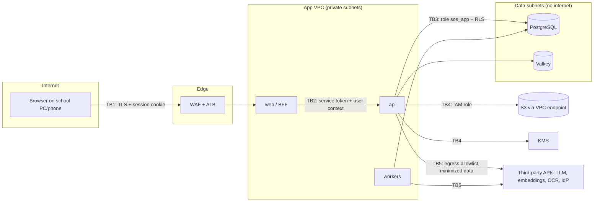

# 07 · Security Architecture

| Field | Value |
|---|---|
| Version | 0.3 · 2026-09-26 |
| Target | OWASP ASVS (current version) Level 2 · OWASP API Security Top 10 · OWASP Top 10 for LLM Applications (2025) |
| Related | 05-Data model (RLS, encryption), 06-RAG, 08-Privacy, 10-Infrastructure, 11-Operations (incident response), 16-Platform admin panel, ADR-0013, ADR-0015, ADR-0017, ADR-0018 |
| Changes | 0.3: platform catalog files as built (§6.5); non-atomic school-chain copies of platform actions and suspended-school behaviour noted (§6.6); CODEOWNERS paths (§14). 0.2: role keys fixed and permissions split in the matrix (§6.2) with `tenant.structure.manage` and `tenant.billing.read`; platform roles × permissions (§6.5); privilege separation (§6.6); isolation layers incl. composite FKs and `definer_access` (§7); actors, trust boundaries and threats for the control plane, dedicated hosts and heartbeat (§2–4); SEC-026..030 (§16); MFA enforcement and step-up with Cognito (§5.1–5.2, ADR-0018). 0.1: baseline |

---

## 1. Security principles

1. **Least privilege everywhere:** people, services, database roles, IAM roles, AI tools.
2. **Defense in depth:** no single control protects children's data; tenant isolation exists at four layers.
3. **Fail closed:** missing tenant context returns no rows; unknown permission means deny; empty document ACL means restricted.
4. **Secure by default, configurable within limits:** schools can tighten, never loosen below baseline (e.g., MFA for privileged roles cannot be turned off).
5. **Minimize data:** don't collect it (Aadhaar numbers), don't send it (LLM context), don't keep it (retention).
6. **Everything auditable:** who did what, when, from where, with which approval.
7. **Assume breach:** encryption with per-tenant keys, immutable audit archive, rehearsed incident response.

## 2. Assets and actors

**Assets (by value to an attacker / harm if exposed):** student identity and sensitive data (C2/C3), guardian contact data, identity evidence scans, audit trail integrity, staff credentials and sessions, tenant encryption keys, LLM/API keys, source code and CI secrets, backups.

**Actors**

| Actor | Motivation | Capability |
|---|---|---|
| External attacker | Data theft, ransom, defacement | Internet scanning, credential stuffing, phishing |
| Malicious or curious insider (school staff) | Snooping on students/colleagues, covering mistakes | Valid account, possibly shared PC |
| Compromised staff account | Via phishing/shared password | Same as the user |
| Other tenant's user | Accidental or deliberate cross-school access | Valid account in another tenant |
| Malicious document author | Prompt injection via uploaded/circulated files | Content that reaches the knowledge base |
| Platform operator (SchoolOS staff) or compromised operator account | Error or abuse | Platform admin panel (control plane) with platform roles; infra access and deploy rights for engineers |
| Compromised control-plane code path | Bug or injected code in the `platform` module | Runs as `sos_platform`: no privileges on tenant tables (§6.6) |
| Attacker targeting a dedicated host | Data theft from one school; pivot to control plane | Internet-facing host (80/443), forged heartbeats |
| Supply-chain attacker | Backdoor via dependency/CI | Package or action compromise |

## 3. Trust boundaries



| Boundary | Key controls |
|---|---|
| TB1 Browser → edge | TLS 1.2+/HSTS, WAF managed rules + rate rules, HttpOnly `__Host-` session cookie, CSRF protection, CSP |
| TB2 BFF → API | mTLS or signed service token on internal network; user access token forwarded; API re-validates everything |
| TB3 API → DB | Least-privileged role, RLS FORCE, parameterized SQL, statement timeouts, no superuser |
| TB4 App → AWS services | Task IAM roles scoped per resource, VPC endpoints, KMS key policies |
| TB5 App → third parties | Egress allowlist, API keys in Secrets Manager, minimal data, no Aadhaar, ZDR where available, timeouts/circuit breakers |
| TB6 Operator browser → control plane (`admin.<domain>`) | Separate OIDC client, MFA for every operator, step-up for ᴿ permissions, own `__Host-` session cookie, WAF, CSP; control plane connects to the DB as `sos_platform` only |
| TB7 Dedicated host → control plane (heartbeat) | Outbound only; HMAC-SHA256 per deployment, ±5 min timestamp window, nonce replay cache, strict schema without free text, rate limit; the control plane never connects into a host |
| TB8 Internet → dedicated host | Caddy TLS (ACME), security headers, only 80/443 open, no SSH (SSM), same app controls as the shared tier |

## 4. Threat model (STRIDE)

| # | Threat | STRIDE | Primary controls | Residual risk |
|---|---|---|---|---|
| T1 | Stolen staff credentials used on a shared office PC | S | MFA for privileged roles, 15-min idle lock, session list + revoke, new-device alerts, login throttling | Medium: non-privileged roles without MFA → encourage MFA for all |
| T2 | Forged or replayed access tokens | S | JWT signature via JWKS, issuer and audience checks (Cognito: `client_id` + `token_use`, ADR-0018), ≤ 10 min expiry, refresh rotation with reuse detection, BFF service token | Low |
| T3 | Identity data changed without authority | T | Maker-checker (DB CHECK against self-approval), evidence required, step-up MFA, audit | Low |
| T4 | Audit trail altered to hide actions | T/R | Append-only grants + trigger, per-tenant hash chain, daily signed export to S3 Object Lock | Low |
| T5 | Malicious upload (malware, parser exploit, polyglot) | T/E | Magic-byte allowlist, size limits, AV scan, parsing in isolated worker containers with no credentials beyond needed, never served inline | Low–medium |
| T6 | Staff deny making a change | R | Audit with actor, time, request ID, MFA context, IP hash | Low |
| T7 | Cross-tenant data exposure (missing filter/bug) | I | RLS FORCE on every tenant table, app role without BYPASSRLS, catalog test, cross-tenant test suite | Low |
| T8 | BOLA: guessing another student/document ID within tenant | I | Scoped repositories, UUIDs, 404 for out-of-scope, per-resource BOLA tests | Low |
| T9 | AI reveals data outside the user's scope | I | Filter-before-rank retrieval, tools run under user context, leakage evals as hard gate | Low |
| T10 | Prompt injection in documents causes data exfiltration or misleading answers | I/T | Content treated as data (prompt), no network/write tools, no external links in output, citation validation, injection eval set | Low–medium |
| T11 | PII leaks into logs, traces, error reports | I | Structured logging with allowlisted fields, `redact()`, log tests, no request-body logging | Low |
| T12 | Backup/snapshot exposure | I | KMS encryption, restricted IAM, separate backup vault account (Stage 1), crypto-shredding | Low |
| T13 | LLM provider retains/uses prompts | I | Commercial API terms, ZDR requested, data minimization, sub-processor disclosure in DPA | Low–medium |
| T14 | Resource exhaustion (bulk uploads, OCR floods) | D | Per-tenant quotas, queue fairness, size/page limits, WAF rate rules | Low |
| T15 | AI cost abuse ("denial of wallet") | D | Per-user/tenant rate limits, monthly budgets, max tokens, anomaly alerts | Low |
| T16 | Privilege escalation via role changes | E | `role.assign` limited to owner/principal, step-up MFA, alerts on privileged grants; holders may only grant roles whose permissions they hold, except `owner` (root of trust, `assign_any_role`); the last active owner cannot be suspended or demoted | Low |
| T17 | Platform operator misuse | E/I | No standing data access, school-approved time-bound break-glass, actions visible to school | Low–medium |
| T18 | Injection (SQL, template, command) | T/E | Bound parameters only, no dynamic SQL from AI, auto-escaping templates, no shell calls with input | Low |
| T19 | Dependency or CI compromise | T/E | Pinned deps with hashes, SHA-pinned actions, OIDC to AWS (no stored keys), scans, SBOM, protected branches | Medium |
| T20 | Control-plane bug or compromise reads or changes student data | I/T | `sos_platform` has no privileges on tenant tables; only allowlisted definer functions; privilege-separation catalog test; alert on `permission denied` from the platform path | Low |
| T21 | Faulty `SECURITY DEFINER` function leaks across tenants | I/E | Pinned allowlist owned by `sos_definer` (NOBYPASSRLS); `definer_access` only on listed tables; minimal columns; `search_path` pinned; catalog tests | Low |
| T22 | Operator account takeover (phishing) used to provision, suspend or offboard schools | S/E | MFA for every operator, step-up ≤ 5 min for ᴿ permissions, two-person offboarding, alerts to all owners on risky actions, platform audit chain | Low–medium |
| T23 | Forged or replayed heartbeat hides an outage or injects false usage | S/T | Per-deployment HMAC keys (KMS-wrapped), timestamp window, nonce cache, schema validation, mismatch alerts | Low |
| T24 | Heartbeat or support ticket carries personal data to the control plane | I | Heartbeat schema has no free text; ticket form warning, `redact()` before storage, personal-data flag, 1-year retention | Low–medium |
| T25 | Dedicated host compromised or left unpatched | I/T/E | Hardening baseline (SEC-030), no SSH, monthly OS patching, fleet version tracking, own KMS key and bucket per host, backups off-host in ap-south-2 | Medium |
| T26 | Wrongful suspension cuts off a school during exams | D | Suspension never automatic; step-up + reason; exam-window rule with owner approval; audited | Low |
| T27 | Cross-tenant reference via foreign key (FK checks bypass RLS) | I/T | Composite `(tenant_id, x_id)` FKs on every tenant→tenant reference; test | Low |

Review the model at each milestone and after any incident.

## 5. Authentication and sessions

### 5.1 Identity provider
- OIDC provider (reference: Amazon Cognito in ap-south-1, ADR-0012) behind the `identity` module interface. The BFF runs Authorization Code + PKCE; tokens never reach browser JavaScript.
- Login identifiers: username or email; phone as recovery where available. School staff without email get admin-created usernames with forced first-login password change.
- **Passwords** (policy aligned with NIST SP 800-63B principles): minimum 12 characters, no composition rules, screening against breached/common passwords, no periodic forced rotation, rotation on suspicion.
- **MFA:** mandatory for `owner`, `principal`, `office_admin` and every platform operator (TOTP authenticator or passkey); optional but encouraged for everyone else. Recovery codes issued once.
- **How MFA is enforced with Cognito (ADR-0018):** two user pools on the Essentials plan: operators (MFA ON) and staff (MFA OPTIONAL). A pre-token-generation Lambda adds the claim `sos:mfa = "true"` when the user has MFA (device remembering off; adaptive auth never skips MFA). The API refuses sessions whose active membership holds `owner`, `principal` or `office_admin` unless `sos:mfa` is true (`403 mfa_required`). Cognito access tokens have no `aud`, so the API checks issuer, `token_use = "access"` and `client_id`.
- **Platform operators** sign in through a separate OIDC client (`SOS_PLATFORM_OIDC_*`) on the admin host, with their own session cookie (`__Host-sos_platform_session`), idle timeout 15 min and absolute 8 h (ADR-0013, ADR-0017).
- **Throttling:** per-account and per-IP limits; progressive delays; lockout notifications to the user and school admins.

### 5.2 Sessions (BFF)
- Server-side session in Valkey, referenced by a `__Host-sos_session` cookie: `HttpOnly; Secure; SameSite=Lax; Path=/`.
- Tokens stored server-side, encrypted; access token ≤ 10 min; refresh token rotated on every use; reuse detection revokes the whole session family.
- Idle timeout 15 min (tenant-configurable 5–30), absolute 12 h. Shared-PC mode shows a visible "Lock now" button.
- **Step-up authentication** (MFA within the last 5 minutes) for: approving identity changes, role/permission changes, waiving blockers, bulk exports, full tenant export, break-glass approval, and every platform permission marked ᴿ (§6.5). The API requires `sos:mfa = "true"` and `auth_time` within 5 minutes, otherwise returns `428 step_up_required`; the BFF re-authenticates with `prompt=login` and retries (ADR-0018).
- CSRF: synchronizer token on all state-changing BFF routes in addition to SameSite.
- Users can list and revoke sessions; admins can force sign-out for a user.

## 6. Authorization

### 6.1 Model
- **RBAC:** roles are sets of `resource.action` permissions (catalog in `core.permissions`). System roles are cloned per tenant at provisioning; tenants may create custom roles from the catalog, but cannot grant platform permissions: `platform.*` keys exist in `core.permissions` only with `is_platform = true` (a CHECK ties the flag to the prefix) and a trigger on `core.role_permissions` refuses to grant them; platform roles are not tenant roles (§6.5). Every active member also holds the implicit `session.authenticated` permission (never stored in `role_permissions`), which guards routes that only need a signed-in member.
- **Scopes (ABAC):** each membership has scopes (`school`, `class:<id>`, `section:<id>`). Scope is applied by **scoped repositories** on every read path: lists, search, exports and AI tools.
- **Sensitivity:** C3 data requires `student.read_sensitive` in addition to basic read.
- **Enforcement points:** (1) route dependency `require(permission, scope)`; (2) service-level checks for object state (e.g., cannot approve own request); (3) scoped repositories; (4) RLS for tenant; (5) retrieval ACL filters; (6) AI tool gating.

```python
@router.post("/students/{student_id}/change-requests/{cr_id}/approve")
def approve(
    cr_id: UUID,
    ctx: UserContext = Depends(require("student.identity_change.approve", step_up=True)),
):
    return changes.service.approve(
        ctx, cr_id
    )  # service re-checks requester != approver, state = pending
```

### 6.2 Roles × permissions (defaults)

Legend: ✓ = school-wide · S = limited to own classes/sections · ✓ᴿ = requires step-up MFA · — = no access. Role keys are exactly those of FR-IAM-010.

| Permission | owner | principal | office_admin | office_staff | accountant | exam_coordinator | class_teacher | teacher | auditor_readonly |
|---|---|---|---|---|---|---|---|---|---|
| tenant.settings.manage | ✓ᴿ | ✓ᴿ | — | — | — | — | — | — | — |
| tenant.structure.manage (academic years, classes, sections) | ✓ | ✓ | ✓ | — | — | — | — | — | — |
| tenant.billing.read (Plan & billing page) | ✓ | ✓ | — | — | ✓ | — | — | — | — |
| support.ticket.create (open and reply to support tickets; no student data) | ✓ | ✓ | ✓ | ✓ | ✓ | ✓ | ✓ | ✓ | — |
| user.manage (invite, deactivate) | ✓ᴿ | ✓ᴿ | ✓ᴿ | — | — | — | — | — | — |
| role.assign | ✓ᴿ | ✓ᴿ | — | — | — | — | — | — | — |
| student.read_basic | ✓ | ✓ | ✓ | ✓ | ✓ | ✓ | S | S | ✓ |
| student.read_sensitive | ✓ | ✓ | ✓ | — | — | — | S | — | — |
| student.create | — | ✓ | ✓ | ✓ | — | — | — | — | — |
| student.update_nonidentity | — | ✓ | ✓ | ✓ | — | — | — | — | — |
| student.identity_change.request | — | ✓ | ✓ | ✓ | — | ✓ | — | — | — |
| student.identity_change.approve | ✓ᴿ | ✓ᴿ | — | — | — | — | — | — | — |
| student.export (bulk) | ✓ᴿ | ✓ᴿ | ✓ᴿ | — | — | ✓ᴿ | — | — | — |
| import.run | — | ✓ | ✓ | ✓ | — | ✓ | — | — | — |
| import.commit | — | ✓ | ✓ | — | — | ✓ | — | — | — |
| dq.findings.read | ✓ | ✓ | ✓ | ✓ | — | ✓ | S | — | ✓ |
| dq.findings.resolve | — | ✓ | ✓ | ✓ | — | ✓ | — | — | — |
| dq.findings.waive | — | ✓ᴿ | ✓ᴿ | — | — | — | — | — | — |
| document.upload | ✓ | ✓ | ✓ | ✓ | ✓ | ✓ | S | — | — |
| document.read | ✓ | ✓ | ✓ | ✓ | ✓ | ✓ | S | S | ✓ |
| document.manage_acl (also gates document delete) | ✓ | ✓ | ✓ | — | — | — | — | — | — |
| kb.ask | ✓ | ✓ | ✓ | ✓ | ✓ | ✓ | S | S | — |
| kb.verified_answer.manage | — | ✓ | ✓ | — | — | — | — | — | — |
| export.board | — | ✓ | ✓ | — | — | ✓ | — | — | — |
| export.portal | — | ✓ | ✓ | — | — | ✓ | — | — | — |
| audit.read | ✓ | ✓ | ✓ | — | — | — | — | — | ✓ |
| finance.read (M6) | ✓ | ✓ | — | — | ✓ | — | — | — | ✓ |
| insights.read (M5) | ✓ | ✓ | — | — | — | — | S | — | — |
| breakglass.approve | ✓ᴿ | ✓ᴿ | — | — | — | — | — | — | — |
| tenant.export_all | ✓ᴿ | — | — | — | — | — | — | — | — |

`auditor_readonly` memberships are time-bound (default 14 days) and read-only.

### 6.3 Maker-checker (ADR-0010)
- Applies to identity attributes (`is_identity = true`), waiving blocker findings, and custom-role creation.
- Requester ≠ approver, enforced in service code **and** by a DB `CHECK` constraint.
- Evidence document mandatory for identity changes; the approver sees old/new values, evidence preview and requester.
- Approvals expire after 30 days; all transitions audited.

### 6.4 Break-glass (platform support access)
- The platform operator has **no standing access** to tenant data. Operator console shows health and usage only.
- A support request names reason, scope (e.g., "read import batch X") and duration (≤ 8 h). A tenant `owner`/`principal` approves with step-up MFA.
- Access is implemented as a temporary, scoped membership with a special `platform_support` role; it is visibly flagged in the school's audit viewer and auto-expires; the school can revoke at any time.
- Emergency access without approval exists only for legal obligation or active security incident, requires two operator-side confirmations (`platform.breakglass.emergency`, two different operators, step-up), and is reported to the school within 24 hours.
- Operators request access with `platform.breakglass.request`; the platform admin panel lists requests and their status (16 §5.15). The workflow ships in M1.

**How it works (M1, `app/breakglass`, US-103, FR-OPS-004).** The control plane never writes tenant tables: the school side pulls its open requests (worker every minute, and when the list is opened) into `ops.break_glass_grants`, audits `breakglass.requested` in the school's chain and notifies every holder of `breakglass.approve`. Approval (step-up) runs in the school's own transaction: the operator's account is created or found with `core.create_user_for_invite` (the approver is the inviter; no new definer function) and receives a temporary membership holding only `platform_support`, MFA required, scoped like the request (`section_id` / `class_id`, else the whole school) and expiring with the grant; sign-in resolution refuses it the moment it expires. The approver can never be the person who gets access (service check + DB `CHECK`); unanswered requests expire after 24 h; the school can revoke at any time. Emergency requests confirmed by two different operators are opened when pulled and the owner and principal are notified immediately (in-app notification + audit), which satisfies "reported within 24 hours"; an operator without an existing SchoolOS sign-in gets no access this way (fail closed). Every decision is audited in the school's chain and reported to the control-plane chain. A `platform_support` session is read-only (`require()` refuses non-GET calls, 403 `breakglass_read_only`) and every call it makes is written to the school's audit log as `breakglass.access` with `via_breakglass: true`, the route and the IDs in the path. `platform_support` is not an FR-IAM-010 system role: it is defined in `roles.yaml` (`breakglass_role`), created in a school on first approval, hidden from role assignment and never assignable by staff. Its permissions (all scoped to the membership's scopes):

| Permission | Why support needs it |
|---|---|
| `student.read_basic` | See the student records a request is about (C2 only; never C3) |
| `dq.findings.read` | See the data-quality findings the school asks about |
| `document.read` | Open the uploaded file or register photo behind an import problem |

Not granted: `student.read_sensitive`, `audit.read` (the audit log is how the school watches support, T17), `kb.ask`, exports and every write permission.

### 6.5 Platform roles × permissions

Platform roles belong to SchoolOS staff (operators), not to schools (ADR-0013). Catalog: the `platform.*` entries (`is_platform: true`) of `apps/api/app/authz/permissions.yaml` and the role matrix in `apps/api/app/platform/roles.yaml`; the platform authz tests are generated from them. ᴿ = step-up MFA within 5 minutes; 2P = two different operators. This matrix and 16 §6 must stay identical.

| Permission | platform_owner | platform_engineer | support_agent | billing_admin | platform_viewer |
|---|---|---|---|---|---|
| platform.tenants.read | ✓ | ✓ | ✓ | ✓ | ✓ |
| platform.tenants.provision ᴿ | ✓ | ✓ | — | — | — |
| platform.tenants.suspend ᴿ | ✓ | ✓ | — | — | — |
| platform.tenants.offboard ᴿ 2P | ✓ | — | — | — | — |
| platform.plans.manage ᴿ | ✓ | — | — | ✓ | — |
| platform.subscriptions.read | ✓ | — | — | ✓ | ✓ |
| platform.subscriptions.manage ᴿ | ✓ | — | — | ✓ | — |
| platform.invoices.read | ✓ | — | — | ✓ | ✓ |
| platform.invoices.manage | ✓ | — | — | ✓ | — |
| platform.flags.read | ✓ | ✓ | — | — | ✓ |
| platform.flags.manage ᴿ | ✓ | ✓ | — | — | — |
| platform.usage.read | ✓ | ✓ | ✓ | ✓ | ✓ |
| platform.fleet.read | ✓ | ✓ | ✓ | — | ✓ |
| platform.fleet.manage ᴿ | ✓ | ✓ | — | — | — |
| platform.announcements.manage | ✓ | — | ✓ | — | — |
| platform.support.read | ✓ | ✓ | ✓ | — | ✓ |
| platform.support.manage | ✓ | — | ✓ | — | — |
| platform.breakglass.request | ✓ | ✓ | ✓ | — | — |
| platform.breakglass.emergency ᴿ 2P | ✓ | — | — | — | — |
| platform.operators.manage ᴿ | ✓ | — | — | — | — |
| platform.audit.read | ✓ | ✓ | — | — | ✓ |

`platform_support` is unrelated: it is the tenant-side temporary role granted by break-glass (§6.4).

### 6.6 Privilege separation (control plane vs tenant data)

| Control | Detail |
|---|---|
| Separate DB role | Control-plane code uses `core.db.platform_session()` as `sos_platform`: DML on schema `platform`, **no privileges on any table in `core`, `sis`, `kb`, `audit`, `ops`** |
| Tenant app cannot read platform data | `sos_app` and `sos_readonly` have no privileges on `platform` except `SELECT platform.feature_flags` (for `sos_app`) |
| Narrow bridges only | Cross-tenant work goes through the allowlisted `SECURITY DEFINER` functions owned by `sos_definer` (NOLOGIN, NOBYPASSRLS), which reach only tables carrying the `definer_access` policy (05 §3.3–3.4) |
| No BYPASSRLS anywhere | No role in any environment has `BYPASSRLS` or superuser at runtime |
| Separate identity | Operators are `platform.operators` rows with platform roles, separate OIDC client, MFA always |
| Separate audit | Control-plane actions are recorded in the hash-chained `platform.audit_events` in the same transaction; actions changing a school also appear in its own audit log, written in a separate `sos_app` transaction committed right after (not atomic; ADR-0013 Amendment A6) |
| Dedicated hosts | `SOS_DEPLOYMENT_MODE=dedicated` removes control-plane routes; the control plane never connects into a host |
| Verified by | Catalog tests (12 §4.8–4.9), platform authz matrix (12 §4.12), alert on any `permission denied` from the platform path (11 §12) |

## 7. Tenant isolation (four layers)

| Layer | Control | Verified by |
|---|---|---|
| Database | RLS ENABLE + FORCE on every tenant table and every audit partition; no role has BYPASSRLS; context via transaction-local `set_config('app.tenant_id', :t, true)` (same effect as `SET LOCAL`, bound parameters); fail closed when unset; composite `(tenant_id, x_id)` foreign keys; cross-tenant reach only through allowlisted definer functions on tables with the `definer_access` policy | RLS catalog test, definer allowlist test, composite-FK test in CI; cross-tenant integration suite |
| Service | Scoped repositories require `UserContext`; no raw ID lookups | BOLA tests per resource |
| Retrieval / AI | ACL + scope filters inside retrieval SQL; tools execute under caller context | Leakage eval (hard gate) |
| Storage & crypto | Tenant-prefixed S3 keys; per-tenant DEKs; exports scoped by tenant | S3 key tests; crypto AAD includes tenant ID |

Workers never run "for all tenants" in one transaction; batch jobs get tenant IDs from `core.list_tenant_ids()` and open a separate `tenant_session()` per tenant.

**Definer access, not BYPASSRLS.** `sos_definer` is NOLOGIN and NOBYPASSRLS (Amazon RDS restricts granting BYPASSRLS, and a bypass role would open every table). Inside a `SECURITY DEFINER` function `current_user` is `sos_definer`; the permissive policy `definer_access USING (current_user = 'sos_definer') WITH CHECK (current_user = 'sos_definer')` exists only on the tables those functions must touch, pinned by a catalog test (05 §3.3; ADR-0013).

**Dedicated tier.** A dedicated host is a one-tenant install with the same roles, RLS and tests; isolation from other schools is additionally physical (own host, bucket and KMS key).

## 8. Data protection and key management

- **In transit:** TLS 1.2+ (prefer 1.3) at the edge; TLS to RDS (`sslmode=verify-full`) and Valkey (in-transit encryption); HTTPS to all third parties.
- **At rest:** RDS, snapshots, S3 and Valkey (ElastiCache) encrypted with KMS customer-managed keys (separate CMKs for data, audit archive, backups).
- **Application-layer encryption** for C3 fields (05 §9): AES-256-GCM, per-tenant DEK wrapped by KMS, AAD binds ciphertext to tenant/table/column/row.
- **Key rotation:** CMKs rotated annually (automatic); DEKs rotated on schedule or incident with background re-encryption.
- **Crypto-shredding:** deleting a tenant's wrapped keys renders remaining ciphertext (including in backups) unreadable.
- **Masking:** C3 values masked in UI by default ("show" click is audited), in exports unless explicitly included, and always in logs.
- **Aadhaar:** never stored (ADR-0007); Verhoeff-based redaction in all text pipelines.

## 9. Secrets management

- All secrets (DB credentials, API keys, OIDC client secrets, signing keys) in AWS Secrets Manager; fetched at startup via the task role; never in images, repos, CI logs or `.env` files committed to git.
- DB credentials rotated ≤ 90 days (managed rotation); API keys rotated ≤ 180 days or on staff/device change.
- Separate secrets per environment; staging never holds production keys.
- `gitleaks` in pre-commit and CI; GitHub secret scanning with push protection enabled.
- Product runtime uses **organization API keys** only. Developers' personal/consumer AI subscriptions are never used for product traffic.

## 10. Input, file and output security

- **Validation:** Pydantic schemas with strict types, lengths and enums on every input; unknown fields rejected (prevents mass assignment).
- **Output shaping:** response models are explicit allowlists of fields (prevents excessive data exposure); C3 fields only in responses for permitted callers.
- **Files:** magic-byte type allowlist; size and page limits; AV scan before processing; parsing in worker containers with minimal IAM; uploads via presigned POST with content-length-range and content-type constraints; downloads via presigned GET ≤ 5 min with `Content-Disposition: attachment` and `X-Content-Type-Options: nosniff`.
- **Spreadsheets:** formulas never evaluated; exported cells beginning with `= + - @` are prefixed to prevent CSV/formula injection.
- **PDF rendering:** templates auto-escape; Chromium runs sandboxed with network disabled except for local assets.
- **Rich text:** none in core; if added later, sanitize server-side with an allowlist.

## 11. Web and API security

**Headers (set by web and API):**
```
Strict-Transport-Security: max-age=63072000; includeSubDomains; preload
Content-Security-Policy: default-src 'self'; script-src 'self' 'nonce-{n}' 'strict-dynamic'; style-src 'self';
  img-src 'self' data: blob: https://{files-domain}; connect-src 'self'; font-src 'self'; object-src 'none';
  base-uri 'none'; frame-ancestors 'none'; form-action 'self'; upgrade-insecure-requests
X-Content-Type-Options: nosniff
Referrer-Policy: strict-origin-when-cross-origin
Permissions-Policy: camera=(self), microphone=(), geolocation=(), payment=()
Cross-Origin-Opener-Policy: same-origin
Cross-Origin-Resource-Policy: same-origin
```
(`camera=(self)` allows photographing register pages from a phone browser.)

**OWASP API Security Top 10 mapping**

| Risk | Control |
|---|---|
| API1 Broken object level authorization | Scoped repositories, UUIDs, 404 on out-of-scope, BOLA tests |
| API2 Broken authentication | OIDC via BFF, MFA, short tokens, rotation, throttling |
| API3 Broken object property level authorization | Explicit request/response schemas; C3 gating |
| API4 Unrestricted resource consumption | Rate limits, pagination caps, file/page limits, AI budgets, statement timeouts |
| API5 Broken function level authorization | `require()` on every route, route-enumeration test |
| API6 Unrestricted access to sensitive business flows | Step-up MFA and throttles on exports, approvals, role changes |
| API7 SSRF | No user-supplied URL fetching in core; egress allowlist |
| API8 Security misconfiguration | IaC with policy checks, security headers, no debug in prod, CIS-aligned images |
| API9 Improper inventory management | Single versioned OpenAPI, no undocumented endpoints, staging isolated |
| API10 Unsafe consumption of APIs | Validate third-party responses, timeouts, circuit breakers, treat LLM output as untrusted |

**Other:** CORS disabled for API (BFF same-origin); request size limits; idempotency keys on POSTs that create resources; `statement_timeout` 5 s for API transactions (longer for workers); problem+json errors without stack traces; 404 (not 403) when revealing existence would leak information.

## 12. LLM application security (OWASP Top 10 for LLM Applications, 2025)

| Risk | Controls in SchoolOS |
|---|---|
| LLM01 Prompt injection | System prompt states tool content is data; documents can't trigger tools with side effects (all tools read-only, no network); output limited to text + internal citations; injection red-team set is a hard eval gate |
| LLM02 Sensitive information disclosure | Filter-before-rank; tools under user scope; C3 minimization; no Aadhaar anywhere; ZDR requested; logs store encrypted Q/A only |
| LLM03 Supply chain | Providers behind gateway/interfaces; model IDs pinned in config; dependency scanning |
| LLM04 Data and model poisoning | No model training/fine-tuning on school data; knowledge base changes are authenticated, versioned and audited; verified answers require authorized approval |
| LLM05 Improper output handling | Output rendered as restricted markdown; no HTML; citations validated; AI output never executed or used in SQL |
| LLM06 Excessive agency | Read-only whitelisted tools; max tool rounds; writes only through human-confirmed endpoints |
| LLM07 System prompt leakage | System prompt contains no secrets or other tenants' data; treat as public |
| LLM08 Vector and embedding weaknesses | Per-tenant filters and RLS on chunks; embedding cache per tenant; ACL copies updated on change; no cross-tenant similarity search |
| LLM09 Misinformation | Grounding + citations + "not found" behaviour; faithfulness and correctness gates; "as of" dates; verified answers |
| LLM10 Unbounded consumption | Rate limits, token caps per request, per-tenant budgets, anomaly alerts |

## 13. Infrastructure security (AWS)

- **Accounts:** AWS Organizations with separate `prod` and `staging` accounts (plus `log-archive`/`security` from Stage 1). Humans use IAM Identity Center with MFA; no IAM users with long-lived keys.
- **Guardrails:** SCPs deny actions outside ap-south-1/ap-south-2 (except global services), deny disabling CloudTrail/GuardDuty/Config, deny public S3.
- **Network:** RDS and ElastiCache for Valkey in private data subnets with no internet route; security groups allow only app tasks; S3/KMS/Secrets Manager/ECR via VPC endpoints where cost-justified; egress allowlist to required third-party domains (via proxy or firewall rules at Stage 1).
- **Access to hosts/DB:** no SSH; SSM Session Manager with logging; DB admin access only through a break-glass role with approval and session recording.
- **Detection:** CloudTrail (org trail to log-archive with Object Lock), GuardDuty, AWS Config conformance rules, Security Hub foundational checks, WAF logs, VPC flow logs (sampled).
- **CI/CD access:** GitHub Actions assumes deploy roles via OIDC with branch/environment conditions; production deploy requires manual approval.
- **Containers:** minimal base images, non-root user, read-only root filesystem, no privileged mode, resource limits, image scanning before deploy.
- **Dedicated hosts (SEC-030):** CIS-aligned OS baseline, IMDSv2 only, encrypted EBS, no SSH (SSM Session Manager with logging), only 80/443 inbound, Postgres and Valkey bound to the internal container network, automatic security updates with a monthly reboot window, clock sync to Amazon Time Sync, logs shipped to CloudWatch in ap-south-1 (400 days), images pulled by digest, own KMS key and buckets (10 §15).

## 14. Supply chain security

- Lockfiles with hashes (Python via `uv`/pip-tools, npm lockfile); Renovate/Dependabot updates weekly; auto-merge only for patch updates passing CI.
- Scans: `pip-audit`, `npm audit`/OSV-Scanner, Trivy (images, IaC), Semgrep (SAST), `gitleaks`.
- npm install scripts are disabled (`.npmrc` `ignore-scripts=true`) and registry signatures are checked with `npm audit signatures`; dependencies that need an install-time native build or download are avoided (docs/13 §9).
- SBOM generated per build (Syft) and stored with the release; images tagged by commit SHA and optionally signed (cosign).
- GitHub Actions pinned to commit SHAs; `GITHUB_TOKEN` least privilege; protected `main` with required checks; CODEOWNERS on `apps/api/app/{core,authz,audit,platform}/` (which includes the permission and billing YAML), `knowledge/gateway/`, migrations, `apps/api/tests/security/` (incl. `rls_allowlist.yaml`), `infra/`, `deploy/`, `.github/`, `.semgrep/`, `.importlinter`, `Makefile`, `CLAUDE.md` and `SECURITY.md` (owner handle is a placeholder until branch protection is configured).
- Licence policy: permissive licences preferred; no AGPL/SSPL in core runtime without an ADR. Local/CI service images follow the same rule (ADR-0014: SeaweedFS, Valkey).

## 15. Security monitoring, vulnerability management, testing

**Security events alerted:** repeated login failures / lockouts; MFA reset or disable; privileged role grants; bulk exports; tenant data export; break-glass requests and use; RLS violation errors or tenant-context-missing errors; unusual AI query volume per user; WAF blocks spike; GuardDuty high findings; secrets access anomalies; operator role changes and new operators; `permission denied` on tenant tables from the platform path; platform audit chain failures; heartbeat signature failures; offboarding approvals; tenant suspensions.

**Vulnerability SLAs:** critical ≤ 7 days, high ≤ 30 days, medium ≤ 90 days; exceptions recorded with compensating controls.

**Testing:** authz matrix and BOLA tests (CI), cross-tenant suite (CI), ZAP baseline against staging (nightly), dependency/SAST/IaC scans (CI), RAG leakage/injection evals (CI), external penetration test before first paid go-live and annually (consider a CERT-In empanelled auditor for credibility with schools), restore and incident drills quarterly.

**Disclosure:** `SECURITY.md` defines how researchers report issues and response timelines.

## 16. Security controls checklist (with milestones)

| ID | Control | Milestone |
|---|---|---|
| SEC-001 | RLS ENABLE+FORCE on all tenant tables + catalog test | M0 |
| SEC-002 | App DB role without BYPASSRLS; migrator role separate | M0 |
| SEC-003 | `require()` on every route + route-enumeration test | M0 |
| SEC-004 | OIDC via BFF; HttpOnly session cookie; CSRF tokens | M0 |
| SEC-005 | MFA enforced for privileged roles; step-up for sensitive actions | M0 |
| SEC-006 | Idle/absolute session timeouts; session revocation | M0 |
| SEC-007 | Hash-chained append-only audit + daily verification | M0 |
| SEC-008 | Structured logging with redaction; log tests | M0 |
| SEC-009 | Secrets Manager; gitleaks; push protection | M0 |
| SEC-010 | Security headers + CSP | M0 |
| SEC-011 | KMS encryption for RDS/S3/Valkey/backups | M0 |
| SEC-012 | Per-tenant DEKs; C3 field encryption | M1 |
| SEC-013 | Aadhaar input rejection + Verhoeff redaction in pipelines | M1 |
| SEC-014 | Maker-checker with DB constraint | M1 |
| SEC-015 | Scoped repositories + BOLA tests per resource | M1 |
| SEC-016 | File upload controls (allowlist, AV, presigned, limits) | M1 |
| SEC-017 | Formula-injection-safe spreadsheet exports | M1 |
| SEC-018 | Retrieval ACL filters + leakage eval hard gate | M2 |
| SEC-019 | Prompt-injection red-team set as hard gate | M2 |
| SEC-020 | Read-only AI tools; max tool rounds; token/budget limits | M2 |
| SEC-021 | Break-glass workflow visible to school | M1 |
| SEC-022 | WAF managed + rate rules | Pilot gate |
| SEC-023 | GuardDuty, CloudTrail (Object Lock), Config, Security Hub | Pilot gate |
| SEC-024 | Restore drill passed; incident runbook rehearsed | Pilot gate |
| SEC-025 | External penetration test; findings fixed per SLA | Before paid go-live |
| SEC-026 | Platform privilege separation: `sos_platform` has no privileges on tenant tables; `sos_app`/`sos_readonly` none on `platform` (except flags SELECT); definer functions pinned, owned by `sos_definer` (NOBYPASSRLS), `definer_access` only on listed tables; catalog tests | M0 |
| SEC-027 | Operator identity: separate OIDC client, MFA for every operator, step-up ≤ 5 min for ᴿ platform permissions, separate session and host | M0 |
| SEC-028 | Heartbeat authentication: per-deployment HMAC-SHA256 keys (KMS-wrapped, rotatable), ±5 min timestamp window, nonce replay cache, strict schema without personal data, rate limit | M0 |
| SEC-029 | Two-person rule for tenant offboarding (M0) and emergency break-glass (M1), enforced in service and DB | M0 / M1 |
| SEC-030 | Dedicated host hardening baseline (§13), patching SLAs, off-host encrypted backups, restore test before go-live | Before first dedicated-tier school |
