# 10 · Infrastructure & DevOps

| Field | Value |
|---|---|
| Version | 0.2 · 2026-09-26 |
| Cloud | AWS ap-south-1 (Mumbai) primary · ap-south-2 (Hyderabad) backups/DR |
| Tooling | Terraform · Docker · GitHub Actions · OpenTelemetry |
| Related | 04-Architecture §11, §16–17, 07-Security §13–14, 11-Operations, 16-Platform admin panel §12–13, ADR-0014, ADR-0015, ADR-0018 |
| Changes | 0.2: dedicated tier (§15: Terraform module `dedicated_host`, `deploy/dedicated/compose.yaml`, Caddy TLS, WAL-G/`pg_dump` backups to ap-south-2, hardening, patching, fleet upgrades); local compose with SeaweedFS, Valkey, `migrate`, `beat`, OIDC stub and `infra/db/bootstrap.sql` (§11); Valkey and two Cognito pools (§4–5, ADR-0018); fleet step in CD (§8). 0.1: baseline |

---

## 1. Environments

| Env | Purpose | Data | Deploys |
|---|---|---|---|
| **local** | Development (docker compose) | Synthetic only | Developer |
| **ci** | Ephemeral test services per PR (Postgres+pgvector, Valkey, SeaweedFS; ADR-0014) | Synthetic fixtures | Every PR |
| **staging** | Integration, E2E, load, ZAP, demo | Synthetic only (never production copies) | Auto on merge to `main` |
| **production** (shared) | Shared-tier schools + control plane | Real data | Manual approval after staging passes |
| **production** (dedicated) | One host per dedicated-tier school | Real data (one school per host) | Fleet waves after the shared release (§15.5) |

## 2. AWS account structure

| Stage | Accounts |
|---|---|
| Stage 0 (pilot) | Management (billing, Identity Center) · `staging` · `prod` |
| Stage 1+ | + `log-archive` (CloudTrail, audit archive copies, Object Lock) · + `security` (GuardDuty/Security Hub delegated admin) · + `backup` (cross-account AWS Backup vault) |

SCPs: restrict regions to ap-south-1/ap-south-2 (global services excepted), deny disabling logging/detection, deny public S3, deny root usage.

## 3. Network

```
VPC 10.20.0.0/16 (ap-south-1, two AZs)
├── public   10.20.0.0/24, 10.20.1.0/24    ALB, NAT (Stage 1+)
├── app      10.20.10.0/24, 10.20.11.0/24  ECS tasks: web, api, worker, beat
└── data     10.20.20.0/24, 10.20.21.0/24  RDS, ElastiCache for Valkey (no internet route)
Endpoints: S3 (gateway), ECR, Secrets Manager, KMS, CloudWatch Logs (interface; add when cost-justified)
```

- Security groups: ALB → web (443→3000), web → api (internal port), app → RDS (5432), app → Valkey (6379). Nothing else inbound.
- Egress: third-party APIs (LLM, embeddings, OCR, IdP) via NAT; Stage 1 adds a domain allowlist (egress proxy or firewall rules).
- **Cost note (Stage 0):** a NAT gateway is a notable fixed monthly cost. Options: single NAT in one AZ; or tasks in public subnets with public IPs and security groups allowing **only** ALB inbound (acceptable for pilot with strict SGs); revisit at Stage 1.

## 4. Services by stage

| Component | Stage 0 · Pilot | Stage 1 · Growth | Stage 2 · Scale |
|---|---|---|---|
| Compute | ECS Fargate: 1 task each (web, api, worker, beat); or one container host | Autoscaling per service; worker pools per queue | + Spot for batch workers; ingestion service split if needed |
| DB | RDS PostgreSQL single-AZ, PITR, gp3 | Multi-AZ, RDS Proxy/PgBouncer, read replica | Partitioning, silo large tenants, larger instances |
| Cache/queue | ElastiCache for Valkey (small) | Replication group with failover | Cluster mode |
| Files | S3 + versioning + lifecycle | + cross-region replication for documents to ap-south-2 | Same |
| Edge | ALB + ACM + WAF | + CloudFront for static assets | Same |
| Identity | Two Cognito user pools in ap-south-1 on the Essentials plan: staff (MFA optional, `sos:mfa` claim) and operators (MFA on); pre-token-generation Lambda; access tokens 10 min (ADR-0018) | Same | Same |
| Observability | CloudWatch Logs/Metrics, X-Ray via OTel collector sidecar | + dashboards, synthetic checks | + tracing sampling policies |
| Backups | RDS automated (14 days) + daily snapshot copy to ap-south-2 | AWS Backup cross-account vault, 35-day PITR | Warm standby option |

## 5. Terraform

```
infra/terraform/
├── modules/
│   ├── network/        vpc, subnets, endpoints, nat
│   ├── rds/            postgres, parameter group (log settings, pgvector), roles bootstrap
│   ├── redis/          ElastiCache for Valkey (Redis protocol)
│   ├── s3/             buckets, policies, lifecycle, object lock (audit), replication
│   ├── kms/            CMKs + key policies (data, audit, backup)
│   ├── ecs_service/    task def, service, autoscaling, IAM task role
│   ├── alb_waf/
│   ├── cognito/        staff and operator user pools (Essentials), app clients, pre-token-generation Lambda (ADR-0018)
│   ├── observability/  log groups (retention), alarms, dashboards
│   ├── ci_oidc/        GitHub OIDC provider + deploy roles
│   └── dedicated_host/ one school's EC2 host, KMS key, buckets, IAM, SSM parameters, log group (§15)
└── envs/
    ├── staging/  main.tf, variables.tfvars
    ├── prod/     main.tf, variables.tfvars
    └── dedicated/<tenant_code>/  one directory per dedicated-tier school (module dedicated_host)
```

- Remote state in S3 (versioned, encrypted) with locking; separate state per env.
- `terraform plan` on PR (posted as comment); `apply` only from the pipeline with approval.
- Checks: `terraform fmt/validate`, `tflint`, Trivy/Checkov IaC scan (no public buckets, encryption on, logging on).
- Mandatory tags: `project`, `env`, `owner`, `data_class`, `cost_center`.
- Log group retention: security/access/app logs **400 days** (≥ 13 months) in ap-south-1.

## 6. Containers

- Multi-stage Dockerfiles; slim/distroless bases; pinned digests. Base and service images per ADR-0014 (`python:3.12-slim-bookworm`, `node:24-bookworm-slim`, `pgvector/pgvector:0.8.6-pg16-bookworm`, `valkey/valkey:8.1-alpine`, pinned `chrislusf/seaweedfs`, pinned `caddy:2`).
- Run as non-root; read-only root FS; `/tmp` as tmpfs; drop Linux capabilities.
- Worker image includes Chromium (Playwright) and fonts (Noto Sans/Serif Telugu) for PDF rendering; ClamAV as separate sidecar/service with definitions updated daily.
- Health endpoints: `/healthz` (liveness), `/readyz` (DB, Valkey reachable).
- Images tagged with git SHA; SBOM attached; Trivy scan must pass (no critical CVEs) before push to ECR.

## 7. CI pipeline (GitHub Actions)

```mermaid
flowchart LR
  PR[Pull request] --> L[Lint + format<br/>ruff, eslint, prettier]
  L --> T[Typecheck<br/>mypy strict, tsc]
  T --> U[Unit + integration tests<br/>pytest w/ Postgres+pgvector, vitest]
  U --> S[Security<br/>semgrep, gitleaks, pip-audit, npm audit, trivy fs/iac]
  S --> M[Migration check<br/>upgrade/downgrade on seeded DB + RLS catalog test]
  M --> A[AuthZ suite<br/>route enumeration, BOLA, cross-tenant]
  A --> E[RAG eval subset<br/>if knowledge/prompt/model config changed]
  E --> B[Build images + SBOM + scan]
  B --> P[terraform plan comment]
```



- Required checks on `main`; squash merges; Conventional Commit titles.
- Concurrency groups cancel superseded runs; caches for pip/npm.
- Secrets in GitHub Environments; AWS via OIDC roles scoped to branch/environment.

## 8. CD and releases

1. Merge to `main` → images pushed → **staging deploy**: run migrations task (`sos_migrator`) → rolling update → smoke tests → Playwright E2E → ZAP baseline (nightly) → k6 smoke.
2. **Production**: manual approval (GitHub Environment) → migrations (expand-only by policy) → rolling deploy with health checks and circuit-breaker rollback → post-deploy smoke → release notes.
3. **Rollback:** redeploy previous task definition; migrations are backward compatible so code rollback is safe; contract migrations only after a full release cycle.
4. **Windows:** production deploys outside school hours (after 18:00 IST or Sundays) unless hotfix; schools notified 48 h ahead of maintenance with expected impact.
5. **Versioning:** CalVer releases (`2026.10.1`) + CHANGELOG; feature flags decouple deploy from release.
6. **Dedicated fleet:** after production (shared) is healthy, the `deploy-dedicated` workflow upgrades dedicated hosts in waves (§15.5) and sets their `target_version` in the fleet registry.

## 9. Database operations

- Bootstrap: `infra/db/bootstrap.sql` runs once per database as the admin user (RDS master user via an ECS one-off task; compose init locally; testcontainers in CI; the dedicated-host bootstrap). It creates roles (`sos_owner`, `sos_migrator`, `sos_app`, `sos_platform`, `sos_readonly`, `sos_definer`; none with BYPASSRLS), schemas (`core`, `sis`, `kb`, `audit`, `ops`, `platform`) and extensions (05 §3).
- Migrations: Alembic via one-off ECS task as `sos_migrator` (`SET ROLE sos_owner`); `lock_timeout` and `statement_timeout` set; large index builds `CONCURRENTLY`. The same task tops up `audit.events` partitions to 12 months ahead (05 §7.1).
- Parameters: `log_min_duration_statement` (e.g., 500 ms, no bind values logged), `pg_stat_statements`, `idle_in_transaction_session_timeout`, SSL required.
- Backups: automated backups with PITR (14 days Stage 0, 35 days Stage 1+); daily snapshot copied to ap-south-2, retained 30 days; monthly snapshot retained 12 months (encrypted, access-restricted).
- **Restore drill (quarterly):** restore PITR to a new instance in staging account (via snapshot share), run integrity checks (row counts, audit chain verification), record timings against RPO/RTO.
- Maintenance: autovacuum tuning for high-churn tables (`attribute_values`, `document_chunks`), HNSW index monitoring, alert when `audit.events` has fewer than 3 future partitions.

## 10. Disaster recovery

| Scenario | Strategy | Target |
|---|---|---|
| AZ failure | Multi-AZ RDS and ECS across two AZs (Stage 1+) | Minutes |
| Data corruption / bad migration | PITR to timestamp before incident; replay safe events from outbox if needed | RPO ≤ 15 min, RTO ≤ 4 h |
| Region impairment (ap-south-1) | Restore from snapshot copies + S3 replicas in ap-south-2 via Terraform `envs/dr` | RTO ≤ 24 h (Stage 1), ≤ 4 h with warm standby (Stage 2) |
| Account compromise | Cross-account backup vault with separate credentials; Object Lock audit archive | Recover from immutable copies |

## 11. Local development

The local stack runs the shared deployment (tenant app + control plane) with permissive-licence images (ADR-0014). Ports and services are fixed so every tool and test agrees:

```yaml
# compose.yaml (sketch; the real file pins every image tag)
services:
  db:       { image: pgvector/pgvector:0.8.6-pg16-bookworm, ports: ["5432:5432"],
              volumes: ["./infra/db/bootstrap.sql:/docker-entrypoint-initdb.d/00-bootstrap.sql:ro"] }
  valkey:   { image: valkey/valkey:8.1-alpine, ports: ["6379:6379"] }
  s3:       { image: chrislusf/seaweedfs:<pinned>, command: "server -s3 -s3.port=8333", ports: ["8333:8333"] }
  s3-init:  { image: <aws-cli or seaweedfs>, depends_on: [s3], restart: "no" }   # creates the two buckets
  migrate:  { build: ./apps/api, command: alembic upgrade head, depends_on: [db], restart: "no" }
  api:      { build: ./apps/api, ports: ["8000:8000"], env_file: .env, depends_on: [migrate, valkey, s3] }
  worker:   { build: ./apps/api, command: celery -A app.worker worker -Q ingest,embed,ocr,dq,exports,pdf,maintenance }
  beat:     { build: ./apps/api, command: celery -A app.worker beat }
  web:      { build: ./apps/web, ports: ["3000:3000"], env_file: .env }
  oidc:     { image: ghcr.io/navikt/mock-oauth2-server:<pinned>, ports: ["8080:8080"], profiles: ["dev"] }
  otel:     { image: otel/opentelemetry-collector:<pinned>, ports: ["4318:4318"], profiles: ["otel"] }
```

- `infra/db/bootstrap.sql` runs on the first start of `db` (roles, schemas, extensions); `migrate` then applies Alembic revisions as `sos_migrator`.
- Environment variables are listed in `.env.example`: `SOS_ENV` (`local|ci|staging|prod`), `SOS_DEPLOYMENT_MODE` (`shared|dedicated`), `SOS_DATABASE_URL` (`sos_app`), `SOS_PLATFORM_DATABASE_URL` (`sos_platform`), `SOS_MIGRATOR_DATABASE_URL`, `SOS_REDIS_URL` (Valkey), `SOS_S3_ENDPOINT_URL`, `SOS_S3_BUCKET_FILES`, `SOS_S3_BUCKET_AUDIT`, `AWS_REGION`, `SOS_OIDC_ISSUER`, `SOS_OIDC_AUDIENCE`, `SOS_PLATFORM_OIDC_ISSUER`, `SOS_PLATFORM_OIDC_AUDIENCE`, `SOS_SERVICE_TOKEN_KEY`, `SOS_KEY_WRAPPER` (`kms|local-dev`), `SOS_LOCAL_DEV_MASTER_KEY`, `SOS_OTEL_EXPORTER_OTLP_ENDPOINT`, `SOS_LOG_LEVEL`; web: `API_INTERNAL_URL`, `SESSION_SECRET`, `OIDC_ISSUER`, `OIDC_CLIENT_ID`, `OIDC_CLIENT_SECRET`, `PLATFORM_OIDC_CLIENT_ID`, `PLATFORM_OIDC_CLIENT_SECRET`, `APP_BASE_URL`, `REDIS_URL`.
- `make install` sets up Python (uv) and Node (npm workspaces) dependencies; `make dev` starts the stack; `make seed-synthetic` creates a synthetic tenant (Telugu/English names, classes, deliberate mismatches, sample circulars) and a synthetic platform operator.
- LLM calls in local/CI default to recorded fixtures (VCR-style) unless `LIVE_LLM=1`; eval runs use real APIs with synthetic data.
- Local identity: the dev OIDC stub serves both staff and operator logins; it is excluded from staging/prod builds. `SOS_KEY_WRAPPER=local-dev` replaces KMS locally only.
- To try the dedicated tier locally, run `deploy/dedicated/compose.yaml` with `SOS_DEPLOYMENT_MODE=dedicated` against a separate project name.

## 12. Cost management

- AWS Budgets with alerts at 50/80/100% per account; anomaly detection on.
- Cost allocation tags on everything; monthly cost per active school tracked (NFR-CST-002).
- LLM/embedding spend metered per tenant and feature in-app; provider dashboards reconciled monthly.
- Right-size quarterly; prefer Graviton (arm64) images where dependencies allow.

## 13. Edge agent (M6: Tally connector)

- Small signed Windows service installed on the office PC running TallyPrime; reads via Tally's XML-over-HTTP interface on localhost (read-only export requests only).
- Outbound HTTPS only to SchoolOS; per-device credential bound to the tenant; revocable from admin console.
- Sends only configured data (e.g., outstanding fee ledgers), queues offline, retries; signed auto-updates; logs locally without personal data.

## 14. Production readiness checklist (per release of a new module)

- [ ] Runbook entries and alerts exist for new components
- [ ] Dashboards include new metrics; SLOs updated if needed
- [ ] Backup/retention settings cover new data
- [ ] Threat model and data classification updated
- [ ] Load test for new heavy paths
- [ ] Feature flag and rollback plan documented

## 15. Dedicated tier (ADR-0015)

A dedicated-tier school gets its own host running the same images as the shared tier. It is a one-tenant install: `tenant_id`, RLS, roles and tests are unchanged. The provisioning runbook outline is in 16 §13.

### 15.1 Terraform module `dedicated_host`

| Resource | Setting |
|---|---|
| EC2 instance | ap-south-1; Graviton where images allow; Amazon Linux 2023 (or Ubuntu LTS) hardened image; IMDSv2 only; encrypted gp3 EBS with the host's KMS key; SSM agent; no SSH key pair |
| Network | Dedicated VPC subnet per region shared by dedicated hosts, one security group per host: inbound 80/443 only; egress to AWS endpoints, the control plane, LLM/embeddings/OCR providers and OS/image registries |
| KMS | One customer-managed key per host (EBS, buckets, backups, SSM parameters); deleting it crypto-shreds the host's data and backups |
| S3 | Files bucket (ap-south-1) and backup bucket (ap-south-2), private, versioned, TLS-only, encrypted with the host key; lifecycle per 05 §13 |
| IAM | Instance role limited to its own buckets, key, SSM parameters (`/schoolos/<tenant_code>/*`) and log group |
| SSM | Parameters (SecureString) for DB passwords, `SOS_SERVICE_TOKEN_KEY`, `SESSION_SECRET`, OIDC client secret, heartbeat key |
| Logs | CloudWatch log group in ap-south-1, 400-day retention (CERT-In/DPDP) |
| DNS | Default host name under the SchoolOS domain; optional custom domain (school adds a CNAME) |

### 15.2 Runtime: `deploy/dedicated/compose.yaml`

Services: `caddy` (TLS termination, ACME certificates for the default and custom domains, HSTS, security headers), `web`, `api`, `worker`, `beat`, `postgres` (`pgvector/pgvector:0.8.6-pg16-bookworm`), `valkey` (`valkey/valkey:8.1-alpine`). Images are pulled **by digest**. Only `caddy` publishes ports (80/443); Postgres and Valkey listen on the internal container network only. `SOS_DEPLOYMENT_MODE=dedicated` removes control-plane routes and schedules. `beat` sends the heartbeat (16 §12).

### 15.3 Backups and restore

| What | How | Where | Retention |
|---|---|---|---|
| Continuous WAL archive | WAL-G, `archive_timeout` 5 min | Backup bucket, ap-south-2, host KMS key | 14 days |
| Base backup | WAL-G nightly (≈ 01:00 IST) | Same | 14 daily + 12 monthly |
| Logical dump | `pg_dump -Fc` nightly, encrypted | Same | 30 days |
| Files | S3 versioning on the files bucket; replication to ap-south-2 | ap-south-2 | Per lifecycle |

Targets: RPO ≤ 15 min, RTO ≤ 8 h (NFR-AVL-005). A restore to a scratch host is tested **before go-live** and quarterly (R6). Backup age and WAL lag are reported in the heartbeat and alerted (11 §11).

### 15.4 Hardening and patching (SEC-030)

- CIS-aligned OS baseline; no SSH (SSM Session Manager with session logging); IMDSv2 only; host firewall allows 80/443 in.
- Automatic OS security updates; monthly maintenance reboot outside school hours; critical patches within 7 days, high within 30 days (NFR-SEC-005).
- Containers non-root, read-only root filesystems where possible, resource limits; Docker daemon with live-restore and log rotation.
- Clock sync to Amazon Time Sync Service (CERT-In NTP requirement; 08 §6).
- Logs shipped to CloudWatch (no personal data; same allowlist and `redact()` as the shared tier).
- Operator access only through the pipeline or SSM, under the same break-glass rules as the shared tier; the control plane has no inbound path.

### 15.5 Fleet upgrades

- The `deploy-dedicated` GitHub Actions workflow runs after a shared-tier production release: it reads the fleet list, then upgrades hosts in waves (canary host first, then the rest) via SSM Run Command: pull new digests → run `migrate` (backward-compatible migrations only) → `docker compose up -d` → smoke test → confirm the next heartbeat reports the new version.
- A failed wave stops the rollout and rolls the host back to the previous digests. Upgrades run outside school hours (after 18:00 IST or Sundays) with 48-hour notice via announcements.
- Target: every host no more than one release behind 14 days after a release (NFR-FLT-002).

### 15.6 Custom domains and TLS

The school points `office.<school>.edu.in` (example) at its host with a CNAME. Caddy obtains and renews certificates automatically (ACME). Certificate expiry is reported in the heartbeat and alerted at 14 days. The OIDC app client for that deployment lists the domain's callback URL (ADR-0018; 16 §19, Q4).
