# 10 · Infrastructure & DevOps

| Field | Value |
|---|---|
| Version | 0.1 · 2026-09-26 |
| Cloud | AWS ap-south-1 (Mumbai) primary · ap-south-2 (Hyderabad) backups/DR |
| Tooling | Terraform · Docker · GitHub Actions · OpenTelemetry |
| Related | 04-Architecture §11, 07-Security §13–14, 11-Operations |

---

## 1. Environments

| Env | Purpose | Data | Deploys |
|---|---|---|---|
| **local** | Development (docker compose) | Synthetic only | Developer |
| **ci** | Ephemeral test services per PR (Postgres+pgvector, Redis, MinIO) | Synthetic fixtures | Every PR |
| **staging** | Integration, E2E, load, ZAP, demo | Synthetic only (never production copies) | Auto on merge to `main` |
| **production** | Schools | Real data | Manual approval after staging passes |

## 2. AWS account structure

| Stage | Accounts |
|---|---|
| Stage 0 (pilot) | Management (billing, Identity Center) · `staging` · `prod` |
| Stage 1+ | + `log-archive` (CloudTrail, audit archive copies, Object Lock) · + `security` (GuardDuty/Security Hub delegated admin) · + `backup` (cross-account AWS Backup vault) |

SCPs: restrict regions to ap-south-1/ap-south-2 (global services excepted), deny disabling logging/detection, deny public S3, deny root usage.

## 3. Network

```
VPC 10.20.0.0/16 (ap-south-1, two AZs)
├── public   10.20.0.0/24, 10.20.1.0/24    ALB, NAT (Stage 1+)
├── app      10.20.10.0/24, 10.20.11.0/24  ECS tasks: web, api, worker, beat
└── data     10.20.20.0/24, 10.20.21.0/24  RDS, Redis (no internet route)
Endpoints: S3 (gateway), ECR, Secrets Manager, KMS, CloudWatch Logs (interface; add when cost-justified)
```

- Security groups: ALB → web (443→3000), web → api (internal port), app → RDS (5432), app → Redis (6379). Nothing else inbound.
- Egress: third-party APIs (LLM, embeddings, OCR, IdP) via NAT; Stage 1 adds a domain allowlist (egress proxy or firewall rules).
- **Cost note (Stage 0):** a NAT gateway is a notable fixed monthly cost. Options: single NAT in one AZ; or tasks in public subnets with public IPs and security groups allowing **only** ALB inbound (acceptable for pilot with strict SGs); revisit at Stage 1.

## 4. Services by stage

| Component | Stage 0 · Pilot | Stage 1 · Growth | Stage 2 · Scale |
|---|---|---|---|
| Compute | ECS Fargate: 1 task each (web, api, worker, beat); or one container host | Autoscaling per service; worker pools per queue | + Spot for batch workers; ingestion service split if needed |
| DB | RDS PostgreSQL single-AZ, PITR, gp3 | Multi-AZ, RDS Proxy/PgBouncer, read replica | Partitioning, silo large tenants, larger instances |
| Cache/queue | ElastiCache Redis/Valkey (small) | Replication group with failover | Cluster mode |
| Files | S3 + versioning + lifecycle | + cross-region replication for documents to ap-south-2 | Same |
| Edge | ALB + ACM + WAF | + CloudFront for static assets | Same |
| Identity | Cognito user pool (ap-south-1) | Same | Same |
| Observability | CloudWatch Logs/Metrics, X-Ray via OTel collector sidecar | + dashboards, synthetic checks | + tracing sampling policies |
| Backups | RDS automated (14 days) + daily snapshot copy to ap-south-2 | AWS Backup cross-account vault, 35-day PITR | Warm standby option |

## 5. Terraform

```
infra/terraform/
├── modules/
│   ├── network/        vpc, subnets, endpoints, nat
│   ├── rds/            postgres, parameter group (log settings, pgvector), roles bootstrap
│   ├── redis/
│   ├── s3/             buckets, policies, lifecycle, object lock (audit), replication
│   ├── kms/            CMKs + key policies (data, audit, backup)
│   ├── ecs_service/    task def, service, autoscaling, IAM task role
│   ├── alb_waf/
│   ├── cognito/
│   ├── observability/  log groups (retention), alarms, dashboards
│   └── ci_oidc/        GitHub OIDC provider + deploy roles
└── envs/
    ├── staging/  main.tf, variables.tfvars
    └── prod/     main.tf, variables.tfvars
```

- Remote state in S3 (versioned, encrypted) with locking; separate state per env.
- `terraform plan` on PR (posted as comment); `apply` only from the pipeline with approval.
- Checks: `terraform fmt/validate`, `tflint`, Trivy/Checkov IaC scan (no public buckets, encryption on, logging on).
- Mandatory tags: `project`, `env`, `owner`, `data_class`, `cost_center`.
- Log group retention: security/access/app logs **400 days** (≥ 13 months) in ap-south-1.

## 6. Containers

- Multi-stage Dockerfiles; slim/distroless bases; pinned digests.
- Run as non-root; read-only root FS; `/tmp` as tmpfs; drop Linux capabilities.
- Worker image includes Chromium (Playwright) and fonts (Noto Sans/Serif Telugu) for PDF rendering; ClamAV as separate sidecar/service with definitions updated daily.
- Health endpoints: `/healthz` (liveness), `/readyz` (DB, Redis reachable).
- Images tagged with git SHA; SBOM attached; Trivy scan must pass (no critical CVEs) before push to ECR.

## 7. CI pipeline (GitHub Actions)

```mermaid
flowchart LR
  PR[Pull request] --> L[Lint + format<br/>ruff, eslint, prettier]
  L --> T[Typecheck<br/>mypy strict, tsc]
  T --> U[Unit + integration tests<br/>pytest w/ Postgres+pgvector, vitest]
  U --> S[Security<br/>semgrep, gitleaks, pip-audit, npm audit, trivy fs/iac]
  S --> M[Migration check<br/>upgrade/downgrade on seeded DB + RLS catalog test]
  M --> A[AuthZ suite<br/>route enumeration, BOLA, cross-tenant]
  A --> E[RAG eval subset<br/>if knowledge/prompt/model config changed]
  E --> B[Build images + SBOM + scan]
  B --> P[terraform plan comment]
```



- Required checks on `main`; squash merges; Conventional Commit titles.
- Concurrency groups cancel superseded runs; caches for pip/npm.
- Secrets in GitHub Environments; AWS via OIDC roles scoped to branch/environment.

## 8. CD and releases

1. Merge to `main` → images pushed → **staging deploy**: run migrations task (`sos_migrator`) → rolling update → smoke tests → Playwright E2E → ZAP baseline (nightly) → k6 smoke.
2. **Production**: manual approval (GitHub Environment) → migrations (expand-only by policy) → rolling deploy with health checks and circuit-breaker rollback → post-deploy smoke → release notes.
3. **Rollback:** redeploy previous task definition; migrations are backward compatible so code rollback is safe; contract migrations only after a full release cycle.
4. **Windows:** production deploys outside school hours (after 18:00 IST or Sundays) unless hotfix; schools notified 48 h ahead of maintenance with expected impact.
5. **Versioning:** CalVer releases (`2026.10.1`) + CHANGELOG; feature flags decouple deploy from release.

## 9. Database operations

- Migrations: Alembic via one-off ECS task; `lock_timeout` and `statement_timeout` set; large index builds `CONCURRENTLY`.
- Parameters: `log_min_duration_statement` (e.g., 500 ms, no bind values logged), `pg_stat_statements`, `idle_in_transaction_session_timeout`, SSL required.
- Backups: automated backups with PITR (14 days Stage 0, 35 days Stage 1+); daily snapshot copied to ap-south-2, retained 30 days; monthly snapshot retained 12 months (encrypted, access-restricted).
- **Restore drill (quarterly):** restore PITR to a new instance in staging account (via snapshot share), run integrity checks (row counts, audit chain verification), record timings against RPO/RTO.
- Maintenance: autovacuum tuning for high-churn tables (`attribute_values`, `document_chunks`), HNSW index monitoring, partition creation job for `audit.events`.

## 10. Disaster recovery

| Scenario | Strategy | Target |
|---|---|---|
| AZ failure | Multi-AZ RDS and ECS across two AZs (Stage 1+) | Minutes |
| Data corruption / bad migration | PITR to timestamp before incident; replay safe events from outbox if needed | RPO ≤ 15 min, RTO ≤ 4 h |
| Region impairment (ap-south-1) | Restore from snapshot copies + S3 replicas in ap-south-2 via Terraform `envs/dr` | RTO ≤ 24 h (Stage 1), ≤ 4 h with warm standby (Stage 2) |
| Account compromise | Cross-account backup vault with separate credentials; Object Lock audit archive | Recover from immutable copies |

## 11. Local development

```yaml
# docker-compose.yml (sketch)
services:
  db:     { image: pgvector/pgvector:pg16, environment: [POSTGRES_PASSWORD=dev], ports: ["5432:5432"] }
  redis:  { image: redis:7, ports: ["6379:6379"] }
  s3:     { image: minio/minio, command: server /data --console-address :9001 }
  api:    { build: ./apps/api, env_file: .env, depends_on: [db, redis, s3] }
  worker: { build: ./apps/api, command: celery -A app.worker worker -Q ingest,embed,ocr,dq,exports,pdf, env_file: .env }
  web:    { build: ./apps/web, env_file: .env, ports: ["3000:3000"] }
```

- `make seed-synthetic` creates a synthetic tenant (Telugu/English names, classes, deliberate mismatches, sample circulars).
- LLM calls in local/CI default to recorded fixtures (VCR-style) unless `LIVE_LLM=1`; eval runs use real APIs with synthetic data.
- Local identity: a dev OIDC stub (clearly disabled in staging/prod builds).

## 12. Cost management

- AWS Budgets with alerts at 50/80/100% per account; anomaly detection on.
- Cost allocation tags on everything; monthly cost per active school tracked (NFR-CST-002).
- LLM/embedding spend metered per tenant and feature in-app; provider dashboards reconciled monthly.
- Right-size quarterly; prefer Graviton (arm64) images where dependencies allow.

## 13. Edge agent (M6: Tally connector)

- Small signed Windows service installed on the office PC running TallyPrime; reads via Tally's XML-over-HTTP interface on localhost (read-only export requests only).
- Outbound HTTPS only to SchoolOS; per-device credential bound to the tenant; revocable from admin console.
- Sends only configured data (e.g., outstanding fee ledgers), queues offline, retries; signed auto-updates; logs locally without personal data.

## 14. Production readiness checklist (per release of a new module)

- [ ] Runbook entries and alerts exist for new components
- [ ] Dashboards include new metrics; SLOs updated if needed
- [ ] Backup/retention settings cover new data
- [ ] Threat model and data classification updated
- [ ] Load test for new heavy paths
- [ ] Feature flag and rollback plan documented
