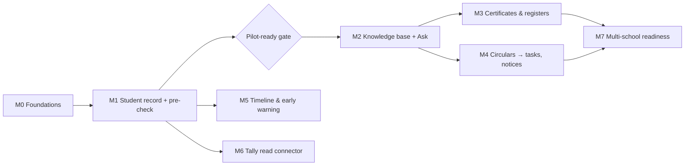

# 14 · Roadmap & Milestones

| Field | Value |
|---|---|
| Version | 0.4 · 2026-09-27 |
| Approach | Module by module on a shared core; real school needs decide order after M1; no calendar commitments |
| Related | 01-BRD §7, §11, 02-PRD §3, 03-TRD, 16-Platform admin panel |
| Changes | 0.4: M0 decisions 1, 3, 4 and 5 settled by the product owner (ADR-0020); decision 2 stays open. 0.3: M0 status (built per task, remaining work, decisions needed, pilot-gate status) after §2 M0; Task 5 lists all definer functions. 0.2: M0 adds the platform admin panel with minimal billing (C14), school setup and user admin UI, synthetic data as tasks; M0 task order changed; M0 exit criteria and pilot gate add platform checks; promotions and invoice PDFs in M1; M7 no longer carries basic billing. 0.1: baseline |

---

## 1. Milestone overview

Order after M2 is decided by the design partner's answer to "which task takes most of the office's time?"

## 2. Milestones

### M0 · Foundations (the core that never changes)
**Scope:** monorepo skeleton · local stack (compose: Postgres+pgvector, Valkey, SeaweedFS) · CI with all merge gates · Terraform staging env · OIDC login via BFF with MFA for privileged roles (ADR-0018) · tenancy + academic structure · RBAC with scopes + `require()` · RLS on all tables + catalog tests · database roles and privilege separation (ADR-0013) · hash-chained audit + daily verification · structured logging with redaction · OTel tracing · **platform admin panel (C14) with minimal billing: manual payments, GST invoices** · fleet heartbeat for dedicated hosts · school setup and user admin UI · synthetic data generator · security headers/CSP.
**Exit criteria**
- Cross-tenant suite, route-enumeration and authz matrix pass in CI
- Audit chain verification job green; tamper test detects modification; sequence concurrency test green
- Platform suites pass in CI: privilege separation, definer allowlist, composite FKs, admin panel authz matrix, heartbeat (12 §4.8–4.13)
- In staging, a shared-tier school is provisioned end to end from the admin panel and its owner signs in with MFA
- In staging, an invoice is generated, issued with a correct financial-year number and marked paid with a manual payment
- A staging dedicated host (`deploy/dedicated/compose.yaml`) sends accepted heartbeats; stopping it raises the `unreachable` alert
- Deploy to staging fully through the pipeline (no manual console changes)
- `make check` < 10 min on CI
- SEC-001..011 and SEC-026..028 implemented; SEC-029 for offboarding

### M0 status (2026-09-26)

The M0 code is merged on the session branch (not yet on `main`). What exists, per build task (§4), with the main requirement IDs:

| Task | Built | Requirements |
|---|---|---|
| 1 · Repo scaffold | uv + npm workspaces monorepo; Makefile (`install`, `dev`, `down`, `logs`, `migrate`, `db-shell`, `seed-synthetic`, `openapi`, `test`, `test-api`, `test-web`, `test-security`, `migration-check`, `e2e`, `lint`, `format`, `typecheck`, `security`, `eval` (stub until M2), `check`); `docker-compose.yml` (`db`, `valkey`, `s3`, `s3-init`, `migrate`, `api`, `worker`, `beat`, `web`, `oidc` in profile `dev`); `.env.example`; pre-commit; import-linter contracts | NFR-MNT-002 |
| 2 · CI pipeline | `.github/workflows/ci.yml` (jobs `lint`, `typecheck`, `test (test-api, test-web)`, `migrations`, `authz-suite`, `security`, `ci-config`, `terraform`, `images`, required check `ci-ok`), `nightly.yml`, `deploy-staging.yml`, `deploy-dedicated.yml`; CODEOWNERS; Dependabot; zizmor/actionlint | SEC-009, NFR-SEC-* |
| 3 · DB bootstrap | `infra/db/bootstrap.sql` (six roles, none with BYPASSRLS; schemas; extensions); `0001_baseline`; RLS catalog, definer allowlist and privilege-separation tests | SEC-001, SEC-002, SEC-026 |
| 4 · Tenant session | `tenant_session()`, `context_free_session()`, `platform_session()`; two-tenant isolation harness | FR-TEN-001, FR-TEN-002, SEC-001 |
| 8 · Logging/telemetry | Structured JSON logging with field allowlist and `redact()` (Verhoeff Aadhaar, phones, emails); OTel tracing with allowlisted attributes | SEC-008, NFR-OBS-001, PRV-015 |
| 7 · Audit | `0002_audit`: partitioned append-only tenant chain + platform chain; `record()`, `record_platform()`, `verify_chain()`; daily signed S3 archive and verification; partition CLI; school audit viewer and verify routes | FR-AUD-001..005 (CSV export pending), SEC-007 |
| 5 · Core schema | `0003_core_schema` with composite FKs and seven definer functions; `0007_accept_invitations` (ADR-0019) | FR-TEN-001..003, FR-TEN-010, FR-IAM-010..013 |
| 6 · AuthZ | `0004_authz_seed`; `permissions.yaml` + `roles.yaml`; `require()` with scopes, implicit `session.authenticated`, 60 s snapshot cache; route enumeration, generated matrix, BOLA | FR-IAM-010..014, SEC-003, SEC-005, SEC-015 (M0 resources) |
| 9 · Identity + BFF | API: OIDC access-token verification (JWKS), service token, MFA and step-up (`428`), `/me*` routes incl. school picker and invitation acceptance. Web: PKCE login for staff and operators, encrypted server sessions in Valkey, CSRF, refresh rotation with reuse detection, idle/absolute timeouts, step-up, session list/revoke | FR-IAM-001..006, FR-IAM-013, SEC-004..006 |
| 10 · Terraform | Modules `network`, `rds`, `rds_backup_replication`, `redis`, `s3`, `s3_bucket`, `kms`, `secrets`, `ecr`, `ecs_cluster`, `ecs_service`, `alb_waf`, `cognito` (+ pre-token Lambda), `observability`, `ci_oidc`, `shared_platform`, `dedicated_host`; roots `bootstrap`, `envs/staging`, `envs/prod`, `envs/dedicated-template`, with `terraform test` files. Validated in CI; never planned or applied against AWS | SEC-009, SEC-011, SEC-022, SEC-030 (partly) |
| 11 · Platform admin panel | 11a–11g backend (`0005_platform`, `0006_ops`, 70 control-plane routes + the fleet heartbeat, heartbeat, billing jobs, usage, flags, announcements, support, bootstrap-owner CLI); 11h web screens under `/[locale]/platform/*` (dashboard, schools, provision, plans, subscriptions, invoices, usage, flags, fleet, announcements, support, break-glass, operators, audit) | FR-PLT-001..030, SEC-026..029 |
| 12 · School setup UI | Structure (years, classes, sections), users (invite, roles, scopes, status), Plan & billing, audit log pages; EN/TE messages | US-102, US-202, US-1204, FR-AUD-005 |
| 13 · Synthetic data | `make seed-synthetic`: deterministic schools, academic structure and staff for every system role with AP name variants and overlapping names across schools; each first owner created through the production path (owner invite while provisioning → activate → invitation acceptance), audited on both chains | NFR-MNT-002, docs/12 §3 |

**Remaining before M0 exit** (exit criteria above):
- **CI on GitHub:** the workflows have never run on GitHub (pushing the branch is currently blocked); `ci-ok` must go green and `make check` must be timed (< 10 min).
- **Branch protection / rulesets** on `main` with `ci-ok` required and CODEOWNERS review (owner handle in `.github/CODEOWNERS` is a placeholder).
- **AWS:** accounts, `terraform plan/apply` for `bootstrap` and `envs/staging`, deploy pipeline secrets; then the staging exit checks (shared school provisioned end to end, owner signs in with MFA, invoice issued and paid, dedicated host heartbeat and `unreachable` alert, deploy fully through the pipeline).
- **Deploy configuration vs settings names (blocker for staging):** the Terraform `shared_platform` module and `deploy/dedicated/compose.yaml` set `SOS_KMS_KEY_ARN`, `SOS_FLEET_URL` and `SOS_FLEET_HMAC_KEY`, but the settings read `SOS_KMS_DATA_KEY_ARN`, `SOS_CONTROL_PLANE_URL`, `SOS_HEARTBEAT_KEY`/`SOS_HEARTBEAT_KEY_ID` and `SOS_DEDICATED_TENANT_ID`; `SOS_AUDIT_SIGNING_KEY_ARN` and `SOS_BILLING_SUPPLIER_*` are set nowhere; the ECS migrate task sets only `SOS_ENV`, so the staging/prod settings guard refuses it (`key_wrapper` defaults to `local-dev`).
- **Dedicated tier:** a host-side tenant provisioning command (the runbook names `python -m app.tenancy.provision_dedicated`, which does not exist); pin WAL-G in `deploy/dedicated/walg/walg.lock` (go-live precondition, 10 §15.3).
- **Identity:** Cognito Essentials has no threat protection, so breached-password screening (and adaptive login protection) must be built in the BFF/identity module or the pool moved to Plus (ADR-0018); FR-IAM-005 lockout auditing is not built.
- **Email delivery:** owner and staff invite emails, billing reminders (FR-PLT-019), usage-threshold notifications (FR-PLT-021). M0 records the events only.
- **Audit:** CSV export of the school audit log (FR-AUD-005).
- **Usage meters:** students, storage, documents and AI counts are 0 until `sis`/`kb` exist (M1+; `core.tenant_usage_summary` and the `definer_access` allowlist grow then).
- **Security testing:** ZAP baseline (nightly job skips until staging exists); axe accessibility checks in Playwright; Schemathesis contract tests; e2e beyond the signed-out smoke test.
- **School support form** in the web app (API routes exist).

**Decisions** (docs and code disagreed; product owner decisions of 2026-09-27):
1. **School-chain audit events for platform actions** — **settled:** guaranteed through a transactional outbox (`platform.tenant_audit_outbox`, queued in the platform transaction, delivered exactly once and in order per school by `platform.deliver_tenant_audit`); no definer function. [ADR-0020](adr/ADR-0020-control-plane-boundaries-and-guaranteed-audit-copies.md), 16 §16.
2. **Shared provisioning is not one transaction** (FR-PLT-002 says "in one transaction"): the first transaction is atomic and later steps resume idempotently (16 §5.4). **Still open:** amend FR-PLT-002, or change the code? (The school-chain `tenant.provisioned` copy is now queued atomically with the owner invite.)
3. **Suspended schools** — **settled:** the owner and principal keep `GET /me`, school choice, the sign-in event and Plan & billing (and the full export once FR-ADM-001 exists); every other school route answers `403 tenant_suspended` for every role. One pinned allowlist in `app/authz/resolver.py` (16 §5.5).
4. **Control plane and tenant modules** — **settled:** `platform` may call `tenancy.service` only for tenant lifecycle (register, initialise keys, activate, suspend, reactivate, offboard, usage counts) and never reads tenant data; enforced by `tests/platform/test_boundaries.py` (CLAUDE.md §4, ADR-0020).
5. **ADR process** — **settled:** dated Amendments sections may record implementation facts that do not change the decision; any change to the decision needs a new ADR that amends or supersedes it (adr/README step 5).

**Pilot-ready gate (§3) status:** not started except where M0 code covers controls: SEC-001..011 and SEC-026..029 are implemented in code and tests (SEC-029 emergency break-glass workflow is M1; SEC-011/SEC-022/SEC-023 exist only as unapplied Terraform); SEC-012..017, SEC-021 are M1; SEC-024 restore drill, incident rehearsal, DPA/DPIA, ZDR request, production accounts with two platform owners, CA confirmation of invoice format and GST, and staff training are all open.

### M1 · Student record, onboarding and pre-check
**Scope:** promotions with preview/commit/undo (FR-TEN-011) · invoice PDFs (before the first paid invoice) · students, enrolments, guardians · attribute catalog + per-source values + canonical projection · Excel/CSV/Sheets import with mapping, validation, commit, revert · register-photo extraction with verification queue (Aadhaar redaction) · DQ engine with DQ-001..012 and name matching · findings workflow · change requests (maker-checker) + correction memo · export profiles: `cisce-registration-2026` pre-check, `udise-plus` check sheet · bilingual reports (PDF/XLSX) · C3 field encryption · break-glass workflow.
**Exit criteria**
- Design partner's Class 9 and Class 11 batches imported and identity fields verified
- Pre-check report used before a real CISCE registration; post-submission corrections for pre-checked batches = 0
- DQ precision on seeded mismatches ≥ 0.95 for blocker/high rules
- SEC-012..017, SEC-021 and SEC-029 (emergency break-glass) implemented; pilot-ready gate passed before real data

### M2 · Knowledge base and "Ask the school"
**Scope:** document upload (presigned), AV scan, extraction/OCR, chunking, embeddings (provider chosen by eval, ADR-0006), hybrid retrieval, record tools, answer generation with search-result citations, citation validation, SSE UI with source chips, feedback, verified answers, budgets + search-only fallback, eval harness with hard gates.
**Exit criteria**
- Hard gates pass (leakage 0, injection 0, citation precision ≥ 0.95, refusal ≥ 0.95)
- Soft gates met on full suite; p95 latency targets met in staging
- Office staff use Ask for real questions weekly at the design partner; ≥ 80% rated helpful
- SEC-018..020 implemented

### M3 · Certificates and registers
**Scope:** templates for TC, bonafide, study, conduct certificates (EN/TE, school formats) · serial numbers · automatic register entries · duplicate marking · print views of registers in familiar formats · certificate PDFs indexed as documents.
**Exit:** certificates issued in production with median time < 5 minutes; register entries reconcile with paper.

### M4 · Circulars → tasks and bilingual notices
**Scope:** circular metadata/deadline extraction · task list with owners and due dates · reminders · parent notice generator (EN/TE text + printable/image) for posting in existing groups.
**Exit:** ≥ 90% of circulars in a term processed with deadlines captured; staff confirm fewer missed tasks.

### M5 · Student timeline and early warning
**Scope:** attendance and marks import · per-student timeline · ABC indicators (attendance, behaviour notes, course performance) · flags with assigned owner and intervention log · purpose limits (08 §4) · AP three-consecutive-absence follow-up support.
**Exit:** pilot with class teachers; ≥ 90% of flags actioned within 7 days; DPIA updated.

### M6 · Tally read connector
**Scope:** edge agent (Windows service) reading TallyPrime via XML over HTTP on localhost · configured ledgers only · sync to SchoolOS · `get_fee_dues` tool for accountant/management.
**Exit:** fee-due questions answered from synced Tally data; accountant confirms figures match Tally.

### M7 · Multi-school readiness
**Scope:** self-serve onboarding wizard · import templates library · online payment collection if ADR-0016 is accepted (basic billing already shipped in M0) · tenant admin improvements · support tooling beyond tickets · first dedicated-tier schools at scale (SEC-030 before the first one) · Stage 1 infrastructure (Multi-AZ, replicas, cross-account backups) · external pen test · published security overview for schools.
**Exit:** 5 schools live with < 1 week onboarding effort each; SLOs met for 2 consecutive months.

## 3. Pilot-ready gate (before any real student data)

- [ ] SEC-001..017, SEC-021..024 and SEC-026..029 implemented and verified
- [ ] Restore drill completed within RPO/RTO; results recorded
- [ ] Incident runbook rehearsed, including the CERT-In 6-hour flow; CERT-In point of contact designated
- [ ] DPA signed with the school; school's parent/staff notice issued; DPIA completed
- [ ] Sub-processor list shared; Zero Data Retention requested for the production API organization
- [ ] Production accounts: MFA on all operator access (operator pool MFA ON); break-glass tested; at least two active platform owners (two-person rules, 16 §19 Q1)
- [ ] Invoice number format and GST registration confirmed with a CA (16 §19 Q2–Q3)
- [ ] Data-handling permission for imports/photos documented; synthetic data purged from prod
- [ ] Staff training done (EN/TE); support channel and escalation path defined

## 4. First build tasks for AI-assisted development (M0)

Give these to your coding assistant one at a time, each with the referenced docs loaded. **Task numbers are stable IDs; do them in the order listed** (1, 2, 3, 4, 8, 7, 5, 6, 9, 10, 11, 12, 13).

| Order | Task | What | Docs |
|---|---|---|---|
| 1 | **Task 1 · Repo scaffold** | Monorepo layout, root Makefile (`install`, `dev`, `down`, `logs`, `migrate`, `seed-synthetic`, `test`, `test-api`, `test-web`, `e2e`, `lint`, `format`, `typecheck`, `security`, `eval`, `check`, `db-shell`), compose (`db`, `valkey`, `s3`, `s3-init`, `migrate`, `api`, `worker`, `beat`, `web`, `oidc` in profile `dev`), `.env.example`, pre-commit (ruff, mypy, eslint, gitleaks) | 13 §1, 10 §11, 04 §17, ADR-0014 |
| 2 | **Task 2 · CI pipeline** | Lint/typecheck/test/security jobs (`make install`, `make lint`, `make typecheck`, `make test`, `make security`) and required checks | 10 §7, 12 §9 |
| 3 | **Task 3 · DB bootstrap** | `infra/db/bootstrap.sql` (roles `sos_owner`, `sos_migrator`, `sos_app`, `sos_platform`, `sos_readonly`, `sos_definer`; schemas incl. `platform`; extensions), `core.current_tenant()`, Alembic `0001_baseline`, RLS catalog test + `rls_allowlist.yaml` + `definer_access` allowlist, privilege-separation catalog test | 05 §3, 12 §4.5, §4.8, ADR-0013 |
| 4 | **Task 4 · Tenant session** | `core.db.tenant_session()` with `set_config(..., true)`, `core.db.platform_session()`; cross-tenant test harness with two synthetic tenants | 05 §3.2, 12 §4.4 |
| 5 | **Task 8 · Logging/telemetry** | Structured logger with allowlist + `redact()` (incl. Verhoeff), OTel instrumentation, log redaction tests | 11 §2–4, 08 §5 |
| 6 | **Task 7 · Audit module** | `0002_audit`: partitioned append-only events with `seq`, chain heads with `last_seq`, RFC 8785 hashing, genesis, TRUNCATE trigger, RLS on partitions; `audit.record()`, `record_platform()`, `verify_chain()`, daily verification task, tamper and concurrency tests | 05 §7.1, 12 §4.7, §4.11, ADR-0013 |
| 7 | **Task 5 · Core schema** | `0003_core_schema`: tenants, keys, users, memberships, roles, permissions, scopes, academic structure with composite FKs; allowlisted definer functions (`resolve_login`, `find_user_id_by_subject`, `create_user_for_invite`, `list_tenant_ids`, `provision_tenant`, `set_tenant_status`, `tenant_usage_summary`; later `current_subscription`, `create_owner_invite` in 0005, `ops.claim_outbox` in 0006, `accept_invitations` in 0007) | 05 §3.4–3.5, §4, 12 §4.9–4.10 |
| 8 | **Task 6 · AuthZ module** | `0004_authz_seed`: permission catalog (incl. `tenant.structure.manage`, `tenant.billing.read`, split student/export permissions) and system role templates from config; `require()` dependency, scope filters, route-enumeration and matrix tests | 07 §6, 12 §4.1–4.2 |
| 9 | **Task 9 · Identity + BFF** | Two Cognito pools (staff MFA optional + `sos:mfa`; operators MFA on), dev OIDC stub locally; BFF session cookie, CSRF, `X-Service-Token`, idle/absolute timeouts, step-up with `prompt=login` | 07 §5, 09 §1, ADR-0018 |
| 10 | **Task 10 · Terraform staging** | Network, RDS (pgvector), ElastiCache for Valkey, S3 (+ audit bucket with Object Lock), KMS, ECS services, ALB+WAF, Cognito pools + Lambda, CI OIDC roles | 10 §3–5 |
| 11 | **Task 11 · Platform admin panel** | Sub-steps below | 16, ADR-0013, ADR-0015, ADR-0017 |
| 12 | **Task 12 · School setup and user admin UI** | Screens for academic years, classes, sections (`tenant.structure.manage`); invite users, assign roles and scopes (step-up); Plan & billing page (US-1204); support ticket form once `support.ticket.create` is approved | 02 US-102, US-202, US-1204; 09 §4 |
| 13 | **Task 13 · Synthetic data** | `make seed-synthetic`: two synthetic tenants (2,000 students, Telugu/English names, deliberate mismatches, circulars), synthetic operators with each platform role, plans, subscriptions, invoices, a fake dedicated deployment | 12 §3 |

**Task 11 sub-steps** (migrations `0005_platform`, `0006_ops`):

| Step | Scope | Requirements |
|---|---|---|
| 11a | Platform schema and operators: `0005_platform` tables and grants, platform audit chain, `platform.operators`/`operator_roles`, `require_platform()`, operator OIDC client, step-up, bootstrap-owner CLI | FR-PLT-028, FR-PLT-029, SEC-026, SEC-027 |
| 11b | Schools and provisioning: list/detail, shared provisioning via `core.provision_tenant()`, dedicated provisioning record + heartbeat key, suspend/reactivate, two-person offboarding; Terraform module `dedicated_host` and `deploy/dedicated/compose.yaml` | FR-PLT-001..005, SEC-029 |
| 11c | Plans, subscriptions, billing accounts, invoices and **manual payments**: versioned plans, lifecycle with 15-day grace and exam-window rule, invoice job, FY numbering, GST, payments with TDS, reversal, void | FR-PLT-010..019 |
| 11d | Feature flags (`platform.feature_flags`, % rollout, overrides) and announcements (publish to Valkey; heartbeat delivery) | FR-PLT-022, FR-PLT-026 |
| 11e | Usage and fleet: `core.tenant_usage_summary()` collector, thresholds, deployments registry, `POST /api/v1/fleet/heartbeat` (HMAC), staleness job, alerts | FR-PLT-020, FR-PLT-021, FR-PLT-023..025, SEC-028 |
| 11f | Support tickets: queue, SLA timers, redaction, 1-year purge; `0006_ops` (`ops.job_runs`, `ops.outbox` + `claim_outbox`, `ops.break_glass_grants`, `ops.idempotency_keys`) | FR-PLT-027 |
| 11g | Platform audit viewer and verification; `core.current_subscription()` for the school's Plan & billing page | FR-PLT-029, FR-PLT-030 |
| 11h | Web admin UI: route group `/[locale]/platform/*` on the admin host, all screens in 16 §5, EN/TE strings, keyboard and 1366×768 checks, Playwright journeys | 16 §5 |

Then continue with M1 stories US-301 → US-401 → US-501 → US-601 → US-402 in that order.

## 5. Scope guardrails

- New ideas go to a backlog with the question: "Which BRD objective does this move, and for which user?"
- Anything that adds a new sub-processor, a new data class, or AI write capability requires an ADR and a privacy review.
