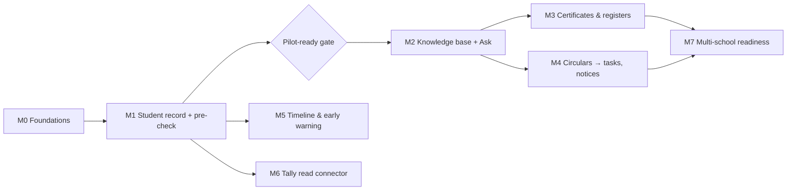

# 14 · Roadmap & Milestones

| Field | Value |
|---|---|
| Version | 0.1 · 2026-09-26 |
| Approach | Module by module on a shared core; real school needs decide order after M1; no calendar commitments |
| Related | 01-BRD §7, 02-PRD §3, 03-TRD |

---

## 1. Milestone overview

Order after M2 is decided by the design partner's answer to "which task takes most of the office's time?"

## 2. Milestones

### M0 · Foundations (the core that never changes)
**Scope:** monorepo skeleton · local stack (compose) · CI with all merge gates · Terraform staging env · OIDC login via BFF with MFA for privileged roles · tenancy + academic structure · RBAC with scopes + `require()` · RLS on all tables + catalog test · hash-chained audit + daily verification · structured logging with redaction · OTel tracing · synthetic data generator · operator console (provision tenant, flags) · security headers/CSP.
**Exit criteria**
- Cross-tenant suite, route-enumeration and authz matrix pass in CI
- Audit chain verification job green; tamper test detects modification
- Deploy to staging fully through the pipeline (no manual console changes)
- `make check` < 10 min on CI
- SEC-001..011 implemented

### M1 · Student record, onboarding and pre-check
**Scope:** students, enrolments, guardians · attribute catalog + per-source values + canonical projection · Excel/CSV/Sheets import with mapping, validation, commit, revert · register-photo extraction with verification queue (Aadhaar redaction) · DQ engine with DQ-001..012 and name matching · findings workflow · change requests (maker-checker) + correction memo · export profiles: `cisce-registration-2026` pre-check, `udise-plus` check sheet · bilingual reports (PDF/XLSX) · C3 field encryption · break-glass workflow.
**Exit criteria**
- Design partner's Class 9 and Class 11 batches imported and identity fields verified
- Pre-check report used before a real CISCE registration; post-submission corrections for pre-checked batches = 0
- DQ precision on seeded mismatches ≥ 0.95 for blocker/high rules
- SEC-012..017, SEC-021 implemented; pilot-ready gate passed before real data

### M2 · Knowledge base and "Ask the school"
**Scope:** document upload (presigned), AV scan, extraction/OCR, chunking, embeddings (provider chosen by eval, ADR-0006), hybrid retrieval, record tools, answer generation with search-result citations, citation validation, SSE UI with source chips, feedback, verified answers, budgets + search-only fallback, eval harness with hard gates.
**Exit criteria**
- Hard gates pass (leakage 0, injection 0, citation precision ≥ 0.95, refusal ≥ 0.95)
- Soft gates met on full suite; p95 latency targets met in staging
- Office staff use Ask for real questions weekly at the design partner; ≥ 80% rated helpful
- SEC-018..020 implemented

### M3 · Certificates and registers
**Scope:** templates for TC, bonafide, study, conduct certificates (EN/TE, school formats) · serial numbers · automatic register entries · duplicate marking · print views of registers in familiar formats · certificate PDFs indexed as documents.
**Exit:** certificates issued in production with median time < 5 minutes; register entries reconcile with paper.

### M4 · Circulars → tasks and bilingual notices
**Scope:** circular metadata/deadline extraction · task list with owners and due dates · reminders · parent notice generator (EN/TE text + printable/image) for posting in existing groups.
**Exit:** ≥ 90% of circulars in a term processed with deadlines captured; staff confirm fewer missed tasks.

### M5 · Student timeline and early warning
**Scope:** attendance and marks import · per-student timeline · ABC indicators (attendance, behaviour notes, course performance) · flags with assigned owner and intervention log · purpose limits (08 §4) · AP three-consecutive-absence follow-up support.
**Exit:** pilot with class teachers; ≥ 90% of flags actioned within 7 days; DPIA updated.

### M6 · Tally read connector
**Scope:** edge agent (Windows service) reading TallyPrime via XML over HTTP on localhost · configured ledgers only · sync to SchoolOS · `get_fee_dues` tool for accountant/management.
**Exit:** fee-due questions answered from synced Tally data; accountant confirms figures match Tally.

### M7 · Multi-school readiness
**Scope:** self-serve onboarding wizard · import templates library · billing/subscriptions · tenant admin improvements · support tooling · Stage 1 infrastructure (Multi-AZ, replicas, cross-account backups) · external pen test · published security overview for schools.
**Exit:** 5 schools live with < 1 week onboarding effort each; SLOs met for 2 consecutive months.

## 3. Pilot-ready gate (before any real student data)

- [ ] SEC-001..017, SEC-021..024 implemented and verified
- [ ] Restore drill completed within RPO/RTO; results recorded
- [ ] Incident runbook rehearsed, including the CERT-In 6-hour flow; CERT-In point of contact designated
- [ ] DPA signed with the school; school's parent/staff notice issued; DPIA completed
- [ ] Sub-processor list shared; Zero Data Retention requested for the production API organization
- [ ] Production accounts: MFA on all operator access; break-glass tested
- [ ] Data-handling permission for imports/photos documented; synthetic data purged from prod
- [ ] Staff training done (EN/TE); support channel and escalation path defined

## 4. First build tasks for AI-assisted development (M0)

Give these to your coding assistant one at a time, each with the referenced docs loaded:

1. **Repo scaffold:** monorepo layout, Makefile targets, docker compose (Postgres+pgvector, Redis, MinIO), `.env.example`, pre-commit (ruff, mypy, eslint, gitleaks). *Docs: 13 §1, 10 §11.*
2. **CI pipeline** with lint/typecheck/test/security jobs and required checks. *Docs: 10 §7, 12 §9.*
3. **DB bootstrap:** roles (`sos_owner`, `sos_migrator`, `sos_app`), schemas, `core.current_tenant()`, Alembic setup, RLS catalog test. *Docs: 05 §3, 12 §4.5.*
4. **Tenant session:** `core.db.tenant_session()` with `SET LOCAL`; cross-tenant test harness with two synthetic tenants. *Docs: 05 §3, 12 §4.4.*
5. **Core schema:** tenants, users, memberships, roles, permissions, scopes, academic structure + `resolve_login()`. *Docs: 05 §4.*
6. **AuthZ module:** permission catalog seed, default roles (07 §6.2), `require()` dependency, scope filters, route-enumeration and matrix tests. *Docs: 07 §6, 12 §4.1–4.2.*
7. **Audit module:** append-only table, chain heads, `audit.record()`, daily verification task, tamper test. *Docs: 05 §7, 12 §4.7.*
8. **Logging/telemetry:** structured logger with allowlist + `redact()` (incl. Verhoeff), OTel instrumentation, log redaction tests. *Docs: 11 §2–4, 08 §5.*
9. **Identity + BFF:** OIDC with a dev stub locally, Cognito in staging; session cookie, CSRF, idle/absolute timeouts, step-up flow. *Docs: 07 §5, 09 §1.*
10. **Terraform staging:** network, RDS (pgvector), Redis, S3 (+ audit bucket with Object Lock), KMS, ECS services, ALB+WAF, Cognito, CI OIDC roles. *Docs: 10 §3–5.*

Then continue with M1 stories US-301 → US-401 → US-501 → US-601 → US-402 in that order.

## 5. Scope guardrails

- New ideas go to a backlog with the question: "Which BRD objective does this move, and for which user?"
- Anything that adds a new sub-processor, a new data class, or AI write capability requires an ADR and a privacy review.
