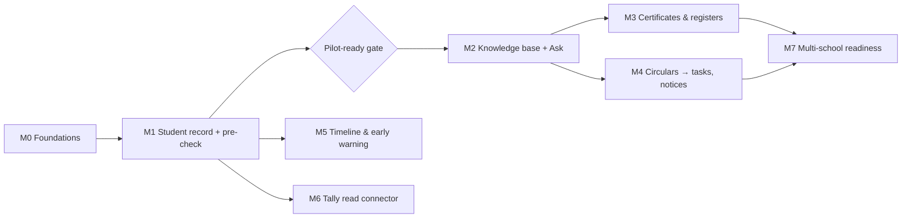

# 14 · Roadmap & Milestones

| Field | Value |
|---|---|
| Version | 0.9 · 2026-09-30 |
| Approach | Module by module on a shared core; real school needs decide order after M1; no calendar commitments |
| Related | 01-BRD §7, §11, 02-PRD §3, 03-TRD, 12-Testing strategy, 16-Platform admin panel |
| Changes | 0.9: M2 addendum: Ask conversations, context and per-user memory (ADR-0034; PO questions). 0.8: M5 status (attendance, marks, early-warning flags, notes and timeline built on the M5 branch; PO questions). 0.7: M4 status (circulars, tasks, parent notices built on the M4 branch; PO questions). 0.6: M1 status updated for everything merged up to `cc818b3` (promotions, DEK rotation, break-glass support sign-in, synthetic students, test gates, SEC-023 Terraform, worker image and Chromium sandbox); new M2 status; owner decisions for SEC-012 and SEC-023 (2026-09-27) recorded. 0.5: M1 status (built per scope item, M1 security controls, remaining work, decisions needed, pilot-gate items checkable in code) after §2 M1, verified against code and tests. 0.4: M0 decisions 1, 3, 4 and 5 settled by the product owner (ADR-0020); decision 2 stays open. 0.3: M0 status (built per task, remaining work, decisions needed, pilot-gate status) after §2 M0; Task 5 lists all definer functions. 0.2: M0 adds the platform admin panel with minimal billing (C14), school setup and user admin UI, synthetic data as tasks; M0 task order changed; M0 exit criteria and pilot gate add platform checks; promotions and invoice PDFs in M1; M7 no longer carries basic billing. 0.1: baseline |

---

## 1. Milestone overview

Order after M2 is decided by the design partner's answer to "which task takes most of the office's time?"

### English first; Telugu moved to later (ADR-0036, product owner 2026-09-30)

"Forget about Telugu for now; deal with English first." Every milestone below ships in **English**. Telugu output (UI, notices, notifications, certificates and registers, AI answers, summaries) is **hidden, not deleted**, behind `SOS_TELUGU_ENABLED` (default `false`); the "EN/TE" items below are done for the code but shown in English only while the switch is off. Telugu *input* still works (Telugu questions answered in English, Telugu-script search, transliteration matching, Telugu register values). Telugu tests and eval gates keep running with the switch on (docs/12 §4.0.8, docs/06 §13.8).

**Bring Telugu back (checklist):**

- [ ] Product owner decision recorded in a new ADR (superseding ADR-0036 in part or whole)
- [ ] `SOS_TELUGU_ENABLED=true` in one non-production environment first (API, worker and web read the same variable)
- [ ] `make eval EVAL_ADAPTER=app-fake EVAL_SUITE=full` green and the live Telugu run on Vertex AI (docs/06 §13.7) with the Telugu soft gates `--fail-on-soft`: language match, follow-up language, memory preference, TE and code-mixed circulars
- [ ] A fluent Telugu reviewer signs off answers (30 proposed), notices (10), notifications, certificates and register print views; the Telugu catalog (`messages/te.json`) completed for keys added while it was off
- [ ] Knowledge: the switch picks `answer_system` v2, `followups` v1, `circular_reading` v1 and `parent_notice` v1 (`telugu_prompt` in the configs) and the `te` not-found and memory replies; re-check these prompts against today's English versions and write new versions if the English ones gained rules
- [ ] Print: Noto Sans Telugu loaded again; the worker's Telugu PDF smoke test (docs/10) and "no clipped glyphs" checks on real printers
- [ ] Docs: remove the "deferred: hidden while `SOS_TELUGU_ENABLED` is off" notes from 01, 02, 03 and the "English first" notes elsewhere
- [ ] Staff training material and parent-facing templates in Telugu; production switched on per the new ADR

## 2. Milestones

### M0 · Foundations (the core that never changes)
**Scope:** monorepo skeleton · local stack (compose: Postgres+pgvector, Valkey, SeaweedFS) · CI with all merge gates · Terraform staging env · OIDC login via BFF with MFA for privileged roles (ADR-0018) · tenancy + academic structure · RBAC with scopes + `require()` · RLS on all tables + catalog tests · database roles and privilege separation (ADR-0013) · hash-chained audit + daily verification · structured logging with redaction · OTel tracing · **platform admin panel (C14) with minimal billing: manual payments, GST invoices** · fleet heartbeat for dedicated hosts · school setup and user admin UI · synthetic data generator · security headers/CSP.
**Exit criteria**
- Cross-tenant suite, route-enumeration and authz matrix pass in CI
- Audit chain verification job green; tamper test detects modification; sequence concurrency test green
- Platform suites pass in CI: privilege separation, definer allowlist, composite FKs, admin panel authz matrix, heartbeat (12 §4.8–4.13)
- In staging, a shared-tier school is provisioned end to end from the admin panel and its owner signs in with MFA
- In staging, an invoice is generated, issued with a correct financial-year number and marked paid with a manual payment
- A staging dedicated host (`deploy/dedicated/compose.yaml`) sends accepted heartbeats; stopping it raises the `unreachable` alert
- Deploy to staging fully through the pipeline (no manual console changes)
- `make check` < 10 min on CI
- SEC-001..011 and SEC-026..028 implemented; SEC-029 for offboarding

### M0 status (2026-09-26)

The M0 code is merged on the session branch (not yet on `main`). What exists, per build task (§4), with the main requirement IDs:

| Task | Built | Requirements |
|---|---|---|
| 1 · Repo scaffold | uv + npm workspaces monorepo; Makefile (`install`, `dev`, `down`, `logs`, `migrate`, `db-shell`, `seed-synthetic`, `openapi`, `test`, `test-api`, `test-web`, `test-security`, `migration-check`, `e2e`, `lint`, `format`, `typecheck`, `security`, `eval` (stub until M2), `check`); `docker-compose.yml` (`db`, `valkey`, `s3`, `s3-init`, `migrate`, `api`, `worker`, `beat`, `web`, `oidc` in profile `dev`); `.env.example`; pre-commit; import-linter contracts | NFR-MNT-002 |
| 2 · CI pipeline | `.github/workflows/ci.yml` (jobs `lint`, `typecheck`, `test (test-api, test-web)`, `migrations`, `authz-suite`, `security`, `ci-config`, `terraform`, `images`, required check `ci-ok`), `nightly.yml`, `deploy-staging.yml`, `deploy-dedicated.yml`; CODEOWNERS; Dependabot; zizmor/actionlint | SEC-009, NFR-SEC-* |
| 3 · DB bootstrap | `infra/db/bootstrap.sql` (six roles, none with BYPASSRLS; schemas; extensions); `0001_baseline`; RLS catalog, definer allowlist and privilege-separation tests | SEC-001, SEC-002, SEC-026 |
| 4 · Tenant session | `tenant_session()`, `context_free_session()`, `platform_session()`; two-tenant isolation harness | FR-TEN-001, FR-TEN-002, SEC-001 |
| 8 · Logging/telemetry | Structured JSON logging with field allowlist and `redact()` (Verhoeff Aadhaar, phones, emails); OTel tracing with allowlisted attributes | SEC-008, NFR-OBS-001, PRV-015 |
| 7 · Audit | `0002_audit`: partitioned append-only tenant chain + platform chain; `record()`, `record_platform()`, `verify_chain()`; daily signed S3 archive and verification; partition CLI; school audit viewer and verify routes | FR-AUD-001..005 (CSV export pending), SEC-007 |
| 5 · Core schema | `0003_core_schema` with composite FKs and seven definer functions; `0007_accept_invitations` (ADR-0019) | FR-TEN-001..003, FR-TEN-010, FR-IAM-010..013 |
| 6 · AuthZ | `0004_authz_seed`; `permissions.yaml` + `roles.yaml`; `require()` with scopes, implicit `session.authenticated`, 60 s snapshot cache; route enumeration, generated matrix, BOLA | FR-IAM-010..014, SEC-003, SEC-005, SEC-015 (M0 resources) |
| 9 · Identity + BFF | API: OIDC access-token verification (JWKS), service token, MFA and step-up (`428`), `/me*` routes incl. school picker and invitation acceptance. Web: PKCE login for staff and operators, encrypted server sessions in Valkey, CSRF, refresh rotation with reuse detection, idle/absolute timeouts, step-up, session list/revoke | FR-IAM-001..006, FR-IAM-013, SEC-004..006 |
| 10 · Terraform | Modules `network`, `rds`, `rds_backup_replication`, `redis`, `s3`, `s3_bucket`, `kms`, `secrets`, `ecr`, `ecs_cluster`, `ecs_service`, `alb_waf`, `cognito` (+ pre-token Lambda), `observability`, `ci_oidc`, `shared_platform`, `dedicated_host`; roots `bootstrap`, `envs/staging`, `envs/prod`, `envs/dedicated-template`, with `terraform test` files. Validated in CI; never planned or applied against AWS | SEC-009, SEC-011, SEC-022, SEC-030 (partly) |
| 11 · Platform admin panel | 11a–11g backend (`0005_platform`, `0006_ops`, 70 control-plane routes + the fleet heartbeat, heartbeat, billing jobs, usage, flags, announcements, support, bootstrap-owner CLI); 11h web screens under `/[locale]/platform/*` (dashboard, schools, provision, plans, subscriptions, invoices, usage, flags, fleet, announcements, support, break-glass, operators, audit) | FR-PLT-001..030, SEC-026..029 |
| 12 · School setup UI | Structure (years, classes, sections), users (invite, roles, scopes, status), Plan & billing, audit log pages; EN/TE messages | US-102, US-202, US-1204, FR-AUD-005 |
| 13 · Synthetic data | `make seed-synthetic`: deterministic schools, academic structure and staff for every system role with AP name variants and overlapping names across schools; each first owner created through the production path (owner invite while provisioning → activate → invitation acceptance), audited on both chains | NFR-MNT-002, docs/12 §3 |

**Remaining before M0 exit** (exit criteria above):
- **CI on GitHub:** the workflows have never run on GitHub (pushing the branch is currently blocked); `ci-ok` must go green and `make check` must be timed (< 10 min).
- **Branch protection / rulesets** on `main` with `ci-ok` required and CODEOWNERS review (owner handle in `.github/CODEOWNERS` is a placeholder).
- **AWS:** accounts, `terraform plan/apply` for `bootstrap` and `envs/staging`, deploy pipeline secrets; then the staging exit checks (shared school provisioned end to end, owner signs in with MFA, invoice issued and paid, dedicated host heartbeat and `unreachable` alert, deploy fully through the pipeline).
- **Deploy configuration vs settings names:** **done** (checked 2026-09-29): Terraform `shared_platform` and `deploy/dedicated/compose.yaml` pass the names `app/core/config.py` reads (`SOS_KMS_DATA_KEY_ARN`, `SOS_AUDIT_SIGNING_KEY_ARN`, `SOS_CONTROL_PLANE_URL`, `SOS_HEARTBEAT_KEY`/`_ID`, `SOS_DEDICATED_TENANT_ID`, `SOS_BILLING_SUPPLIER_*`), and every task, migrate included, gets the full settings (`c7373b1`); `tests/deploy/test_env_contract.py` parses the deploy files and runs the staging/prod guards per container.
- **Dedicated tier:** pin WAL-G in `deploy/dedicated/walg/walg.lock` (go-live precondition, 10 §15.3). The host-side provisioning command is done (`python -m app.platform.provision_dedicated`, `e48d475` · `tests/deploy/test_provision_dedicated.py`; 10 §15).
- **Identity:** Cognito Essentials has no threat protection, so breached-password screening (and adaptive login protection) must be built in the BFF/identity module or the pool moved to Plus (ADR-0018); FR-IAM-005 lockout auditing is not built.
- **Email delivery:** staff invite emails built (provider interface, SES, `POST /users/{id}/invitation-email`; off until `SOS_EMAIL_PROVIDER=ses` and an SES identity exist). Still open: owner invite emails from the control plane, billing reminders (FR-PLT-019), usage-threshold notifications (FR-PLT-021), SES identity, DKIM and `ses:SendEmail` permission in Terraform.
- **Audit:** CSV export of the school audit log (FR-AUD-005): **done** (API `GET /audit/export`; web download button with the current filters and step-up, `4115f30`, `apps/web/src/features/school/AuditExportButton.tsx`).
- **Usage meters:** students, storage, documents and AI counts are 0 until `sis`/`kb` exist (M1+; `core.tenant_usage_summary` and the `definer_access` allowlist grow then).
- **Security testing:** ZAP baseline (nightly job skips until staging exists); Schemathesis contract tests. Done (checked 2026-09-29): axe (WCAG 2.2 AA) and keyboard checks in Playwright, and e2e well beyond the signed-out smoke test (signed-in school and platform pages, M1 journeys, Ask the school, responsive layout), which now run on every pull request (`e2e` jobs in `ci.yml`, part of `ci-ok`). The first full `make security` run (2026-09-29) found no dependency CVEs (pip-audit, npm audit, trivy fs) and no IaC misconfigurations (trivy config); gitleaks history hits were reviewed false positives (`.gitleaksignore`); semgrep's repo rules found string-built SQL in `app/core/purge.py` and `app/students/rotation.py` (fixed) and a reviewed RLS toggle in `0014` (suppressed with reason). The registry rulesets `p/python`, `p/typescript` and `p/owasp-top-ten` could not be fetched from the build sandbox and still need a first run on GitHub.
- **School support form** in the web app: **done** (`/support`: list, open a ticket, thread and reply; `apps/web/src/features/school/SupportScreens.tsx`).

**Decisions** (docs and code disagreed; product owner decisions of 2026-09-27):
1. **School-chain audit events for platform actions** — **settled:** guaranteed through a transactional outbox (`platform.tenant_audit_outbox`, queued in the platform transaction, delivered exactly once and in order per school by `platform.deliver_tenant_audit`); no definer function. [ADR-0020](adr/ADR-0020-control-plane-boundaries-and-guaranteed-audit-copies.md), 16 §16.
2. **Shared provisioning is not one transaction** (FR-PLT-002 says "in one transaction"): the first transaction is atomic and later steps resume idempotently (16 §5.4). **Still open:** amend FR-PLT-002, or change the code? (The school-chain `tenant.provisioned` copy is now queued atomically with the owner invite.)
3. **Suspended schools** — **settled:** the owner and principal keep `GET /me`, school choice, the sign-in event, Plan & billing and the full data export (FR-ADM-001, built); every other school route answers `403 tenant_suspended` for every role. One pinned allowlist in `app/authz/resolver.py` (16 §5.5).
4. **Control plane and tenant modules** — **settled:** `platform` may call `tenancy.service` only for tenant lifecycle (register, initialise keys, activate, suspend, reactivate, offboard, usage counts) and never reads tenant data; enforced by `tests/platform/test_boundaries.py` (CLAUDE.md §4, ADR-0020).
5. **ADR process** — **settled:** dated Amendments sections may record implementation facts that do not change the decision; any change to the decision needs a new ADR that amends or supersedes it (adr/README step 5).

**Pilot-ready gate (§3) status:** not started except where M0 code covers controls: SEC-001..011 and SEC-026..029 are implemented in code and tests (SEC-029 emergency break-glass workflow is M1; SEC-011/SEC-022/SEC-023 exist only as unapplied Terraform); SEC-012..017, SEC-021 are M1; SEC-024 restore drill, incident rehearsal, DPA/DPIA, ZDR request, production accounts with two platform owners, CA confirmation of invoice format and GST, and staff training are all open.

### M1 · Student record, onboarding and pre-check
**Scope:** promotions with preview/commit/undo (FR-TEN-011) · invoice PDFs (before the first paid invoice) · students, enrolments, guardians · attribute catalog + per-source values + canonical projection · Excel/CSV/Sheets import with mapping, validation, commit, revert · register-photo extraction with verification queue (Aadhaar redaction) · DQ engine with DQ-001..012 and name matching · findings workflow · change requests (maker-checker) + correction memo · export profiles: `cisce-registration-2026` pre-check, `udise-plus` check sheet · bilingual reports (PDF/XLSX) · C3 field encryption · break-glass workflow.
**Exit criteria**
- Design partner's Class 9 and Class 11 batches imported and identity fields verified
- Pre-check report used before a real CISCE registration; post-submission corrections for pre-checked batches = 0
- DQ precision on seeded mismatches ≥ 0.95 for blocker/high rules
- SEC-012..017, SEC-021 and SEC-029 (emergency break-glass) implemented; pilot-ready gate passed before real data

### M1 status (2026-09-28)

Checked against the code and tests on the session branch up to the Ask screen merge `cfe93db` (migrations `0008_sis_students` … `0029_kb_v2`), not against earlier doc claims. Paths are relative to `apps/api/` unless they start with `apps/`, `infra/` or `deploy/`. "In progress" means another work package is open on it today.

| Scope item | Status | Evidence (code · tests) | Missing |
|---|---|---|---|
| Promotions with preview/commit/undo (FR-TEN-011, US-202 AC2) | **Done** | `0022_promotions`; preview, commit and undo within 24 h (API, merge `b8d2299`), year-end promotions screen with structure archive and class-teacher picker (`28eb754`); enrolment into archived structure refused (`8680d68`) | — |
| Invoice PDFs (before the first paid invoice) | **Done in code; template v0 pending CA review** | `app/platform/invoice_pdf.py` (template v0, Rule 46 fields), `invoice_files.py` (render on queue `pdf` via `app/core/pdf.py`, idempotent per invoice, audit), `invoice_storage.py` (control-plane prefix `platform/invoices/`), `GET /platform/invoices/{id}/download-url`, migration `0029_invoice_pdfs` (16 §5.8.1); Terraform wires `SOS_BILLING_SUPPLIER_ADDRESS`, `SOS_PLATFORM_INVOICE_BUCKET` and the task role's `platform/invoices/*` | CA sign-off of the layout (16 §19 Q2, Q3, Q11); panel download button; emailing to schools (Q13) |
| Commercial catalogue: one-time fee, AI answer bundles, overage (ADR-0038, 2026-10-01) | **Done in code** | Migration `0041_billing_catalogue` seeds Shared (₹4,999 a month + ₹15,000 one-time) and Dedicated (₹9,900 + ₹49,000) and the AI bundles Lite/Standard/High (300/1,000/3,000 answers, ₹699/₹1,499/₹3,499, ₹1.50 each extra); `app/platform/billing.py` (fee on the first invoice once, bundle line in advance, overage for the previous calendar month once), `usage.py` (billable AI answers counted in the school's own session; heartbeat `ai_answers`), routes `GET /platform/ai-bundles`, `PUT`/`DELETE /platform/subscriptions/{id}/ai-bundle`; plans and subscriptions screens · `tests/platform/test_catalogue.py`, `test_boundaries.py`, web `actions.test.tsx` (16 §5.6, §5.7, §10.2, §11) | Owner decisions 16 §19 Q15 (cached answers count?), Q16 (annual plans, quota alerts), Q17 (`usd_inr_rate`); school-side Plan & billing page shows the bundle (built: `ai_bundle` on `GET /tenant/billing`, 16 §5.18); public `/pricing` copy still says "price agreed" and "your own server" |
| FR-PLT-005 Offboarding deletion, crypto-shredding, certificate (ADR-0029) | Done | Export gate, deletion job as `sos_purger` in the school's own session (`0032_offboarding`), verification over the whole catalog, key destruction, dedicated teardown confirmation, 30-day deadline alerts, bilingual certificate (Telugu wording pending review), retained audit chain deleted after 366 days · `tests/tenancy/test_offboarding_purge.py`, `tests/platform/test_offboarding.py`, `tests/platform/test_deletion_certificate.py` | **Open infra item:** noncurrent object versions deleted before offboarding keep their 90-day expiry (needs `s3:ListBucketVersions`/`s3:DeleteObjectVersion` on `t/*` for the worker, or a lifecycle change). Staff sign-in accounts: identity rework ADR (docs/16 §5.5 TODO). Telugu wording review (docs/16 Q14) |
| Students, enrolments, guardians (FR-STU-001..008, 010..012; US-301..303) | **Done** | `0008_sis_students`; `app/students/`; `tests/students/`; BOLA and scope rows in `tests/security/test_bola.py`; web `/students`, `/students/new`, `/students/[id]` with guardian, enrolment editing and corrections (`a0174d3`, `808610f`) | — |
| Attribute catalog, per-source values, canonical projection (FR-STU-002..006) | **Done** | `app/students/attributes.yaml` seeded into `sis.attribute_definitions`; append-only values with supersession and verification; `canonical.py` resolves on read with the admission-register anchor (BR-01) · `tests/students/test_definitions.py`, `test_canonical.py`, `test_service.py`, `test_values_changed_event.py` | — |
| Excel/CSV/Sheets import with mapping, validation, commit, revert (FR-IMP-001..007; US-401) | **Done** | `0012_imports`; `app/imports/` · `tests/imports/` (every FR-IMP-001..007 ID, SEC-013, SEC-015, SEC-017, 2,000-row timing); students own the revert, `import.reverted` notice (`2a1d841`); web `/imports` | — |
| Register-photo extraction with verification queue and Aadhaar redaction (FR-IMP-020..024, PRV-016; US-402) | **Partial** | `0016_extraction`, `0018_extraction_redaction`; `app/extraction/` (provider interface, queue, confirm/reject with the page as evidence, page-image black-out and re-read) · `tests/extraction/` (FR-IMP-020..024, PRV-016, SEC-008); web `/register-photos` | **No real provider**: only `fake` (local/ci); staging/prod default to `not-configured` (`SOS_EXTRACTION_PROVIDER`). **PDF pages refused** (`accepted_mime_types` is JPEG/PNG; no approved rasteriser) although FR-IMP-020 lists PDF |
| DQ engine, DQ-001..012, name matching (FR-DQ-001..006) | **Done** | `app/dq/` (12 rules, matching, EN/TE explanations, on-demand and incremental runs) · `tests/dq/` incl. `test_precision.py` ≥ 0.95 and the robust 2,000-student timing test (`42fd217`) | — |
| Findings workflow (FR-DQ-020; US-502) | **Done** | `/findings/{id}/resolve` · `/waive` (`dq.findings.waive`, reason) · `tests/dq/test_engine.py`, `test_api.py`; web `/findings`, `/findings/rules`, `/findings/runs/[id]` | — |
| Change requests (maker-checker) and correction memo (FR-CR-001..005, SEC-014; US-601) | **Done** | `0014_change_requests` (DB CHECK against self-approval); `app/changes/` incl. `memo.py` (print-ready bilingual HTML) and daily expiry · `tests/changes/` (`test_SEC_014_database_refuses_self_approval_*`, FR-CR-001..005); web `/change-requests` | — |
| Export profiles `cisce-registration-2026` pre-check and `udise-plus` check sheet (FR-EXP-001; US-501, US-901) | **Partial** | Profiles in `app/dq/config/profiles/*.yaml`, layouts in `app/exports/config.yaml`, `0017_exports`, `0019_export_access` (ADR-0021) · `tests/exports/test_config.py`, `test_service.py`, `test_report.py`; web `/exports/new/precheck` | Field lists are **minimal placeholders** (`TODO(board formats)`, `TODO(portal formats)`): exact council and UDISE+ field order, codes and date formats still to be taken from the official formats |
| Bilingual reports PDF/XLSX (FR-EXP-002..004, SEC-017) | **Done** | `app/exports/report.py`, `pdf.py`, `tables.py` · `tests/exports/`; worker image with chrome-headless-shell, export lifecycle tag and SSE-KMS (`343938c`); Chromium sandbox on (ADR-0025: EC2 `pdf` capacity on the shared tier, seccomp + AppArmor on dedicated hosts, `c6f723b`); CI renders sandboxed | Staging render on real infrastructure (needs AWS) |
| C3 field encryption (SEC-012, FR-STU-007) | **Done** | `app/core/crypto.py`, `app/students/crypto.py` · `tests/students/test_crypto.py`, `tests/tenancy/test_key_wrapping.py`; DEK rotation, background re-encryption and guarded retirement (`0026_dek_rotation`, `python -m app.tenancy.rotate_keys`, `98c281c`). Policy settled 2026-09-27: yearly and after a suspected incident, platform owner + second approver, retired keys kept until offboarding (07 §8, 10 §9.1). `kb.queries` is re-encrypted too (`register_reencryptor("kb_queries", …)` in `app/knowledge/service.py`, `8fbb007` · `tests/knowledge/test_query_reencryption.py`) | Technical enforcement of the second approval (procedural today) |
| Break-glass workflow (SEC-021, SEC-029; US-103, FR-OPS-004) | **Done** for the shared tier | `0011_breakglass`; `app/breakglass/`, `app/platform/breakglass.py`, `app/authz/breakglass_guard.py` · `tests/breakglass/`; web `/break-glass`, `/platform/break-glass`. Operator sign-in to the school (ADR-0023 option C, merge `0c67673`): `0027_identity_issuer` (expand), support verifier and resolver, `POST /breakglass/support-session`, web `/bff/auth/support/*` · `tests/identity/test_support_tokens.py`, `tests/breakglass/test_support_signin.py`; Cognito support app client per environment and per dedicated host in Terraform (`modules/cognito_support_client`, unapplied) | Contract migration for `core.users.idp_issuer` (later release); dedicated hosts: requests cannot reach them (decision 6); emergency path for an operator never approved (decision 7) |
| School data export and retention settings (C12, US-1201; FR-ADM-001, FR-ADM-002; BR-08) | **Done** (FR-ADM-001/002); FR-ADM-003..006 not written | `0031_admin`; `app/admin/` (full export worker on queue `exports` streamed to the bucket, 24-hour link, hourly purge; retention bounds in `app/admin/retention.yaml`, provider in `app/core/retention.py` read by `imports.purge_raw_files`, the export expiry and `notifications.purge_read`); export routes on the suspended-school allowlist · `tests/admin/` (config, archive, service, API, retention, migration round trip, log redaction, public additions), authz matrix, BOLA, `tests/authz/test_suspended_allowlist.py`, `tests/api/test_suspended_school.py`, `apps/worker/tests/test_admin_routing.py`; web `/settings/data-export`, `/settings/retention` | FR-ADM-003..006 are referenced by US-1201 but not written in 03-TRD. Not in the archive yet: parsed import rows, extraction items, notifications, pre-check export records, knowledge questions. Owner questions below (decision 9). Done 2026-09-29: `kb_queries` is purged after 180 days by the daily `knowledge.purge_queries` job (`query_log.retention_days` in `app/knowledge/config/models.yaml`; `tests/knowledge/test_query_retention.py`); the Exports and Imports screens no longer state fixed 7/90-day periods: the export pages show the school's period (from the export's own dates, or `GET /admin/retention` for `tenant.settings.manage` holders) and otherwise say it ends with the school's retention period (en + te) |
| Sheet editor for imports and documents (FR-IMP-008, FR-IMP-009, FR-DOC-009..011; US-701) | **Done** (2026-10-03) | Sheet routes in `app/imports/` and `app/documents/` (view, edit, export); web `/imports/[importId]/sheet` and `/documents/[documentId]/sheet` (grid search, Tab out, pending cells, unsaved-changes guard, conflict reload, document preview) · `tests/imports/`, `tests/documents/`, `tests/core/test_logging.py` (sheet fields never logged), `apps/web/e2e/sheets.spec.ts` with axe | e2e run in CI |
| Exact search by APAAR ID (FR-STU-016; ADR-0037, PRV-020) | **Done** (2026-10-03) | `POST /students/search` with `apaar_id` (12 digits; exact match on current, not rejected values; same permission and scope as every search; never logged); "APAAR ID" field on the web students list · `tests/students/test_apaar_search.py` | — |
| Automatic deletions discarded after 1 day (FR-DOC-007, PRV-016; owner decision 2026-10-03) | **Done** | `documents.delete_for_retention` and the other automated purges tag objects `sos-lifecycle=discarded` (bucket rule `discarded-1d` in `modules/s3` and `modules/dedicated_host`); a person's delete keeps the 90-day recovery window; the `document.deleted` event carries `discard` (06 §4.8, 08 §7) · `tests/documents/test_tasks.py`, `test_storage_s3.py`, `test_documents_api.py` | — |
| AI budget from the AI answer bundle (FR-KB-011, NFR-CST-001, FR-PLT-013; ADR-0020 B2/B3, ADR-0038 C1) | **Done** (2026-10-03) | The bundle's included answers reach the school through `tenancy.set_ai_answer_allowance` when the bundle changes and in the daily `usage.collect_daily` reconciliation (`billing.sync_ai_allowance`); one alert at 100% on the first refusal of the month; `usd_inr_rate` set to the FBIL reference rate · `tests/knowledge/test_bundle_budget.py`, `test_budget_reservation.py`, `tests/tenancy/test_ai_allowance.py`, `tests/platform/test_catalogue.py` | Owner questions 16 §19 (Q19, Q20) |

**M1 security controls** (07 §15):

| Control | Status | Evidence |
|---|---|---|
| SEC-012 Per-tenant DEKs; C3 encryption | Done (rotation built; policy settled, second approval procedural) | see C3 row above |
| SEC-013 Aadhaar input rejection + Verhoeff redaction in pipelines | Done | `app/students/api.py` and `service.py` (422 `aadhaar_full_number_rejected`), `app/core/redaction.py`; `tests/imports/` (`test_SEC_013_*`), `tests/extraction/` (`test_FR_IMP_022_PRV_016_*`), `tests/exports/` (`test_invariant_4_*`), `apps/web/src/lib/aadhaar.test.ts` |
| SEC-014 Maker-checker with DB constraint | Done | `tests/changes/test_schema.py`, `test_service.py` (`test_SEC_014_*`) |
| SEC-015 Scoped repositories + BOLA per resource | Done for every M1 resource | `tests/security/test_bola.py` (`test_SEC_015_every_id_route_is_covered`, students, change requests, extraction, exports), scope tests per module |
| SEC-016 File upload controls | Done in code; browser uploads wired for staging/prod (`49e1eb1`); ClamAV service not deployed | `app/documents/filetypes.py`, `scanning.py` (ClamAV `INSTREAM`; dev scanner refused in staging/prod), `storage.py` (presigned POST with size range, SSE-KMS condition) · `tests/documents/` (`test_SEC_016_*`, FR-DOC-001..008) |
| SEC-017 Formula-injection-safe spreadsheets | Done | `app/exports/tables.py`, `app/imports/sheet.py` · `tests/exports/test_tables.py`, `tests/imports/` (`test_SEC_017_*`) |
| SEC-021 Break-glass visible to school | Done (shared tier) | see break-glass row |
| SEC-029 Two-person rule (offboarding M0, emergency break-glass M1) | Done | `tests/breakglass/test_breakglass.py`, `tests/platform/test_provisioning.py` |

**Remaining before M1 exit** (besides the items in progress listed above):
- **Invoice PDFs**: merge the work package (in progress) before the first paid invoice.
- **Extraction provider**: choose a real OCR/extraction provider by evaluation (FR-IMP-024), then add it; a new sub-processor needs an ADR and a privacy review (§5). PDF register pages need an approved rasteriser.
- **Official export formats**: replace the placeholder field lists of `cisce-registration-2026` and `udise-plus` with the council's and the portal's exact formats.
- **Usage meters**: students, storage and documents are still 0 (`core.tenant_usage_summary()` counts memberships, sections and years only); counting `sis`/`kb` rows means `definer_access` on those tables, which needs an ADR (CLAUDE.md §11).
- **Test gates**: done 2026-09-29: the whole Playwright suite (`make e2e` with `E2E_STAND_IN=1`: signed-out pages, signed-in school and platform pages, M1 journeys, Ask the school, axe, keyboard, responsive layout at 1366×768 and 375×812) runs on every pull request in two shards and is part of `ci-ok`; the nightly job runs the wide responsive sweep (`make e2e-audit`, ten viewports). Earlier: coverage gate `fail_under = 92`, a shuffled-order run and signed-in M1 journeys (`a0c1e93`).
- **Carried from M0 and still open**: email delivery beyond staff invitations (owner invites, approvals; invitation email through SES is built and its Terraform is ready, 10 §5.2), everything that needs AWS or GitHub (M0 status above). (The audit log CSV button, FR-AUD-005, is done.)
- **Human evidence for the exit criteria**: design-partner batches imported and verified, a real CISCE pre-check used, post-submission corrections counted. None can be ticked from code.

**Decisions needed** (owner):
1. **Promotions design:** settled in code (merge `b8d2299`, `0022_promotions`); no owner question left.
2. **Extraction provider:** candidate providers, residency (ap-south-1), cost ceiling and the evaluation set; new ADR.
3. **Export formats:** who supplies the official CISCE 2026 registration and UDISE+ formats, and whether M1 exits with the placeholders.
4. **Invoice PDF:** CA confirmation of the invoice layout and GST fields (16 §19 Q2–Q3) before the template is fixed; where the PDF lives (control-plane bucket, not a school prefix).
5. **Usage meters:** ADR extending `core.tenant_usage_summary()` (and `definer_access`) to `sis.students`, `kb.document_versions` sizes and document counts, or defer to M2.
6. **Break-glass on dedicated hosts:** deliver requests with the heartbeat response, or support shared tier only in M1.
7. **Emergency break-glass for an operator never approved anywhere** (ADR-0023 item 5, recorded as a deviation in its Amendments): the emergency path finds the operator's identity but cannot create it, because `core.create_user_for_invite` requires an inviter. Relax that definer guard for operator-issuer identities (new ADR), or keep failing closed.
8. **In-house identity (Proposed: [ADR-0030](adr/ADR-0030-in-house-identity-and-sessions.md)).** Owner decisions 2026-09-29: build our own sign-in, MFA and account management instead of Cognito, invite-only sign-up, and follow the user management of `bb3agency/calevate-site`. ADR-0030 follows that design (Argon2id passwords with a pepper, opaque server-side sessions with rotation and reuse detection, single-use e-mailed links) in a separate `auth` schema and role, keeps TOTP with recovery codes for privileged roles, lists where SchoolOS must differ, and asks 8 open questions (first: may we use the same security libraries and an e-mail service as calevate-site). Nothing else in the docs changes, and the Cognito Terraform should not be applied, until it is accepted. Recommended to land before the first staging deployment.
9. **Full export and retention (FR-ADM-001/002, built 2026-09-29):** (a) restricted (C3) values are masked by default and included only when the owner ticks "include restricted details" (needs `student.read_sensitive`); confirm, or decide the owner's export always carries them; (b) the Aadhaar-as-printed name, DOB and gender are never exported (same rule as the pre-check exports), so an offboarding school does not get them back; confirm; (c) the retention bounds (import files 7–90 days, export files 1–7, read notifications 30–90; shorten only) are engineering choices: confirm with counsel against DPDP Rule 8 (1-year minimum for some data) before real data; (d) write FR-ADM-003..006 or drop them from US-1201; (e) should the principal (who keeps the export routes while suspended) hold `tenant.export_all`? Today only the owner does (07 §6.2).

**Pilot-ready gate (§3), items checkable in code** (none ticked; each still needs verification in staging):
- SEC-001..017: implemented in code and tests (SEC-011 only as unapplied Terraform; SEC-016 needs ClamAV and SSE-KMS deployed).
- SEC-021: implemented (shared tier). SEC-022: WAF managed rule groups and rate-based rules in `infra/terraform/modules/alb_waf/main.tf` (auth rate limit on `/bff/auth/`), never applied. **SEC-023: Terraform written, never applied** (`modules/security_baseline`, `security_detection`: account trail with Object Lock, GuardDuty, Config, Security Hub, EventBridge alerts; merge `c53c2e4`). Owner decisions of 2026-09-27 recorded in 10 §5.1: prod COMPLIANCE 400 days kept, email alerts for the pilot with an upgrade path to paging, CIS CloudWatch.1-14 disabled with a recorded reason where the subscribed CIS version has them (v3.0.0 does not), the management-account trail is a manual step, HIGH Security Hub alerts after the first triage. SEC-024: dedicated-host drill script `deploy/dedicated/scripts/restore.sh` exists; no RDS restore drill script; no drill run.
- SEC-026..029: implemented in code and tests.
- Operator pool MFA ON: asserted by `infra/terraform/envs/prod/tests/prod.tftest.hcl`; not applied.
- Synthetic data never in prod: `make seed-synthetic` refuses outside `local`/`ci` (`tests/devtools/test_seed_synthetic.py`); the purge of prod itself is a human check.
- Everything else in §3 (restore drill, incident rehearsal, DPA/DPIA, ZDR, two platform owners, CA, data-handling permission, training) needs human evidence.

### M2 · Knowledge base and "Ask the school"
**Scope:** document upload (presigned), AV scan, extraction/OCR, chunking, embeddings (provider chosen by eval, ADR-0006), hybrid retrieval, record tools, answer generation with search-result citations, citation validation, SSE UI with source chips, feedback, verified answers, budgets + search-only fallback, eval harness with hard gates.
**Exit criteria**
- Hard gates pass (leakage 0, injection 0, citation precision ≥ 0.95, refusal ≥ 0.95)
- Soft gates met on full suite; p95 latency targets met in staging
- Office staff use Ask for real questions weekly at the design partner; ≥ 80% rated helpful
- SEC-018..020 implemented

### M2 status (2026-09-28)

Merged up to `cfe93db` (checked against code): `0021_kb_tables`, `0024_kb_metering` and `0029_kb_v2`; streaming answers (SSE `delta`/`final`), follow-up questions, four read-only tools, C3 retrieval for `read_sensitive` (SEC-018), verified-answer review and retire (FR-KB-030); the web Ask screen with source chips, draft preview, search-only status and verified-answer review; `app/knowledge/` with ingestion and Telugu-safe chunking (outbox → `ingest` queue), PDF text layer with pypdfium2 (ADR-0027), embeddings interface with per-tenant cache, offline fake and a Voyage adapter over httpx, hybrid retrieval with one ACL predicate in SQL before ranking, the LLM gateway (redaction, budgets, retries, circuit breaker, fake/live providers), read-only record tools, answer composition with citation validation, AI policy and metering, SSE ask API; RAG eval harness with hard gates (`evals/`, `make eval`, `app-fake` bridge). SEC-018..020 implemented in code and tests.

Contextual retrieval and reranking (PO approval 2026-09-30; ADR-0035 Proposed; docs/06 §4.11, §6, §13.6): built behind `SOS_KB_CONTEXTUAL_CHUNKS` / `SOS_KB_RERANK`, both **off**: contextual chunk headers through the gateway role `contextualize` (checked, redacted, metered per document, budget-aware, reused per version, hourly backfill), contextual full-text and keyword branches, a reranker interface with an offline fake and a Voyage adapter, migration `0040_contextual_retrieval`, and a 54-question eval set in EN/TE/mixed with a hard leakage gate (offline: recall@5 0.685 plain → 1.00 with contexts; leakage 0). Switching on waits for a live run meeting the §13.6 soft gates and, for a reranker, the sub-processor steps.

Not done: embeddings model chosen by evaluation on real providers (ADR-0006), live eval runs (incl. the contextual set, docs/06 §13.7) and p95 latency in staging, and every human exit criterion. (Feedback and verified answers exist in the API: `POST /knowledge/queries/{id}/feedback`, `/knowledge/verified-answers`.)

**LLM provider switched to Google Gemini on Vertex AI (ADR-0033, product owner decision 2026-09-30).** Built: per-role `provider` in `models.yaml` (all roles Gemini; each keeps its evaluated Anthropic `fallback`, switched only by a reviewed config change); the Gemini codec and Vertex REST transport (asia-south1, service identity via workload identity federation or a service-account key, fail-closed check that project caching is off, explicit context caches for static prompts only, thought-signature replay, structured output, images for extraction); provider-neutral `[n]` passage citations with server-side mapping and number checks; `SOS_LLM_*` settings with India-region, identity and ZDR start-up guards; offline Gemini-wire fake so CI and `make eval EVAL_ADAPTER=app-fake` run through the Gemini codec (all gates pass, same numbers as before); `make eval-live` (docs/06 §13.7). **Pending credentials:** live model selection per role (the configured models are provisional: `gemini-3.5-flash` for answer/notice/extraction, `gemini-3.5-flash-lite` for router/metadata/translation/circular and the Ask conversation roles (followups, summary, memory_screen, query_rewrite), `gemini-3.1-pro-preview` judge), the live gates of docs/06 §13.7 before any role goes live, Telugu quality sign-off, and staging p95 latency. Also open: Terraform for the Google project, workload identity pool and the new secrets (docs/10 §11.1 lists the manual steps); a vision register-extraction provider (FR-IMP-024) through the gateway.

**Questions for the PO (ADR-0033)** (safer behaviour chosen meanwhile):
1. Who owns the Google Cloud organization, the Vertex AI projects (`sos-ai-staging`, `sos-ai-prod`) and their billing account? Nothing can be evaluated live until they exist.
2. Is the prod project eligible for the abuse-monitoring prompt-logging exception, and who files the request? Until Google confirms, the DPIA must say that Google may keep prompts for abuse detection for a limited period; AI stays off for real schools until `SOS_LLM_ZDR_CONFIRMED` is set.
3. Region: product traffic is limited to asia-south1 / asia-south2, which currently excludes the newest and cheapest models (Gemini 3.8 Flash, 3.1 Flash-Lite were listed for the global and US/EU endpoints). Keep India-only (chosen), or accept the global endpoint for some roles after a privacy review?
4. (Deferred with Telugu, ADR-0036: only when Telugu comes back.) Who signs off Telugu and code-mixed answer quality and the Telugu parent notices on the live run (a fluent reviewer; 30 answers and 10 notices proposed)?
5. Register extraction with a vision model would send page images to Google; Aadhaar numbers on those pages must be blacked out first, which today needs the OCR geometry the vision model would provide. Use an in-region OCR pass for redaction first, or keep extraction on the non-AI path?
6. When may the Anthropic fallback (and its sub-processor entry) be removed: after one full term on Gemini without a switch-back (proposed)?
**Addendum 2026-09-30: Ask conversations, context and memory (backend; ADR-0034, FR-KB-012 as amended).** Built on the worktree branch: migration `0038_ask_conversations` (`kb.conversations`, `kb.user_memories`, `kb.user_memory_settings`; answer details, revisions, cache columns and `summarized` on `kb.queries`); conversation list, detail, rename/pin (`If-Match`) and delete; regenerate and edit-and-resend; SSE `status`, `followups` and `memory` events and `meta.conversation_id`, `title`, `cached`, `cached_from`, `summarized`; bounded history with a visibility re-check of every earlier answer, an async rolling summary (worker job), query rewrite before retrieval, follow-up suggestions; per-user memory with a three-step screen, pending suggestions and per-user and school switches; the documents-only answer cache; `search_my_conversations`; four new provider-neutral gateway roles (`query_rewrite`, `summary`, `followups`, `memory_screen`); DEK rotation, census, offboarding, retention and export wiring; security suites; conversation eval set with two hard gates (06 §13.5; app-fake passes all gates). The web screens are a separate change.

Not done: a live run of the four new roles and of the conversation eval against the real provider; latency of the rewrite in staging; tuning the memory screen and suggestion prompt with consented feedback; a per-school count of memory use for the DPO.

**PO questions (Ask conversations and memory):**
1. *Deleting a conversation.* Today it is hidden at once and its title and summary are erased, but its questions and answers stay in the encrypted query log until the 180-day purge (the record of AI queries, invariant 7). Should delete also remove the questions at once?
2. *Answer cache while the budget is used up.* A cached exact repeat costs nothing, so it is still served when the monthly budget is exhausted (but not when the school switched AI off). Confirm, or treat it like any AI answer.
3. *Memory in the full data export.* The owner's full export includes each staff member's memory items and switch (decrypted). Keep, reduce to counts, or leave memory out?
4. *Memory default.* Memory is on by default for schools (`ai_memory_enabled`) and users; suggested items are never used without confirmation. Should the school default be off until the principal turns it on?
5. *Legacy sessions.* A `session_id` sent by an older client that names someone else's conversation silently starts a new conversation rather than failing. Keep, or refuse with 404 once the new web client ships?
6. *Who else may see conversations.* Nobody but the owner can see a conversation or memory (not the principal or owner). Confirm that no supervisory view is wanted (the audit log already records every question with ids and counts).

### M3 · Certificates and registers
**Scope:** templates for TC, bonafide, study, conduct certificates (EN/TE, school formats) · serial numbers · automatic register entries · duplicate marking · print views of registers in familiar formats · certificate PDFs indexed as documents.
**Exit:** certificates issued in production with median time < 5 minutes; register entries reconcile with paper.

### M3 status (2026-09-29)

Built on the worktree branch, and not yet merged. The stories (US-1101..US-1108) and requirements (FR-CERT-001..014, FR-REG-001..005) are **proposed from the roadmap scope; the PO still has to confirm them**.

| Scope item | Status | Evidence | Missing |
|---|---|---|---|
| Certificate types and templates (EN/TE) | **Done (v1 layout)** | `app/certificates/config.yaml`, `templates.py`; TC, bonafide, study and conduct; letterhead in school settings | The official AP TC format. Fields SchoolOS cannot fill yet (e.g. caste/religion, which are C3) print as labelled blanks, marked `TODO(official format)`. No logo. |
| Serial numbers | **Done** | `0033_certificates` (`certificate_counters`, unique serials); gap-free under concurrency (`tests/certificates/test_service.py`) | A serial format per school (PO) |
| Maker-checker TC that ends the enrolment | **Done** | DB CHECK plus service; `students.withdraw_for_transfer_certificate` in the same transaction | — |
| Duplicates and cancellation | **Done** | DUPLICATE mark with the original serial and a reason; cancelled certificates keep their number | — |
| Register print views | **Done** | TC register, certificate issue register, admission and withdrawal register (A4 landscape, bilingual, step-up) | Checking against paper at the design partner |
| PDFs stored and indexed as documents | **Done** | Queue `pdf`, purpose `certificate` (C2, ACL by role), scanned and indexed | Whether certificate text should be answerable in Ask (PO) |
| Web | **Done** | `/certificates`, `/certificates/[id]`, `/students/[id]/certificates/new`, `/registers`; vitest; responsive e2e entries | e2e run in CI |
| Public verification (QR or serial lookup) | **Not built** | — | Needs a PO decision and an ADR (it would be a public route) |

Release notes: run `python -m app.identity.sync_system_roles --apply` after `0033_certificates`. The system-role fingerprint changed because of the four new permissions.

### M4 · Circulars → tasks and bilingual notices (English only while Telugu is hidden, ADR-0036)
**Scope:** circular metadata/deadline extraction · task list with owners and due dates · reminders · parent notice generator (EN/TE text + printable/image) for posting in existing groups.
**Exit:** ≥ 90% of circulars in a term processed with deadlines captured; staff confirm fewer missed tasks.

### M4 status (2026-09-29)

Built on the M4 branch (not yet merged; migration `0034_circulars` must be relinked after M3's `0033` before merge). Stories US-1601..US-1606 and FR-CIR-001..008, FR-TASK-001..008, FR-NOTICE-001..008 are written in 02-PRD C16 and 03-TRD §3.14, each *proposed from the roadmap scope; PO to confirm*.

- **Circular reading** (docs/06 §4.10): a circular is read after it is indexed (hook `INDEXED_HOOKS`, outbox, `ingest` queue) through the gateway with only its own Aadhaar-masked passages; metadata, an EN/TE summary with citation chips and deadline suggestions, each kept only if its quote is in the cited passage and writes the date. Failures end in "needs manual review" with a code; "Read again" up to 3 times.
- **Tasks**: suggestions become tasks only when a `circular.review` holder confirms them (owner, title, date editable); manual tasks for `task.manage`, who also edit open and in-progress tasks (title, owner, due date typed in the school's date format, details; only changed fields with `If-Match`; web added 2026-10-04, FR-TASK-003); my tasks and the school view; owners mark in progress / done; in-app reminders 2 days before and when overdue (daily beat 07:10 IST, `maintenance` queue, dedupe keys).
- **Parent notices**: AI draft in English and Telugu from a C1 circular (its passages and confirmed dates) or staff text (personal numbers refused), edited by staff, approved by `notice.approve`, then copied or downloaded as an A4 PDF / PNG made by Chromium with Noto Sans Telugu (`pdf` queue, files kept 6 days, made again on request). SchoolOS never sends it.
- **Data, access, audit**: four RLS tables (docs/05 §6.3), six permissions (07 §6.2), 19 routes (09 §4), audit per action with IDs and codes only, metering features `circulars` / `notices`, offboarding purge.
- **Web**: Circulars inbox and detail with source chips, Tasks, Notices list and editor (EN/TE, print, copy, download), nav section "Work", bell links, `circulars`/`tasks`/`notices` messages in EN and TE.
- **Eval** (docs/06 §13.3): 24 synthetic circulars, 36 deadlines; hard gates recall ≥ 0.90, precision ≥ 0.90, citation validity 1.00, hallucinated 0. `app-fake` run: recall 0.944, precision 1.00, citation validity 1.00, hallucinated 0.

Not done: a live-model eval of `circular_reading` and `parent_notice` (the offline numbers measure the application's controls with a heuristic stand-in, not a model; since ADR-0033 the live run is on Gemini, `make eval-live`); email reminders (the notifications email interface sends invitations only; FR-TASK-008); OCR for scanned circulars (they end in manual review with `no_text`); an Ask tool for "what's due this week"; retention periods for tasks and notices; every human exit criterion (≥ 90 % of a term's circulars with deadlines captured at the design partner, fewer missed tasks).

**Questions for the PO** (safer behaviour chosen meanwhile):
1. `notice.approve` is granted to owner and principal only; should office admins approve?
2. Any phone number in a notice is refused, including the school office landline; allow an office number configured per school?
3. Email (or SMS) reminders for tasks: needed for the pilot?
4. "Read again" is limited to 3 attempts per circular version; enough?
5. People who confirm suggestions see every active staff member's name in the owner list; acceptable, or limit to their own section's staff?
6. A task owner who cannot see the source circular sees the task without its citation; acceptable?
7. Only C1 circulars can be turned into parent notices (C2/C3 refused); confirm.
8. Rendered notice files are kept 6 days (the exports bucket rule is 7); confirm, and set retention for tasks and notices (kept for the life of the school today).
9. Approve the live-model eval budget before the pilot.

### M5 · Student timeline and early warning
**Scope:** attendance and marks import · per-student timeline · ABC indicators (attendance, behaviour notes, course performance) · flags with assigned owner and intervention log · purpose limits (08 §4) · AP three-consecutive-absence follow-up support.
**Exit:** pilot with class teachers; ≥ 90% of flags actioned within 7 days; DPIA updated.

### M5 status (2026-09-29)

Built on the M5 branch (not yet merged; migration `0035_student_insights` has `down_revision = "0034_circulars"` and must be relinked with M6's `0036` before merge). Stories US-1701..US-1709 and FR-ATT-001..005, FR-MRK-001..005, FR-EW-001..018 are written in 02-PRD C17 and 03-TRD §3.15, each *proposed from the roadmap scope; PO to confirm*.

| Area | State | Where | Open |
|---|---|---|---|
| Attendance (mark, month register, sheet import) | **Done** | `app/academics`, `/attendance`; sheet deleted once read; A4 landscape register | Checking the register layout against the paper register at the design partner |
| Exams and marks (entry, grid, sheet import) | **Done** | `app/academics`, `/marks`; overall % per exam (absent papers left out) | Grading scales and CCE/FA/SA structure (not modelled) |
| ABC indicators and rules | **Done** | `app/insights/engine.py` (pure), `rules.yaml` v1; daily beat and after each write | Thresholds and bounds (PO) |
| AP three-consecutive-absence follow-up | **Done** | Rule `attendance_streak` (cannot be switched off), flag to the class teacher, due in 7 days, overdue reminder | The official definition (does a leave day end the run? holidays?) |
| Flags, owners, intervention log | **Done** | `/flags`, `/flags/[id]`: my flags and the school view, actions, close, reassign, erase | — |
| Behaviour notes and the student timeline | **Done** | Timeline tab on the student profile (class teacher and principal only), A4 print | — |
| Purpose limits (08 §4) | **Done** | Scope intersection, no export route, no AI (import-linter), audited reads, fixed retention, `sos_readonly` revoked | Legal review of the education exemption |
| Exit metric (≥ 90 % of flags actioned within 7 days) | **Measurable** | `GET /insights/summary` (`actioned_on_time` / `raised`) and the flags screen | The pilot itself |
| DPIA | **Inputs written** | 08 §10 (M5 table) | The school's DPIA and sign-off |
| e2e | **Listed, not run here** | `e2e/support/responsive.ts` and stand-in data for the four pages | Run in CI (no Playwright browsers in this environment) |

Release notes: after `0035_student_insights`, run `python -m app.identity.sync_system_roles --apply` (new grants) and `--prune` (the owner loses `insights.read`, PRV-004). The system-role fingerprint changed.

Not done: attendance by period (one status per day only); a school calendar (a school day is a day with at least one mark in the section); parent-facing messages about flags (by design none are sent); a counsellor role; Telugu register codes in sheets (only P/A/L/LV and the English words are read; the Telugu codes used on paper were not verified); every human exit criterion.

**Questions for the PO** (the most restrictive behaviour is built meanwhile):
1. Confirm US-1701..US-1709 and the FR-ATT/FR-MRK/FR-EW requirements (all proposed from the roadmap scope).
2. The owner (management) no longer sees insights, only a principal and the class teacher of the student's current section do (PRV-004). Should management see counts only, and should a counsellor or vice-principal role be added?
3. Insights need `student.read_sensitive` as well as `insights.read`, both reaching the student's current section (the default class teacher and principal roles have both); a custom role with only `insights.read` sees nothing, and a student not placed in a section this year has no visible insights. Confirm, with the default role grants in 07 §6.2.
4. Default thresholds and bounds: 3 absences in a row (2–5), attendance below 75 % over 30 marked days (60–90), marks below 35 % (25–50), a fall of 15 points (10–30), 3 concern notes in 30 days (2–5); due in 7 days. Confirm, and confirm that the AP rule cannot be switched off.
5. The AP follow-up definition: consecutive **marked** school days; a leave, late or present day ends the run. Confirm against the department's circular.
6. FR-MRK-005: absent papers are left out of the overall percentage (so illness is not read as low performance). The first draft said "absent counts as 0"; confirm.
7. Retention: behaviour notes 365 days after their date, closed flags 365 days after closing, fixed (not configurable). Confirm the periods and whether schools may shorten them.
8. Erasure: the principal erases a note or a flag on a parent's request or for an error. Who handles a parent's request, and should the parent be told?
9. Behaviour notes can be dated up to 60 days back; action notes are optional. Confirm.
10. Which Telugu attendance codes appear on the paper registers (to accept them in sheets)?
11. Should exam coordinators see the course-performance flags of students (they record marks but do not see insights today)?

### M6 · Tally read connector
**Scope:** edge agent (Windows service) reading TallyPrime via XML over HTTP on localhost · configured ledgers only · sync to SchoolOS · `get_fee_dues` tool for accountant/management.
**Exit:** fee-due questions answered from synced Tally data; accountant confirms figures match Tally.

### M6 status (2026-09-29)

Built on the M6 branch, **behind flag; ADR Proposed** (not yet merged; migration `0036_tally` revises `0034_circulars` and must be relinked after M5's `0035` before merge). Stories US-1801..US-1805 and FR-TALLY-001..010 are written in 02-PRD C18 and 03-TRD §3.16, each *proposed from the roadmap scope; PO to confirm*. The per-school flag `tally.connector.enabled` defaults off and must not be switched on anywhere before ADR-0032 is accepted.

- **Edge agent** (`apps/edge-agent`, 10 §13): Windows service (WinSW) that sends only `Export` requests to Tally on localhost, parses XML safely, keeps its credential in DPAPI and syncs complete snapshots with a stable batch id; CI on Linux and Windows.
- **Server** (`app/tally`, 05 §7.4, 09 Tally connector): one-time enrolment codes (owner, step-up), signed agent requests with replay and rate limits (07 §3 TB9), key rotation and revocation, group selection enforced on sync, idempotent snapshots, person-made ledger ↔ student links, fee dues, silent-agent notices, full export and offboarding purge. Two permissions (07 §6.2).
- **Ask**: `get_fee_dues` (06 §7), school-wide `finance.read` only, linked ledgers only; eval gates in 06 §13.4 all pass on `app-fake`.
- **Web**: `/settings/tally` (status, agents, groups), `/settings/tally/ledgers` (linking), `/fees` (dues), EN and TE; menu items only while the connector answers.

Not built: the MSI installer and code signing; signed auto-update; exposure of `/api/v1/edge/tally/*` in the ALB and the dedicated Caddyfile (10 §13); bill-wise (term-wise) dues; a live-model fee eval; an e2e run of the new screens (listed in the responsive suite, not run in this change); the human exit criterion (the accountant confirms the figures match Tally at the design partner).

**Questions for the PO and security review**: the ten questions of ADR-0032 (Tally version and ledger layout at the design partner, HMAC vs Ed25519, C2 vs C3 for fee data, who enrols, updates, an Excel fallback, bill-wise dues, the 48-hour silence window, class-teacher access).

### M7 · Multi-school readiness
**Scope:** self-serve onboarding wizard · import templates library · online payment collection if ADR-0016 is accepted (basic billing already shipped in M0) · tenant admin improvements · support tooling beyond tickets · first dedicated-tier schools at scale (SEC-030 before the first one) · Stage 1 infrastructure (Multi-AZ, replicas, cross-account backups) · external pen test · published security overview for schools.
**Exit:** 5 schools live with < 1 week onboarding effort each; SLOs met for 2 consecutive months.

## 3. Pilot-ready gate (before any real student data)

- [ ] SEC-001..017, SEC-021..024 and SEC-026..029 implemented and verified
- [ ] Restore drill completed within RPO/RTO; results recorded
- [ ] Incident runbook rehearsed, including the CERT-In 6-hour flow; CERT-In point of contact designated
- [ ] DPA signed with the school; school's parent/staff notice issued; DPIA completed
- [ ] Sub-processor list shared (Google Cloud Vertex AI in asia-south1; Anthropic only while a fallback is configured); Vertex AI Zero Data Retention set-up done (project caching disabled, no request-response logging, abuse-monitoring exception requested and answered) and confirmed with `SOS_LLM_ZDR_CONFIRMED` (ADR-0033, docs/10 §11.1)
- [ ] Live model evaluation per role passed on Vertex AI (docs/06 §13.7), including the English-first gates (docs/06 §13.8); Telugu quality sign-off deferred until Telugu comes back (ADR-0036)
- [ ] Production accounts: MFA on all operator access (operator pool MFA ON); break-glass tested; at least two active platform owners (two-person rules, 16 §19 Q1)
- [ ] Invoice number format and GST registration confirmed with a CA (16 §19 Q2–Q3)
- [ ] Data-handling permission for imports/photos documented; synthetic data purged from prod
- [ ] Staff training done (English; Telugu deferred, ADR-0036); support channel and escalation path defined

## 4. First build tasks for AI-assisted development (M0)

Give these to your coding assistant one at a time, each with the referenced docs loaded. **Task numbers are stable IDs; do them in the order listed** (1, 2, 3, 4, 8, 7, 5, 6, 9, 10, 11, 12, 13).

| Order | Task | What | Docs |
|---|---|---|---|
| 1 | **Task 1 · Repo scaffold** | Monorepo layout, root Makefile (`install`, `dev`, `down`, `logs`, `migrate`, `seed-synthetic`, `test`, `test-api`, `test-web`, `e2e`, `lint`, `format`, `typecheck`, `security`, `eval`, `check`, `db-shell`), compose (`db`, `valkey`, `s3`, `s3-init`, `migrate`, `api`, `worker`, `beat`, `web`, `oidc` in profile `dev`), `.env.example`, pre-commit (ruff, mypy, eslint, gitleaks) | 13 §1, 10 §11, 04 §17, ADR-0014 |
| 2 | **Task 2 · CI pipeline** | Lint/typecheck/test/security jobs (`make install`, `make lint`, `make typecheck`, `make test`, `make security`) and required checks | 10 §7, 12 §9 |
| 3 | **Task 3 · DB bootstrap** | `infra/db/bootstrap.sql` (roles `sos_owner`, `sos_migrator`, `sos_app`, `sos_platform`, `sos_readonly`, `sos_definer`; schemas incl. `platform`; extensions), `core.current_tenant()`, Alembic `0001_baseline`, RLS catalog test + `rls_allowlist.yaml` + `definer_access` allowlist, privilege-separation catalog test | 05 §3, 12 §4.5, §4.8, ADR-0013 |
| 4 | **Task 4 · Tenant session** | `core.db.tenant_session()` with `set_config(..., true)`, `core.db.platform_session()`; cross-tenant test harness with two synthetic tenants | 05 §3.2, 12 §4.4 |
| 5 | **Task 8 · Logging/telemetry** | Structured logger with allowlist + `redact()` (incl. Verhoeff), OTel instrumentation, log redaction tests | 11 §2–4, 08 §5 |
| 6 | **Task 7 · Audit module** | `0002_audit`: partitioned append-only events with `seq`, chain heads with `last_seq`, RFC 8785 hashing, genesis, TRUNCATE trigger, RLS on partitions; `audit.record()`, `record_platform()`, `verify_chain()`, daily verification task, tamper and concurrency tests | 05 §7.1, 12 §4.7, §4.11, ADR-0013 |
| 7 | **Task 5 · Core schema** | `0003_core_schema`: tenants, keys, users, memberships, roles, permissions, scopes, academic structure with composite FKs; allowlisted definer functions (`resolve_login`, `find_user_id_by_subject`, `create_user_for_invite`, `list_tenant_ids`, `provision_tenant`, `set_tenant_status`, `tenant_usage_summary`; later `current_subscription`, `create_owner_invite` in 0005, `ops.claim_outbox` in 0006, `accept_invitations` in 0007) | 05 §3.4–3.5, §4, 12 §4.9–4.10 |
| 8 | **Task 6 · AuthZ module** | `0004_authz_seed`: permission catalog (incl. `tenant.structure.manage`, `tenant.billing.read`, split student/export permissions) and system role templates from config; `require()` dependency, scope filters, route-enumeration and matrix tests | 07 §6, 12 §4.1–4.2 |
| 9 | **Task 9 · Identity + BFF** | Two Cognito pools (staff MFA optional + `sos:mfa`; operators MFA on), dev OIDC stub locally; BFF session cookie, CSRF, `X-Service-Token`, idle/absolute timeouts, step-up with `prompt=login` | 07 §5, 09 §1, ADR-0018 |
| 10 | **Task 10 · Terraform staging** | Network, RDS (pgvector), ElastiCache for Valkey, S3 (+ audit bucket with Object Lock), KMS, ECS services, ALB+WAF, Cognito pools + Lambda, CI OIDC roles | 10 §3–5 |
| 11 | **Task 11 · Platform admin panel** | Sub-steps below | 16, ADR-0013, ADR-0015, ADR-0017 |
| 12 | **Task 12 · School setup and user admin UI** | Screens for academic years, classes, sections (`tenant.structure.manage`); invite users, assign roles and scopes (step-up); Plan & billing page (US-1204); support ticket form once `support.ticket.create` is approved | 02 US-102, US-202, US-1204; 09 §4 |
| 13 | **Task 13 · Synthetic data** | `make seed-synthetic`: two synthetic tenants (2,000 students, Telugu/English names, deliberate mismatches, circulars), synthetic operators with each platform role, plans, subscriptions, invoices, a fake dedicated deployment | 12 §3 |

**Task 11 sub-steps** (migrations `0005_platform`, `0006_ops`):

| Step | Scope | Requirements |
|---|---|---|
| 11a | Platform schema and operators: `0005_platform` tables and grants, platform audit chain, `platform.operators`/`operator_roles`, `require_platform()`, operator OIDC client, step-up, bootstrap-owner CLI | FR-PLT-028, FR-PLT-029, SEC-026, SEC-027 |
| 11b | Schools and provisioning: list/detail, shared provisioning via `core.provision_tenant()`, dedicated provisioning record + heartbeat key, suspend/reactivate, two-person offboarding; Terraform module `dedicated_host` and `deploy/dedicated/compose.yaml` | FR-PLT-001..005, SEC-029 |
| 11c | Plans, subscriptions, billing accounts, invoices and **manual payments**: versioned plans, lifecycle with 15-day grace and exam-window rule, invoice job, FY numbering, GST, payments with TDS, reversal, void | FR-PLT-010..019 |
| 11d | Feature flags (`platform.feature_flags`, % rollout, overrides) and announcements (publish to Valkey; heartbeat delivery) | FR-PLT-022, FR-PLT-026 |
| 11e | Usage and fleet: `core.tenant_usage_summary()` collector, thresholds, deployments registry, `POST /api/v1/fleet/heartbeat` (HMAC), staleness job, alerts | FR-PLT-020, FR-PLT-021, FR-PLT-023..025, SEC-028 |
| 11f | Support tickets: queue, SLA timers, redaction, 1-year purge; `0006_ops` (`ops.job_runs`, `ops.outbox` + `claim_outbox`, `ops.break_glass_grants`, `ops.idempotency_keys`) | FR-PLT-027 |
| 11g | Platform audit viewer and verification; `core.current_subscription()` for the school's Plan & billing page | FR-PLT-029, FR-PLT-030 |
| 11h | Web admin UI: route group `/[locale]/platform/*` on the admin host, all screens in 16 §5, EN/TE strings, keyboard and 1366×768 checks, Playwright journeys | 16 §5 |

Then continue with M1 stories US-301 → US-401 → US-501 → US-601 → US-402 in that order.

## 5. Scope guardrails

- New ideas go to a backlog with the question: "Which BRD objective does this move, and for which user?"
- Anything that adds a new sub-processor, a new data class, or AI write capability requires an ADR and a privacy review.
