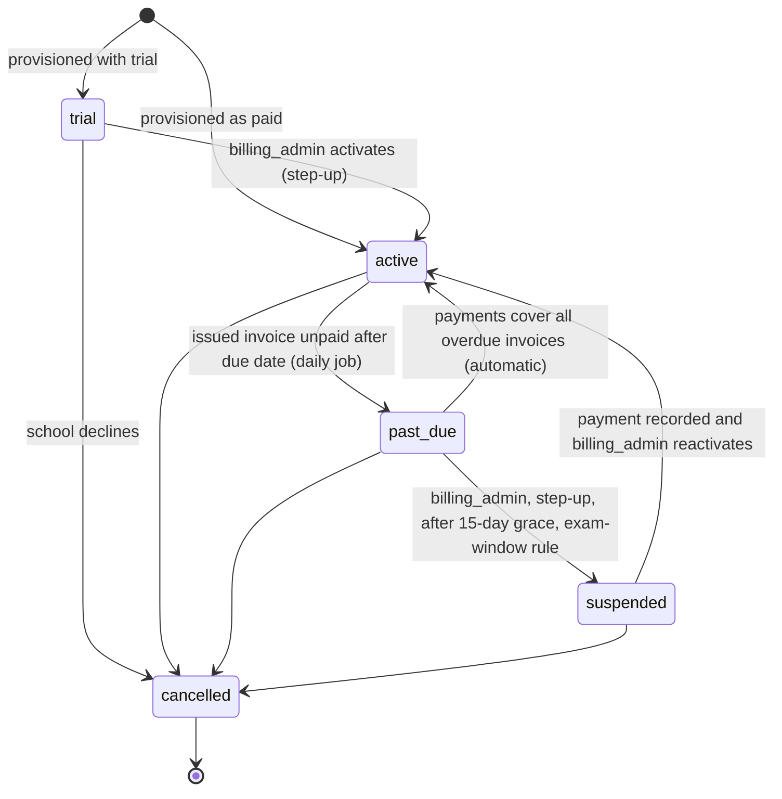

# 16 · Platform Admin Panel (control plane)

| Field | Value |
|---|---|
| Version | 0.6 · 2026-09-28 |
| Changes | 0.6: invoice PDFs (M1): template v0 **pending CA review**, render on the `pdf` queue, control-plane storage, download route, `platform.invoice_pdfs` (migration `0029_invoice_pdfs`), audit events, open questions Q11-Q13 (§1, §5.8, §5.8.1, §7, §8.1, §16, §18, §19; FR-PLT-016, FR-PLT-017). 0.5: provisioning is a persisted, resumable state machine (`platform.provisioning_runs`, migration `0020_provisioning_runs`): request fingerprint, lease, failed state, `provisioning:resume`, go-live refused until provisioning completed (§5.3, §5.4, §7, §8.1, §16, §18; FR-PLT-002). 0.4: product decisions of 2026-09-27: suspended schools keep an allowlist of routes for the owner and principal (§5.5); school-chain copies of platform actions go through `platform.tenant_audit_outbox` and are delivered exactly once (§5.4, §16, §17; ADR-0020). 0.3: matches the M0 implementation: provisioning steps (§5.4), catalog files and `is_platform` (§6), DDL from `0005_platform` incl. `usage_threshold_events`, `breakglass_requests`, `plans.trial_days`, `deployments.boards`/`heartbeat_rotation_started_at`, `subscriptions.cancel_at_period_end`, `job_runs.created_by` (§7), route catalog reconciled with `apps/api/openapi.json` (§8), heartbeat check order (§12.2), audit events and the school-chain limitation (§16), Q2/Q6/Q8 settled (§19). 0.2: new document |
| Capability | C14 · Milestone M0 (roadmap Task 11) |
| Requirements | FR-PLT-001..030 (03-TRD §3.12) · stories US-1301..US-1310, US-1204 (02-PRD §4) |
| Decisions | ADR-0013 (privilege separation), ADR-0015 (tiers), ADR-0016 (payments, Proposed), ADR-0017 (architecture), ADR-0020 (control-plane boundaries, guaranteed audit copies), ADR-0023 (operator sign-in for break-glass, Proposed), ADR-0024 (resumable provisioning, Proposed) |
| Related | 04 §16, 05 §3, 07 §6.5–6.6, 08 §14, 09 §4, 10 §15, 11 §11–12, 12 §4.8–4.13 |

---

## 1. Purpose and scope

The platform admin panel is the **control plane** of SchoolOS: the tool our own team uses to run the business and the fleet. It lets operators:

- provision schools on the shared tier or on a dedicated host, and suspend, reactivate or offboard them;
- manage plans, subscriptions, billing accounts, invoices and (manual) payments;
- see usage against plan limits, fleet health and AI spend;
- run feature flags and announcements;
- handle support tickets and see break-glass requests;
- manage operator accounts and read the platform audit log.

It **never shows student data**. Everything it shows about a school is the school's name, plan, status, deployment, counts and IDs.

The control plane runs **only in the shared deployment** (ADR-0015). On a dedicated host (`SOS_DEPLOYMENT_MODE=dedicated`) its routes and screens are not mounted.

Out of scope for M0: online payment collection (ADR-0016, Proposed), invoice PDFs (built in M1, template v0 pending CA review; §5.8.1), credit notes, self-serve sign-up, the break-glass *workflow* (M1; the panel only lists requests in M0).

## 2. Personas (platform operator team)

Operators are SchoolOS staff, not school users. One person may hold several roles; at Stage 0 the founder holds `platform_owner`.

| Role key | Who | Typical jobs |
|---|---|---|
| `platform_owner` | Founder / director | Everything; approves risky actions; second person for offboarding and emergency break-glass |
| `platform_engineer` | Engineer on call | Provision schools and dedicated hosts, run flags, watch the fleet, suspend for security reasons |
| `support_agent` | Support staff | Answer school tickets, post announcements, request break-glass access |
| `billing_admin` | Accounts / billing staff | Plans, subscriptions, invoices, recording payments, billing suspension |
| `platform_viewer` | Read-only (e.g., reviewer, auditor, new joiner) | Read every screen; change nothing |

`platform_support` is a different thing: the *tenant-side* temporary role used by break-glass inside a school (07 §6.4). Holding a platform role gives no access to any school's data.

## 3. Principles

1. **No standing access to school data (BR-09).** The panel works with counts, statuses and IDs. The database enforces this: the control plane connects as `sos_platform`, which has no privileges on `core`, `sis`, `kb`, `audit` or `ops` tables (ADR-0013; SEC-026).
2. **Narrow bridges only.** The control plane touches tenant data only through the allowlisted definer functions (05 §3.4). Adding a bridge needs an ADR.
3. **Everything is audited** in the hash-chained platform log, in the same transaction as the action. Actions that change a school also appear in the school's own audit log.
4. **Step-up for risk, two people for the irreversible.** ᴿ permissions need MFA within 5 minutes; offboarding and emergency break-glass need a second operator (SEC-027, SEC-029).
5. **Nothing punitive happens automatically.** Suspension is always a human decision with a reason, never during board exam windows without `platform_owner` approval.
6. **Money is exact.** `numeric(14,2)` INR, issued invoices are immutable, invoice numbers are gapless per financial year.
7. **Same codebase, same rules.** Same stack, i18n (`en`, `te`), accessibility, logging and error conventions as the school app.

## 4. Where it runs

| Aspect | Decision |
|---|---|
| Module | `apps/api/app/platform/` (ADR-0017); billing is part of it |
| API routes | `/api/v1/platform/*` with `require_platform("platform.<…>")`; heartbeat `POST /api/v1/fleet/heartbeat` with `require_fleet_signature()` |
| DB access | `core.db.platform_session()` as `sos_platform` (`SOS_PLATFORM_DATABASE_URL`). Exceptions (ADR-0013 Amendment A10): `tenant_session()` for school-chain audit events (§16), the school-side routes (§8.3) and the daily active-user count (§11); `app.tenancy.service` wrappers for the definer functions |
| Web | Next.js route group `/[locale]/platform/*`; production host `admin.<domain>`; own `__Host-sos_platform_session` cookie; BFF handlers mirror API paths |
| Identity | Separate OIDC client (`SOS_PLATFORM_OIDC_ISSUER`, `SOS_PLATFORM_OIDC_AUDIENCE`; web `PLATFORM_OIDC_CLIENT_ID/SECRET`); reference setup: a separate Cognito user pool with MFA ON and the `sos:mfa` claim (ADR-0018); MFA mandatory for every operator |
| Jobs | Shared `worker`/`beat`; progress in `platform.job_runs` |
| Dedicated hosts | Routers and web route group not mounted; platform beat schedules not registered |

Operator session rules: idle timeout 15 minutes, absolute 8 hours, step-up window 5 minutes, no "remember this device" for step-up.

## 5. Features and screens

Each screen lists the permission needed to see it; actions list their own permission. Screens are usable at 1366×768 and by keyboard.

### 5.1 Dashboard
*Permission:* any platform role; each tile appears only if the operator holds its read permission.

| Tile | Content | Source |
|---|---|---|
| MRR / ARR | Monthly recurring revenue: sum of monthly-equivalent subscription prices (annual ÷ 12) for `active` and `past_due` subscriptions, excluding GST and trials; ARR = MRR × 12 | `subscriptions`, `plans` |
| Schools | Counts by tenant status (active, suspended, offboarding) and tier (shared, dedicated) | `deployments` |
| Trials | Trials running; trials ending in the next 14 days | `subscriptions` |
| Past due | Count and amount outstanding; oldest overdue invoice | `invoices` |
| Fleet health | Deployments by status (healthy, degraded, unreachable); version skew | `deployments` |
| AI spend | Month-to-date AI cost (INR) overall and top 5 schools vs their allowance | `usage_daily` |
| Open tickets | By priority; SLA breaches | `support_tickets` |

### 5.2 Schools list
*Permission:* `platform.tenants.read`. Columns: school name, code, tier, plan, subscription status, tenant status, deployment status, version (dedicated), students (count), last heartbeat (dedicated), open tickets. Filters: status, tier, plan, "trial ending", "past due", search by name/code. No student names anywhere.

### 5.3 School detail
*Permission:* `platform.tenants.read`. Tabs:
- **Overview:** code, name, boards, state, tier, tenant status (with reason and who changed it), created date, owner invite status (sent/accepted; email masked), provisioning state (`provisioning`: state, failed step and error code, attempts, `in_progress`, `resumable`; a **Resume provisioning** action when resumable).
- **Plan & subscription** (`platform.subscriptions.read`): plan and version, status, period, trial end, price override and reason, pending plan change.
- **Billing account** (`platform.subscriptions.read` or `platform.invoices.read`): legal name, GSTIN, billing email, address, state code.
- **Invoices** (`platform.invoices.read`): list with number, period, total, paid, status.
- **Usage** (`platform.usage.read`): 90-day chart of daily aggregates vs plan limits.
- **Deployment** (`platform.fleet.read`): mode, region, host, domain, version, last heartbeat, backup status.
- **Flags** (`platform.flags.read`): effective flags and per-school overrides.
- **Tickets** (`platform.support.read`).
- **Activity** (`platform.audit.read`): platform audit events for this school.

### 5.4 Provision school
*Permission:* `platform.tenants.provision` (ᴿ). A wizard:

1. **School:** name, short code (slug, unique), boards, state (default AP), preferred languages.
2. **Tier:** shared or dedicated. For dedicated: region (ap-south-1), optional custom domain.
3. **Owner** (shared tier, required): display name, optional email, language, and the owner's sign-in subject in the staff user pool (the account is created there first). Stored only for the invite.
4. **Plan:** plan and version; trial (length from the plan's `trial_days`, default 30) or active; optional negotiated price with reason.
5. **Billing account:** legal name, GSTIN (optional), billing email, address, state code.
6. **Review and confirm** (step-up).

Result for **shared** (`app/platform/provisioning.py`). The steps run in different sessions (control plane, then the school's own `tenant_session`) and cannot share one transaction, so every provisioning is a persisted state machine in `platform.provisioning_runs` (one row per school; §7):

```
registered --(2: keys + roles)--> initialised --(3: owner invite + school-chain event)--> completed
     |                                 |
     +------------- a step fails ------+--> failed --(resume)--> continues from the failed step
```

1. **Register**, one `platform_session()` transaction: `core.provision_tenant(...)` (tenant row, status `provisioning`), deployment, billing account, subscription (and, when started as `active`, the first period's draft invoice), platform event `tenant.provisioned` and the run (`registered`, holding this request's lease, the request fingerprint and the owner invite parameters). A failure leaves none of them.
2. **Initialise**: `tenancy.initialise_tenant` in the new school's own `tenant_session`: KMS (or the local-dev wrapper) generates and wraps the DEK and HMAC key into `core.tenant_keys`; post-provision hooks clone the system roles from `apps/api/app/authz/roles.yaml`. Keys and hooks share that transaction; an existing key is kept, and concurrent calls for one school are serialised (advisory lock), so a retry never creates a second key. The run becomes `initialised`.
3. **Invite and finish**, one platform transaction: `core.create_owner_invite(...)` (public wrapper `platform.service.invite_school_owner(platform_db, tenant_id=, subject=, display_name=, email=, language=)`: an `invited` owner membership with `mfa_required`, school scope and the `owner` role; platform event `tenant.owner_invite_created`), `tenant.provisioned` queued for the school's own audit chain (`actor_type = 'platform'`; delivered exactly once, §16) and the run `completed` with the owner parameters cleared. All or nothing, so the school-chain event is queued once.

**Idempotency, retries and failures** (FR-PLT-002):

- **Same request again.** The run stores a SHA-256 fingerprint of the request. Submitting the same request again, with any `Idempotency-Key` and by any operator, resumes an unfinished provisioning or replays a finished one (`201`, same school; `owner_invite = existing`). The same code with a different request is `409 duplicate`. Retrying with the same `Idempotency-Key` still replays from the 24-hour key store (§8).
- **Double submit.** Two concurrent submissions create one school: the second waits on the code's unique index, then finds the run and either replays it or gets `409 provisioning_in_progress`.
- **Lease.** One runner at a time holds the run's lease (`provisioning.lease_seconds` in `apps/api/app/platform/billing.yaml`, 120 s); every state change is fenced on it, so a runner that lost its lease cannot change the run. While a lease is live other attempts get `409 provisioning_in_progress`. A crashed process leaves its lease to expire; the next attempt takes over.
- **Failed.** A step that raises marks the run `failed` with `failed_step` (`initialise` or `owner_invite`) and an error code (never a message), releases the lease and records `tenant.provisioning_failed`; the request gets `503 provisioning_failed` (or the step's own domain error). The school detail shows it. An operator resumes it with `POST /platform/tenants/{id}/provisioning:resume` (no body: the owner invite parameters are kept in the run until the invite exists) or by submitting the same request again; each resume records `tenant.provisioning_resumed`.
- **Go-live guard.** `POST /platform/tenants/{id}/activate` is refused with `409 provisioning_incomplete` until the run is `completed` (keys alone would satisfy the database).
- **Before `0020`.** Schools provisioned earlier got a backfilled run: `completed` when the platform log has `tenant.owner_invite_created` (or the school is dedicated), otherwise `registered` without fingerprint or owner parameters. Such a run resumes only from the same request again (same code, tier and school name; the owner comes from the request); `provisioning:resume` answers `409 resume_needs_request`.

The owner accepts the invite on first sign-in (`POST /api/v1/me/accept-invitations`, ADR-0019) once the school is `active`; an operator makes it live with `POST /platform/tenants/{id}/activate` (refused until provisioning completed, and by the database until a data key exists). Invite **email delivery is not built yet** (`owner-invite:resend` only records `tenant.owner_invite_sent`).

Result for **dedicated**: the deployment row (`status = provisioning`), billing account, subscription, a new heartbeat key and a `completed` run are created in one control-plane transaction; the tenant row itself is created **on the host** by the provisioning runbook (§13) with the tenant ID chosen here. The heartbeat key is returned once in the `201` response (`heartbeat_key_id`, `heartbeat_key`) and never again: submitting the same request again replays the result without it (rotate the key if the first response was lost).

### 5.5 Suspend, reactivate, offboard
- **Suspend (non-billing)** — `platform.tenants.suspend` (ᴿ): reason required (security incident, abuse, school's written request). Calls `core.set_tenant_status(tenant, 'suspended')` for shared; for dedicated, the engineer runs the fleet command (§13.3). Billing suspensions go through the subscription (§5.7).
- **Reactivate** — same permission and step-up; reason required. A billing suspension is lifted from the subscription instead (`409 billing_suspension`).
- **Activate (go-live)** — `platform.tenants.provision` (ᴿ): `provisioning → active` through `core.set_tenant_status`, which refuses a tenant without an unretired data key.
- **What suspension does** (decided 2026-09-27; BR-08, FR-PLT-004): while a school is `suspended` (and also while it is `offboarding`), the school's **owner and principal** may still use only these routes, and every other school route answers `403 tenant_suspended` for every role. The problem detail says in plain language that Plan & billing and the data export remain available to the owner and principal. The allowlist is one explicit list of (method, route template, roles), `SUSPENDED_SCHOOL_ALLOWLIST` in `apps/api/app/authz/resolver.py`, pinned by `tests/authz/test_suspended_allowlist.py` and an enumeration over every school route (`tests/api/test_suspended_school.py`). The route permission still applies on top (for example `tenant.billing.read`).

  | Method | Route | Why |
  |---|---|---|
  | GET | `/api/v1/me` | Who am I in this school |
  | POST | `/api/v1/me/active-tenant` | Choose the suspended school (users with several schools) |
  | POST | `/api/v1/me/login-event` | Sign-in event (`auth.login.succeeded`); other roles get `auth.login.denied` with reason `tenant_suspended` |
  | GET | `/api/v1/tenant/billing`, `/api/v1/tenant/billing/invoices` | Plan & billing (FR-PLT-030) |
  | — | full data export (FR-ADM-001, not built yet) | Added to the allowlist with one line when the route exists |

  `GET /me/schools` and `POST /me/accept-invitations` never resolve a school and are not affected; `/me/schools` reports the school's `status`, which the web app uses to show the suspended banner. No data is deleted. Scheduled tenant jobs pause, except audit verification and retention purges.
- **Offboard** — `platform.tenants.offboard` (ᴿ, **two-person**): operator A records the request (reason, reference to the school's written request); operator B (a different operator holding the permission) approves with step-up. Then: tenant status `offboarding` → school confirms it has its export (or the export is delivered by us per R8) → access disabled → deletion job removes tenant data **within 30 days** → wrapped keys destroyed (crypto-shredding; for dedicated, the host's KMS key is scheduled for deletion and the host destroyed) → certificate of deletion issued → status `deleted`. Invoices and the billing account stay in `platform` as business records (retention in 08 §14).

### 5.6 Plans and pricing
*Permission:* read with `platform.subscriptions.read`; change with `platform.plans.manage` (ᴿ).
Fields: code, version, name, tier, billing period (monthly/annual), pricing model (flat or per student), base price (INR), per-student price, included students, GST rate (default 18%), SAC code, limits (students, staff users, storage GB, documents, AI tokens per month), included features (flag defaults). Plans are **versioned**: a published plan's prices and limits never change; editing creates a new draft version. Retiring a plan stops new subscriptions; existing ones continue.

### 5.7 Subscriptions
*Permission:* read `platform.subscriptions.read`; actions `platform.subscriptions.manage` (ᴿ).
List with filters by status. Actions: activate (trial → active), extend trial, change plan (takes effect at the next period; no proration in M0), set or clear a negotiated price (reason required), **suspend** (only from `past_due` after the grace period, §9), reactivate, cancel. The screen shows whether today falls inside a protected board-exam window (§9.3).

### 5.8 Invoices and billing accounts
*Permission:* read `platform.invoices.read`; actions `platform.invoices.manage`.
- **Invoice list:** number, school, period, issue date, due date, total, paid, status; filters by status, financial year, school.
- **Invoice detail:** supplier and recipient blocks (legal names, GSTINs, addresses, place of supply), lines (description, SAC, quantity, unit price, amount), taxable value, CGST/SGST or IGST, total, payments, balance due.
- **Actions:** edit draft lines; discard draft; **issue** (assigns the next number, freezes the invoice); **void** (issued, unpaid; reason required; number is kept); record payment (§5.9); **download PDF** of any numbered invoice (§5.8.1).
- **Billing account** (edit with `platform.subscriptions.manage`, ᴿ): legal name, GSTIN (validated format; its first two digits must match the state code), PAN (optional), billing email, billing contact name and phone, address, district, PIN code, state code, PO reference. Changes apply to future invoices only; issued invoices keep their snapshot.

### 5.8.1 Invoice PDFs (M1)

> **Template v0: pending CA review** (§19 Q2, Q3, Q11-Q13). The layout, wording, SAC code and number format must be confirmed by the supplier's chartered accountant before the first paid invoice. The marker lives here and in `billing.yaml`, never on the PDF. Synthetic samples for the CA, rendered from the same template and renderer settings: [`samples/invoice-template-v0-sample.pdf`](samples/invoice-template-v0-sample.pdf) and its HTML [`samples/invoice-template-v0-sample.html`](samples/invoice-template-v0-sample.html) (synthetic supplier and school; intra-state CGST + SGST, a per-student line and a discount).

- **What is printed** (CGST Rule 46): title "Tax Invoice"; supplier legal name, registered address (`SOS_BILLING_SUPPLIER_ADDRESS`, `;` separates lines) and GSTIN; invoice number (at most 16 characters) and date, due date, service period; recipient (the school's billing entity) legal name, address and GSTIN ("Unregistered" when empty); state codes with names and the place of supply; per line: description, SAC, quantity, rate, GST rate, taxable value; taxable value, CGST + SGST (intra-state) or IGST (inter-state) with the rate, total; amount in words (Indian system); "tax payable on reverse charge: No"; invoice notes; a zero-rate note when every line has GST 0 (§19 Q3); a signatory block; "computer-generated invoice". A4 portrait, bundled font, JavaScript off, no network (ADR-0025). **English only** (a tax document for the school's accounts office; the panel itself stays bilingual, §3 principle 7; Telugu labels are Q12). No student data: only the invoice snapshot taken at issue (supplier, billing entity, lines, totals).
- **When:** every numbered invoice (issued, paid or void) gets exactly one PDF. The beat task `billing.render_invoice_pdfs` (every minute, queue `pdf`, the Chromium workers) renders those without one, oldest first, 20 per run; a failure is logged (IDs and error type) and retried on the next run. The worker refuses to render in staging/prod while the supplier address is the dev placeholder. Drafts never have a PDF.
- **Idempotent per invoice:** `platform.invoice_pdfs` (primary key `invoice_id`) records template version, object key, SHA-256 and size in the same transaction as `invoice.pdf_rendered`. Each render writes its own object; a render that loses the insert deletes its object. The table is append-only (`sos_platform` has SELECT and INSERT only; a trigger refuses UPDATE, DELETE and TRUNCATE). A voided invoice keeps its original PDF (the list shows the void).
- **Where:** the control-plane bucket/prefix `platform/invoices/<financial_year>/<invoice_id>/<render_id>.pdf` (`SOS_PLATFORM_INVOICE_BUCKET`, default the files bucket), never under a school prefix, so offboarding keeps invoices as business records (ADR-0017 Amendment 2026-09-28).
- **Download:** `GET /platform/invoices/{id}/download-url` (`platform.invoices.read`): a presigned GET of at most 5 minutes with `Content-Disposition: attachment` and the file name `invoice-SOS-26-27-000123.pdf`; `409 invoice_draft` for a draft, `409 invoice_pdf_pending` until rendered, 404 for an unknown ID; audited as `invoice.pdf_downloaded`. Emailing PDFs to schools and the school-side download are not built yet (no email delivery; §5.18).

### 5.9 Payments
*Permission:* `platform.invoices.manage`.
M0 has one provider, `manual`: a billing admin records a payment against an issued invoice: method (bank transfer, UPI, cheque, other), amount, received date, reference (UTR, UPI reference or cheque number), TDS deducted by the school (if any), notes. Partial payments are allowed. The invoice becomes `paid` when payments plus TDS cover the total. A payment recorded in error is **reversed** with a reason, never deleted. Online collection (Razorpay candidate) is ADR-0016 and is not built.

### 5.10 Usage and quotas
*Permission:* `platform.usage.read`.
Daily aggregates per school: active users, staff users, active students, storage, documents, AI queries, AI tokens and AI cost. Each metric shows its plan limit and a bar at 80% and 100%. Crossing 80% or 100% (once per metric per billing period) notifies operators (dashboard + daily email digest) and emails the school's billing contact. **Limits never block school work** in M0; the only automatic limit is the existing AI budget, which degrades Ask to search-only (FR-KB-011).

### 5.11 Feature flags
*Permission:* read `platform.flags.read`; change `platform.flags.manage` (ᴿ).
Global flags (on/off with optional % rollout) and per-school overrides. The school app reads flags from `platform.feature_flags` (its only grant on the `platform` schema). Evaluation: a school override wins; otherwise the global value, and for a % rollout the school is in when `hash(flag_key, tenant_id) mod 100 < rollout_percent`. Every change is audited with before/after values.

### 5.12 Fleet
*Permission:* read `platform.fleet.read`; change `platform.fleet.manage` (ᴿ).
One row per deployment: school, mode, region, host (EC2 instance ID), hostname and custom domain, running version, target version, last heartbeat, status, backup status, TLS certificate expiry. Actions: set target version, set or change custom domain, rotate heartbeat key, mark decommissioned. Details in §12.

### 5.13 Announcements
*Permission:* `platform.announcements.manage` (viewing needs any platform role).
Bilingual banners (English and Telugu title and body are both required), severity (info, maintenance, warning, critical), audience (all schools, one tier, or listed schools), start and end time (IST shown, UTC stored). Delivery in §14.

### 5.14 Support tickets
*Permission:* read `platform.support.read`; act `platform.support.manage`.
Queue with SLA timers, filters by status, priority, school, assignee. Ticket view: subject, category, messages, internal notes, status history. Details in §15.

### 5.15 Break-glass requests
*Permission:* `platform.breakglass.request` to create (M1); any platform role to view the list.
M0 shows the list and status of requests (requested, approved, active, expired, revoked, denied) with school, reason, scope and times. The approval workflow lives in the school app (07 §6.4) and arrives in M1. Emergency access without school approval needs `platform.breakglass.emergency` (ᴿ, two-person) and is reported to the school within 24 hours. **Using an active grant** ([ADR-0023](adr/ADR-0023-operator-sign-in-for-break-glass-across-user-pools.md) option C): for an `active` request the list offers **Open the school (support sign-in)**, a link to `/bff/auth/support/login?request=<request id>&tenant=<school id>`. The operator signs in again (MFA, fresh sign-in) with the support app client of the operator pool; the school app shows a read-only "SchoolOS support" banner and a sign-out button. The session start is recorded as `breakglass.session_started` in both chains. A host without the support client (`SOS_SUPPORT_OIDC_AUDIENCE` / `SUPPORT_OIDC_CLIENT_ID` unset) keeps the grant unusable (fail closed).

### 5.16 Operators and roles
*Permission:* `platform.operators.manage` (ᴿ).
Invite (email, name, roles), resend invite, assign or remove roles, deactivate. An operator cannot change their own roles. At least one active `platform_owner` must remain. Operators must enrol MFA before first use.

### 5.17 Platform audit log
*Permission:* `platform.audit.read`.
Filter by operator, action, school, date; export CSV; **Verify chain** runs the verification job and shows the result (first bad sequence number if any).

### 5.18 School-side "Plan & billing" page (FR-PLT-030)
In the **school** app, for holders of `tenant.billing.read` (owner, principal, accountant): current plan, status, period, trial end; usage vs limits (latest daily aggregates); invoices list (number, period, total, status, amount due). Data comes from `core.current_subscription()`, which returns only the current tenant's own records. On a dedicated host the page shows the summary delivered in the heartbeat response (§12.4); until that lands (M1), it shows plan name and a note that invoices are sent by email.

## 6. Permissions

Catalog: the `platform.*` entries of `apps/api/app/authz/permissions.yaml` (descriptions, sensitivity, step-up; `is_platform: true`) plus the role matrix and two-person list in `apps/api/app/platform/roles.yaml`. The platform authz tests are generated from them and pin this table (it must stay identical to 07 §6.5). Platform permissions exist in `core.permissions` with `is_platform = true` but can never be granted to tenant roles (CHECK ties the flag to the `platform.` prefix; trigger `role_permissions_not_platform`); platform roles are not `core.roles` rows. ᴿ = step-up MFA within 5 minutes. **2P** = two different operators.

| Permission | platform_owner | platform_engineer | support_agent | billing_admin | platform_viewer |
|---|---|---|---|---|---|
| `platform.tenants.read` | ✓ | ✓ | ✓ | ✓ | ✓ |
| `platform.tenants.provision` ᴿ | ✓ | ✓ | — | — | — |
| `platform.tenants.suspend` ᴿ | ✓ | ✓ | — | — | — |
| `platform.tenants.offboard` ᴿ 2P | ✓ | — | — | — | — |
| `platform.plans.manage` ᴿ | ✓ | — | — | ✓ | — |
| `platform.subscriptions.read` | ✓ | — | — | ✓ | ✓ |
| `platform.subscriptions.manage` ᴿ | ✓ | — | — | ✓ | — |
| `platform.invoices.read` | ✓ | — | — | ✓ | ✓ |
| `platform.invoices.manage` | ✓ | — | — | ✓ | — |
| `platform.flags.read` | ✓ | ✓ | — | — | ✓ |
| `platform.flags.manage` ᴿ | ✓ | ✓ | — | — | — |
| `platform.usage.read` | ✓ | ✓ | ✓ | ✓ | ✓ |
| `platform.fleet.read` | ✓ | ✓ | ✓ | — | ✓ |
| `platform.fleet.manage` ᴿ | ✓ | ✓ | — | — | — |
| `platform.announcements.manage` | ✓ | — | ✓ | — | — |
| `platform.support.read` | ✓ | ✓ | ✓ | — | ✓ |
| `platform.support.manage` | ✓ | — | ✓ | — | — |
| `platform.breakglass.request` | ✓ | ✓ | ✓ | — | — |
| `platform.breakglass.emergency` ᴿ 2P | ✓ | — | — | — | — |
| `platform.operators.manage` ᴿ | ✓ | — | — | — | — |
| `platform.audit.read` | ✓ | ✓ | — | — | ✓ |

Notes:
- Two-person permissions held only by `platform_owner` mean **at least two active owners** are needed to offboard a school or use emergency break-glass (see §19, Q1).
- Suspending a subscription inside a protected exam window additionally needs a `platform_owner` approval recorded on the action (§9.3).

## 7. Data model (schema `platform`)

Rules for this schema:
- Owned by `sos_owner`; DML granted to `sos_platform` only, through default privileges (audit tables: events SELECT + INSERT, head SELECT + UPDATE). `sos_app` has only `SELECT` on `platform.feature_flags`. `sos_definer` gets `SELECT` on the tables `core.current_subscription()` reads (`plans`, `subscriptions`, `invoices`, `usage_daily`).
- No RLS (no student data; not tenant-owned). `tenant_id` columns here are plain references to `core.tenants.id`; there is no cross-schema FK because dedicated schools' tenant rows live on their own hosts.
- No personal data about students. Personal data here is limited to operators and school billing/support contacts (08 §14).
- Money is `numeric(14,2)` in INR. Dates of business meaning (`period_start`, `issue_date`) are IST calendar dates; timestamps are `timestamptz` UTC.
- `platform.audit_events` and `platform.audit_chain_head` are created by `0002_audit` (DDL in [05 §7.1](05-data-model.md#71-audit-adr-0011-as-amended-by-adr-0013)); everything else below by `0005_platform`, verbatim.

```sql
-- Schema, USAGE and default privileges come from infra/db/bootstrap.sql (05 §3.1):
--   GRANT USAGE ON SCHEMA platform TO sos_app, sos_platform, sos_definer;
--   ALTER DEFAULT PRIVILEGES FOR ROLE sos_owner IN SCHEMA platform
--     GRANT SELECT, INSERT, UPDATE, DELETE ON TABLES TO sos_platform;

CREATE TABLE platform.operators (
  id              uuid PRIMARY KEY,
  idp_subject     text UNIQUE CHECK (char_length(idp_subject) BETWEEN 1 AND 255),
  email           public.citext NOT NULL UNIQUE,
  display_name    text NOT NULL CHECK (char_length(display_name) BETWEEN 1 AND 200),
  status          text NOT NULL CHECK (status IN ('invited','active','deactivated')),
  mfa_enrolled    boolean NOT NULL DEFAULT false,
  invited_by      uuid REFERENCES platform.operators(id),
  created_at      timestamptz NOT NULL DEFAULT now(),
  last_login_at   timestamptz,
  deactivated_at  timestamptz,
  updated_at      timestamptz NOT NULL DEFAULT now(),
  version         int NOT NULL DEFAULT 1 CHECK (version >= 1),
  CONSTRAINT operators_deactivated_at CHECK ((status = 'deactivated') = (deactivated_at IS NOT NULL)),
  CONSTRAINT operators_active_needs_mfa
    CHECK (status <> 'active' OR (idp_subject IS NOT NULL AND mfa_enrolled))
);

CREATE TABLE platform.operator_roles (
  operator_id  uuid NOT NULL REFERENCES platform.operators(id),
  role_key     text NOT NULL CHECK (role_key IN
                 ('platform_owner','platform_engineer','support_agent','billing_admin',
                  'platform_viewer')),
  granted_by   uuid REFERENCES platform.operators(id),
  granted_at   timestamptz NOT NULL DEFAULT now(),
  PRIMARY KEY (operator_id, role_key),
  CONSTRAINT operator_roles_no_self_grant CHECK (granted_by IS NULL OR granted_by <> operator_id)
);

CREATE TABLE platform.plans (
  id                     uuid PRIMARY KEY,
  code                   text NOT NULL CHECK (code ~ '^[a-z0-9][a-z0-9-]{1,40}$'),
  version                int  NOT NULL CHECK (version >= 1),
  name                   text NOT NULL CHECK (char_length(name) BETWEEN 1 AND 100),
  tier                   text NOT NULL CHECK (tier IN ('shared','dedicated')),
  billing_period         text NOT NULL CHECK (billing_period IN ('monthly','annual')),
  pricing_model          text NOT NULL CHECK (pricing_model IN ('flat','per_student')),
  base_price_inr         numeric(14,2) NOT NULL CHECK (base_price_inr >= 0),
  per_student_price_inr  numeric(14,2) CHECK (per_student_price_inr >= 0),
  included_students      int CHECK (included_students >= 0),
  gst_rate               numeric(5,2) NOT NULL DEFAULT 18.00 CHECK (gst_rate IN (0, 5, 12, 18, 28)),
  sac_code               text NOT NULL CHECK (sac_code ~ '^[0-9]{6}$'),
  trial_days             int NOT NULL DEFAULT 30 CHECK (trial_days BETWEEN 0 AND 365),
  limits                 jsonb NOT NULL DEFAULT '{}' CHECK (jsonb_typeof(limits) = 'object'),
  features               jsonb NOT NULL DEFAULT '{}' CHECK (jsonb_typeof(features) = 'object'),
  status                 text NOT NULL CHECK (status IN ('draft','published','retired')),
  published_at           timestamptz,
  created_by             uuid NOT NULL REFERENCES platform.operators(id),
  created_at             timestamptz NOT NULL DEFAULT now(),
  updated_at             timestamptz NOT NULL DEFAULT now(),
  UNIQUE (code, version),
  CONSTRAINT plans_per_student_price
    CHECK ((pricing_model = 'per_student') = (per_student_price_inr IS NOT NULL)),
  CONSTRAINT plans_published_at CHECK ((status = 'draft') = (published_at IS NULL))
);

CREATE TABLE platform.billing_accounts (
  id                    uuid PRIMARY KEY,
  tenant_id             uuid NOT NULL UNIQUE,
  legal_name            text NOT NULL CHECK (char_length(legal_name) BETWEEN 1 AND 200),
  gstin                 text CHECK (gstin ~ '^[0-9]{2}[A-Z]{5}[0-9]{4}[A-Z][1-9A-Z]Z[0-9A-Z]$'),
  pan                   text CHECK (pan ~ '^[A-Z]{5}[0-9]{4}[A-Z]$'),
  billing_email         public.citext NOT NULL,
  billing_contact_name  text,
  billing_phone         text CHECK (billing_phone ~ '^\+?[0-9]{10,13}$'),
  address_line1         text NOT NULL,
  address_line2         text,
  city                  text NOT NULL,
  district              text,
  postal_code           text NOT NULL CHECK (postal_code ~ '^[1-9][0-9]{5}$'),
  state_code            text NOT NULL CHECK (state_code ~ '^[0-9]{2}$'),
  po_reference          text,
  created_at            timestamptz NOT NULL DEFAULT now(),
  updated_at            timestamptz NOT NULL DEFAULT now(),
  version               int NOT NULL DEFAULT 1 CHECK (version >= 1),
  CONSTRAINT billing_accounts_gstin_state CHECK (gstin IS NULL OR substr(gstin, 1, 2) = state_code),
  CONSTRAINT billing_accounts_gstin_pan
    CHECK (gstin IS NULL OR pan IS NULL OR substr(gstin, 3, 10) = pan)
);

CREATE TABLE platform.deployments (
  id                        uuid PRIMARY KEY,
  tenant_id                 uuid NOT NULL UNIQUE,
  tenant_code               text NOT NULL UNIQUE CHECK (tenant_code ~ '^[a-z][a-z0-9-]{1,31}$'),
  school_name               text NOT NULL CHECK (char_length(school_name) BETWEEN 1 AND 200),
  boards                    text[] NOT NULL DEFAULT '{}',
  mode                      text NOT NULL CHECK (mode IN ('shared','dedicated')),
  region                    text NOT NULL DEFAULT 'ap-south-1' CHECK (region = 'ap-south-1'),
  backup_region             text NOT NULL DEFAULT 'ap-south-2' CHECK (backup_region = 'ap-south-2'),
  host_ref                  text CHECK (host_ref ~ '^i-[0-9a-f]{8,17}$'),
  hostname                  text CHECK (hostname ~ '^[a-z0-9.-]{1,253}$'),
  custom_domain             public.citext UNIQUE CHECK (custom_domain ~ '^[a-z0-9.-]{1,253}$'),
  tenant_status             text NOT NULL CHECK (tenant_status IN
                              ('provisioning','active','suspended','offboarding','deleted')),
  tenant_status_reason      text,
  status                    text NOT NULL CHECK (status IN
                              ('provisioning','healthy','degraded','unreachable','decommissioned')),
  app_version               text,
  target_version            text,
  last_heartbeat_at         timestamptz,
  last_heartbeat            jsonb,
  heartbeat_key_id          text,
  heartbeat_key_ciphertext  bytea,
  heartbeat_next_key_id     text,
  heartbeat_next_key_ciphertext bytea,
  heartbeat_rotation_started_at timestamptz,
  offboard_requested_by     uuid REFERENCES platform.operators(id),
  offboard_requested_at     timestamptz,
  offboard_reason           text,
  offboard_approved_by      uuid REFERENCES platform.operators(id),
  offboard_approved_at      timestamptz,
  deletion_certificate_ref  text,
  created_at                timestamptz NOT NULL DEFAULT now(),
  updated_at                timestamptz NOT NULL DEFAULT now(),
  version                   int NOT NULL DEFAULT 1 CHECK (version >= 1),
  CONSTRAINT deployments_shared_has_no_host
    CHECK (mode = 'dedicated' OR (host_ref IS NULL AND custom_domain IS NULL
                                  AND heartbeat_key_id IS NULL)),
  CONSTRAINT deployments_dedicated_has_key
    CHECK (mode = 'shared' OR status = 'decommissioned' OR heartbeat_key_ciphertext IS NOT NULL),
  CONSTRAINT deployments_key_pair CHECK ((heartbeat_key_id IS NULL) = (heartbeat_key_ciphertext IS NULL)),
  CONSTRAINT deployments_next_key_pair
    CHECK ((heartbeat_next_key_id IS NULL) = (heartbeat_next_key_ciphertext IS NULL)),
  CONSTRAINT deployments_rotation_started
    CHECK ((heartbeat_next_key_id IS NULL) = (heartbeat_rotation_started_at IS NULL)),
  CONSTRAINT deployments_offboard_request
    CHECK ((offboard_requested_by IS NULL) = (offboard_requested_at IS NULL)),
  CONSTRAINT deployments_offboard_approved_at
    CHECK ((offboard_approved_by IS NULL) = (offboard_approved_at IS NULL)),
  -- SEC-029: two different operators request and approve offboarding.
  CONSTRAINT deployments_offboard_two_person
    CHECK (offboard_approved_by IS NULL
           OR (offboard_requested_by IS NOT NULL AND offboard_approved_by <> offboard_requested_by)),
  CONSTRAINT deployments_suspension_reason
    CHECK (tenant_status <> 'suspended' OR tenant_status_reason IS NOT NULL)
);

CREATE TABLE platform.subscriptions (
  id                    uuid PRIMARY KEY,
  tenant_id             uuid NOT NULL REFERENCES platform.deployments(tenant_id),
  billing_account_id    uuid NOT NULL REFERENCES platform.billing_accounts(id),
  plan_id               uuid NOT NULL REFERENCES platform.plans(id),
  pending_plan_id       uuid REFERENCES platform.plans(id),
  status                text NOT NULL CHECK (status IN ('trial','active','past_due','suspended','cancelled')),
  trial_ends_at         timestamptz,
  current_period_start  date NOT NULL,
  current_period_end    date NOT NULL,
  price_override_inr    numeric(14,2) CHECK (price_override_inr >= 0),
  override_reason       text,
  past_due_since        date,
  grace_ends_on         date,
  suspended_at          timestamptz,
  suspended_by          uuid REFERENCES platform.operators(id),
  suspension_reason     text,
  exam_window_override_by uuid REFERENCES platform.operators(id),
  cancel_at_period_end  boolean NOT NULL DEFAULT false,
  cancelled_at          timestamptz,
  cancel_reason         text,
  created_at            timestamptz NOT NULL DEFAULT now(),
  updated_at            timestamptz NOT NULL DEFAULT now(),
  version               int NOT NULL DEFAULT 1 CHECK (version >= 1),
  CONSTRAINT subscriptions_period CHECK (current_period_end > current_period_start),
  CONSTRAINT subscriptions_trial_end CHECK (status <> 'trial' OR trial_ends_at IS NOT NULL),
  CONSTRAINT subscriptions_override_reason
    CHECK ((price_override_inr IS NULL) = (override_reason IS NULL)),
  CONSTRAINT subscriptions_past_due_fields
    CHECK (status NOT IN ('past_due','suspended')
           OR (past_due_since IS NOT NULL AND grace_ends_on IS NOT NULL)),
  CONSTRAINT subscriptions_grace_15_days
    CHECK (grace_ends_on IS NULL OR grace_ends_on >= past_due_since + 15),
  CONSTRAINT subscriptions_suspension_fields
    CHECK (status <> 'suspended'
           OR (suspended_at IS NOT NULL AND suspended_by IS NOT NULL AND suspension_reason IS NOT NULL)),
  CONSTRAINT subscriptions_cancelled_at CHECK ((status = 'cancelled') = (cancelled_at IS NOT NULL)),
  CONSTRAINT subscriptions_cancel_reason CHECK (NOT cancel_at_period_end OR cancel_reason IS NOT NULL)
);
CREATE UNIQUE INDEX one_live_subscription ON platform.subscriptions (tenant_id)
  WHERE status <> 'cancelled';

CREATE TABLE platform.invoice_sequences (
  financial_year  text PRIMARY KEY CHECK (financial_year ~ '^[0-9]{4}-[0-9]{2}$'),
  prefix          text NOT NULL DEFAULT 'SOS' CHECK (prefix ~ '^[A-Z]{2,5}$'),
  last_number     int  NOT NULL DEFAULT 0 CHECK (last_number >= 0),
  updated_at      timestamptz NOT NULL DEFAULT now()
);

CREATE TABLE platform.invoices (
  id                          uuid PRIMARY KEY,
  tenant_id                   uuid NOT NULL,
  subscription_id             uuid NOT NULL REFERENCES platform.subscriptions(id),
  billing_account_id          uuid NOT NULL REFERENCES platform.billing_accounts(id),
  status                      text NOT NULL CHECK (status IN ('draft','issued','paid','void')),
  financial_year              text REFERENCES platform.invoice_sequences(financial_year),
  sequence_no                 int CHECK (sequence_no > 0),
  -- CGST Rule 46: at most 16 characters, e.g. 'SOS/26-27/000123'.
  invoice_number              text UNIQUE CHECK (invoice_number ~ '^[A-Z0-9/-]{1,16}$'),
  period_start                date NOT NULL,
  period_end                  date NOT NULL,
  issue_date                  date,
  due_date                    date,
  currency                    char(3) NOT NULL DEFAULT 'INR' CHECK (currency = 'INR'),
  supplier_legal_name         text NOT NULL,
  supplier_gstin              text NOT NULL,
  supplier_state_code         text NOT NULL CHECK (supplier_state_code ~ '^[0-9]{2}$'),
  recipient_legal_name        text NOT NULL,
  recipient_gstin             text,
  recipient_address           jsonb NOT NULL,
  place_of_supply_state_code  text NOT NULL CHECK (place_of_supply_state_code ~ '^[0-9]{2}$'),
  tax_type                    text NOT NULL CHECK (tax_type IN ('cgst_sgst','igst')),
  taxable_value_inr           numeric(14,2) NOT NULL DEFAULT 0 CHECK (taxable_value_inr >= 0),
  cgst_inr                    numeric(14,2) NOT NULL DEFAULT 0 CHECK (cgst_inr >= 0),
  sgst_inr                    numeric(14,2) NOT NULL DEFAULT 0 CHECK (sgst_inr >= 0),
  igst_inr                    numeric(14,2) NOT NULL DEFAULT 0 CHECK (igst_inr >= 0),
  total_inr                   numeric(14,2) NOT NULL DEFAULT 0,
  amount_paid_inr             numeric(14,2) NOT NULL DEFAULT 0 CHECK (amount_paid_inr >= 0),
  tds_inr                     numeric(14,2) NOT NULL DEFAULT 0 CHECK (tds_inr >= 0),
  notes                       text CHECK (char_length(notes) <= 1000),
  issued_by                   uuid REFERENCES platform.operators(id),
  issued_at                   timestamptz,
  voided_by                   uuid REFERENCES platform.operators(id),
  voided_at                   timestamptz,
  void_reason                 text,
  created_at                  timestamptz NOT NULL DEFAULT now(),
  updated_at                  timestamptz NOT NULL DEFAULT now(),
  version                     int NOT NULL DEFAULT 1 CHECK (version >= 1),
  CONSTRAINT invoices_period CHECK (period_end > period_start),
  CONSTRAINT invoices_total CHECK (total_inr = taxable_value_inr + cgst_inr + sgst_inr + igst_inr),
  CONSTRAINT invoices_tax_type CHECK (tax_type = CASE WHEN place_of_supply_state_code = supplier_state_code
                         THEN 'cgst_sgst' ELSE 'igst' END),
  CONSTRAINT invoices_tax_split CHECK ((tax_type = 'igst' AND cgst_inr = 0 AND sgst_inr = 0)
      OR (tax_type = 'cgst_sgst' AND igst_inr = 0 AND cgst_inr = sgst_inr)),
  CONSTRAINT invoices_number_iff_not_draft CHECK ((status = 'draft') = (invoice_number IS NULL)),
  CONSTRAINT invoices_number_fields CHECK ((invoice_number IS NULL) = (financial_year IS NULL AND sequence_no IS NULL
                                     AND issue_date IS NULL AND due_date IS NULL AND issued_at IS NULL)),
  CONSTRAINT invoices_due_after_issue CHECK (due_date IS NULL OR due_date >= issue_date),
  CONSTRAINT invoices_void_fields CHECK ((status = 'void') = (voided_at IS NOT NULL AND void_reason IS NOT NULL)),
  CONSTRAINT invoices_paid_covered CHECK (status <> 'paid' OR amount_paid_inr + tds_inr >= total_inr),
  UNIQUE (financial_year, sequence_no)
);
CREATE UNIQUE INDEX one_invoice_per_period ON platform.invoices (subscription_id, period_start)
  WHERE status <> 'void';
CREATE INDEX invoices_tenant ON platform.invoices (tenant_id, period_start DESC);
CREATE INDEX invoices_status_due ON platform.invoices (status, due_date);

CREATE TABLE platform.invoice_lines (
  id              uuid PRIMARY KEY,
  invoice_id      uuid NOT NULL REFERENCES platform.invoices(id) ON DELETE CASCADE,
  line_no         int  NOT NULL CHECK (line_no >= 1),
  kind            text NOT NULL CHECK (kind IN
                    ('subscription','per_student','addon','usage_overage','discount','adjustment')),
  description     text NOT NULL CHECK (char_length(description) BETWEEN 1 AND 200),
  sac_code        text NOT NULL CHECK (sac_code ~ '^[0-9]{6}$'),
  quantity        numeric(12,3) NOT NULL CHECK (quantity > 0),
  unit_price_inr  numeric(14,2) NOT NULL,
  amount_inr      numeric(14,2) NOT NULL,
  gst_rate        numeric(5,2) NOT NULL CHECK (gst_rate IN (0, 5, 12, 18, 28)),
  UNIQUE (invoice_id, line_no),
  CONSTRAINT invoice_lines_sign CHECK (CASE kind WHEN 'discount'   THEN amount_inr <= 0
                   WHEN 'adjustment' THEN true
                   ELSE amount_inr >= 0 END)
);

CREATE TABLE platform.payments (
  id                   uuid PRIMARY KEY,
  invoice_id           uuid NOT NULL REFERENCES platform.invoices(id),
  tenant_id            uuid NOT NULL,
  provider             text NOT NULL CHECK (provider IN ('manual')),
  method               text NOT NULL CHECK (method IN ('bank_transfer','upi','cheque','other')),
  amount_inr           numeric(14,2) NOT NULL CHECK (amount_inr > 0),
  tds_inr              numeric(14,2) NOT NULL DEFAULT 0 CHECK (tds_inr >= 0),
  received_on          date NOT NULL,
  reference            text NOT NULL CHECK (reference ~ '^[A-Za-z0-9/_.-]{1,64}$'),
  provider_payment_id  text,
  status               text NOT NULL CHECK (status IN ('recorded','reversed')),
  notes                text CHECK (char_length(notes) <= 500),
  recorded_by          uuid NOT NULL REFERENCES platform.operators(id),
  recorded_at          timestamptz NOT NULL DEFAULT now(),
  reversed_by          uuid REFERENCES platform.operators(id),
  reversed_at          timestamptz,
  reversal_reason      text,
  UNIQUE (tenant_id, method, reference),
  CONSTRAINT payments_reversal_fields CHECK ((status = 'reversed') = (reversed_by IS NOT NULL AND reversed_at IS NOT NULL
                                  AND reversal_reason IS NOT NULL))
);
CREATE INDEX payments_invoice ON platform.payments (invoice_id);

CREATE TABLE platform.usage_daily (
  tenant_id         uuid NOT NULL,
  usage_date        date NOT NULL,
  source            text NOT NULL CHECK (source IN ('shared_collector','heartbeat')),
  active_users      int NOT NULL CHECK (active_users >= 0),
  staff_users       int NOT NULL CHECK (staff_users >= 0),
  students_active   int NOT NULL CHECK (students_active >= 0),
  storage_bytes     bigint NOT NULL CHECK (storage_bytes >= 0),
  documents         int NOT NULL CHECK (documents >= 0),
  ai_queries        int NOT NULL DEFAULT 0 CHECK (ai_queries >= 0),
  ai_input_tokens   bigint NOT NULL DEFAULT 0 CHECK (ai_input_tokens >= 0),
  ai_output_tokens  bigint NOT NULL DEFAULT 0 CHECK (ai_output_tokens >= 0),
  ai_cost_usd       numeric(14,4) NOT NULL DEFAULT 0 CHECK (ai_cost_usd >= 0),
  ai_cost_inr       numeric(14,2) NOT NULL DEFAULT 0 CHECK (ai_cost_inr >= 0),
  collected_at      timestamptz NOT NULL DEFAULT now(),
  PRIMARY KEY (tenant_id, usage_date)
);

-- 80% / 100% crossings are reported once per metric per billing period (FR-PLT-021).
CREATE TABLE platform.usage_threshold_events (
  tenant_id     uuid NOT NULL,
  metric        text NOT NULL CHECK (metric ~ '^[a-z_]{1,40}$'),
  threshold     smallint NOT NULL CHECK (threshold IN (80, 100)),
  period_start  date NOT NULL,
  usage_value   numeric(20,2) NOT NULL,
  limit_value   numeric(20,2) NOT NULL,
  crossed_at    timestamptz NOT NULL DEFAULT now(),
  PRIMARY KEY (tenant_id, metric, threshold, period_start)
);

CREATE TABLE platform.feature_flags (
  id               uuid PRIMARY KEY,
  key              text NOT NULL CHECK (key ~ '^[a-z0-9_]+(\.[a-z0-9_]+)+$'),
  tenant_id        uuid,
  enabled          boolean NOT NULL,
  rollout_percent  smallint CHECK (rollout_percent BETWEEN 0 AND 100),
  description      text CHECK (char_length(description) <= 300),
  updated_by       uuid REFERENCES platform.operators(id),
  updated_at       timestamptz NOT NULL DEFAULT now(),
  version          int NOT NULL DEFAULT 1 CHECK (version >= 1),
  UNIQUE NULLS NOT DISTINCT (key, tenant_id),
  CONSTRAINT feature_flags_rollout_global_only CHECK (tenant_id IS NULL OR rollout_percent IS NULL)
);

CREATE TABLE platform.announcements (
  id                   uuid PRIMARY KEY,
  title_en             text NOT NULL CHECK (char_length(title_en) BETWEEN 1 AND 120),
  title_te             text NOT NULL CHECK (char_length(title_te) BETWEEN 1 AND 120),
  body_en              text NOT NULL CHECK (char_length(body_en) BETWEEN 1 AND 1000),
  body_te              text NOT NULL CHECK (char_length(body_te) BETWEEN 1 AND 1000),
  severity             text NOT NULL CHECK (severity IN ('info','maintenance','warning','critical')),
  audience             text NOT NULL CHECK (audience IN ('all','tier','tenants')),
  audience_tier        text CHECK (audience_tier IN ('shared','dedicated')),
  audience_tenant_ids  uuid[] NOT NULL DEFAULT '{}',
  starts_at            timestamptz NOT NULL,
  ends_at              timestamptz NOT NULL,
  status               text NOT NULL CHECK (status IN ('draft','scheduled','cancelled')),
  created_by           uuid NOT NULL REFERENCES platform.operators(id),
  created_at           timestamptz NOT NULL DEFAULT now(),
  updated_at           timestamptz NOT NULL DEFAULT now(),
  version              int NOT NULL DEFAULT 1 CHECK (version >= 1),
  CONSTRAINT announcements_window CHECK (ends_at > starts_at),
  CONSTRAINT announcements_tier CHECK ((audience = 'tier') = (audience_tier IS NOT NULL)),
  CONSTRAINT announcements_tenants CHECK ((audience = 'tenants') = (cardinality(audience_tenant_ids) > 0))
);

CREATE TABLE platform.support_tickets (
  id                      uuid PRIMARY KEY,
  ticket_no               bigint GENERATED ALWAYS AS IDENTITY UNIQUE,
  tenant_id               uuid NOT NULL,
  opened_by_user_id       uuid,
  opened_by_operator_id   uuid REFERENCES platform.operators(id),
  channel                 text NOT NULL CHECK (channel IN ('app','email','phone','whatsapp')),
  category                text NOT NULL CHECK (category IN
                            ('access','import','data_quality','exports','documents','ask','billing','bug','other')),
  priority                text NOT NULL CHECK (priority IN ('p1','p2','p3','p4')),
  subject                 text NOT NULL CHECK (char_length(subject) BETWEEN 1 AND 200),
  status                  text NOT NULL CHECK (status IN
                            ('open','in_progress','waiting_on_school','resolved','closed')),
  assigned_to             uuid REFERENCES platform.operators(id),
  first_response_due_at   timestamptz NOT NULL,
  resolution_due_at       timestamptz NOT NULL,
  first_responded_at      timestamptz,
  resolved_at             timestamptz,
  closed_at               timestamptz,
  personal_data_flagged   boolean NOT NULL DEFAULT false,
  purge_after             date,
  created_at              timestamptz NOT NULL DEFAULT now(),
  updated_at              timestamptz NOT NULL DEFAULT now(),
  version                 int NOT NULL DEFAULT 1 CHECK (version >= 1),
  CONSTRAINT support_tickets_opener CHECK ((opened_by_user_id IS NULL) <> (opened_by_operator_id IS NULL)),
  CONSTRAINT support_tickets_app_channel CHECK ((channel = 'app') = (opened_by_user_id IS NOT NULL)),
  CONSTRAINT support_tickets_closed CHECK ((status = 'closed') = (closed_at IS NOT NULL AND purge_after IS NOT NULL)),
  CONSTRAINT support_tickets_purge_after
    CHECK (purge_after IS NULL OR purge_after >= (closed_at AT TIME ZONE 'Asia/Kolkata')::date + 365)
);
CREATE INDEX tickets_queue ON platform.support_tickets (status, priority, resolution_due_at);
CREATE INDEX tickets_tenant ON platform.support_tickets (tenant_id, created_at DESC);

CREATE TABLE platform.support_messages (
  id             uuid PRIMARY KEY,
  ticket_id      uuid NOT NULL REFERENCES platform.support_tickets(id) ON DELETE CASCADE,
  author_type    text NOT NULL CHECK (author_type IN ('school_user','operator','system')),
  author_id      uuid,
  body           text NOT NULL CHECK (char_length(body) BETWEEN 1 AND 5000),
  internal_note  boolean NOT NULL DEFAULT false,
  created_at     timestamptz NOT NULL DEFAULT now(),
  CONSTRAINT support_messages_internal CHECK (NOT internal_note OR author_type = 'operator'),
  CONSTRAINT support_messages_author CHECK (author_type = 'system' OR author_id IS NOT NULL)
);
CREATE INDEX support_messages_ticket ON platform.support_messages (ticket_id, created_at);

-- Break-glass requests as seen by the control plane (07 §6.4; workflow M1). Emergency access
-- without school approval needs two different operators holding platform.breakglass.emergency.
CREATE TABLE platform.breakglass_requests (
  id                    uuid PRIMARY KEY,
  tenant_id             uuid NOT NULL,
  requested_by          uuid NOT NULL REFERENCES platform.operators(id),
  reason_code           text NOT NULL CHECK (reason_code IN
                          ('support_request','security_incident','legal_obligation')),
  reason                text NOT NULL CHECK (char_length(reason) BETWEEN 10 AND 500),
  scope                 jsonb NOT NULL CHECK (jsonb_typeof(scope) = 'object'),
  duration_minutes      int NOT NULL CHECK (duration_minutes BETWEEN 15 AND 480),
  emergency             boolean NOT NULL DEFAULT false,
  status                text NOT NULL CHECK (status IN
                          ('requested','approved','active','expired','revoked','denied')),
  emergency_confirmed_by_1 uuid REFERENCES platform.operators(id),
  emergency_confirmed_by_2 uuid REFERENCES platform.operators(id),
  emergency_confirmed_at   timestamptz,
  created_at            timestamptz NOT NULL DEFAULT now(),
  updated_at            timestamptz NOT NULL DEFAULT now(),
  version               int NOT NULL DEFAULT 1 CHECK (version >= 1),
  CONSTRAINT breakglass_emergency_only
    CHECK (emergency OR (emergency_confirmed_by_1 IS NULL AND emergency_confirmed_by_2 IS NULL)),
  CONSTRAINT breakglass_second_after_first
    CHECK (emergency_confirmed_by_2 IS NULL OR emergency_confirmed_by_1 IS NOT NULL),
  -- SEC-029: the two emergency confirmations come from different operators.
  CONSTRAINT breakglass_two_person
    CHECK (emergency_confirmed_by_2 IS NULL OR emergency_confirmed_by_2 <> emergency_confirmed_by_1),
  CONSTRAINT breakglass_confirmed_at
    CHECK ((emergency_confirmed_by_2 IS NULL) = (emergency_confirmed_at IS NULL))
);
CREATE INDEX breakglass_tenant ON platform.breakglass_requests (tenant_id, created_at DESC);

CREATE TABLE platform.job_runs (
  id               uuid PRIMARY KEY,
  task_name        text NOT NULL CHECK (task_name ~ '^[a-z_]+(\.[a-z_]+)+$'),
  idempotency_key  text NOT NULL UNIQUE CHECK (char_length(idempotency_key) BETWEEN 1 AND 200),
  status           text NOT NULL CHECK (status IN ('pending','running','succeeded','failed','dead')),
  attempts         int NOT NULL DEFAULT 0 CHECK (attempts >= 0),
  progress         jsonb,
  error            text CHECK (char_length(error) <= 500),
  created_by       uuid REFERENCES platform.operators(id),
  started_at       timestamptz,
  finished_at      timestamptz,
  created_at       timestamptz NOT NULL DEFAULT now(),
  updated_at       timestamptz NOT NULL DEFAULT now(),
  CONSTRAINT job_runs_finished_after_start CHECK (finished_at IS NULL OR started_at IS NOT NULL)
);
```

Triggers, grants and definer functions of `0005_platform`:

```sql
-- updated_at triggers (platform.tg_set_updated_at) on operators, plans, billing_accounts, deployments,
-- subscriptions, invoices, announcements, support_tickets, breakglass_requests, job_runs,
-- feature_flags, invoice_sequences.

-- FR-PLT-010: plans_freeze BEFORE UPDATE OR DELETE ON platform.plans
--   once status <> 'draft' nothing but status (published -> retired) and updated_at may change;
--   published/retired plans cannot be deleted (constraint name plans_frozen).
-- FR-PLT-016: invoices_freeze BEFORE UPDATE OR DELETE ON platform.invoices
--   after issue only status, amount_paid_inr, tds_inr, voided_by, voided_at, void_reason, updated_at,
--   version may change; status moves only issued<->paid and issued->void; only drafts can be deleted.
-- invoice_lines_draft_only BEFORE INSERT OR UPDATE OR DELETE ON platform.invoice_lines
--   lines of a non-draft invoice cannot change (constraint name invoices_frozen).

GRANT SELECT ON platform.feature_flags TO sos_app;
GRANT SELECT ON platform.plans, platform.subscriptions, platform.invoices, platform.usage_daily
  TO sos_definer;                                           -- core.current_subscription()
GRANT INSERT ON core.memberships, core.membership_scopes, core.membership_roles TO sos_definer;
GRANT SELECT ON core.roles TO sos_definer;                  -- core.create_owner_invite()
-- definer_access on core.roles, core.membership_roles, core.membership_scopes (if absent)
-- Definer functions core.current_subscription() (sos_app) and core.create_owner_invite(...)
-- (sos_platform): 05 §3.4.
```

Platform chain write (inside the action's transaction, `audit.service.record_platform()`): `SELECT last_seq, last_hash FROM platform.audit_chain_head FOR UPDATE` → `seq = last_seq + 1` → `hash = sha256(last_hash || jcs(event without hash))` (RFC 8785) → insert event → update head. Same algorithm as the tenant chain (05 §7.1).

Notes on columns that are easy to miss:
- `plans.trial_days` (default 30, 0–365): trial length for subscriptions started as `trial` on that plan (not a global config value).
- `deployments.boards` (copied from provisioning), `deployments.heartbeat_rotation_started_at` (set iff a next key exists; the old key stops working 7 days after it, `fleet.key_rotation_overlap_days`), `heartbeat_key_ciphertext`/`heartbeat_next_key_ciphertext`: the 32-byte keys **wrapped** with the KMS data key (local-dev wrapper outside AWS), not hashed, because the control plane must recompute each HMAC.
- `subscriptions.cancel_at_period_end` (+ `cancel_reason`): `cancel` on a paid subscription ends it at period end; a trial is cancelled at once.
- `usage_threshold_events`: one row per (school, metric, 80/100, billing period) records the first crossing (FR-PLT-021).
- `breakglass_requests`: the control-plane side of break-glass (07 §6.4); two different emergency confirmers (`breakglass_two_person`). Tenant-side grants live in `ops.break_glass_grants` (05 §7.2).
- `provisioning_runs` (migration `0020_provisioning_runs`): one row per school (`tenant_id` → `deployments.tenant_id`, `tenant_code` unique), `tier`, `request_sha256` (NULL for runs backfilled from before `0020`), `state` (`registered`, `initialised`, `completed`, `failed`), `failed_step` + `last_error` (a code; set exactly when `failed`), `attempts`, `lease_id` + `lease_expires_at`, `owner_subject`/`owner_display_name`/`owner_email`/`owner_language` (the owner invite parameters, held only until the invite exists: a CHECK requires them empty once `completed`, and dedicated runs never hold them), `created_by`, `completed_at`. `sos_platform` may `SELECT`, `INSERT`, `UPDATE` (no `DELETE`); `sos_app` and `sos_readonly` nothing. API responses show only state, step, error code and attempts (§5.4).
- `job_runs.created_by`: the operator who started a job (`GET /platform/jobs/{id}` shows a job to its creator or to holders of `platform.audit.read`).
- `invoices.invoice_number` is at most 16 characters (CGST Rule 46), e.g. `SOS/26-27/000123`.
- `invoice_pdfs` (migration `0029_invoice_pdfs`): `invoice_id` (primary key, one PDF per invoice), `template_version` (`v0`…), `object_key` (control-plane prefix, CHECK: never `t/…`), `sha256`, `size_bytes`, `rendered_at`. Append-only: `sos_platform` has SELECT and INSERT only and a trigger refuses UPDATE, DELETE and TRUNCATE; `sos_app` and `sos_readonly` nothing (§5.8.1).

## 8. API endpoint catalog

Conventions from 09 §2 apply (problem+json, `Idempotency-Key` on creating POSTs, `ETag`/`If-Match`, cursor pagination). Base path `/api/v1`. The committed `apps/api/openapi.json` is the authoritative route list (a test fails when it is stale; `make openapi` regenerates it and the TypeScript client). "ᴿ" = step-up (`428 step_up_required` otherwise); step-up follows the permission's catalog flag, except `GET /platform/operators`, which is a read without step-up. Control-plane idempotency keys are kept for 24 hours in Valkey (operator ID + key → request hash, status and resource ID; no personal data), because `sos_platform` cannot use `ops.idempotency_keys`.

"Any operator" means the guard `require_platform("platform.tenants.read")`, which every platform role holds (§6); the constant is `ANY_OPERATOR` in `app/platform/permissions.py`.

### 8.1 Control plane (`/api/v1/platform/*`, operators only)

| Method | Path | Permission | Status | Notes |
|---|---|---|---|---|
| GET | `/platform/me` | any operator | 200 | Operator, roles, effective permissions, step-up freshness |
| GET | `/platform/dashboard` | any operator | 200 | Tiles filtered by the caller's read permissions (§5.1) |
| GET | `/platform/tenants` | `platform.tenants.read` | 200 | Filters: `status`, `tier`, `plan`, `q`, `trial_ending`, `past_due`; cursor |
| POST | `/platform/tenants` | `platform.tenants.provision` ᴿ | 201 | Provision shared or dedicated (§5.4); `Idempotency-Key`; the same request again resumes or replays (`409 duplicate` for the same code with a different request, `409 provisioning_in_progress`, `503 provisioning_failed`); the dedicated heartbeat key is returned only in the first response |
| GET | `/platform/tenants/{tenant_id}` | `platform.tenants.read` | 200 | Registry, statuses, subscription summary, counts, provisioning state (codes only) |
| POST | `/platform/tenants/{tenant_id}/provisioning:resume` | `platform.tenants.provision` ᴿ | 200 | Resume an unfinished or failed provisioning (§5.4) and return its result; a finished one is returned as it is; `409 provisioning_in_progress` while another request holds it; `409 resume_needs_request` for a run from before `0020` |
| POST | `/platform/tenants/{tenant_id}/activate` | `platform.tenants.provision` ᴿ | 200 | Go-live `provisioning → active`; `409 provisioning_incomplete` until provisioning completed; the database refuses without a data key (`core.set_tenant_status`) |
| POST | `/platform/tenants/{tenant_id}/owner-invite:resend` | `platform.tenants.provision` ᴿ | 202 | Only while `provisioning`; records `tenant.owner_invite_sent` (email delivery not built yet) |
| POST | `/platform/tenants/{tenant_id}/suspend` · `/reactivate` | `platform.tenants.suspend` ᴿ | 200 | Reason required; non-billing; a billing suspension is lifted from the subscription (`409 billing_suspension`) |
| POST | `/platform/tenants/{tenant_id}/offboarding` | `platform.tenants.offboard` ᴿ | 202 | Two-person step 1: request (`409 already_requested` on repeat) |
| POST | `/platform/tenants/{tenant_id}/offboarding:approve` | `platform.tenants.offboard` ᴿ | 200 | Step 2 by a different operator (`409 same_operator`; DB CHECK too); tenant → `offboarding` |
| GET | `/platform/tenants/{tenant_id}/usage` | `platform.usage.read` | 200 | Daily aggregates (`from`, `to`) |
| GET | `/platform/usage` | `platform.usage.read` | 200 | All schools |
| GET | `/platform/tenants/{tenant_id}/billing-account` | `platform.subscriptions.read` or `platform.invoices.read` | 200 | |
| PUT | `/platform/tenants/{tenant_id}/billing-account` | `platform.subscriptions.manage` ᴿ | 200 | Affects future invoices only |
| GET | `/platform/plans` · `/platform/plans/{plan_id}` | `platform.subscriptions.read` or `platform.plans.manage` | 200 | |
| POST | `/platform/plans` | `platform.plans.manage` ᴿ | 201 | Creates a draft (new code or new version) |
| PATCH | `/platform/plans/{plan_id}` | `platform.plans.manage` ᴿ | 200 | Drafts only |
| POST | `/platform/plans/{plan_id}/publish` · `/retire` | `platform.plans.manage` ᴿ | 200 | |
| GET | `/platform/subscriptions` · `/platform/subscriptions/{sub_id}` | `platform.subscriptions.read` | 200 | Filter by `status` |
| POST | `/platform/subscriptions/{sub_id}/activate` · `/extend-trial` · `/change-plan` · `/cancel` | `platform.subscriptions.manage` ᴿ | 200 | Plan change at the next period (immediately for a trial); cancel at period end (a trial at once) |
| PUT · DELETE | `/platform/subscriptions/{sub_id}/price-override` | `platform.subscriptions.manage` ᴿ | 200 | Amount + reason; DELETE clears |
| POST | `/platform/subscriptions/{sub_id}/suspend` | `platform.subscriptions.manage` ᴿ | 200 | Only `past_due` after grace; exam-window rule (§9.3) |
| POST | `/platform/subscriptions/{sub_id}/reactivate` | `platform.subscriptions.manage` ᴿ | 200 | |
| GET | `/platform/invoices` · `/platform/invoices/{invoice_id}` | `platform.invoices.read` | 200 | Filters: `status`, `financial_year`, `tenant_id` |
| GET | `/platform/invoices/{invoice_id}/download-url` | `platform.invoices.read` | 200 | Presigned PDF download ≤ 5 min (§5.8.1); `409 invoice_draft`, `409 invoice_pdf_pending` |
| POST | `/platform/invoices` | `platform.invoices.manage` | 201 | Manual draft for a subscription and period |
| PATCH | `/platform/invoices/{invoice_id}` | `platform.invoices.manage` | 200 | Draft lines and notes only |
| DELETE | `/platform/invoices/{invoice_id}` | `platform.invoices.manage` | 204 | Drafts only |
| POST | `/platform/invoices/{invoice_id}/issue` | `platform.invoices.manage` | 200 | Assigns the number (§10.3) |
| POST | `/platform/invoices/{invoice_id}/void` | `platform.invoices.manage` | 200 | Issued and unpaid; reason required |
| POST | `/platform/invoices/{invoice_id}/payments` | `platform.invoices.manage` | 201 | Record manual payment (§5.9) |
| POST | `/platform/payments/{payment_id}/reverse` | `platform.invoices.manage` | 200 | Reason required |
| POST | `/platform/invoice-runs` | `platform.invoices.manage` | 202 | Generate drafts for a month now (idempotent per month) |
| GET | `/platform/flags` | `platform.flags.read` | 200 | Global rows and overrides |
| PUT | `/platform/flags/{key}` | `platform.flags.manage` ᴿ | 200 | Global value and rollout % |
| PUT · DELETE | `/platform/flags/{key}/tenants/{tenant_id}` | `platform.flags.manage` ᴿ | 200 · 204 | Per-school override |
| GET | `/platform/deployments` · `/platform/deployments/{deployment_id}` | `platform.fleet.read` | 200 | |
| PATCH | `/platform/deployments/{deployment_id}` | `platform.fleet.manage` ᴿ | 200 | `target_version`, `custom_domain`, `hostname`, `host_ref` (dedicated only; `If-Match`) |
| POST | `/platform/deployments/{deployment_id}/heartbeat-key:rotate` | `platform.fleet.manage` ᴿ | 200 | Returns the new key **once** for the runbook |
| POST | `/platform/deployments/{deployment_id}/decommission` | `platform.fleet.manage` ᴿ | 200 | After an approved offboarding |
| GET | `/platform/fleet/versions` | `platform.fleet.read` | 200 | Running versions across deployments (version skew) |
| GET | `/platform/announcements` | any operator | 200 | |
| POST | `/platform/announcements` | `platform.announcements.manage` | 201 | |
| PATCH | `/platform/announcements/{announcement_id}` | `platform.announcements.manage` | 200 | |
| POST | `/platform/announcements/{announcement_id}/cancel` | `platform.announcements.manage` | 200 | |
| GET | `/platform/support/tickets` · `/{ticket_id}` | `platform.support.read` | 200 | |
| POST | `/platform/support/tickets` | `platform.support.manage` | 201 | Operator-created (email/phone/WhatsApp) |
| POST | `/platform/support/tickets/{ticket_id}/messages` | `platform.support.manage` | 201 | Reply or internal note |
| PATCH | `/platform/support/tickets/{ticket_id}` | `platform.support.manage` | 200 | Status, priority, assignee, personal-data flag |
| GET | `/platform/break-glass-requests` | any operator | 200 | Status list, optional `tenant_id` |
| POST | `/platform/break-glass-requests` | `platform.breakglass.request` | 201 | Records the request (school approval workflow: M1) |
| POST | `/platform/break-glass-requests/{request_id}/emergency-confirm` | `platform.breakglass.emergency` ᴿ | 200 | Two different operators (SEC-029) |
| GET | `/platform/operators` | `platform.operators.manage` (no step-up) | 200 | |
| POST | `/platform/operators` | `platform.operators.manage` ᴿ | 201 | Invite |
| PUT | `/platform/operators/{operator_id}/roles` | `platform.operators.manage` ᴿ | 200 | Not own roles; keep ≥ 1 owner |
| POST | `/platform/operators/{operator_id}/deactivate` | `platform.operators.manage` ᴿ | 200 | |
| GET | `/platform/audit/events` | `platform.audit.read` | 200 | Filters: `actor`, `action`, `tenant_id`, `from`, `to`; CSV via `Accept: text/csv` |
| POST | `/platform/audit/verify` | `platform.audit.read` | 202 | Runs verification; result in the job |
| GET | `/platform/jobs/{job_id}` | any operator | 200 | Visible to the job's creator or holders of `platform.audit.read`; otherwise 404 |

### 8.2 Fleet (machine to machine)

| Method | Path | Authentication | Notes |
|---|---|---|---|
| POST | `/fleet/heartbeat` | `require_fleet_signature()` (HMAC, §12.2) | 200; not routed through the BFF or the dedicated edge; rate limit 1 per minute per deployment |

### 8.3 School app additions (tenant API, `sos_app`)

Served by `app/platform/tenant_api.py` in the caller's `tenant_session`.

| Method | Path | Permission | Status | Notes |
|---|---|---|---|---|
| GET | `/tenant/billing` | `tenant.billing.read` | 200 | Plan, status, period, trial end, usage vs limits (via `core.current_subscription()`) |
| GET | `/tenant/billing/invoices` | `tenant.billing.read` | 200 | Own issued invoices, newest first (last 24): number, period, total, amount due, status |
| GET | `/announcements` | any active member (`session.authenticated`) | 200 | Active announcements for this school, EN and TE (§14) |
| POST | `/support/tickets` | `support.ticket.create` | 201 | Opens a ticket via `platform.service.open_ticket_from_tenant`; text redacted before storage |
| GET | `/support/tickets` · `/support/tickets/{ticket_id}` | `support.ticket.create` | 200 | The school's own tickets; internal notes never shown |
| POST | `/support/tickets/{ticket_id}/messages` | `support.ticket.create` | 200 | Reply on the school's own ticket |

## 9. Billing lifecycle

### 9.1 States



### 9.2 Rules

| Rule | Detail |
|---|---|
| Payment terms | Due date = issue date + `billing.payment_terms_days` (default 15) |
| Past due | The daily job (`billing.mark_past_due`, 06:00 IST) sets `past_due` when any issued invoice is unpaid after its due date; `past_due_since` = first such day; `grace_ends_on` = `past_due_since` + 15 days |
| Grace | **15 days**. During grace nothing changes for the school except reminder emails and a banner on its Plan & billing page |
| Suspension | **Never automatic.** Only a `billing_admin` (or `platform_owner`) with step-up, after `grace_ends_on`, with a reason. The service re-checks every condition |
| Reactivation | Automatic back to `active` when a past-due school pays; from `suspended`, a billing admin reactivates after payment |
| Trial end | Operators and the school's billing contact are reminded 14 and 3 days before; nothing happens automatically at the end; the dashboard lists expired trials for a decision |
| Reminders | Billing email at issue, 3 days before due, on the due date, and 7 and 14 days after (EN/TE templates) |
| Cancellation | Stops future invoices; issued invoices stay payable; offboarding is a separate, explicit flow (§5.5) |
| Plan change | Takes effect at the next period start; no proration in M0 |

### 9.3 Protected board-exam windows

Suspension must not cut off a school during board exams or registration deadlines. Windows are configured per year in `apps/api/app/platform/billing.yaml` (`protected_windows`: name, boards, start, end; empty in M0), maintained from the boards' published calendars. If today is inside a window that applies to the school's boards, suspension additionally requires `exam_window_override_by` = a `platform_owner` who approves with step-up; the event records both operators.

## 10. Invoice generation job

### 10.1 Schedule and idempotency
- Beat task `billing.generate_invoices` runs daily at 02:00 IST; only the first run of a month does work (and on demand via `POST /platform/invoice-runs`). Beat task `billing.daily` (06:00 IST) rolls ended periods and marks past-due subscriptions.
- It records a `platform.job_runs` row with `idempotency_key = 'invoices.generate:<YYYY-MM>'`; a rerun resumes rather than duplicates. The unique index `one_invoice_per_period` guarantees at most one live invoice per subscription and period.

### 10.2 What it creates
- For each subscription in `active` or `past_due` whose next period starts in the run month (monthly: every month; annual: on the anniversary month): one **draft** invoice for the coming period (billing in advance). Trials and cancelled or suspended subscriptions are skipped.
- Lines: plan base price (or the negotiated price override) with the plan's SAC code; for per-student plans, `max(students_active, included_students) − included_students` extra students at the per-student price, where `students_active` is taken from `usage_daily` on the last day of the previous month.
- Tax: place of supply = billing account state code. If it equals the supplier's state code (supplier legal name, GSTIN and state code from `SOS_BILLING_SUPPLIER_LEGAL_NAME`, `SOS_BILLING_SUPPLIER_GSTIN`, `SOS_BILLING_SUPPLIER_STATE_CODE`; AP = 37; the API refuses to start in staging/prod with the dev placeholders), CGST 9% + SGST 9%; otherwise IGST 18%. Line amounts are rounded half-up to paise; each tax is computed on the taxable value and rounded half-up to paise.
- Drafts appear in the invoice list for review; a billing admin issues them (usually the same day).

### 10.3 Numbering (on issue)
- Financial year runs 1 April to 31 March (IST): an issue date in April 2026–March 2027 belongs to `2026-27`.
- In the issuing transaction: `INSERT INTO platform.invoice_sequences (financial_year) VALUES (:fy) ON CONFLICT DO NOTHING`, then `SELECT last_number FROM platform.invoice_sequences WHERE financial_year = :fy FOR UPDATE`, increment, update, and set `invoice_number = 'SOS/' || :fy_short || '/' || lpad(:n::text, 6, '0')` (e.g., `SOS/26-27/000123`, 16 characters).
- Numbers are **gapless**: drafts have no number; voided invoices keep theirs; numbers are never reused.
- The format is config (`billing.invoice_number_format = "{prefix}/{fy_short}/{seq:06d}"` in `apps/api/app/platform/billing.yaml`), giving 16 characters, the CGST Rule 46 limit; the column CHECK allows at most 16. Confirm with a CA before the first real invoice (§19, Q2).

## 11. Usage metering

| Metric | Definition (per school, per IST day) |
|---|---|
| `active_users` | Distinct users with at least one sign-in or audited action that day |
| `staff_users` | Active memberships at end of day |
| `students_active` | Students with status `active` at end of day |
| `storage_bytes` | Sum of stored document versions and retained import files |
| `documents` | Active documents |
| `ai_queries`, `ai_input_tokens`, `ai_output_tokens`, `ai_cost_usd` | From the LLM gateway's per-tenant meters (`kb.queries`) |
| `ai_cost_inr` | `ai_cost_usd` × FX rate from config (`billing.usd_inr_rate`, reviewed monthly) |

- **Shared tier:** beat task `usage.collect_daily` (01:30 IST) calls `core.list_tenant_ids(ARRAY['active','suspended'])` and, for each school, `core.tenant_usage_summary(tenant_id)`, which returns **counts only**, plus one aggregate count in the school's own `tenant_session` (distinct users with audited actions that IST day); results are upserted into `platform.usage_daily` with `source = 'shared_collector'`.
- **M0 coverage:** `active_users` and `staff_users` (active memberships) are real; `students_active`, `storage_bytes`, `documents` and the AI meters are recorded as 0 until the `sis`/`kb` modules extend `core.tenant_usage_summary` (M1/M2).
- **Dedicated tier:** the host computes the same function locally and sends the numbers in its heartbeat `usage` block; the control plane upserts them with `source = 'heartbeat'`.
- **Thresholds:** after each upsert, compare with plan limits; on first crossing of 80% and 100% per metric per billing period, record a row in `platform.usage_threshold_events` and `usage.limit_threshold_crossed` in the platform audit log. Operator notifications and the email to the school's billing contact (§5.10) are not built yet (no email delivery in M0).

## 12. Fleet and heartbeat protocol

### 12.1 Sending
- Every dedicated host's `beat` sends `POST https://<control-plane-host>/api/v1/fleet/heartbeat` every **5 minutes** (±30 s jitter), outbound only.
- Shared-tier deployments do not send heartbeats; the shared stack is monitored directly (11).

### 12.2 Authentication (SEC-028)

| Header | Value |
|---|---|
| `X-SOS-Deployment` | deployment UUID |
| `X-SOS-Key-Id` | key identifier (current or next key) |
| `X-SOS-Timestamp` | Unix time in seconds (UTC) |
| `X-SOS-Signature` | `v1=` + lowercase hex of `HMAC-SHA256(key, timestamp + "." + raw_body)` |

The control plane (`require_fleet_signature()` in `app/platform/fleet.py`) checks, in this order, storing nothing on any failure:
1. deployment and key ID known, and the key currently valid (current key, or the next key during a rotation; the old key stops working 7 days after rotation started) → else `401`, no detail;
2. `|now − timestamp| ≤ 300 s` (**5-minute skew window**) → else `401`;
3. body ≤ 16 KB → else `422`;
4. HMAC over the exact bytes received, compared in constant time → else `401`;
5. strict schema (unknown fields rejected, no free text) → else `422`;
6. `deployment_id` and `tenant_id` in the body match the registry → else `401`;
7. `nonce` not seen in the last 10 minutes (Valkey, per deployment) → else `409 replay`;
8. at most one accepted heartbeat per deployment per minute → else `429`.

Rejections are logged as `fleet.heartbeat.rejected` with a reason code (not audited individually).

Keys are 32 random bytes, one per deployment, generated at provisioning and on rotation, stored **wrapped** (KMS; the local-dev wrapper outside AWS) in `platform.deployments` — not hashed, because the control plane must recompute the HMAC — and on the host in AWS Secrets Manager (read at start-up by `deploy/dedicated/scripts/fetch-secrets.sh` into a 0600 env file). Rotation keeps the old and new keys valid together for 7 days.

### 12.3 Payload (schema version 1)

No personal data: no names, emails, phone numbers, free text from users, file names or document titles. Only versions, states, timings and counts.

```json
{
  "schema_version": 1,
  "deployment_id": "0192…",
  "tenant_id": "0192…",
  "sent_at": "2026-09-26T04:35:00Z",
  "nonce": "0192…",
  "app_version": "2026.10.1",
  "git_sha": "3f2c1ab",
  "db_revision": "0006_ops",
  "health": { "api": "ok", "worker": "ok", "beat": "ok", "db": "ok", "valkey": "ok", "s3": "ok" },
  "queues": { "ingest": {"depth": 0, "oldest_s": 0}, "exports": {"depth": 1, "oldest_s": 12} },
  "errors_5xx_rate_15m": 0.0,
  "host": { "disk_used_pct": 41.5, "mem_used_pct": 63.0, "load_1m": 0.4, "uptime_s": 864000 },
  "db": { "size_bytes": 5368709120, "connections": 18 },
  "backup": { "last_base_backup_at": "2026-09-25T20:31:00Z", "wal_archive_lag_s": 42,
              "last_pg_dump_at": "2026-09-25T21:05:00Z", "status": "ok" },
  "tls": { "cert_expires_at": "2026-12-01T00:00:00Z" },
  "audit": { "last_verified_at": "2026-09-26T00:10:00Z", "result": "ok" },
  "usage": { "date": "2026-09-25", "active_users": 23, "staff_users": 41, "students_active": 1984,
             "storage_bytes": 21474836480, "documents": 812, "ai_queries": 57,
             "ai_input_tokens": 410000, "ai_output_tokens": 52000, "ai_cost_usd": 3.1200 }
}
```

`usage` is the latest complete IST day; the control plane upserts it once per day.

### 12.4 Response

`200` with:

```json
{ "received_at": "2026-09-26T04:35:01Z", "target_version": "2026.10.1", "min_supported_version": "2026.09.2",
  "announcements": [ { "id": "0192…", "severity": "maintenance", "title_en": "…", "title_te": "…",
                       "body_en": "…", "body_te": "…", "starts_at": "…", "ends_at": "…" } ] }
```

The host caches `announcements` in its Valkey for the school app to show (§14). A billing summary for the dedicated school's Plan & billing page is planned for the response in M1 (§5.18). The response never carries commands; host changes go through the deploy pipeline.

### 12.5 Deployment status

| Status | Condition |
|---|---|
| `provisioning` | Created; no valid heartbeat yet |
| `healthy` | Valid heartbeat within 20 minutes and all `health` values `ok` |
| `degraded` | Valid heartbeat within 20 minutes with any value not `ok`, backup older than 26 hours, WAL lag over 15 minutes, disk over 85%, or certificate expiring in under 14 days |
| `unreachable` | No valid heartbeat for **20 minutes** (checked every 5 minutes by `fleet.check_staleness`) |
| `decommissioned` | Offboarded and host destroyed |

Status changes are written to the platform audit log (`actor_type = 'system'`) and drive alerts (11 §11). Every accepted heartbeat updates `last_heartbeat_at`, `last_heartbeat` and `app_version`; individual heartbeats are not audited.

## 13. Dedicated-tier provisioning runbook (outline)

Full steps live in the ops runbook (11 §8, R10). Outline:

### 13.1 Before
1. Signed order and DPA; plan is a dedicated-tier plan; billing account complete.
2. Custom domain decided (optional) and the school's IT contact knows how to add a DNS record.

### 13.2 Build
1. **Panel:** Provision school → Dedicated (step-up). Creates the deployment (`provisioning`), subscription, billing account, tenant ID and heartbeat key; shows the key **once**.
2. **Terraform:** `infra/terraform/envs/dedicated-template` with one tfvars file and one backend config per school, using module `dedicated_host`: EC2 in ap-south-1 (encrypted EBS, IMDSv2 only, no SSH, SSM agent), security group allowing only 80/443 inbound, host KMS key, files bucket and backup bucket (ap-south-2) encrypted with that key, instance role limited to those buckets, keys and its Secrets Manager secrets, CloudWatch log group (400 days).
3. **Secrets:** database passwords, `SOS_SERVICE_TOKEN_KEY`, `SESSION_SECRET`, OIDC client secret and the heartbeat key into AWS Secrets Manager under `schoolos/<tenant_code>/`.
4. **Host bootstrap** (SSM document): apply the OS hardening baseline (SEC-030), install the container runtime, pull images **by digest**, write `deploy/dedicated/compose.yaml` with `SOS_DEPLOYMENT_MODE=dedicated`, run `infra/db/bootstrap.sql`, run the `migrate` service, then provision the tenant with the chosen tenant ID and create the owner invite. **Gap (M0):** there is no host-side provisioning command yet (`deploy/dedicated/README.md` names `python -m app.tenancy.provision_dedicated`, which does not exist); see 14 · M0 status.
5. **Identity:** create the deployment's OIDC app client with callback URLs on its host name(s) (§19, Q4).
6. **DNS and TLS:** default host name, and the school's CNAME for the custom domain; Caddy obtains certificates via ACME; HSTS on.
7. **Backups:** enable WAL-G archiving and nightly base backup + `pg_dump` to the ap-south-2 bucket; **run a restore test** to a scratch host before go-live.

### 13.3 Verify and hand over
1. First valid heartbeat → status `healthy`; smoke tests pass; audit chain verified.
2. Owner accepts invite and enrols MFA; tenant status `active`; platform audit records go-live.
3. For later changes (suspend, reactivate, upgrade), engineers run fleet commands through the deploy pipeline (SSM Run Command), never by logging into the host.

### 13.4 Decommission
After offboarding approval (§5.5): final export delivered → data deleted → host KMS key scheduled for deletion (crypto-shredding of host storage and backups) → Terraform destroy → buckets emptied and removed after the backup retention window → deployment `decommissioned` → certificate of deletion.

## 14. Announcements

- Operators create a bilingual announcement with severity, audience and schedule (§5.13). Both languages are required.
- **Delivery to shared-tier schools:** the `sos_app` role cannot read `platform.announcements`. A platform job (`announcements.publish`, every minute and on every change) writes the currently active announcements (no personal data) to a Valkey key; `GET /api/v1/announcements` in the school app reads that key and filters by the school's tier and ID.
- **Delivery to dedicated hosts:** included in the heartbeat response (§12.4) and cached on the host.
- The school app shows them as a dismissible banner (critical: not dismissible until it ends) in the user's language.
- Cancelling removes it from the next publish (within one minute on shared; next heartbeat on dedicated).

## 15. Support tickets

- **Opening:** school staff open tickets in the school app (Help → Contact support); the school API calls `platform.service.open_ticket_from_tenant(ctx, …)`, which writes through `platform_session()`. Operators can also open tickets on a school's behalf from email, phone or WhatsApp.
- **No student data.** The form shows a clear warning in English and Telugu: "Don't include student names, dates of birth, Aadhaar or phone numbers. Use the student's SchoolOS ID if needed." Every message is passed through `redact()` (Aadhaar and phone masking) before storage. Operators flag tickets that still contain personal data (`personal_data_flagged`); flagged messages are redacted by an operator edit that is audited.
- **Statuses:** `open` → `in_progress` → `waiting_on_school` ↔ `in_progress` → `resolved` → `closed` (auto-close 7 days after `resolved` without reply).
- **SLA timers** (school hours 08:00–18:00 IST, Mon–Sat):

| Priority | Example | First response | Resolution target |
|---|---|---|---|
| P1 | School cannot sign in; suspected data exposure | 1 hour | 8 hours |
| P2 | Import or export blocked before a deadline | 4 hours | 2 school days |
| P3 | Something is wrong but there is a workaround | 1 school day | 5 school days |
| P4 | Question or suggestion | 2 school days | Best effort |

- **Retention:** tickets and messages are deleted **1 year after closing** (`purge_after`) by the daily purge job; the audit log keeps only IDs and status changes.
- Data needed to diagnose a problem inside a school's records is never pasted into a ticket; it is reached only through break-glass (07 §6.4).

## 16. Audit events

Written with `audit.service.record_platform(...)` in `platform.audit_events`, in the same transaction as the change. Actions marked (+ T) are **also** copied into the school's own chain (`actor_type = 'platform'`; shared tier, and on a dedicated host by its own provisioning command) through a transactional outbox ([ADR-0020](adr/ADR-0020-control-plane-boundaries-and-guaranteed-audit-copies.md)):

1. `platform.tenant_audit.enqueue(...)` writes a row to `platform.tenant_audit_outbox` **in the same platform transaction** as the change and its platform event (all commit or none do). The summary is validated like any audit summary (IDs, codes, counts only) before anything is written.
2. `platform.deliver_tenant_audit` (Celery, queue `maintenance`, every minute, both modes; also tried right after the action commits) locks each school's oldest undelivered row (`FOR UPDATE SKIP LOCKED`), writes `audit.record()` in that school's `tenant_session` and marks the row delivered. Per school the order is the queue order; schools do not wait for each other.
3. Exactly once: the row ID is stored in the school event's summary as `platform_event_id`. A retry after a crash between the school commit and marking the row delivered finds that event and does not write it again (advisory lock + lookup in the school's session).

`platform.tenant_audit_outbox`: `id` (the platform event ID), `seq` (identity), `tenant_id`, `action`, `resource_type`, `resource_id`, `summary` jsonb, `actor_id`, `request_id`, `created_at`, `delivered_at`, `attempts`, `last_error` (code). `sos_platform` may `SELECT`, `INSERT` and update only `delivered_at`, `attempts`, `last_error`; nobody else has access. Thresholds (`stuck_after_attempts`, `backlog_alert_minutes`) are in `apps/api/app/platform/billing.yaml` → `tenant_audit`.

| Area | Actions |
|---|---|
| Operators | `operator.invited`, `operator.activated` (first MFA sign-in), `operator.bootstrapped` (system, bootstrap CLI), `operator.roles_changed`, `operator.deactivated` (`operator.login` and `operator.step_up` are not recorded yet) |
| Schools | `tenant.provisioned` (+ T), `tenant.provisioning_failed` (step, error code, attempt), `tenant.provisioning_resumed` (from state, attempt), `tenant.owner_invite_created`, `tenant.owner_invite_sent`, `tenant.activated` (+ T), `tenant.suspended` (+ T), `tenant.reactivated` (+ T), `tenant.offboard_requested`, `tenant.offboard_approved` (+ T), `tenant.deleted` (M1, with the deletion job) |
| Plans | `plan.created`, `plan.updated`, `plan.published`, `plan.retired` |
| Subscriptions | `subscription.activated`, `subscription.trial_extended`, `subscription.plan_changed`, `subscription.price_override_set`, `subscription.past_due` (system), `subscription.suspended` (summary records `exam_window_override`), `subscription.reactivated`, `subscription.cancelled` |
| Billing | `billing_account.updated`, `invoice.created` (manual draft), `invoice.generated` (system), `invoice.updated`, `invoice.draft_discarded`, `invoice.issued`, `invoice.voided`, `payment.recorded`, `payment.reversed`, `invoice.paid` (system), `invoice.pdf_rendered` (system; number, template version, size), `invoice.pdf_downloaded` |
| Usage | `usage.limit_threshold_crossed` (system) |
| Flags | `flag.updated`, `flag.override_set`, `flag.override_removed` |
| Fleet | `deployment.created`, `deployment.updated`, `deployment.first_heartbeat`, `deployment.status_changed` (system), `deployment.heartbeat_key_rotated`, `deployment.decommissioned` (rejected heartbeats are logged, not audited) |
| Announcements | `announcement.created`, `announcement.updated`, `announcement.cancelled` |
| Support | `support.ticket_opened`, `support.ticket_updated`, `support.personal_data_flagged`, `support.tickets_purged` (system) |
| Break-glass | `breakglass.requested`, `breakglass.emergency_confirmed` (M1); outcomes reported by the school (`breakglass.active`, `.denied`, `.expired`, `.revoked`) and `breakglass.session_started` (ADR-0023; grant ID and a session reference only) |
| Audit | `audit.verify_run` |

Summaries hold IDs, field names and before/after values of non-personal fields (e.g., plan code, status, amounts). Never ticket text, emails or phone numbers.

## 17. SLOs and alerts

| SLO | Target | Measurement |
|---|---|---|
| Control-plane API availability | 99.5% monthly | ALB + OTel for `/api/v1/platform/*` |
| Heartbeat ingest availability | 99.9% monthly | Accepted / valid heartbeats received |
| Heartbeat processing latency | p95 < 500 ms | OTel |
| Invoice run | 100% of due drafts generated by the 2nd of the month | `platform.job_runs` |
| Usage collection freshness | Previous day's usage present for 100% of schools by 06:00 IST | `usage_daily` |
| Platform audit integrity | 100% daily verification success | beat job |

Alerts specific to the control plane (full table in 11 §11–12):

| Alert | Condition | Severity |
|---|---|---|
| Heartbeat missed | Deployment `unreachable` (no valid heartbeat 20 min) | P2 in school hours, P3 otherwise |
| Dedicated backup stale | Base backup older than 26 h or WAL lag > 15 min | P2 |
| Dedicated host degraded | Disk > 85%, certificate < 14 days, health not `ok` | P3 |
| Version skew | Host more than one release behind 14 days after release | P3 |
| Heartbeat signature failures | > 5 rejected per deployment per hour | P2 security |
| Platform audit chain broken | Verification failure | **P1 security** |
| School-chain audit copies stuck | `platform.tenant_audit.backlog` (oldest undelivered copy older than 15 min) or `platform.tenant_audit.stuck` | P2 |
| `sos_platform` permission denied | Any `permission denied` on `core`/`sis`/`kb`/`audit`/`ops` from the platform path | **P1 security** |
| Invoice run failed | Job `failed` or `dead` | P2 |
| Invoices overdue | School past grace | Info (daily digest) |
| Operator role change or new owner | Any | Info (notify all owners) |
| Offboarding approved / emergency break-glass | Any | Info (notify all owners) |

## 18. Testing requirements

In addition to the general suites (12 §4):

| Test | What it proves | Ref |
|---|---|---|
| Privilege separation catalog | `sos_platform` has no privileges on any table in `core`/`sis`/`kb`/`audit`/`ops`; `sos_app`/`sos_readonly` have none on `platform` except `SELECT platform.feature_flags`; live query as `sos_platform` against `sis.students` fails with `permission denied` | 12 §4.8 |
| Definer allowlist | Exactly the functions in 05 §3.4 are `SECURITY DEFINER`, owned by `sos_definer`, with `search_path` set; `definer_access` policies exist only on the allowlisted tables | 12 §4.9 |
| Platform authz matrix | For every `/api/v1/platform/*` route and every platform role: allowed → 2xx, not allowed → 403, missing step-up → 428; tenant users' tokens → 401 | 12 §4.12 |
| Two-person rules | Same operator cannot request and approve offboarding (API 409 and DB CHECK) | SEC-029 |
| Dedicated mode | With `SOS_DEPLOYMENT_MODE=dedicated`, every platform route returns 404 and platform beat tasks are absent | ADR-0017 |
| Heartbeat | Valid signature accepted; wrong key, altered body, stale or future timestamp (> 300 s), replayed nonce, unknown field, oversized body, mismatched tenant all rejected | 12 §4.13 |
| Heartbeat privacy | Schema has no free-text fields; fuzzed payloads with personal-looking values in unknown fields are rejected | 12 §4.13 |
| Invoice numbering | Concurrent issues in one financial year produce consecutive, unique numbers with no gaps; FY boundary on 1 April IST | FR-PLT-016 |
| GST | Intra-state → CGST = SGST; inter-state → IGST; totals equal sum; rounding half-up to paise (table-driven) | FR-PLT-017 |
| Immutability | Issued invoice fields other than status/payments/void cannot change; published plan prices cannot change | FR-PLT-010, FR-PLT-016 |
| Invoice PDFs | Template content (Rule 46 fields, CGST/SGST vs IGST, escaping, no URL but the bundled font, no student fields) always runs; the real Chromium render is checked by text extraction (number, totals, GSTINs) and skipped only without Chromium; render once per invoice (concurrent render keeps one document), drafts never, append-only table, placeholder supplier refused in prod; download route: roles with `platform.invoices.read` only, 404/409 cases, audit (`tests/platform/test_invoice_pdf_template.py`, `test_invoice_pdf.py`) | FR-PLT-016, FR-PLT-017, FR-PLT-028 |
| Lifecycle | Past-due after due date; never auto-suspended; suspension before grace end → 409; inside exam window without owner approval → 409 | FR-PLT-014 |
| Provisioning | The first provisioning transaction is atomic (failure leaves no tenant, subscription or deployment); a failure or crash at each later step is recorded (or leaves a lease that expires), and a retry or resume converges on exactly one tenant, key, owner membership and school-chain `tenant.provisioned`; concurrent double submission yields one school; a runner that lost its lease cannot change the run; go-live is refused until provisioning completed (`tests/platform/test_provisioning_resume.py`, `test_provisioning_migration.py`) | FR-PLT-002 |
| Platform audit chain | Every mutating platform route writes exactly one event in the same transaction; tamper and gap detection | FR-PLT-029 |
| Support redaction | Aadhaar-like and phone numbers in ticket messages are masked before storage | FR-PLT-027 |
| School billing page | `core.current_subscription()` returns only the caller's tenant; other roles get 403 | FR-PLT-030 |

## 19. Open questions

| # | Question | Proposed default | Owner |
|---|---|---|---|
| Q1 | Two-person permissions are held only by `platform_owner`; with one founder, offboarding and emergency break-glass cannot happen. Who is the second owner? | Appoint a trusted second `platform_owner` (co-founder or advisor) before the first paid school; alternatively accept the school owner's written confirmation as the second person for offboarding only (needs an ADR) | Founder |
| Q2 | Invoice number format: CGST Rule 46 allows 16 characters. | **Implemented** as `SOS/26-27/000123` (16 characters, config `invoice_number_format`); still confirm with a CA before the first issued invoice | Founder + CA |
| Q3 | GST registration and SAC code. Below the registration threshold SchoolOS may not charge GST; the correct SAC for SaaS needs confirming; services to schools are generally taxable at 18% but check exemptions. TDS deducted by schools also needs handling. | Confirm with a CA; until registered, issue invoices with GST rate 0 and a note; keep `tds_inr` in payments | Founder + CA |
| Q4 | Identity for dedicated hosts: per-deployment app client in the shared Cognito user pool, or a separate user pool per host? | Per-deployment app client (callback URLs per host); revisit for schools that require full separation | Engineering |
| Q5 | Feature flags on dedicated hosts: the host's local `platform.feature_flags` cannot be written by the control plane. | The deploy pipeline writes the deployment's flag set on each release (`updated_by` NULL); M1: consider delivering flags in the heartbeat response | Engineering |
| Q6 | Opening tickets from the school app needs a tenant permission. | **Settled:** `support.ticket.create` is in the catalog and granted to every staff role (07 §6.2); school routes in §8.3 | Product owner |
| Q7 | Dedicated schools' Plan & billing page and in-app tickets need data from the control plane. | M1: billing summary in the heartbeat response; tickets via email/phone until an authenticated outbound ticket call is designed | Product owner |
| Q8 | Default trial length and pilot terms. | **Implemented** per plan: `platform.plans.trial_days` (default 30), extendable by billing admin; design partner per signed pilot terms | Founder |
| Q9 | Should `admin.<domain>` be restricted by IP allowlist in addition to MFA? | Not at Stage 0 (operators travel); WAF rate rules and geo-restriction to India; revisit at Stage 1 | Engineering |
| Q10 | E-invoicing (IRN) applies above a turnover threshold. | Not needed at Stage 0; add to the compliance calendar | Founder + CA |
| Q11 | Invoice PDF template v0 (§5.8.1): layout and wording, "Tax Invoice" vs "Bill of Supply" while unregistered (Q3), the zero-rate note, a digital signature or "authorised signatory" block (Rule 46(q)), whether bank/UPI payment details, supplier PAN, contact or CIN should be printed, rounding line. | **Implemented as v0, pending CA review**; a CA-approved layout becomes `v1` (`billing.yaml`) and applies to invoices rendered after the change (stored PDFs never change) | Founder + CA |
| Q12 | Language of invoice PDFs. | English only in v0; add Telugu labels only if schools ask (needs reviewed tax terms) | Product owner |
| Q13 | Sending invoice PDFs to schools (email at issue, FR-PLT-019) and a download on the school-side billing page (§5.18). | Not built (no email delivery in M0/M1); operators download and send manually | Product owner |

## 20. Requirement map

| Requirement | Sections |
|---|---|
| FR-PLT-001..005 | §5.2–5.5, §13 |
| FR-PLT-010..014 | §5.6, §5.7, §9 |
| FR-PLT-015..019 | §5.8, §5.9, §10 |
| FR-PLT-020..021 | §5.10, §11 |
| FR-PLT-022 | §5.11 |
| FR-PLT-023..025 | §5.12, §12 |
| FR-PLT-026 | §5.13, §14 |
| FR-PLT-027 | §5.14, §15 |
| FR-PLT-028 | §2, §5.16, §6 |
| FR-PLT-029 | §5.17, §16 |
| FR-PLT-030 | §5.18 |
