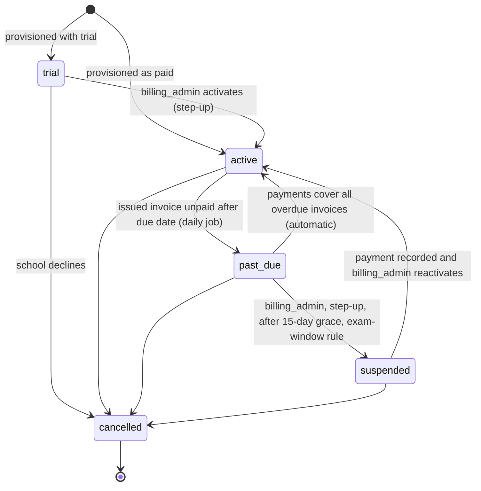

# 16 · Platform Admin Panel (control plane)

| Field | Value |
|---|---|
| Version | 0.2 · 2026-09-26 (new document) |
| Capability | C14 · Milestone M0 (roadmap Task 11) |
| Requirements | FR-PLT-001..030 (03-TRD §3.12) · stories US-1301..US-1310, US-1204 (02-PRD §4) |
| Decisions | ADR-0013 (privilege separation), ADR-0015 (tiers), ADR-0016 (payments, Proposed), ADR-0017 (architecture) |
| Related | 04 §16, 05 §3, 07 §6.5–6.6, 08 §14, 09 §4, 10 §15, 11 §11–12, 12 §4.8–4.13 |

---

## 1. Purpose and scope

The platform admin panel is the **control plane** of SchoolOS: the tool our own team uses to run the business and the fleet. It lets operators:

- provision schools on the shared tier or on a dedicated host, and suspend, reactivate or offboard them;
- manage plans, subscriptions, billing accounts, invoices and (manual) payments;
- see usage against plan limits, fleet health and AI spend;
- run feature flags and announcements;
- handle support tickets and see break-glass requests;
- manage operator accounts and read the platform audit log.

It **never shows student data**. Everything it shows about a school is the school's name, plan, status, deployment, counts and IDs.

The control plane runs **only in the shared deployment** (ADR-0015). On a dedicated host (`SOS_DEPLOYMENT_MODE=dedicated`) its routes and screens are not mounted.

Out of scope for M0: online payment collection (ADR-0016, Proposed), invoice PDFs (planned before the first paid invoice, 14 §2 M1), credit notes, self-serve sign-up, the break-glass *workflow* (M1; the panel only lists requests in M0).

## 2. Personas (platform operator team)

Operators are SchoolOS staff, not school users. One person may hold several roles; at Stage 0 the founder holds `platform_owner`.

| Role key | Who | Typical jobs |
|---|---|---|
| `platform_owner` | Founder / director | Everything; approves risky actions; second person for offboarding and emergency break-glass |
| `platform_engineer` | Engineer on call | Provision schools and dedicated hosts, run flags, watch the fleet, suspend for security reasons |
| `support_agent` | Support staff | Answer school tickets, post announcements, request break-glass access |
| `billing_admin` | Accounts / billing staff | Plans, subscriptions, invoices, recording payments, billing suspension |
| `platform_viewer` | Read-only (e.g., reviewer, auditor, new joiner) | Read every screen; change nothing |

`platform_support` is a different thing: the *tenant-side* temporary role used by break-glass inside a school (07 §6.4). Holding a platform role gives no access to any school's data.

## 3. Principles

1. **No standing access to school data (BR-09).** The panel works with counts, statuses and IDs. The database enforces this: the control plane connects as `sos_platform`, which has no privileges on `core`, `sis`, `kb`, `audit` or `ops` tables (ADR-0013; SEC-026).
2. **Narrow bridges only.** The control plane touches tenant data only through the allowlisted definer functions (05 §3.4). Adding a bridge needs an ADR.
3. **Everything is audited** in the hash-chained platform log, in the same transaction as the action. Actions that change a school also appear in the school's own audit log.
4. **Step-up for risk, two people for the irreversible.** ᴿ permissions need MFA within 5 minutes; offboarding and emergency break-glass need a second operator (SEC-027, SEC-029).
5. **Nothing punitive happens automatically.** Suspension is always a human decision with a reason, never during board exam windows without `platform_owner` approval.
6. **Money is exact.** `numeric(14,2)` INR, issued invoices are immutable, invoice numbers are gapless per financial year.
7. **Same codebase, same rules.** Same stack, i18n (`en`, `te`), accessibility, logging and error conventions as the school app.

## 4. Where it runs

| Aspect | Decision |
|---|---|
| Module | `apps/api/app/platform/` (ADR-0017); billing is part of it |
| API routes | `/api/v1/platform/*` with `require_platform("platform.<…>")`; heartbeat `POST /api/v1/fleet/heartbeat` with `require_fleet_signature()` |
| DB access | `core.db.platform_session()` as `sos_platform` (`SOS_PLATFORM_DATABASE_URL`) |
| Web | Next.js route group `/[locale]/platform/*`; production host `admin.<domain>`; own `__Host-sos_platform_session` cookie; BFF handlers mirror API paths |
| Identity | Separate OIDC client (`SOS_PLATFORM_OIDC_ISSUER`, `SOS_PLATFORM_OIDC_AUDIENCE`; web `PLATFORM_OIDC_CLIENT_ID/SECRET`); reference setup: a separate Cognito user pool with MFA ON and the `sos:mfa` claim (ADR-0018); MFA mandatory for every operator |
| Jobs | Shared `worker`/`beat`; progress in `platform.job_runs` |
| Dedicated hosts | Routers and web route group not mounted; platform beat schedules not registered |

Operator session rules: idle timeout 15 minutes, absolute 8 hours, step-up window 5 minutes, no "remember this device" for step-up.

## 5. Features and screens

Each screen lists the permission needed to see it; actions list their own permission. Screens are usable at 1366×768 and by keyboard.

### 5.1 Dashboard
*Permission:* any platform role; each tile appears only if the operator holds its read permission.

| Tile | Content | Source |
|---|---|---|
| MRR / ARR | Monthly recurring revenue: sum of monthly-equivalent subscription prices (annual ÷ 12) for `active` and `past_due` subscriptions, excluding GST and trials; ARR = MRR × 12 | `subscriptions`, `plans` |
| Schools | Counts by tenant status (active, suspended, offboarding) and tier (shared, dedicated) | `deployments` |
| Trials | Trials running; trials ending in the next 14 days | `subscriptions` |
| Past due | Count and amount outstanding; oldest overdue invoice | `invoices` |
| Fleet health | Deployments by status (healthy, degraded, unreachable); version skew | `deployments` |
| AI spend | Month-to-date AI cost (INR) overall and top 5 schools vs their allowance | `usage_daily` |
| Open tickets | By priority; SLA breaches | `support_tickets` |

### 5.2 Schools list
*Permission:* `platform.tenants.read`. Columns: school name, code, tier, plan, subscription status, tenant status, deployment status, version (dedicated), students (count), last heartbeat (dedicated), open tickets. Filters: status, tier, plan, "trial ending", "past due", search by name/code. No student names anywhere.

### 5.3 School detail
*Permission:* `platform.tenants.read`. Tabs:
- **Overview:** code, name, boards, state, tier, tenant status (with reason and who changed it), created date, owner invite status (sent/accepted; email masked).
- **Plan & subscription** (`platform.subscriptions.read`): plan and version, status, period, trial end, price override and reason, pending plan change.
- **Billing account** (`platform.subscriptions.read` or `platform.invoices.read`): legal name, GSTIN, billing email, address, state code.
- **Invoices** (`platform.invoices.read`): list with number, period, total, paid, status.
- **Usage** (`platform.usage.read`): 90-day chart of daily aggregates vs plan limits.
- **Deployment** (`platform.fleet.read`): mode, region, host, domain, version, last heartbeat, backup status.
- **Flags** (`platform.flags.read`): effective flags and per-school overrides.
- **Tickets** (`platform.support.read`).
- **Activity** (`platform.audit.read`): platform audit events for this school.

### 5.4 Provision school
*Permission:* `platform.tenants.provision` (ᴿ). A wizard:

1. **School:** name, short code (slug, unique), boards, state (default AP), preferred languages.
2. **Tier:** shared or dedicated. For dedicated: region (ap-south-1), optional custom domain.
3. **Owner:** owner's name, email or username, phone (optional). Stored only for the invite.
4. **Plan:** plan and version; trial (default length from config `billing.trial_days`) or active; optional negotiated price with reason.
5. **Billing account:** legal name, GSTIN (optional), billing email, address, state code.
6. **Review and confirm** (step-up).

Result for **shared** (one `platform_session()` transaction): KMS generates the tenant DEK and HMAC key (before the transaction) → `core.provision_tenant(...)` creates the tenant row, wrapped keys, audit chain head and first tenant audit event, and system roles → `core.create_user_for_invite(...)` creates the owner's invited membership → billing account, subscription and deployment rows are inserted → platform audit event. After commit a job sends the owner invite. Retrying with the same `Idempotency-Key` returns the same result.

Result for **dedicated**: the deployment row (`status = provisioning`), billing account, subscription and a new heartbeat key are created in the control plane; the tenant row itself is created **on the host** by the provisioning runbook (§13) using the same definer function with the tenant ID chosen here.

### 5.5 Suspend, reactivate, offboard
- **Suspend (non-billing)** — `platform.tenants.suspend` (ᴿ): reason required (security incident, abuse, school's written request). Calls `core.set_tenant_status(tenant, 'suspended')` for shared; for dedicated, the engineer runs the fleet command (§13.3). Billing suspensions go through the subscription (§5.7).
- **Reactivate** — same permission and step-up; reason required.
- **What suspension does:** staff sign-in shows a suspension notice; the school `owner` can still sign in to download the full data export and see Plan & billing (BR-08). No data is deleted. Scheduled tenant jobs pause, except audit verification and retention purges.
- **Offboard** — `platform.tenants.offboard` (ᴿ, **two-person**): operator A records the request (reason, reference to the school's written request); operator B (a different operator holding the permission) approves with step-up. Then: tenant status `offboarding` → school confirms it has its export (or the export is delivered by us per R8) → access disabled → deletion job removes tenant data **within 30 days** → wrapped keys destroyed (crypto-shredding; for dedicated, the host's KMS key is scheduled for deletion and the host destroyed) → certificate of deletion issued → status `deleted`. Invoices and the billing account stay in `platform` as business records (retention in 08 §14).

### 5.6 Plans and pricing
*Permission:* read with `platform.subscriptions.read`; change with `platform.plans.manage` (ᴿ).
Fields: code, version, name, tier, billing period (monthly/annual), pricing model (flat or per student), base price (INR), per-student price, included students, GST rate (default 18%), SAC code, limits (students, staff users, storage GB, documents, AI tokens per month), included features (flag defaults). Plans are **versioned**: a published plan's prices and limits never change; editing creates a new draft version. Retiring a plan stops new subscriptions; existing ones continue.

### 5.7 Subscriptions
*Permission:* read `platform.subscriptions.read`; actions `platform.subscriptions.manage` (ᴿ).
List with filters by status. Actions: activate (trial → active), extend trial, change plan (takes effect at the next period; no proration in M0), set or clear a negotiated price (reason required), **suspend** (only from `past_due` after the grace period, §9), reactivate, cancel. The screen shows whether today falls inside a protected board-exam window (§9.3).

### 5.8 Invoices and billing accounts
*Permission:* read `platform.invoices.read`; actions `platform.invoices.manage`.
- **Invoice list:** number, school, period, issue date, due date, total, paid, status; filters by status, financial year, school.
- **Invoice detail:** supplier and recipient blocks (legal names, GSTINs, addresses, place of supply), lines (description, SAC, quantity, unit price, amount), taxable value, CGST/SGST or IGST, total, payments, balance due.
- **Actions:** edit draft lines; discard draft; **issue** (assigns the next number, freezes the invoice); **void** (issued, unpaid; reason required; number is kept); record payment (§5.9). PDF download arrives later (§1).
- **Billing account** (edit with `platform.subscriptions.manage`, ᴿ): legal name, GSTIN (validated format; its first two digits must match the state code), PAN (optional), billing email, billing contact name and phone, address, district, PIN code, state code, PO reference. Changes apply to future invoices only; issued invoices keep their snapshot.

### 5.9 Payments
*Permission:* `platform.invoices.manage`.
M0 has one provider, `manual`: a billing admin records a payment against an issued invoice: method (bank transfer, UPI, cheque, other), amount, received date, reference (UTR, UPI reference or cheque number), TDS deducted by the school (if any), notes. Partial payments are allowed. The invoice becomes `paid` when payments plus TDS cover the total. A payment recorded in error is **reversed** with a reason, never deleted. Online collection (Razorpay candidate) is ADR-0016 and is not built.

### 5.10 Usage and quotas
*Permission:* `platform.usage.read`.
Daily aggregates per school: active users, staff users, active students, storage, documents, AI queries, AI tokens and AI cost. Each metric shows its plan limit and a bar at 80% and 100%. Crossing 80% or 100% (once per metric per billing period) notifies operators (dashboard + daily email digest) and emails the school's billing contact. **Limits never block school work** in M0; the only automatic limit is the existing AI budget, which degrades Ask to search-only (FR-KB-011).

### 5.11 Feature flags
*Permission:* read `platform.flags.read`; change `platform.flags.manage` (ᴿ).
Global flags (on/off with optional % rollout) and per-school overrides. The school app reads flags from `platform.feature_flags` (its only grant on the `platform` schema). Evaluation: a school override wins; otherwise the global value, and for a % rollout the school is in when `hash(flag_key, tenant_id) mod 100 < rollout_percent`. Every change is audited with before/after values.

### 5.12 Fleet
*Permission:* read `platform.fleet.read`; change `platform.fleet.manage` (ᴿ).
One row per deployment: school, mode, region, host (EC2 instance ID), hostname and custom domain, running version, target version, last heartbeat, status, backup status, TLS certificate expiry. Actions: set target version, set or change custom domain, rotate heartbeat key, mark decommissioned. Details in §12.

### 5.13 Announcements
*Permission:* `platform.announcements.manage` (viewing needs any platform role).
Bilingual banners (English and Telugu title and body are both required), severity (info, maintenance, warning, critical), audience (all schools, one tier, or listed schools), start and end time (IST shown, UTC stored). Delivery in §14.

### 5.14 Support tickets
*Permission:* read `platform.support.read`; act `platform.support.manage`.
Queue with SLA timers, filters by status, priority, school, assignee. Ticket view: subject, category, messages, internal notes, status history. Details in §15.

### 5.15 Break-glass requests
*Permission:* `platform.breakglass.request` to create (M1); any platform role to view the list.
M0 shows the list and status of requests (requested, approved, active, expired, revoked, denied) with school, reason, scope and times. The approval workflow lives in the school app (07 §6.4) and arrives in M1. Emergency access without school approval needs `platform.breakglass.emergency` (ᴿ, two-person) and is reported to the school within 24 hours.

### 5.16 Operators and roles
*Permission:* `platform.operators.manage` (ᴿ).
Invite (email, name, roles), resend invite, assign or remove roles, deactivate. An operator cannot change their own roles. At least one active `platform_owner` must remain. Operators must enrol MFA before first use.

### 5.17 Platform audit log
*Permission:* `platform.audit.read`.
Filter by operator, action, school, date; export CSV; **Verify chain** runs the verification job and shows the result (first bad sequence number if any).

### 5.18 School-side "Plan & billing" page (FR-PLT-030)
In the **school** app, for holders of `tenant.billing.read` (owner, principal, accountant): current plan, status, period, trial end; usage vs limits (latest daily aggregates); invoices list (number, period, total, status, amount due). Data comes from `core.current_subscription()`, which returns only the current tenant's own records. On a dedicated host the page shows the summary delivered in the heartbeat response (§12.4); until that lands (M1), it shows plan name and a note that invoices are sent by email.

## 6. Permissions

Catalog: `config/platform_permissions.yaml` (the authz tests are generated from it; this table must stay identical to 07 §6.5). Platform permissions can never be granted to tenant roles (`core.permissions` has `CHECK (key NOT LIKE 'platform.%')`; platform roles are not `core.roles` rows). ᴿ = step-up MFA within 5 minutes. **2P** = two different operators.

| Permission | platform_owner | platform_engineer | support_agent | billing_admin | platform_viewer |
|---|---|---|---|---|---|
| `platform.tenants.read` | ✓ | ✓ | ✓ | ✓ | ✓ |
| `platform.tenants.provision` ᴿ | ✓ | ✓ | — | — | — |
| `platform.tenants.suspend` ᴿ | ✓ | ✓ | — | — | — |
| `platform.tenants.offboard` ᴿ 2P | ✓ | — | — | — | — |
| `platform.plans.manage` ᴿ | ✓ | — | — | ✓ | — |
| `platform.subscriptions.read` | ✓ | — | — | ✓ | ✓ |
| `platform.subscriptions.manage` ᴿ | ✓ | — | — | ✓ | — |
| `platform.invoices.read` | ✓ | — | — | ✓ | ✓ |
| `platform.invoices.manage` | ✓ | — | — | ✓ | — |
| `platform.flags.read` | ✓ | ✓ | — | — | ✓ |
| `platform.flags.manage` ᴿ | ✓ | ✓ | — | — | — |
| `platform.usage.read` | ✓ | ✓ | ✓ | ✓ | ✓ |
| `platform.fleet.read` | ✓ | ✓ | ✓ | — | ✓ |
| `platform.fleet.manage` ᴿ | ✓ | ✓ | — | — | — |
| `platform.announcements.manage` | ✓ | — | ✓ | — | — |
| `platform.support.read` | ✓ | ✓ | ✓ | — | ✓ |
| `platform.support.manage` | ✓ | — | ✓ | — | — |
| `platform.breakglass.request` | ✓ | ✓ | ✓ | — | — |
| `platform.breakglass.emergency` ᴿ 2P | ✓ | — | — | — | — |
| `platform.operators.manage` ᴿ | ✓ | — | — | — | — |
| `platform.audit.read` | ✓ | ✓ | — | — | ✓ |

Notes:
- Two-person permissions held only by `platform_owner` mean **at least two active owners** are needed to offboard a school or use emergency break-glass (see §19, Q1).
- Suspending a subscription inside a protected exam window additionally needs a `platform_owner` approval recorded on the action (§9.3).

## 7. Data model (schema `platform`)

Rules for this schema:
- Owned by `sos_owner`; DML granted to `sos_platform` only (audit tables INSERT + SELECT only). `sos_app` has only `SELECT` on `platform.feature_flags`. `sos_definer` gets `SELECT` on the tables `core.current_subscription()` reads (`plans`, `subscriptions`, `invoices`, `usage_daily`).
- No RLS (no student data; not tenant-owned). `tenant_id` columns here are plain references to `core.tenants.id`; there is no cross-schema FK because dedicated schools' tenant rows live on their own hosts.
- No personal data about students. Personal data here is limited to operators and school billing/support contacts (08 §14).
- Money is `numeric(14,2)` in INR. Dates of business meaning (`period_start`, `issue_date`) are IST calendar dates; timestamps are `timestamptz` UTC.

```sql
-- Grants (in migration 0005_platform; schema itself is created by infra/db/bootstrap.sql)
REVOKE ALL ON SCHEMA platform FROM PUBLIC;
GRANT USAGE ON SCHEMA platform TO sos_platform, sos_app, sos_definer;
ALTER DEFAULT PRIVILEGES FOR ROLE sos_owner IN SCHEMA platform
  GRANT SELECT, INSERT, UPDATE, DELETE ON TABLES TO sos_platform;

-- 7.1 Operators and roles ---------------------------------------------------
CREATE TABLE platform.operators (
  id              uuid PRIMARY KEY,
  idp_subject     text UNIQUE,                          -- set on first sign-in
  email           citext NOT NULL UNIQUE,
  display_name    text NOT NULL,
  status          text NOT NULL CHECK (status IN ('invited','active','deactivated')),
  mfa_enrolled    boolean NOT NULL DEFAULT false,
  invited_by      uuid REFERENCES platform.operators(id),
  created_at      timestamptz NOT NULL DEFAULT now(),
  last_login_at   timestamptz,
  deactivated_at  timestamptz,
  version         int NOT NULL DEFAULT 1,
  CHECK ((status = 'deactivated') = (deactivated_at IS NOT NULL)),
  CHECK (status <> 'active' OR (idp_subject IS NOT NULL AND mfa_enrolled))
);

CREATE TABLE platform.operator_roles (
  operator_id  uuid NOT NULL REFERENCES platform.operators(id),
  role_key     text NOT NULL CHECK (role_key IN
                 ('platform_owner','platform_engineer','support_agent','billing_admin','platform_viewer')),
  granted_by   uuid REFERENCES platform.operators(id),  -- NULL only for the bootstrap owner (CLI)
  granted_at   timestamptz NOT NULL DEFAULT now(),
  PRIMARY KEY (operator_id, role_key),
  CHECK (granted_by IS NULL OR granted_by <> operator_id)  -- no self-grant
);

-- 7.2 Plans ----------------------------------------------------------------
CREATE TABLE platform.plans (
  id                     uuid PRIMARY KEY,
  code                   text NOT NULL CHECK (code ~ '^[a-z0-9][a-z0-9-]{1,40}$'),
  version                int  NOT NULL CHECK (version >= 1),
  name                   text NOT NULL,
  tier                   text NOT NULL CHECK (tier IN ('shared','dedicated')),
  billing_period         text NOT NULL CHECK (billing_period IN ('monthly','annual')),
  pricing_model          text NOT NULL CHECK (pricing_model IN ('flat','per_student')),
  base_price_inr         numeric(14,2) NOT NULL CHECK (base_price_inr >= 0),
  per_student_price_inr  numeric(14,2) CHECK (per_student_price_inr >= 0),
  included_students      int CHECK (included_students >= 0),
  gst_rate               numeric(5,2) NOT NULL DEFAULT 18.00 CHECK (gst_rate IN (0, 5, 12, 18, 28)),
  sac_code               text NOT NULL CHECK (sac_code ~ '^[0-9]{6}$'),
  limits                 jsonb NOT NULL DEFAULT '{}',  -- {"students":2500,"staff_users":60,"storage_gb":50,
                                                       --  "documents":5000,"ai_tokens_month":2000000}
  features               jsonb NOT NULL DEFAULT '{}',  -- flag defaults for this plan
  status                 text NOT NULL CHECK (status IN ('draft','published','retired')),
  published_at           timestamptz,
  created_by             uuid NOT NULL REFERENCES platform.operators(id),
  created_at             timestamptz NOT NULL DEFAULT now(),
  UNIQUE (code, version),
  CHECK ((pricing_model = 'per_student') = (per_student_price_inr IS NOT NULL)),
  CHECK ((status = 'draft') = (published_at IS NULL))
);
-- Trigger platform.plans_freeze: once status <> 'draft', only status may change (published -> retired).

-- 7.3 Billing accounts -----------------------------------------------------
CREATE TABLE platform.billing_accounts (
  id                    uuid PRIMARY KEY,
  tenant_id             uuid NOT NULL UNIQUE,
  legal_name            text NOT NULL,
  gstin                 text CHECK (gstin ~ '^[0-9]{2}[A-Z]{5}[0-9]{4}[A-Z][1-9A-Z]Z[0-9A-Z]$'),
  pan                   text CHECK (pan ~ '^[A-Z]{5}[0-9]{4}[A-Z]$'),
  billing_email         citext NOT NULL,
  billing_contact_name  text,
  billing_phone         text CHECK (billing_phone ~ '^\+?[0-9]{10,13}$'),
  address_line1         text NOT NULL,
  address_line2         text,
  city                  text NOT NULL,
  district              text,
  postal_code           text NOT NULL CHECK (postal_code ~ '^[1-9][0-9]{5}$'),
  state_code            text NOT NULL CHECK (state_code ~ '^[0-9]{2}$'),  -- GST state code; AP = '37'
  po_reference          text,
  created_at            timestamptz NOT NULL DEFAULT now(),
  updated_at            timestamptz NOT NULL DEFAULT now(),
  version               int NOT NULL DEFAULT 1,
  CHECK (gstin IS NULL OR substr(gstin, 1, 2) = state_code),
  CHECK (gstin IS NULL OR pan IS NULL OR substr(gstin, 3, 10) = pan)
);

-- 7.4 Deployments (also the platform's registry of schools) ----------------
CREATE TABLE platform.deployments (
  id                        uuid PRIMARY KEY,
  tenant_id                 uuid NOT NULL UNIQUE,
  tenant_code               text NOT NULL UNIQUE,
  school_name               text NOT NULL,              -- public (C0) name only
  mode                      text NOT NULL CHECK (mode IN ('shared','dedicated')),
  region                    text NOT NULL DEFAULT 'ap-south-1' CHECK (region = 'ap-south-1'),
  backup_region             text NOT NULL DEFAULT 'ap-south-2' CHECK (backup_region = 'ap-south-2'),
  host_ref                  text,                       -- EC2 instance ID (dedicated only)
  hostname                  text,                       -- default host name (dedicated)
  custom_domain             citext UNIQUE,
  tenant_status             text NOT NULL CHECK (tenant_status IN
                              ('provisioning','active','suspended','offboarding','deleted')),
  tenant_status_reason      text,
  status                    text NOT NULL CHECK (status IN
                              ('provisioning','healthy','degraded','unreachable','decommissioned')),
  app_version               text,
  target_version            text,
  last_heartbeat_at         timestamptz,
  last_heartbeat            jsonb,                      -- last validated payload (§12.3); no personal data
  heartbeat_key_id          text,
  heartbeat_key_ciphertext  bytea,                      -- KMS-wrapped 32-byte key
  heartbeat_next_key_id     text,                       -- rotation overlap
  heartbeat_next_key_ciphertext bytea,
  offboard_requested_by     uuid REFERENCES platform.operators(id),
  offboard_requested_at     timestamptz,
  offboard_reason           text,
  offboard_approved_by      uuid REFERENCES platform.operators(id),
  offboard_approved_at      timestamptz,
  deletion_certificate_ref  text,
  created_at                timestamptz NOT NULL DEFAULT now(),
  updated_at                timestamptz NOT NULL DEFAULT now(),
  version                   int NOT NULL DEFAULT 1,
  CHECK (mode = 'dedicated' OR (host_ref IS NULL AND custom_domain IS NULL AND heartbeat_key_id IS NULL)),
  CHECK (mode = 'shared' OR status = 'decommissioned' OR heartbeat_key_ciphertext IS NOT NULL),
  CHECK ((heartbeat_key_id IS NULL) = (heartbeat_key_ciphertext IS NULL)),
  CHECK ((heartbeat_next_key_id IS NULL) = (heartbeat_next_key_ciphertext IS NULL)),
  CHECK ((offboard_requested_by IS NULL) = (offboard_requested_at IS NULL)),
  CHECK (offboard_approved_by IS NULL
         OR (offboard_requested_by IS NOT NULL AND offboard_approved_by <> offboard_requested_by)),
  CHECK (tenant_status <> 'suspended' OR tenant_status_reason IS NOT NULL)
);

-- 7.5 Subscriptions --------------------------------------------------------
CREATE TABLE platform.subscriptions (
  id                    uuid PRIMARY KEY,
  tenant_id             uuid NOT NULL REFERENCES platform.deployments(tenant_id),
  billing_account_id    uuid NOT NULL REFERENCES platform.billing_accounts(id),
  plan_id               uuid NOT NULL REFERENCES platform.plans(id),
  pending_plan_id       uuid REFERENCES platform.plans(id),     -- applies at next period
  status                text NOT NULL CHECK (status IN ('trial','active','past_due','suspended','cancelled')),
  trial_ends_at         timestamptz,
  current_period_start  date NOT NULL,
  current_period_end    date NOT NULL,                          -- exclusive
  price_override_inr    numeric(14,2) CHECK (price_override_inr >= 0),
  override_reason       text,
  past_due_since        date,
  grace_ends_on         date,
  suspended_at          timestamptz,
  suspended_by          uuid REFERENCES platform.operators(id),
  suspension_reason     text,
  exam_window_override_by uuid REFERENCES platform.operators(id), -- platform_owner approval (§9.3)
  cancelled_at          timestamptz,
  cancel_reason         text,
  created_at            timestamptz NOT NULL DEFAULT now(),
  updated_at            timestamptz NOT NULL DEFAULT now(),
  version               int NOT NULL DEFAULT 1,
  CHECK (current_period_end > current_period_start),
  CHECK (status <> 'trial' OR trial_ends_at IS NOT NULL),
  CHECK ((price_override_inr IS NULL) = (override_reason IS NULL)),
  -- billing suspension only ever follows past_due (non-billing suspension is on the tenant, §5.5)
  CHECK (status NOT IN ('past_due','suspended') OR (past_due_since IS NOT NULL AND grace_ends_on IS NOT NULL)),
  CHECK (grace_ends_on IS NULL OR grace_ends_on >= past_due_since + 15),
  CHECK (status <> 'suspended'
         OR (suspended_at IS NOT NULL AND suspended_by IS NOT NULL AND suspension_reason IS NOT NULL)),
  CHECK ((status = 'cancelled') = (cancelled_at IS NOT NULL))
);
CREATE UNIQUE INDEX one_live_subscription ON platform.subscriptions (tenant_id) WHERE status <> 'cancelled';

-- 7.6 Invoices -------------------------------------------------------------
CREATE TABLE platform.invoice_sequences (
  financial_year  text PRIMARY KEY CHECK (financial_year ~ '^[0-9]{4}-[0-9]{2}$'),   -- '2026-27'
  prefix          text NOT NULL DEFAULT 'SOS' CHECK (prefix ~ '^[A-Z]{2,5}$'),
  last_number     int  NOT NULL DEFAULT 0 CHECK (last_number >= 0),
  updated_at      timestamptz NOT NULL DEFAULT now()
);

CREATE TABLE platform.invoices (
  id                          uuid PRIMARY KEY,
  tenant_id                   uuid NOT NULL,
  subscription_id             uuid NOT NULL REFERENCES platform.subscriptions(id),
  billing_account_id          uuid NOT NULL REFERENCES platform.billing_accounts(id),
  status                      text NOT NULL CHECK (status IN ('draft','issued','paid','void')),
  financial_year              text REFERENCES platform.invoice_sequences(financial_year),
  sequence_no                 int CHECK (sequence_no > 0),
  invoice_number              text UNIQUE CHECK (invoice_number ~ '^[A-Z0-9/-]{1,20}$'), -- 'SOS/2026-27/000123'
  period_start                date NOT NULL,
  period_end                  date NOT NULL,                     -- exclusive
  issue_date                  date,
  due_date                    date,
  currency                    char(3) NOT NULL DEFAULT 'INR' CHECK (currency = 'INR'),
  -- frozen at issue (snapshots, so later account edits do not change issued invoices)
  supplier_legal_name         text NOT NULL,
  supplier_gstin              text NOT NULL,
  supplier_state_code         text NOT NULL CHECK (supplier_state_code ~ '^[0-9]{2}$'),
  recipient_legal_name        text NOT NULL,
  recipient_gstin             text,
  recipient_address           jsonb NOT NULL,
  place_of_supply_state_code  text NOT NULL CHECK (place_of_supply_state_code ~ '^[0-9]{2}$'),
  tax_type                    text NOT NULL CHECK (tax_type IN ('cgst_sgst','igst')),
  taxable_value_inr           numeric(14,2) NOT NULL DEFAULT 0 CHECK (taxable_value_inr >= 0),
  cgst_inr                    numeric(14,2) NOT NULL DEFAULT 0 CHECK (cgst_inr >= 0),
  sgst_inr                    numeric(14,2) NOT NULL DEFAULT 0 CHECK (sgst_inr >= 0),
  igst_inr                    numeric(14,2) NOT NULL DEFAULT 0 CHECK (igst_inr >= 0),
  total_inr                   numeric(14,2) NOT NULL DEFAULT 0,
  amount_paid_inr             numeric(14,2) NOT NULL DEFAULT 0 CHECK (amount_paid_inr >= 0),
  tds_inr                     numeric(14,2) NOT NULL DEFAULT 0 CHECK (tds_inr >= 0),
  notes                       text,
  issued_by                   uuid REFERENCES platform.operators(id),
  issued_at                   timestamptz,
  voided_by                   uuid REFERENCES platform.operators(id),
  voided_at                   timestamptz,
  void_reason                 text,
  created_at                  timestamptz NOT NULL DEFAULT now(),
  updated_at                  timestamptz NOT NULL DEFAULT now(),
  version                     int NOT NULL DEFAULT 1,
  CHECK (period_end > period_start),
  CHECK (total_inr = taxable_value_inr + cgst_inr + sgst_inr + igst_inr),
  CHECK (tax_type = CASE WHEN place_of_supply_state_code = supplier_state_code
                         THEN 'cgst_sgst' ELSE 'igst' END),
  CHECK ((tax_type = 'igst' AND cgst_inr = 0 AND sgst_inr = 0)
      OR (tax_type = 'cgst_sgst' AND igst_inr = 0 AND cgst_inr = sgst_inr)),
  CHECK ((status = 'draft') = (invoice_number IS NULL)),
  CHECK ((invoice_number IS NULL) = (financial_year IS NULL AND sequence_no IS NULL AND issue_date IS NULL
                                     AND due_date IS NULL AND issued_at IS NULL)),
  CHECK (due_date IS NULL OR due_date >= issue_date),
  CHECK ((status = 'void') = (voided_at IS NOT NULL AND void_reason IS NOT NULL)),
  CHECK (status <> 'paid' OR amount_paid_inr + tds_inr >= total_inr),
  UNIQUE (financial_year, sequence_no)
);
CREATE UNIQUE INDEX one_invoice_per_period ON platform.invoices (subscription_id, period_start)
  WHERE status <> 'void';
CREATE INDEX invoices_tenant ON platform.invoices (tenant_id, period_start DESC);
-- Trigger platform.invoices_freeze: after issue only status, amount_paid_inr, tds_inr, void_* and updated_at
-- may change; DELETE allowed only for drafts.

CREATE TABLE platform.invoice_lines (
  id              uuid PRIMARY KEY,
  invoice_id      uuid NOT NULL REFERENCES platform.invoices(id) ON DELETE CASCADE,  -- drafts only
  line_no         int  NOT NULL CHECK (line_no >= 1),
  kind            text NOT NULL CHECK (kind IN
                    ('subscription','per_student','addon','usage_overage','discount','adjustment')),
  description     text NOT NULL,
  sac_code        text NOT NULL CHECK (sac_code ~ '^[0-9]{6}$'),
  quantity        numeric(12,3) NOT NULL CHECK (quantity > 0),
  unit_price_inr  numeric(14,2) NOT NULL,
  amount_inr      numeric(14,2) NOT NULL,          -- round_half_up(quantity * unit_price_inr, 2)
  gst_rate        numeric(5,2) NOT NULL CHECK (gst_rate IN (0, 5, 12, 18, 28)),
  UNIQUE (invoice_id, line_no),
  CHECK (CASE kind WHEN 'discount'   THEN amount_inr <= 0
                   WHEN 'adjustment' THEN true
                   ELSE amount_inr >= 0 END)
);

-- 7.7 Payments -------------------------------------------------------------
CREATE TABLE platform.payments (
  id                   uuid PRIMARY KEY,
  invoice_id           uuid NOT NULL REFERENCES platform.invoices(id),
  tenant_id            uuid NOT NULL,
  provider             text NOT NULL CHECK (provider IN ('manual')),   -- widened only if ADR-0016 is accepted
  method               text NOT NULL CHECK (method IN ('bank_transfer','upi','cheque','other')),
  amount_inr           numeric(14,2) NOT NULL CHECK (amount_inr > 0),
  tds_inr              numeric(14,2) NOT NULL DEFAULT 0 CHECK (tds_inr >= 0),
  received_on          date NOT NULL,
  reference            text NOT NULL,                 -- UTR / UPI reference / cheque number
  provider_payment_id  text,
  status               text NOT NULL CHECK (status IN ('recorded','reversed')),
  notes                text,
  recorded_by          uuid NOT NULL REFERENCES platform.operators(id),
  recorded_at          timestamptz NOT NULL DEFAULT now(),
  reversed_by          uuid REFERENCES platform.operators(id),
  reversed_at          timestamptz,
  reversal_reason      text,
  UNIQUE (tenant_id, method, reference),
  CHECK ((status = 'reversed') = (reversed_by IS NOT NULL AND reversed_at IS NOT NULL
                                  AND reversal_reason IS NOT NULL))
);

-- 7.8 Usage ----------------------------------------------------------------
CREATE TABLE platform.usage_daily (
  tenant_id         uuid NOT NULL,
  usage_date        date NOT NULL,                     -- IST calendar day
  source            text NOT NULL CHECK (source IN ('shared_collector','heartbeat')),
  active_users      int NOT NULL CHECK (active_users >= 0),
  staff_users       int NOT NULL CHECK (staff_users >= 0),
  students_active   int NOT NULL CHECK (students_active >= 0),
  storage_bytes     bigint NOT NULL CHECK (storage_bytes >= 0),
  documents         int NOT NULL CHECK (documents >= 0),
  ai_queries        int NOT NULL DEFAULT 0 CHECK (ai_queries >= 0),
  ai_input_tokens   bigint NOT NULL DEFAULT 0 CHECK (ai_input_tokens >= 0),
  ai_output_tokens  bigint NOT NULL DEFAULT 0 CHECK (ai_output_tokens >= 0),
  ai_cost_usd       numeric(14,4) NOT NULL DEFAULT 0 CHECK (ai_cost_usd >= 0),
  ai_cost_inr       numeric(14,2) NOT NULL DEFAULT 0 CHECK (ai_cost_inr >= 0),  -- at configured FX rate
  collected_at      timestamptz NOT NULL DEFAULT now(),
  PRIMARY KEY (tenant_id, usage_date)
);

-- 7.9 Feature flags --------------------------------------------------------
CREATE TABLE platform.feature_flags (
  id               uuid PRIMARY KEY,
  key              text NOT NULL CHECK (key ~ '^[a-z0-9_]+(\.[a-z0-9_]+)+$'),   -- 'kb.ask.enabled'
  tenant_id        uuid,                                -- NULL = global
  enabled          boolean NOT NULL,
  rollout_percent  smallint CHECK (rollout_percent BETWEEN 0 AND 100),
  description      text,
  updated_by       uuid REFERENCES platform.operators(id),  -- NULL only when written by the deploy pipeline
  updated_at       timestamptz NOT NULL DEFAULT now(),
  version          int NOT NULL DEFAULT 1,
  UNIQUE NULLS NOT DISTINCT (key, tenant_id),
  CHECK (tenant_id IS NULL OR rollout_percent IS NULL)   -- % rollout only on global rows
);
GRANT SELECT ON platform.feature_flags TO sos_app;

-- 7.10 Announcements -------------------------------------------------------
CREATE TABLE platform.announcements (
  id                   uuid PRIMARY KEY,
  title_en             text NOT NULL CHECK (char_length(title_en) <= 120),
  title_te             text NOT NULL CHECK (char_length(title_te) <= 120),
  body_en              text NOT NULL CHECK (char_length(body_en) <= 1000),
  body_te              text NOT NULL CHECK (char_length(body_te) <= 1000),
  severity             text NOT NULL CHECK (severity IN ('info','maintenance','warning','critical')),
  audience             text NOT NULL CHECK (audience IN ('all','tier','tenants')),
  audience_tier        text CHECK (audience_tier IN ('shared','dedicated')),
  audience_tenant_ids  uuid[] NOT NULL DEFAULT '{}',
  starts_at            timestamptz NOT NULL,
  ends_at              timestamptz NOT NULL,
  status               text NOT NULL CHECK (status IN ('draft','scheduled','cancelled')),
  created_by           uuid NOT NULL REFERENCES platform.operators(id),
  created_at           timestamptz NOT NULL DEFAULT now(),
  updated_at           timestamptz NOT NULL DEFAULT now(),
  version              int NOT NULL DEFAULT 1,
  CHECK (ends_at > starts_at),
  CHECK ((audience = 'tier') = (audience_tier IS NOT NULL)),
  CHECK ((audience = 'tenants') = (cardinality(audience_tenant_ids) > 0))
);

-- 7.11 Support tickets -----------------------------------------------------
CREATE TABLE platform.support_tickets (
  id                      uuid PRIMARY KEY,
  ticket_no               bigint GENERATED ALWAYS AS IDENTITY UNIQUE,   -- shown as T-1042
  tenant_id               uuid NOT NULL,
  opened_by_user_id       uuid,                  -- core.users.id (ID only) when opened in the school app
  opened_by_operator_id   uuid REFERENCES platform.operators(id),
  channel                 text NOT NULL CHECK (channel IN ('app','email','phone','whatsapp')),
  category                text NOT NULL CHECK (category IN
                            ('access','import','data_quality','exports','documents','ask','billing','bug','other')),
  priority                text NOT NULL CHECK (priority IN ('p1','p2','p3','p4')),
  subject                 text NOT NULL CHECK (char_length(subject) <= 200),
  status                  text NOT NULL CHECK (status IN
                            ('open','in_progress','waiting_on_school','resolved','closed')),
  assigned_to             uuid REFERENCES platform.operators(id),
  first_response_due_at   timestamptz NOT NULL,
  resolution_due_at       timestamptz NOT NULL,
  first_responded_at      timestamptz,
  resolved_at             timestamptz,
  closed_at               timestamptz,
  personal_data_flagged   boolean NOT NULL DEFAULT false,
  purge_after             date,                  -- closed_at + 1 year
  created_at              timestamptz NOT NULL DEFAULT now(),
  updated_at              timestamptz NOT NULL DEFAULT now(),
  version                 int NOT NULL DEFAULT 1,
  CHECK ((opened_by_user_id IS NULL) <> (opened_by_operator_id IS NULL)),
  CHECK ((channel = 'app') = (opened_by_user_id IS NOT NULL)),
  CHECK ((status = 'closed') = (closed_at IS NOT NULL AND purge_after IS NOT NULL)),
  CHECK (purge_after IS NULL OR purge_after >= (closed_at AT TIME ZONE 'Asia/Kolkata')::date + 365)
);
CREATE INDEX tickets_queue ON platform.support_tickets (status, priority, resolution_due_at);

CREATE TABLE platform.support_messages (
  id             uuid PRIMARY KEY,
  ticket_id      uuid NOT NULL REFERENCES platform.support_tickets(id) ON DELETE CASCADE,
  author_type    text NOT NULL CHECK (author_type IN ('school_user','operator','system')),
  author_id      uuid,
  body           text NOT NULL CHECK (char_length(body) BETWEEN 1 AND 5000),  -- stored after redact()
  internal_note  boolean NOT NULL DEFAULT false,
  created_at     timestamptz NOT NULL DEFAULT now(),
  CHECK (NOT internal_note OR author_type = 'operator'),
  CHECK (author_type = 'system' OR author_id IS NOT NULL)
);

-- 7.12 Platform audit chain ------------------------------------------------
CREATE TABLE platform.audit_events (
  seq            bigint PRIMARY KEY CHECK (seq >= 1),
  id             uuid NOT NULL UNIQUE,
  occurred_at    timestamptz NOT NULL DEFAULT now(),
  actor_type     text NOT NULL CHECK (actor_type IN ('operator','system','deployment')),
  actor_id       uuid,
  action         text NOT NULL,                  -- e.g. 'tenant.provisioned', 'invoice.issued'
  resource_type  text NOT NULL,
  resource_id    uuid,
  tenant_id      uuid,                           -- affected school, if any
  summary        jsonb NOT NULL,                 -- IDs, field names, before/after of non-personal fields
  request_id     text,
  ip_hash        bytea,
  prev_hash      bytea NOT NULL CHECK (octet_length(prev_hash) = 32),
  hash           bytea NOT NULL CHECK (octet_length(hash) = 32),
  CHECK (actor_type = 'system' OR actor_id IS NOT NULL)
);
CREATE INDEX platform_audit_tenant ON platform.audit_events (tenant_id, occurred_at);

CREATE TABLE platform.audit_chain_head (
  singleton   boolean PRIMARY KEY DEFAULT true CHECK (singleton),
  last_seq    bigint NOT NULL DEFAULT 0 CHECK (last_seq >= 0),
  last_hash   bytea  NOT NULL DEFAULT decode(repeat('00', 32), 'hex')     -- genesis: 32 zero bytes
                     CHECK (octet_length(last_hash) = 32),
  updated_at  timestamptz NOT NULL DEFAULT now()
);
INSERT INTO platform.audit_chain_head DEFAULT VALUES;   -- in the same migration

REVOKE UPDATE, DELETE, TRUNCATE ON platform.audit_events FROM PUBLIC, sos_platform;
REVOKE DELETE, TRUNCATE ON platform.audit_chain_head FROM PUBLIC, sos_platform;
CREATE TRIGGER platform_audit_no_update BEFORE UPDATE OR DELETE ON platform.audit_events
  FOR EACH ROW EXECUTE FUNCTION audit.block_mutation();
CREATE TRIGGER platform_audit_no_truncate BEFORE TRUNCATE ON platform.audit_events
  FOR EACH STATEMENT EXECUTE FUNCTION audit.block_mutation();

-- 7.13 Platform jobs -------------------------------------------------------
CREATE TABLE platform.job_runs (
  id               uuid PRIMARY KEY,
  task_name        text NOT NULL,
  idempotency_key  text NOT NULL UNIQUE,         -- e.g. 'invoices.generate:2026-10'
  status           text NOT NULL CHECK (status IN ('pending','running','succeeded','failed','dead')),
  attempts         int NOT NULL DEFAULT 0 CHECK (attempts >= 0),
  progress         jsonb,
  error            text,                         -- error code and message; no personal data
  started_at       timestamptz,
  finished_at      timestamptz,
  created_at       timestamptz NOT NULL DEFAULT now(),
  updated_at       timestamptz NOT NULL DEFAULT now(),
  CHECK (finished_at IS NULL OR started_at IS NOT NULL)
);
```

Platform chain write (inside the action's transaction): `SELECT last_seq, last_hash FROM platform.audit_chain_head FOR UPDATE` → `seq = last_seq + 1` → `hash = sha256(last_hash || jcs(event without hash))` (RFC 8785) → insert event → update head. Same algorithm as the tenant chain (05 §7).

## 8. API endpoint catalog

Conventions from 09 §2 apply (problem+json, `Idempotency-Key` on creating POSTs, `ETag`/`If-Match`, cursor pagination). Base path `/api/v1`. "ᴿ" = step-up (`428 step_up_required` otherwise). Control-plane idempotency keys are kept for 24 hours in Valkey (operator ID + key → request hash, status and resource ID; no personal data), because `sos_platform` cannot use `ops.idempotency_keys`.

### 8.1 Control plane (`/api/v1/platform/*`, operators only)

| Method | Path | Permission | Notes |
|---|---|---|---|
| GET | `/platform/me` | any operator | Operator, roles, effective permissions, step-up freshness |
| GET | `/platform/dashboard` | any operator | Tiles filtered by the caller's read permissions (§5.1) |
| GET | `/platform/tenants` | `platform.tenants.read` | Filters: `status`, `tier`, `plan`, `q`, `trial_ending`, `past_due` |
| GET | `/platform/tenants/{tenant_id}` | `platform.tenants.read` | Registry, status history, owner-invite status |
| POST | `/platform/tenants` | `platform.tenants.provision` ᴿ | Provision shared or dedicated (§5.4); idempotent |
| POST | `/platform/tenants/{tenant_id}/owner-invite:resend` | `platform.tenants.provision` | |
| POST | `/platform/tenants/{tenant_id}/suspend` · `/reactivate` | `platform.tenants.suspend` ᴿ | Reason required; non-billing |
| POST | `/platform/tenants/{tenant_id}/offboarding` | `platform.tenants.offboard` ᴿ | First operator: request |
| POST | `/platform/tenants/{tenant_id}/offboarding:approve` | `platform.tenants.offboard` ᴿ | Second, different operator; `409 same_operator` otherwise |
| GET | `/platform/tenants/{tenant_id}/usage?from=&to=` | `platform.usage.read` | Daily aggregates |
| GET | `/platform/usage?from=&to=` | `platform.usage.read` | All schools, aggregated |
| GET | `/platform/plans` · `/platform/plans/{id}` | `platform.subscriptions.read` or `platform.plans.manage` | |
| POST | `/platform/plans` | `platform.plans.manage` ᴿ | Creates a draft (new code or new version) |
| PATCH | `/platform/plans/{id}` | `platform.plans.manage` ᴿ | Drafts only; `409 plan_published` otherwise |
| POST | `/platform/plans/{id}/publish` · `/retire` | `platform.plans.manage` ᴿ | |
| GET | `/platform/subscriptions` · `/platform/subscriptions/{id}` | `platform.subscriptions.read` | Filter by `status` |
| POST | `/platform/subscriptions/{id}/activate` · `/extend-trial` · `/change-plan` · `/cancel` | `platform.subscriptions.manage` ᴿ | |
| PUT | `/platform/subscriptions/{id}/price-override` | `platform.subscriptions.manage` ᴿ | Amount + reason; DELETE clears |
| POST | `/platform/subscriptions/{id}/suspend` | `platform.subscriptions.manage` ᴿ | Only `past_due` after grace; exam-window rule (§9.3) |
| POST | `/platform/subscriptions/{id}/reactivate` | `platform.subscriptions.manage` ᴿ | |
| GET | `/platform/tenants/{tenant_id}/billing-account` | `platform.subscriptions.read` or `platform.invoices.read` | |
| PUT | `/platform/tenants/{tenant_id}/billing-account` | `platform.subscriptions.manage` ᴿ | Affects future invoices only |
| GET | `/platform/invoices` · `/platform/invoices/{id}` | `platform.invoices.read` | Filters: `status`, `financial_year`, `tenant_id` |
| POST | `/platform/invoices` | `platform.invoices.manage` | Manual draft for a subscription and period |
| PATCH | `/platform/invoices/{id}` | `platform.invoices.manage` | Draft lines and notes only |
| DELETE | `/platform/invoices/{id}` | `platform.invoices.manage` | Drafts only |
| POST | `/platform/invoices/{id}/issue` | `platform.invoices.manage` | Assigns the number (§10.3) |
| POST | `/platform/invoices/{id}/void` | `platform.invoices.manage` | Issued and unpaid; reason required |
| POST | `/platform/invoices/{id}/payments` | `platform.invoices.manage` | Record manual payment (§5.9) |
| POST | `/platform/payments/{id}/reverse` | `platform.invoices.manage` | Reason required |
| POST | `/platform/invoice-runs` → 202 | `platform.invoices.manage` | Run generation for a month (idempotent) |
| GET | `/platform/flags` | `platform.flags.read` | Global rows and overrides |
| PUT | `/platform/flags/{key}` | `platform.flags.manage` ᴿ | Global value and rollout % |
| PUT · DELETE | `/platform/flags/{key}/tenants/{tenant_id}` | `platform.flags.manage` ᴿ | Per-school override |
| GET | `/platform/deployments` · `/platform/deployments/{id}` | `platform.fleet.read` | |
| PATCH | `/platform/deployments/{id}` | `platform.fleet.manage` ᴿ | `target_version`, `custom_domain`, `hostname`, `host_ref` |
| POST | `/platform/deployments/{id}/heartbeat-key:rotate` | `platform.fleet.manage` ᴿ | Returns the new key **once** for the runbook |
| POST | `/platform/deployments/{id}/decommission` | `platform.fleet.manage` ᴿ | After offboarding completes |
| GET | `/platform/announcements` | any operator | |
| POST · PATCH | `/platform/announcements` · `/{id}` | `platform.announcements.manage` | |
| POST | `/platform/announcements/{id}/cancel` | `platform.announcements.manage` | |
| GET | `/platform/support/tickets` · `/{id}` | `platform.support.read` | |
| POST | `/platform/support/tickets` | `platform.support.manage` | Operator-created (email/phone) |
| POST | `/platform/support/tickets/{id}/messages` | `platform.support.manage` | Reply or internal note |
| PATCH | `/platform/support/tickets/{id}` | `platform.support.manage` | Status, priority, assignee, personal-data flag |
| GET | `/platform/break-glass-requests` | any operator | Status list |
| POST | `/platform/break-glass-requests` | `platform.breakglass.request` | M1 |
| POST | `/platform/break-glass-requests/{id}/emergency-confirm` | `platform.breakglass.emergency` ᴿ | M1; two different operators |
| GET | `/platform/operators` | `platform.operators.manage` | |
| POST | `/platform/operators` | `platform.operators.manage` ᴿ | Invite |
| PUT | `/platform/operators/{id}/roles` | `platform.operators.manage` ᴿ | Not own roles; keep ≥ 1 owner |
| POST | `/platform/operators/{id}/deactivate` | `platform.operators.manage` ᴿ | |
| GET | `/platform/audit/events` | `platform.audit.read` | Filters: `actor`, `action`, `tenant_id`, `from`, `to`; CSV via `Accept: text/csv` |
| POST | `/platform/audit/verify` → 202 | `platform.audit.read` | Runs verification; result in the job |
| GET | `/platform/jobs/{id}` | job creator or `platform.audit.read` | Platform job status |

### 8.2 Fleet (machine to machine)

| Method | Path | Authentication | Notes |
|---|---|---|---|
| POST | `/fleet/heartbeat` | `require_fleet_signature()` (HMAC, §12.2) | Not routed through the BFF; rate limit 1 per minute per deployment |

### 8.3 School app additions (tenant API, `sos_app`)

| Method | Path | Permission | Notes |
|---|---|---|---|
| GET | `/tenant/billing` | `tenant.billing.read` | Plan, status, period, usage vs limits (via `core.current_subscription()`) |
| GET | `/tenant/billing/invoices` | `tenant.billing.read` | Own invoices: number, period, total, status, due |
| GET | `/announcements` | authenticated | Active announcements for this school (§14) |
| POST · GET | `/support/tickets` | proposed `support.ticket.create` (§19, Q6) | Opens or lists the school's own tickets via `platform.service` |

## 9. Billing lifecycle

### 9.1 States



### 9.2 Rules

| Rule | Detail |
|---|---|
| Payment terms | Due date = issue date + `billing.payment_terms_days` (default 15) |
| Past due | The daily job (`billing.mark_past_due`, 06:00 IST) sets `past_due` when any issued invoice is unpaid after its due date; `past_due_since` = first such day; `grace_ends_on` = `past_due_since` + 15 days |
| Grace | **15 days**. During grace nothing changes for the school except reminder emails and a banner on its Plan & billing page |
| Suspension | **Never automatic.** Only a `billing_admin` (or `platform_owner`) with step-up, after `grace_ends_on`, with a reason. The service re-checks every condition |
| Reactivation | Automatic back to `active` when a past-due school pays; from `suspended`, a billing admin reactivates after payment |
| Trial end | Operators and the school's billing contact are reminded 14 and 3 days before; nothing happens automatically at the end; the dashboard lists expired trials for a decision |
| Reminders | Billing email at issue, 3 days before due, on the due date, and 7 and 14 days after (EN/TE templates) |
| Cancellation | Stops future invoices; issued invoices stay payable; offboarding is a separate, explicit flow (§5.5) |
| Plan change | Takes effect at the next period start; no proration in M0 |

### 9.3 Protected board-exam windows

Suspension must not cut off a school during board exams or registration deadlines. Windows are configured per year in `config/billing.yaml` (`protected_windows`: name, boards, start, end), maintained from the boards' published calendars. If today is inside a window that applies to the school's boards, suspension additionally requires `exam_window_override_by` = a `platform_owner` who approves with step-up; the event records both operators.

## 10. Invoice generation job

### 10.1 Schedule and idempotency
- Beat task `billing.generate_invoices` runs on the 1st of each month at 02:00 IST (and on demand via `POST /platform/invoice-runs`).
- It records a `platform.job_runs` row with `idempotency_key = 'invoices.generate:<YYYY-MM>'`; a rerun resumes rather than duplicates. The unique index `one_invoice_per_period` guarantees at most one live invoice per subscription and period.

### 10.2 What it creates
- For each subscription in `active` or `past_due` whose next period starts in the run month (monthly: every month; annual: on the anniversary month): one **draft** invoice for the coming period (billing in advance). Trials and cancelled or suspended subscriptions are skipped.
- Lines: plan base price (or the negotiated price override) with the plan's SAC code; for per-student plans, `max(students_active, included_students) − included_students` extra students at the per-student price, where `students_active` is taken from `usage_daily` on the last day of the previous month.
- Tax: place of supply = billing account state code. If it equals the supplier's state code (configured supplier in `config/billing.yaml`; AP = 37), CGST 9% + SGST 9%; otherwise IGST 18%. Line amounts are rounded half-up to paise; each tax is computed on the taxable value and rounded half-up to paise.
- Drafts appear in the invoice list for review; a billing admin issues them (usually the same day).

### 10.3 Numbering (on issue)
- Financial year runs 1 April to 31 March (IST): an issue date in April 2026–March 2027 belongs to `2026-27`.
- In the issuing transaction: `INSERT INTO platform.invoice_sequences (financial_year) VALUES (:fy) ON CONFLICT DO NOTHING`, then `SELECT last_number FROM platform.invoice_sequences WHERE financial_year = :fy FOR UPDATE`, increment, update, and set `invoice_number = 'SOS/' || :fy || '/' || lpad(:n::text, 6, '0')` (e.g., `SOS/2026-27/000123`).
- Numbers are **gapless**: drafts have no number; voided invoices keep theirs; numbers are never reused.
- **Check before the first real invoice:** that format is 18 characters. GST rules (CGST Rule 46) limit invoice serial numbers to 16 characters. A 16-character alternative is `SOS/26-27/000123`. The format is config (`billing.invoice_number_format`), so it can change without a schema change (§19, Q2).

## 11. Usage metering

| Metric | Definition (per school, per IST day) |
|---|---|
| `active_users` | Distinct users with at least one sign-in or audited action that day |
| `staff_users` | Active memberships at end of day |
| `students_active` | Students with status `active` at end of day |
| `storage_bytes` | Sum of stored document versions and retained import files |
| `documents` | Active documents |
| `ai_queries`, `ai_input_tokens`, `ai_output_tokens`, `ai_cost_usd` | From the LLM gateway's per-tenant meters (`kb.queries`) |
| `ai_cost_inr` | `ai_cost_usd` × FX rate from config (`billing.usd_inr_rate`, reviewed monthly) |

- **Shared tier:** beat task `usage.collect_daily` (01:30 IST) calls `core.list_tenant_ids(ARRAY['active','suspended'])` and, for each school, `core.tenant_usage_summary(tenant_id)`, which returns **counts only**; results are upserted into `platform.usage_daily` with `source = 'shared_collector'`.
- **Dedicated tier:** the host computes the same function locally and sends the numbers in its heartbeat `usage` block; the control plane upserts them with `source = 'heartbeat'`.
- **Thresholds:** after each upsert, compare with plan limits; on first crossing of 80% and 100% per metric per billing period, create an operator notification and email the school's billing contact (§5.10). Record `usage.limit_threshold_crossed` in the platform audit log.

## 12. Fleet and heartbeat protocol

### 12.1 Sending
- Every dedicated host's `beat` sends `POST https://<control-plane-host>/api/v1/fleet/heartbeat` every **5 minutes** (±30 s jitter), outbound only.
- Shared-tier deployments do not send heartbeats; the shared stack is monitored directly (11).

### 12.2 Authentication (SEC-028)

| Header | Value |
|---|---|
| `X-SOS-Deployment` | deployment UUID |
| `X-SOS-Key-Id` | key identifier (current or next key) |
| `X-SOS-Timestamp` | Unix time in seconds (UTC) |
| `X-SOS-Signature` | `v1=` + lowercase hex of `HMAC-SHA256(key, timestamp + "." + raw_body)` |

The control plane:
1. looks up the deployment and key by ID (unknown → `401`, no detail);
2. rejects if `|now − timestamp| > 300 s` (**5-minute skew window**) → `401`;
3. computes the HMAC over the exact bytes received and compares in constant time → `401` on mismatch;
4. rejects a repeated `nonce` seen in the last 10 minutes (Valkey set per deployment) → `409 replay`;
5. validates the body against the strict schema (unknown fields rejected, size ≤ 16 KB) → `422`;
6. checks `deployment_id` and `tenant_id` in the body match the registry → `401`.

Keys are 32 random bytes, one per deployment, generated at provisioning and on rotation, stored KMS-wrapped in `platform.deployments`, and on the host in SSM Parameter Store (SecureString) read at start-up. Rotation keeps the old and new keys valid together for 7 days.

### 12.3 Payload (schema version 1)

No personal data: no names, emails, phone numbers, free text from users, file names or document titles. Only versions, states, timings and counts.

```json
{
  "schema_version": 1,
  "deployment_id": "0192…",
  "tenant_id": "0192…",
  "sent_at": "2026-09-26T04:35:00Z",
  "nonce": "0192…",
  "app_version": "2026.10.1",
  "git_sha": "3f2c1ab",
  "db_revision": "0006_ops",
  "health": { "api": "ok", "worker": "ok", "beat": "ok", "db": "ok", "valkey": "ok", "s3": "ok" },
  "queues": { "ingest": {"depth": 0, "oldest_s": 0}, "exports": {"depth": 1, "oldest_s": 12} },
  "errors_5xx_rate_15m": 0.0,
  "host": { "disk_used_pct": 41.5, "mem_used_pct": 63.0, "load_1m": 0.4, "uptime_s": 864000 },
  "db": { "size_bytes": 5368709120, "connections": 18 },
  "backup": { "last_base_backup_at": "2026-09-25T20:31:00Z", "wal_archive_lag_s": 42,
              "last_pg_dump_at": "2026-09-25T21:05:00Z", "status": "ok" },
  "tls": { "cert_expires_at": "2026-12-01T00:00:00Z" },
  "audit": { "last_verified_at": "2026-09-26T00:10:00Z", "result": "ok" },
  "usage": { "date": "2026-09-25", "active_users": 23, "staff_users": 41, "students_active": 1984,
             "storage_bytes": 21474836480, "documents": 812, "ai_queries": 57,
             "ai_input_tokens": 410000, "ai_output_tokens": 52000, "ai_cost_usd": 3.1200 }
}
```

`usage` is the latest complete IST day; the control plane upserts it once per day.

### 12.4 Response

`200` with:

```json
{ "received_at": "2026-09-26T04:35:01Z", "target_version": "2026.10.1", "min_supported_version": "2026.09.2",
  "announcements": [ { "id": "0192…", "severity": "maintenance", "title_en": "…", "title_te": "…",
                       "body_en": "…", "body_te": "…", "starts_at": "…", "ends_at": "…" } ] }
```

The host caches `announcements` in its Valkey for the school app to show (§14). A billing summary for the dedicated school's Plan & billing page is planned for the response in M1 (§5.18). The response never carries commands; host changes go through the deploy pipeline.

### 12.5 Deployment status

| Status | Condition |
|---|---|
| `provisioning` | Created; no valid heartbeat yet |
| `healthy` | Valid heartbeat within 20 minutes and all `health` values `ok` |
| `degraded` | Valid heartbeat within 20 minutes with any value not `ok`, backup older than 26 hours, WAL lag over 15 minutes, disk over 85%, or certificate expiring in under 14 days |
| `unreachable` | No valid heartbeat for **20 minutes** (checked every 5 minutes by `fleet.check_staleness`) |
| `decommissioned` | Offboarded and host destroyed |

Status changes are written to the platform audit log (`actor_type = 'system'`) and drive alerts (11 §11). Every accepted heartbeat updates `last_heartbeat_at`, `last_heartbeat` and `app_version`; individual heartbeats are not audited.

## 13. Dedicated-tier provisioning runbook (outline)

Full steps live in the ops runbook (11 §8, R10). Outline:

### 13.1 Before
1. Signed order and DPA; plan is a dedicated-tier plan; billing account complete.
2. Custom domain decided (optional) and the school's IT contact knows how to add a DNS record.

### 13.2 Build
1. **Panel:** Provision school → Dedicated (step-up). Creates the deployment (`provisioning`), subscription, billing account, tenant ID and heartbeat key; shows the key **once**.
2. **Terraform:** new directory `infra/terraform/envs/dedicated/<tenant_code>/` using module `dedicated_host`: EC2 in ap-south-1 (encrypted EBS, IMDSv2 only, no SSH, SSM agent), security group allowing only 80/443 inbound, host KMS key, files bucket and backup bucket (ap-south-2) encrypted with that key, instance role limited to those buckets, keys and its SSM parameters, CloudWatch log group (400 days).
3. **Secrets:** database passwords, `SOS_SERVICE_TOKEN_KEY`, `SESSION_SECRET`, OIDC client secret and the heartbeat key into SSM Parameter Store under `/schoolos/<tenant_code>/`.
4. **Host bootstrap** (SSM document): apply the OS hardening baseline (SEC-030), install the container runtime, pull images **by digest**, write `deploy/dedicated/compose.yaml` with `SOS_DEPLOYMENT_MODE=dedicated`, run `infra/db/bootstrap.sql`, run the `migrate` service, then provision the tenant with the chosen tenant ID (same `core.provision_tenant()` function) and send the owner invite.
5. **Identity:** create the deployment's OIDC app client with callback URLs on its host name(s) (§19, Q4).
6. **DNS and TLS:** default host name, and the school's CNAME for the custom domain; Caddy obtains certificates via ACME; HSTS on.
7. **Backups:** enable WAL-G archiving and nightly base backup + `pg_dump` to the ap-south-2 bucket; **run a restore test** to a scratch host before go-live.

### 13.3 Verify and hand over
1. First valid heartbeat → status `healthy`; smoke tests pass; audit chain verified.
2. Owner accepts invite and enrols MFA; tenant status `active`; platform audit records go-live.
3. For later changes (suspend, reactivate, upgrade), engineers run fleet commands through the deploy pipeline (SSM Run Command), never by logging into the host.

### 13.4 Decommission
After offboarding approval (§5.5): final export delivered → data deleted → host KMS key scheduled for deletion (crypto-shredding of host storage and backups) → Terraform destroy → buckets emptied and removed after the backup retention window → deployment `decommissioned` → certificate of deletion.

## 14. Announcements

- Operators create a bilingual announcement with severity, audience and schedule (§5.13). Both languages are required.
- **Delivery to shared-tier schools:** the `sos_app` role cannot read `platform.announcements`. A platform job (`announcements.publish`, every minute and on every change) writes the currently active announcements (no personal data) to a Valkey key; `GET /api/v1/announcements` in the school app reads that key and filters by the school's tier and ID.
- **Delivery to dedicated hosts:** included in the heartbeat response (§12.4) and cached on the host.
- The school app shows them as a dismissible banner (critical: not dismissible until it ends) in the user's language.
- Cancelling removes it from the next publish (within one minute on shared; next heartbeat on dedicated).

## 15. Support tickets

- **Opening:** school staff open tickets in the school app (Help → Contact support); the school API calls `platform.service.open_ticket_from_tenant(ctx, …)`, which writes through `platform_session()`. Operators can also open tickets on a school's behalf from email, phone or WhatsApp.
- **No student data.** The form shows a clear warning in English and Telugu: "Don't include student names, dates of birth, Aadhaar or phone numbers. Use the student's SchoolOS ID if needed." Every message is passed through `redact()` (Aadhaar and phone masking) before storage. Operators flag tickets that still contain personal data (`personal_data_flagged`); flagged messages are redacted by an operator edit that is audited.
- **Statuses:** `open` → `in_progress` → `waiting_on_school` ↔ `in_progress` → `resolved` → `closed` (auto-close 7 days after `resolved` without reply).
- **SLA timers** (school hours 08:00–18:00 IST, Mon–Sat):

| Priority | Example | First response | Resolution target |
|---|---|---|---|
| P1 | School cannot sign in; suspected data exposure | 1 hour | 8 hours |
| P2 | Import or export blocked before a deadline | 4 hours | 2 school days |
| P3 | Something is wrong but there is a workaround | 1 school day | 5 school days |
| P4 | Question or suggestion | 2 school days | Best effort |

- **Retention:** tickets and messages are deleted **1 year after closing** (`purge_after`) by the daily purge job; the audit log keeps only IDs and status changes.
- Data needed to diagnose a problem inside a school's records is never pasted into a ticket; it is reached only through break-glass (07 §6.4).

## 16. Audit events

Written with `audit.service.record_platform(...)` in `platform.audit_events` unless marked (T), which are written into the school's own chain by a definer function.

| Area | Actions |
|---|---|
| Operators | `operator.invited`, `operator.activated`, `operator.login`, `operator.step_up`, `operator.roles_changed`, `operator.deactivated` |
| Schools | `tenant.provisioned` (+ T), `tenant.owner_invite_sent`, `tenant.suspended` (+ T), `tenant.reactivated` (+ T), `tenant.offboard_requested`, `tenant.offboard_approved` (+ T), `tenant.deleted` |
| Plans | `plan.created`, `plan.updated`, `plan.published`, `plan.retired` |
| Subscriptions | `subscription.created`, `subscription.activated`, `subscription.trial_extended`, `subscription.plan_changed`, `subscription.price_override_set`, `subscription.past_due` (system), `subscription.suspended`, `subscription.exam_window_override`, `subscription.reactivated`, `subscription.cancelled` |
| Billing | `billing_account.updated`, `invoice.generated` (system), `invoice.updated`, `invoice.draft_discarded`, `invoice.issued`, `invoice.voided`, `payment.recorded`, `payment.reversed`, `invoice.paid` (system) |
| Usage | `usage.limit_threshold_crossed` (system) |
| Flags | `flag.updated`, `flag.override_set`, `flag.override_removed` |
| Fleet | `deployment.created`, `deployment.updated`, `deployment.first_heartbeat`, `deployment.status_changed` (system), `deployment.heartbeat_key_rotated`, `deployment.decommissioned`, `heartbeat.rejected` (system; rate-limited) |
| Announcements | `announcement.created`, `announcement.updated`, `announcement.cancelled` |
| Support | `support.ticket_opened`, `support.ticket_updated`, `support.personal_data_flagged`, `support.message_redacted`, `support.tickets_purged` (system) |
| Break-glass | `breakglass.requested`, `breakglass.emergency_confirmed` (M1) |
| Audit | `audit.verify_run` |

Summaries hold IDs, field names and before/after values of non-personal fields (e.g., plan code, status, amounts). Never ticket text, emails or phone numbers.

## 17. SLOs and alerts

| SLO | Target | Measurement |
|---|---|---|
| Control-plane API availability | 99.5% monthly | ALB + OTel for `/api/v1/platform/*` |
| Heartbeat ingest availability | 99.9% monthly | Accepted / valid heartbeats received |
| Heartbeat processing latency | p95 < 500 ms | OTel |
| Invoice run | 100% of due drafts generated by the 2nd of the month | `platform.job_runs` |
| Usage collection freshness | Previous day's usage present for 100% of schools by 06:00 IST | `usage_daily` |
| Platform audit integrity | 100% daily verification success | beat job |

Alerts specific to the control plane (full table in 11 §11–12):

| Alert | Condition | Severity |
|---|---|---|
| Heartbeat missed | Deployment `unreachable` (no valid heartbeat 20 min) | P2 in school hours, P3 otherwise |
| Dedicated backup stale | Base backup older than 26 h or WAL lag > 15 min | P2 |
| Dedicated host degraded | Disk > 85%, certificate < 14 days, health not `ok` | P3 |
| Version skew | Host more than one release behind 14 days after release | P3 |
| Heartbeat signature failures | > 5 rejected per deployment per hour | P2 security |
| Platform audit chain broken | Verification failure | **P1 security** |
| `sos_platform` permission denied | Any `permission denied` on `core`/`sis`/`kb`/`audit`/`ops` from the platform path | **P1 security** |
| Invoice run failed | Job `failed` or `dead` | P2 |
| Invoices overdue | School past grace | Info (daily digest) |
| Operator role change or new owner | Any | Info (notify all owners) |
| Offboarding approved / emergency break-glass | Any | Info (notify all owners) |

## 18. Testing requirements

In addition to the general suites (12 §4):

| Test | What it proves | Ref |
|---|---|---|
| Privilege separation catalog | `sos_platform` has no privileges on any table in `core`/`sis`/`kb`/`audit`/`ops`; `sos_app`/`sos_readonly` have none on `platform` except `SELECT platform.feature_flags`; live query as `sos_platform` against `sis.students` fails with `permission denied` | 12 §4.8 |
| Definer allowlist | Exactly the functions in 05 §3.4 are `SECURITY DEFINER`, owned by `sos_definer`, with `search_path` set; `definer_access` policies exist only on the allowlisted tables | 12 §4.9 |
| Platform authz matrix | For every `/api/v1/platform/*` route and every platform role: allowed → 2xx, not allowed → 403, missing step-up → 428; tenant users' tokens → 401 | 12 §4.12 |
| Two-person rules | Same operator cannot request and approve offboarding (API 409 and DB CHECK) | SEC-029 |
| Dedicated mode | With `SOS_DEPLOYMENT_MODE=dedicated`, every platform route returns 404 and platform beat tasks are absent | ADR-0017 |
| Heartbeat | Valid signature accepted; wrong key, altered body, stale or future timestamp (> 300 s), replayed nonce, unknown field, oversized body, mismatched tenant all rejected | 12 §4.13 |
| Heartbeat privacy | Schema has no free-text fields; fuzzed payloads with personal-looking values in unknown fields are rejected | 12 §4.13 |
| Invoice numbering | Concurrent issues in one financial year produce consecutive, unique numbers with no gaps; FY boundary on 1 April IST | FR-PLT-016 |
| GST | Intra-state → CGST = SGST; inter-state → IGST; totals equal sum; rounding half-up to paise (table-driven) | FR-PLT-017 |
| Immutability | Issued invoice fields other than status/payments/void cannot change; published plan prices cannot change | FR-PLT-010, FR-PLT-016 |
| Lifecycle | Past-due after due date; never auto-suspended; suspension before grace end → 409; inside exam window without owner approval → 409 | FR-PLT-014 |
| Provisioning | Shared provisioning is atomic (failure leaves no tenant, subscription or deployment); idempotent retry; school's audit log shows `tenant.provisioned` | FR-PLT-002 |
| Platform audit chain | Every mutating platform route writes exactly one event in the same transaction; tamper and gap detection | FR-PLT-029 |
| Support redaction | Aadhaar-like and phone numbers in ticket messages are masked before storage | FR-PLT-027 |
| School billing page | `core.current_subscription()` returns only the caller's tenant; other roles get 403 | FR-PLT-030 |

## 19. Open questions

| # | Question | Proposed default | Owner |
|---|---|---|---|
| Q1 | Two-person permissions are held only by `platform_owner`; with one founder, offboarding and emergency break-glass cannot happen. Who is the second owner? | Appoint a trusted second `platform_owner` (co-founder or advisor) before the first paid school; alternatively accept the school owner's written confirmation as the second person for offboarding only (needs an ADR) | Founder |
| Q2 | Invoice number format `SOS/2026-27/000123` is 18 characters; CGST Rule 46 allows 16. | Switch to `SOS/26-27/000123` before the first issued invoice (config change); confirm with a CA | Founder + CA |
| Q3 | GST registration and SAC code. Below the registration threshold SchoolOS may not charge GST; the correct SAC for SaaS needs confirming; services to schools are generally taxable at 18% but check exemptions. TDS deducted by schools also needs handling. | Confirm with a CA; until registered, issue invoices with GST rate 0 and a note; keep `tds_inr` in payments | Founder + CA |
| Q4 | Identity for dedicated hosts: per-deployment app client in the shared Cognito user pool, or a separate user pool per host? | Per-deployment app client (callback URLs per host); revisit for schools that require full separation | Engineering |
| Q5 | Feature flags on dedicated hosts: the host's local `platform.feature_flags` cannot be written by the control plane. | The deploy pipeline writes the deployment's flag set on each release (`updated_by` NULL); M1: consider delivering flags in the heartbeat response | Engineering |
| Q6 | Opening tickets from the school app needs a tenant permission that is not in the approved catalog. | Add `support.ticket.create` (all staff roles) to the tenant catalog in Task 12; until then operators open tickets from email/phone | Product owner |
| Q7 | Dedicated schools' Plan & billing page and in-app tickets need data from the control plane. | M1: billing summary in the heartbeat response; tickets via email/phone until an authenticated outbound ticket call is designed | Product owner |
| Q8 | Default trial length and pilot terms. | `billing.trial_days = 30`, extendable by billing admin; design partner per signed pilot terms | Founder |
| Q9 | Should `admin.<domain>` be restricted by IP allowlist in addition to MFA? | Not at Stage 0 (operators travel); WAF rate rules and geo-restriction to India; revisit at Stage 1 | Engineering |
| Q10 | E-invoicing (IRN) applies above a turnover threshold. | Not needed at Stage 0; add to the compliance calendar | Founder + CA |

## 20. Requirement map

| Requirement | Sections |
|---|---|
| FR-PLT-001..005 | §5.2–5.5, §13 |
| FR-PLT-010..014 | §5.6, §5.7, §9 |
| FR-PLT-015..019 | §5.8, §5.9, §10 |
| FR-PLT-020..021 | §5.10, §11 |
| FR-PLT-022 | §5.11 |
| FR-PLT-023..025 | §5.12, §12 |
| FR-PLT-026 | §5.13, §14 |
| FR-PLT-027 | §5.14, §15 |
| FR-PLT-028 | §2, §5.16, §6 |
| FR-PLT-029 | §5.17, §16 |
| FR-PLT-030 | §5.18 |
